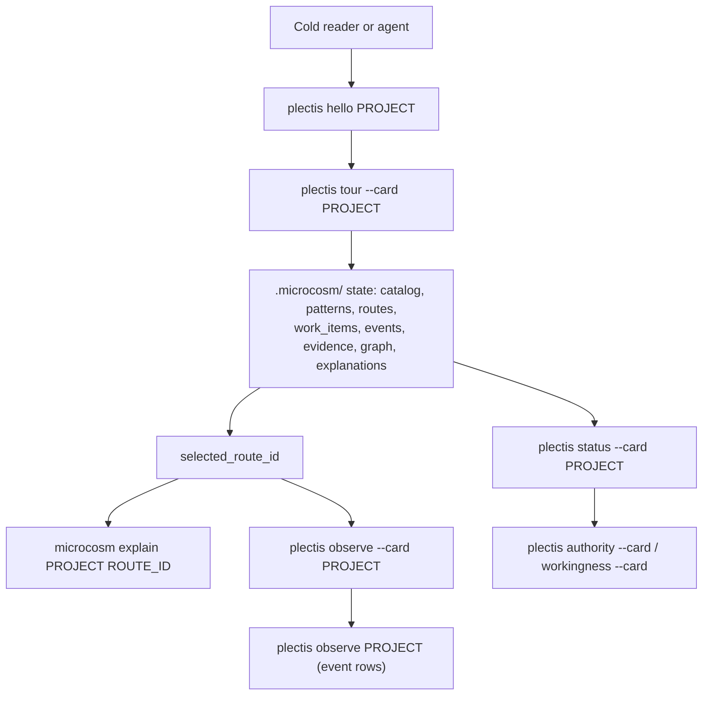
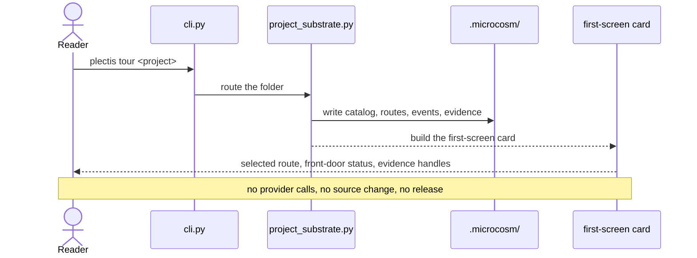
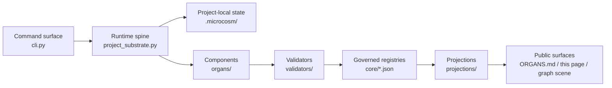
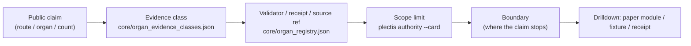
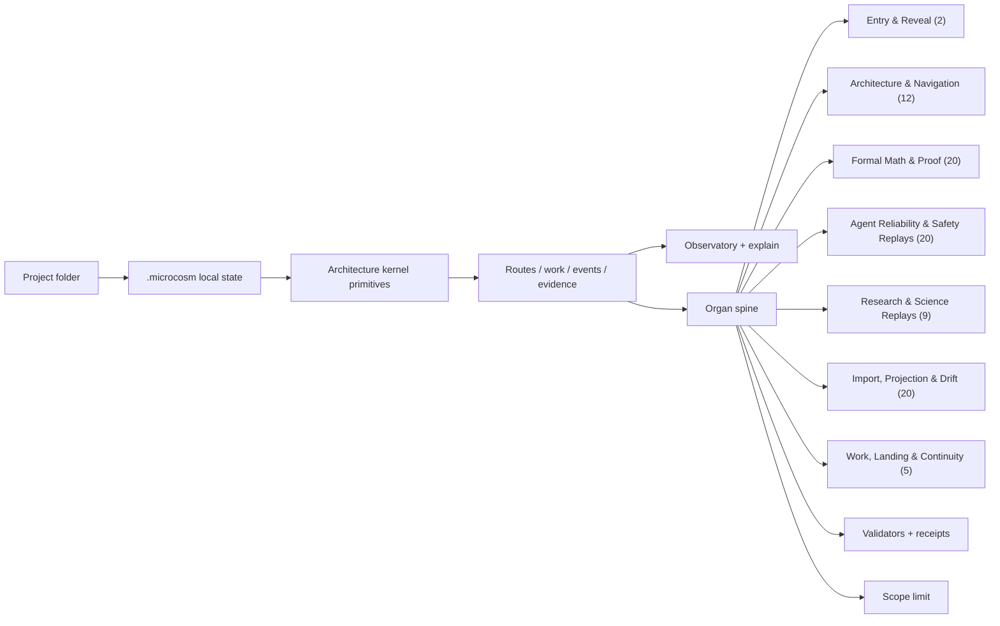
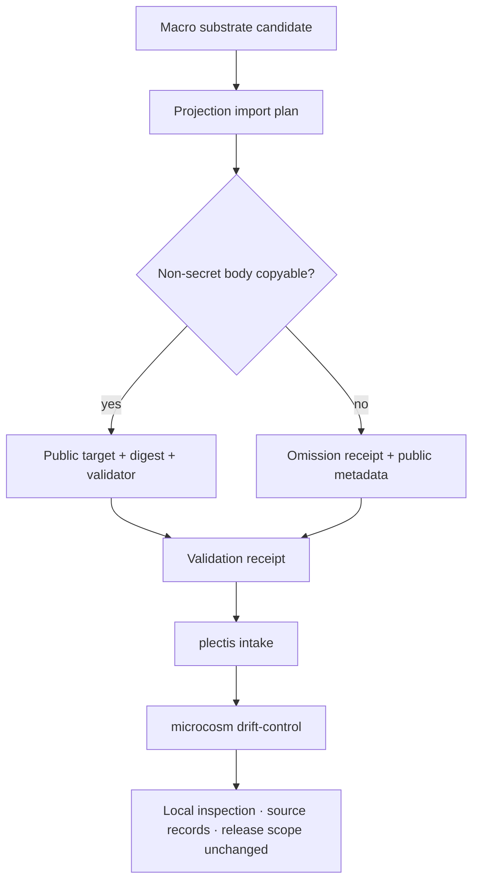

# Plectis Architecture at a Glance

<!-- GENERATED by scripts/build_organ_atlas.py from core/organ_registry.json, core/organ_families.json, core/organ_atlas.json, core/organ_evidence_classes.json, core/substrate_substitution_ledger.json, core/paper_module_capsules.json, and core/architecture_kernel.json. Do not hand-edit; run: PYTHONPATH=src python3 scripts/build_organ_atlas.py --write -->

Plectis is a public executable cross-section of an AI-native workflow and research runtime: 88 bounded components across formal proof, agent reliability and safety, research and forecasting, projection-drift control, validators, work landing, and continuity.

This page is the map of those mechanisms and their accountability layer. Each component names a runner or source locus, evidence class, receipt path, and authority ceiling; the local runtime is how you inspect and falsify that map without provider calls or source mutation. Read it top-down: what it is, the loop you can run, one real run traced through it, the parts it is built from, then the discipline that keeps its counts honest. Every box below resolves to a real command, file, or receipt; the diagrams are routing maps, not decoration.

## How to read this page

An architecture is four things, and the first read is built in that order. First the **boundary and promise**: what Plectis is, what it touches, and what it refuses (Level 0 and the words below it). Then **one real run, traced end to end**, so you watch the machinery work on a concrete command. Then **how the system is built** — the small fixed set of parts that run names. Then the **claim discipline** that keeps its counts honest. Everything after the *Deep reference* line is exhaustive inventory and the full relation graph: drilldown, not a first read.

On a first pass, read down to the Deep reference line and stop; by then you have an accurate model of what runs, what lands on disk, what backs it, what parts it is built from, and where authority stops. One rule holds every line here, and every line in the record it describes. Each is **rerunnable** (a command reproduces it), **traceable** (it names the source or receipt it came from), and **bounded** (it states where its claim stops).

## Level 0 — what it is

```text
Plectis is a public executable atlas of 88 AI-native runtime mechanisms.
Mechanisms first; local records are the accountability layer.
Each component names runner/source, evidence class, receipt path, and ceiling.
No provider calls. No source changes. No release.
No source mutation, private-root equivalence, or proof authority.
Start:     plectis hello .
Prove it:  plectis tour --card .
```

## The words you need first

A handful of terms carry the whole design. Each has a precise, narrow meaning here.

- **Component** (an *organ* in the source): a bounded unit of machinery with one job, its own inputs and outputs, and a stated limit on what it may claim.
- **Family**: a grouping of components by what they help you do, not by how finished they are.
- **Kernel primitive**: one of ten shared verbs (project, catalog, pattern, route, work, event, and so on) that every component binds to instead of calling each other.
- **Evidence class**: the named kind of support behind a result: a source-linked row, a fixture pass, a local tool run, a review packet.
- **Scope limit**: the line that states what a claim does establish and what it does not.
- **Record**: a durable artifact (a result row, a receipt, a generated file) you can reopen on its own.
- **Projection and drift**: a page or a count is a projection drawn over the substrate, a map and not the source; drift is when the map falls out of step, and the system watches for it.
- **Substrate, macro, and micro**: the underlying files, routes, state, and tools the system is built from. The private parent is the macro system; this public cross-section is the micro one (the `microcosm-substrate` tree and the `.microcosm/` state a run writes).
- **Source authority**: the artifact that owns a fact more strongly than anything generated from it. On this page the registries under `core/` are the authority; the prose is generated from them.

## Level 1 — the local runtime loop

Bring a folder. Plectis reads it, writes project-local state under `.microcosm/`, and reads that state back to you as cards and a small local observatory, without touching your files.



What lands on disk is the point. A run leaves a `.microcosm/` directory (git-ignored) holding the catalog, patterns, routes, work items, an `events.jsonl` causal trace, and `evidence/` receipts. Every card you read is a view over those files, and every line in it can be reopened there.

## A real run, traced end to end

The loop above is the shape; here is one real command walked through it. This witness is generated from the governed `cold_reader_route_map` bundle (`examples/cold_reader_route_map/exported_cold_reader_route_map_bundle`), which re-checks every command, receipt, and doc link against live source, so it cannot quietly drift.



| Reader question | What this run answers |
|---|---|
| What starts it? | `plectis tour <project>` — point it at a folder |
| Where does control go? | `cli.py` enters, `project_substrate.py` runs the spine |
| What lands on disk? | `.microcosm/` catalog, routes, `events.jsonl`, `evidence/` |
| What does not change? | source files (`source_mutation_default` `false`), provider state (`provider_calls_authorized` `false`), release state (`release_authorized` `false`) — governed kernel flags, not prose |
| How does it become credible? | receipt `receipts/runtime_shell/public_ten_minute_tour.json` |
| What does the reader see? | the first-screen card: `selected_route_id`, `front_door_status`, the route -> work -> event -> evidence chain |
| Where does the claim stop? | local first-screen route map only; no provider calls or source mutation |
| Where to drill down? | `README.md#run-it`, `AGENTS.md#rules` |

That tour is route 1 of 10 in the bundle's first-run sequence; each later route names its own command, receipt, and scope the same way.

## How the system is built

The run above is one path through a small, fixed set of parts. This is the whole set, so everything after this is detail on something named here. The runnable system is one Python package, `src/microcosm_core/`, plus the `core/*.json` registries it reads and the public surfaces it writes.

| Part | Where it lives | Its job |
|---|---|---|
| Command surface | `cli.py` | Every `plectis` and `microcosm` command enters here. |
| Runtime spine | `project_substrate.py` | Turns a folder into `.microcosm/` state: project, catalog, pattern, route, work, event, evidence, explanation. |
| Project-local state | `.microcosm/` | The record a run writes — one file per primitive, plus `events.jsonl` and `evidence/`. |
| Components | `organs/` | One module per component: a bounded specimen with a runner and a stated scope limit. |
| Validators | `validators/` | The checkers that back claims; an evidence class is only as strong as the validator behind it. |
| Projections | `projections/` | The builders that render the public surfaces — the component atlas, the architecture graph scene, and this page — from `core/*.json`. |
| Governed registries | `core/*.json` | The source of truth this page is generated from, not the prose here. |



The run you just traced enters at the command surface (`cli.py`) and lands in project-local state (`.microcosm/`); the steps it walks are the kernel primitives, enumerated in full under Deep reference. Three rules hold for every part, and the kernel records them as authority flags rather than promises: Plectis does not call providers (`provider_calls_authorized` `false`), change your source (`source_mutation_default` `false`), or claim release authority (`release_authorized` `false`).

## Level 2 — the claim/evidence discipline

This is the part that makes the rest worth trusting. A count or a capability is cheap to assert and slow to check, so every public claim here travels with three things: the evidence class behind it, the proof surface that backs it, and the scope limit that says where it stops meaning anything.



Read the headline number the way the whole system is built to be read:

```text
Reads as:       88 components.
Means:          88 public component contracts, each with its own evidence line.
Does not mean:  product maturity, or whole-system correctness.
```

## Deep reference

Everything below is exhaustive reference, not a first read: the full primitive and component inventories, the source-module relation counts, and the complete wiring graph, kept for drilldown and audit. If you are building a first model of the system you already have it from the run and the parts above; read on only when you need a specific edge, count, primitive, or component id.

## Level 3 — source-module file and shard routing

This facet is the deep drilldown; skip it on a first read. It is body-free relation metadata from `organ-surface-contract::coverage.source_module_file_graph`, connecting macro source files and source shards to public target files, target shards, and validation refs. The counts below are handles into that graph, not the edge authority itself.

| Handle | Count |
|---|---:|
| Accepted organs with source relations | 67 |
| Source-module edges | 3142 |
| Source files (per-organ aggregate) | 306 |
| Source shards (per-organ aggregate) | 699 |
| Target files (per-organ aggregate) | 310 |
| Target shards (per-organ aggregate) | 712 |
| Validation refs (per-organ aggregate) | 121 |

Top relation types: `source_shard.retained_as_public_target_shard` `712` · `source_shard.validated_by_ref` `579` · `target_shard.validated_by_ref` `579` · `source_file.validated_by_ref` `346` · `target_file.validated_by_ref` `346`

Route into the live topology surface:

- `microcosm organ-topology --organ cold_reader_route_map`
- `microcosm organ-topology --relation-type file_to_file --source-ref codex/doctrine/skills/kernel/bootstrap.md`
- `microcosm organ-topology --relation-type shard_to_shard --shard-ref 'codex/doctrine/skills/kernel/bootstrap.md::required_anchor[./repo-python kernel.py --entry "<task>" --context-budget 12000]'`
- `microcosm organ-topology --validation-ref microcosm-substrate/tests/test_cold_reader_route_map.py::test_cold_reader_exported_bundle_validates_runtime_shape`
- `microcosm organ-topology --organ public_reveal_walkthrough`

Dynamic edge truth remains in `microcosm organ-topology`; this page only shows aggregate handles so readers can move from file-to-file and shard-to-shard relations into the owning topology surface.

## Level 3 — the kernel primitives (shared spine)

The full spine, in one table. Components do not call each other; each binds to the same ten primitives, projected into every scanned project as `.microcosm/architecture.json`. The table reads left to right as the loop a run walks: name the folder, catalog it, see patterns, hold to standards, propose routes, record work, emit events, keep evidence, explain, assimilate.

| Primitive | What it does | Run it | Macro analogue |
|---|---|---|---|
| **Project** | Names the user-owned folder and creates project-local Microcosm state. | `microcosm init <project>` | bounded substrate root / authority boundary |
| **Catalog** | Classifies files into public repo roles such as README, package metadata, source, tests, docs, examples, and scripts. | `microcosm index <project>` | kind atlas / source inventory |
| **Pattern** | Maps catalog roles into repo-shape pattern observations through the public pattern surface. | `microcosm patterns <project>` | pattern atlas / pattern binding |
| **Standard** | Records the public constraints that keep local state reversible, explainable, and evidence-backed. | `microcosm architecture <project>` | standards / principles / axioms |
| **Route** | Turns project-grounded pattern_refs into reversible next-action candidates after resolving them against .microcosm/patterns.json. | `microcosm route <project>` | navigation hologram / option surface / route plane |
| **Work** | Records a deterministic governed transaction over the project-local route snapshot. | `microcosm work create <project>` | mission transaction / WorkItem spine |
| **Event** | Emits a causal trace for project substrate operations. | `microcosm observe --card <project>` | observability runtime / trace stream |
| **Evidence** | Keeps generated receipts as black-box recorder drilldowns. | `microcosm evidence list <project> --limit 25` | evidence membrane / receipts |
| **Explanation** | Connects a route to grounded refs, resolved pattern bindings, primitives, standards, work shape, events, and evidence. | `microcosm explain <project> <route_id>` | self-comprehension / route rationale |
| **Assimilation** | Captures reversible next-action and closeout signals without promoting global doctrine. | `microcosm work run <project>` | pattern assimilation step |

## Level 3 — the organ spine, grouped into families

The 88 accepted components cluster into 7 families, grouped by what they help you do rather than by how finished they are. Each family below links into [ORGANS.md](ORGANS.md), where every component has a card: its job, its first command, its evidence class, and its scope limit.



| Family | Organs | What it helps you do |
|---|---|---|
| [Entry & Reveal](ORGANS.md#entry--reveal) | 2 | Microcosm's entry point and what its short guided path actually proves. |
| [Architecture & Navigation](ORGANS.md#architecture--navigation) | 12 | The kernel primitives, pattern binding, doctrine grammar, route plane, and standards that give the system its shape and make it navigable. |
| [Formal Math & Proof](ORGANS.md#formal-math--proof) | 20 | The Lean/proof evidence pipeline: corpus readiness, premise retrieval, tactic routing, verifier trace repair, bounded witnesses, and certificates. |
| [Agent Reliability & Safety Replays](ORGANS.md#agent-reliability--safety-replays) | 20 | Source-open replay specimens for agent failure modes: red-team monitors, sabotage, sandbox escape, prompt injection, tool authority, memory poisoning, benchmark gaming, route observability, and provider budgets. |
| [Research & Science Replays](ORGANS.md#research--science-replays) | 9 | Replay specimens that project scientific and forecasting workflows: replication rubrics, spatial world models, materials-lab safety, mechanistic interpretability, and prediction reconciliation. |
| [Import, Projection & Drift](ORGANS.md#import-projection--drift) | 20 | The membrane that brings non-secret macro substrate into the public tree and keeps projections honest instead of letting them drift from source. |
| [Work, Landing & Continuity](ORGANS.md#work-landing--continuity) | 5 | How reversible work transactions are recorded, how dirty-tree landing decisions are made, and how detached runs resume. |

## Level 3 — organ wiring map

This is the full graph, and it is dense on purpose: a reference, not a first read. Each box is a family; each node is a component (display names; see [ORGANS.md](ORGANS.md) for stable ids). Arrows are the few explicit component-to-component wires, mostly the formal-math proof chain. Most components are standalone specimens, so a node with no arrows is normal: family membership, not call-graph position, is the primary relation.

```mermaid
flowchart LR
  subgraph F0["Entry & Reveal (2)"]
    o0_0["Cold Reader Route Map"]
    o0_1["Public Reveal Walkthrough"]
  end
  subgraph F1["Architecture & Navigation (12)"]
    o1_0["Pattern Binding Contract"]
    o1_1["Pattern Assimilation Step"]
    o1_2["Executable Doctrine Grammar"]
    o1_3["Navigation Hologram Route Plane"]
    o1_4["Standards Meta Diagnostics"]
    o1_5["Voice To Doctrine Self Improvement Loop"]
    o1_6["Cognitive Operator Registry"]
    o1_7["Routing Anti Patterns Registry"]
    o1_8["Doctrine Fact Claim Audit"]
    o1_9["Self Ignorance Coverage Ledger"]
    o1_10["Navigation Fitness Benchmark"]
    o1_11["Annex Knowledge Routing"]
  end
  subgraph F2["Formal Math & Proof (20)"]
    o2_0["Certificate Kernel Execution Lab"]
    o2_1["Formal Math Lean Proof Witness"]
    o2_2["Verifier Lab Execution Spine"]
    o2_3["Corpus Readiness Mathlib Absence Gate"]
    o2_4["Proof / Control / Runtime Import Capsule"]
    o2_5["Proof Diagnostic Evidence Spine"]
    o2_6["Formal Math Readiness Gate"]
    o2_7["Mathematical Strategy Atlas Hypothesis Scorer"]
    o2_8["Tactic Portfolio Availability Probe"]
    o2_9["Target Shape Tactic Routing Gate"]
    o2_10["Lean Std Premise Index"]
    o2_11["Formal Math Premise Retrieval"]
    o2_12["Formal Math Verifier Trace Repair Loop"]
    o2_13["Formal Evidence Cell Anchor Resolver"]
    o2_14["Undeclared Library Prior Symbol Classifier"]
    o2_15["Ring2 Premise Retrieval Precision Recall Harness"]
    o2_16["Verifier Lab Kernel"]
    o2_17["Proof Derived Governed Mutation Authorization"]
    o2_18["Finite Erdos Denominator-Order Certificate Strike"]
    o2_19["Lean Proof-Search Lab Runtime"]
  end
  subgraph F3["Agent Reliability & Safety Replays (20)"]
    o3_0["Agent Closeout Faithfulness Audit"]
    o3_1["Bounded Autonomy Campaign Packet"]
    o3_2["Provider Context Recipe Budget Policy"]
    o3_3["Cold-Eval Honesty Capsule"]
    o3_4["Validator Checker Capsule"]
    o3_5["Secondary Runtime Source Capsule"]
    o3_6["Agent Benchmark Integrity Anti Gaming Replay"]
    o3_7["Monitor Evidence-Boundary Replay"]
    o3_8["Sabotage-Monitor Contract Replay"]
    o3_9["Agent Memory Temporal Conflict Replay"]
    o3_10["Memory-Poisoning Quarantine Policy Replay"]
    o3_11["MCP Tool-Authority Policy Replay"]
    o3_12["Belief-State Reward Bundle Replay"]
    o3_13["Sandbox-Policy Replay"]
    o3_14["Prompt-Injection Flow-Policy Replay"]
    o3_15["Vulnerability Patch-Proof Replay"]
    o3_16["Agent Route Observability Runtime"]
    o3_17["Bridge Campaign DAG Validation"]
    o3_18["Metabolism Queue Reconciliation"]
    o3_19["Egress Self-Compliance Audit"]
  end
  subgraph F4["Research & Science Replays (9)"]
    o4_0["Finance Forecast Evaluation Spine"]
    o4_1["Prediction Market Board Capsule"]
    o4_2["Market Dashboard Read-Model Capsule"]
    o4_3["Toy-Transformer Attribution Replay"]
    o4_4["Gridworld Counterfactual State Replay"]
    o4_5["Research Replication Rubric Artifact Replay"]
    o4_6["Materials Lab-Safety Refusal Replay"]
    o4_7["Prediction Oracle Reconciliation"]
    o4_8["Derived Fact Provider Runtime"]
  end
  subgraph F5["Import, Projection & Drift (20)"]
    o5_0["Macro Projection Import Protocol"]
    o5_1["Projection-Drift Contract Validator"]
    o5_2["Unsurfaced Macro Primitives Capsule"]
    o5_3["Authority Systems Source Capsule"]
    o5_4["Trace, Code-Map and Scheduling Engines Capsule"]
    o5_5["Oracle Sibling Source Capsule"]
    o5_6["Demo Take Console Source Capsule"]
    o5_7["Tools-Tail Primitives Capsule"]
    o5_8["Policy Engines Capsule"]
    o5_9["Audio Level RMS Port"]
    o5_10["Structural Theses Finance Capsule"]
    o5_11["Engine Room Demo"]
    o5_12["Backend and Governance Engines Capsule"]
    o5_13["Governance and Compiler Mechanisms Capsule"]
    o5_14["Saturation Engines Capsule"]
    o5_15["Tool Server Pressure Inventory"]
    o5_16["Compliance Pipeline Capsule"]
    o5_17["Live Source Drift Capsule"]
    o5_18["Release Claim-Language Gate"]
    o5_19["Generated Projection Drift Runtime"]
  end
  subgraph F6["Work, Landing & Continuity (5)"]
    o6_0["Mission Transaction Work Spine"]
    o6_1["Durable Agent Work Landing Replay"]
    o6_2["Bridge-Continuity Acceptance Replay"]
    o6_3["Concurrency Mission Control"]
    o6_4["Semantic Singleflight Dedup Runtime"]
  end
  o0_0 --> o1_3
  o0_0 --> o3_16
  o0_0 --> o1_0
  o0_0 --> o1_8
  o0_0 --> o1_1
  o0_0 --> o1_7
  o0_0 --> o1_9
  o0_0 --> o1_5
  o0_1 --> o5_18
  o0_1 --> o4_3
  o0_1 --> o5_9
  o0_1 --> o3_4
  o1_0 --> o1_3
  o1_0 --> o3_16
  o1_0 --> o0_0
  o1_0 --> o5_0
  o1_0 --> o1_1
  o1_0 --> o1_5
  o1_2 --> o1_8
  o1_3 --> o0_0
  o1_3 --> o3_16
  o1_3 --> o1_7
  o1_3 --> o1_0
  o1_3 --> o1_8
  o1_3 --> o5_0
  o1_3 --> o1_9
  o1_3 --> o1_5
  o1_3 --> o5_11
  o1_3 --> o5_14
  o1_3 --> o5_16
  o1_5 --> o1_1
  o1_7 --> o1_3
  o1_7 --> o3_16
  o1_7 --> o0_0
  o1_8 --> o5_11
  o1_8 --> o1_9
  o1_10 --> o2_0
  o1_10 --> o2_16
  o1_10 --> o2_1
  o1_11 --> o2_0
  o1_11 --> o2_16
  o1_11 --> o2_1
  o2_1 --> o2_11
  o2_1 --> o2_6
  o2_1 --> o2_5
  o2_1 --> o2_16
  o2_1 --> o2_2
  o2_2 --> o2_0
  o2_2 --> o5_11
  o2_3 --> o2_16
  o2_3 --> o2_8
  o2_3 --> o2_14
  o2_3 --> o2_1
  o2_5 --> o2_12
  o2_5 --> o2_13
  o2_5 --> o2_1
  o2_5 --> o2_16
  o2_5 --> o2_15
  o2_5 --> o2_9
  o2_6 --> o2_1
  o2_6 --> o5_0
  o2_6 --> o2_4
  o2_6 --> o3_2
  o2_6 --> o2_8
  o2_6 --> o2_9
  o2_8 --> o2_3
  o2_8 --> o2_12
  o2_8 --> o2_9
  o2_8 --> o2_14
  o2_8 --> o2_16
  o2_9 --> o2_12
  o2_9 --> o2_13
  o2_9 --> o2_5
  o2_9 --> o2_8
  o2_9 --> o2_16
  o2_10 --> o2_12
  o2_10 --> o2_16
  o2_10 --> o2_7
  o2_10 --> o2_14
  o2_11 --> o2_1
  o2_11 --> o2_12
  o2_11 --> o2_10
  o2_11 --> o2_16
  o2_11 --> o2_7
  o2_11 --> o2_15
  o2_12 --> o2_13
  o2_12 --> o2_5
  o2_12 --> o2_16
  o2_12 --> o2_9
  o2_12 --> o2_2
  o2_13 --> o2_12
  o2_13 --> o2_5
  o2_13 --> o2_9
  o2_14 --> o2_3
  o2_14 --> o2_8
  o2_14 --> o3_2
  o2_15 --> o2_7
  o2_15 --> o2_16
  o2_16 --> o2_3
  o2_16 --> o2_10
  o2_16 --> o2_11
  o2_16 --> o2_8
  o2_16 --> o2_9
  o2_16 --> o2_15
  o2_16 --> o2_12
  o2_16 --> o2_5
  o2_16 --> o2_1
  o2_16 --> o2_2
  o2_17 --> o5_18
  o2_17 --> o2_4
  o2_17 --> o5_8
  o2_18 --> o2_0
  o2_18 --> o2_16
  o2_18 --> o2_1
  o2_19 --> o2_0
  o2_19 --> o2_16
  o2_19 --> o2_1
  o3_2 --> o3_1
  o3_2 --> o5_15
  o3_4 --> o3_3
  o3_4 --> o5_18
  o3_6 --> o4_5
  o3_6 --> o3_3
  o3_7 --> o3_8
  o3_9 --> o3_10
  o3_11 --> o3_13
  o3_11 --> o3_10
  o3_13 --> o3_10
  o3_16 --> o1_3
  o3_16 --> o0_0
  o3_16 --> o1_7
  o3_16 --> o1_0
  o3_16 --> o5_0
  o3_16 --> o3_1
  o3_16 --> o5_14
  o3_16 --> o2_4
  o3_16 --> o5_2
  o3_16 --> o5_4
  o3_16 --> o5_16
  o3_16 --> o3_9
  o3_16 --> o3_13
  o3_16 --> o3_2
  o3_16 --> o3_12
  o3_17 --> o2_0
  o3_17 --> o2_16
  o3_17 --> o2_1
  o3_18 --> o2_0
  o3_18 --> o2_16
  o3_18 --> o2_1
  o3_19 --> o2_0
  o3_19 --> o2_16
  o3_19 --> o2_1
  o4_0 --> o4_1
  o4_0 --> o4_7
  o4_1 --> o5_10
  o4_2 --> o5_2
  o4_5 --> o4_6
  o4_5 --> o4_3
  o4_5 --> o4_7
  o4_5 --> o4_4
  o4_5 --> o3_3
  o4_6 --> o4_4
  o4_7 --> o4_2
  o4_7 --> o4_1
  o4_7 --> o5_10
  o4_8 --> o2_0
  o4_8 --> o2_16
  o4_8 --> o2_1
  o5_0 --> o2_6
  o5_0 --> o3_16
  o5_0 --> o6_0
  o5_0 --> o1_3
  o5_0 --> o1_0
  o5_0 --> o4_6
  o5_0 --> o5_14
  o5_0 --> o5_16
  o5_0 --> o5_13
  o5_0 --> o5_17
  o5_0 --> o2_4
  o5_0 --> o5_3
  o5_0 --> o5_2
  o5_0 --> o5_4
  o5_0 --> o5_6
  o5_0 --> o5_5
  o5_0 --> o3_5
  o5_0 --> o5_9
  o5_0 --> o5_8
  o5_0 --> o5_12
  o5_0 --> o6_3
  o5_0 --> o5_11
  o5_0 --> o1_2
  o5_1 --> o4_6
  o5_1 --> o4_3
  o5_1 --> o4_7
  o5_1 --> o4_4
  o5_1 --> o5_15
  o5_1 --> o4_2
  o5_1 --> o5_10
  o5_4 --> o5_8
  o5_4 --> o5_7
  o5_4 --> o5_12
  o5_5 --> o5_7
  o5_6 --> o5_9
  o5_6 --> o5_2
  o5_10 --> o4_1
  o5_11 --> o5_16
  o5_11 --> o3_4
  o5_12 --> o5_13
  o5_14 --> o5_0
  o5_14 --> o5_16
  o5_14 --> o1_3
  o5_14 --> o3_16
  o5_16 --> o5_0
  o5_16 --> o5_14
  o5_16 --> o1_3
  o5_16 --> o3_16
  o5_17 --> o5_13
  o5_19 --> o2_0
  o5_19 --> o2_16
  o5_19 --> o2_1
  o6_0 --> o3_1
  o6_0 --> o6_3
  o6_0 --> o5_0
  o6_0 --> o5_15
  o6_0 --> o5_17
  o6_0 --> o2_4
  o6_0 --> o5_7
  o6_0 --> o3_6
  o6_0 --> o3_15
  o6_1 --> o3_0
  o6_1 --> o5_0
  o6_2 --> o3_9
  o6_2 --> o6_3
  o6_3 --> o6_0
  o6_3 --> o5_17
  o6_4 --> o6_0
  o6_4 --> o6_1
  o6_4 --> o6_3
  o6_4 --> o5_11
```



## Level 4 — import & drift membrane

The public tree carries private substrate, but only through a membrane. A macro candidate is planned; then either its non-secret body is copied to a public target with a digest and a validator, or, if it touches secrets or private state, only an omission receipt and public metadata cross. Projections are then watched for drift. Nothing in this path turns a copy into source-of-record status or a release.



## Where to go next

- Run the loop yourself: `plectis hello .`, then `plectis tour --card .` in any code folder.
- Read one component end to end: open [ORGANS.md](ORGANS.md), pick a card, and follow its first command and its source link.
- Let the system orient you: `plectis comprehend --first-contact` for a cold-start read pack, `plectis comprehend --self-model` for the whole-substrate self-portrait, or `plectis comprehend --packet-atlas` to choose a lens.
- Follow an edge to its authority: `microcosm organ-topology --organ <id>`.

> Family labels and counts are navigation metadata: use them to browse and compare source-linked components; maturity, completeness, and launch posture live in separate review records. Evidence classes describe bounded result-record strength for each component. Use this public artifact for local inspection, source records, fixture replay, and component-specific evidence. Operational deployment, external-service use, source-file changes, source mutation, private-root equivalence, proof authority, formal-result authority, and whole-system claims remain separate review topics. Continue from the linked card, paper module, command, or source reference.

---

Regenerate from substrate with `PYTHONPATH=src python3 scripts/build_organ_atlas.py --write`.
