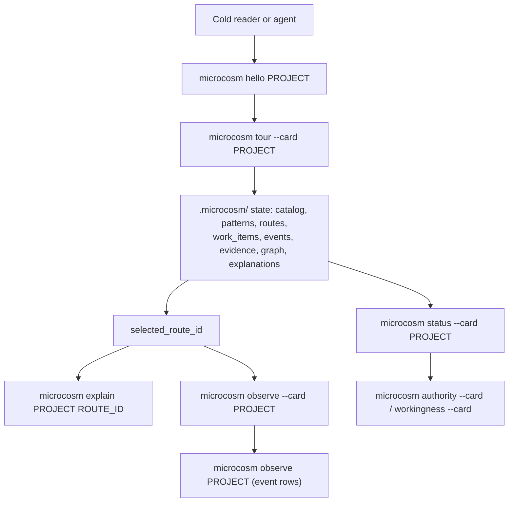
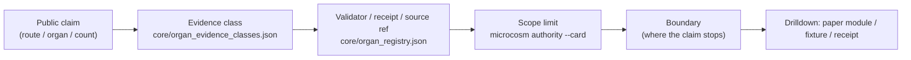
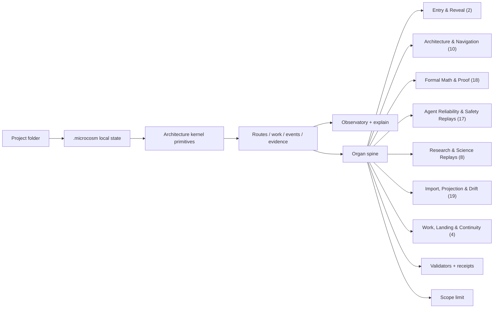
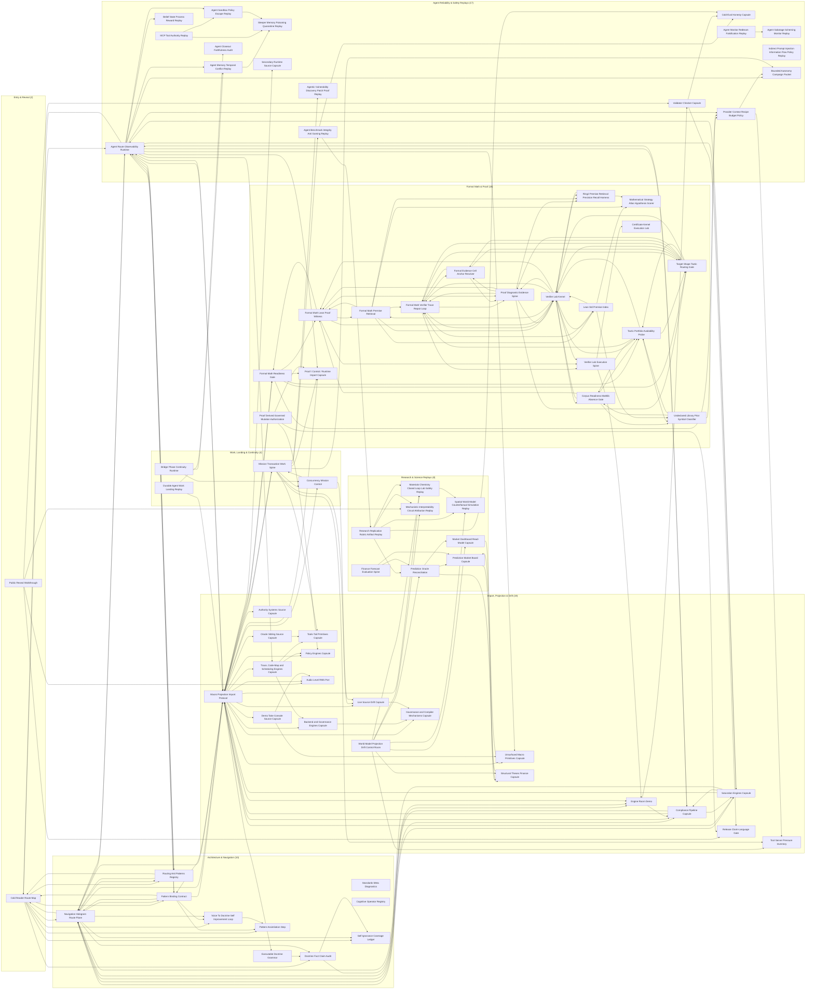
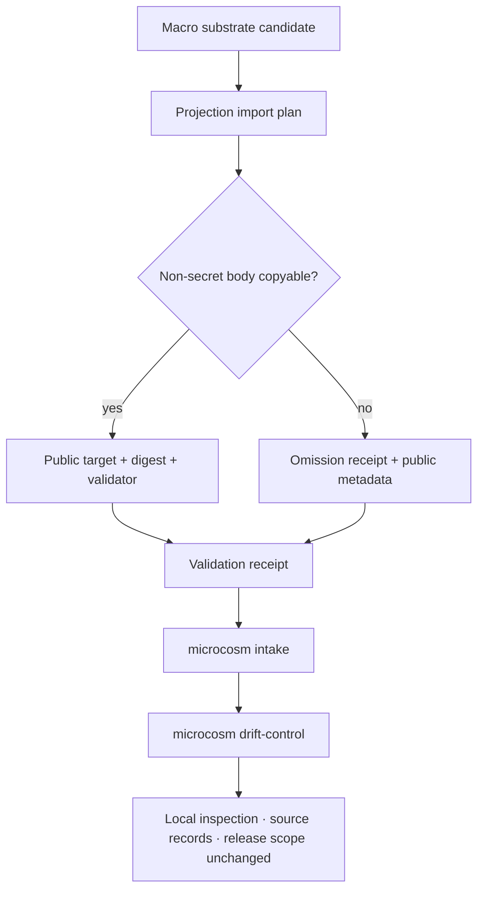

# Microcosm Architecture at a Glance

<!-- GENERATED by scripts/build_organ_atlas.py from core/organ_registry.json, core/organ_families.json, core/organ_atlas.json, core/organ_evidence_classes.json, core/substrate_substitution_ledger.json, core/paper_module_capsules.json, and core/architecture_kernel.json. Do not hand-edit; run: PYTHONPATH=src python3 scripts/build_organ_atlas.py --write -->

Microcosm is a local, source-open operating substrate for inspecting how a larger AI-native workflow system thinks, routes, records work, binds evidence, and limits its own claims. It turns a folder into local `.microcosm/` state without mutating your source files, calling external model providers, while keeping release, proof, and production claims outside the public scope.

Read this top-down: identity, the local runtime loop, the claim/evidence loop, then the organ spine. Every box below resolves to a real command, file, endpoint, or receipt — diagrams here are routing maps, not decoration.

## Level 0 — what it is

```text
Microcosm is the public, local cross-section of a larger AI-native system.
A cold reader can run and inspect the architecture without receiving private state.
Start: microcosm hello .   Prove local behavior: microcosm tour --card .
```

## Level 1 — the local runtime loop

Bring a folder; Microcosm builds project-local state and reads it back as cards and a local observatory.



## Level 2 — the claim/evidence loop

Every claim travels with its evidence class, its proof surface, and the scope of what it is allowed to mean. This is the discipline that keeps counts honest.



## Level 3 — source-module file and shard routing

The source-module file graph is body-free relation metadata from `organ-surface-contract::coverage.source_module_file_graph`. It connects macro source files and source shards to public target files, target shards, and validation refs without making this architecture page the edge authority.

| Handle | Count |
|---|---:|
| Accepted organs with source relations | 77 |
| Source-module edges | 7931 |
| Source files (per-organ aggregate) | 671 |
| Source shards (per-organ aggregate) | 2431 |
| Target files (per-organ aggregate) | 682 |
| Target shards (per-organ aggregate) | 2473 |
| Validation refs (per-organ aggregate) | 115 |

Top relation types: `source_shard.retained_as_public_target_shard` `2474` · `source_shard.validated_by_ref` `1404` · `target_shard.validated_by_ref` `1404` · `target_file.shares_macro_source_with_target_file` `912` · `source_file.copied_to_public_target` `683`

Route into the live topology surface:

- `microcosm organ-topology --organ cold_reader_route_map`
- `microcosm organ-topology --relation-type file_to_file --source-ref codex/doctrine/skills/kernel/bootstrap.md`
- `microcosm organ-topology --relation-type shard_to_shard --shard-ref 'codex/doctrine/skills/kernel/bootstrap.md::required_anchor[./repo-python kernel.py --entry "<task>" --context-budget 12000]'`
- `microcosm organ-topology --validation-ref microcosm-substrate/tests/test_cold_reader_route_map.py::test_cold_reader_exported_bundle_validates_runtime_shape`
- `microcosm organ-topology --organ public_reveal_walkthrough`

Dynamic edge truth remains in `microcosm organ-topology`; this page only shows aggregate handles so readers can move from file-to-file and shard-to-shard relations into the owning topology surface.

## Level 3 — the kernel primitives (shared spine)

Organs do not call each other. They bind to these kernel primitives, projected into every scanned project as `.microcosm/architecture.json`.

| Primitive | What it does | Run it | Macro analogue |
|---|---|---|---|
| **Project** | Names the user-owned folder and creates project-local Microcosm state. | `microcosm init <project>` | bounded substrate root / authority boundary |
| **Catalog** | Classifies files into public repo roles such as README, package metadata, source, tests, docs, examples, and scripts. | `microcosm index <project>` | kind atlas / source inventory |
| **Pattern** | Maps catalog roles into repo-shape pattern observations through the public pattern surface. | `microcosm patterns <project>` | pattern atlas / pattern binding |
| **Standard** | Records the public constraints that keep local state reversible, explainable, and evidence-backed. | `microcosm architecture <project>` | standards / principles / axioms |
| **Route** | Turns project-grounded pattern_refs into reversible next-action candidates after resolving them against .microcosm/patterns.json. | `microcosm route <project>` | navigation hologram / option surface / route plane |
| **Work** | Records a deterministic governed transaction over the project-local route snapshot. | `microcosm work create <project>` | mission transaction / WorkItem spine |
| **Event** | Emits a causal trace for project substrate operations. | `microcosm observe --card <project>` | observability runtime / trace stream |
| **Evidence** | Keeps generated receipts as black-box recorder drilldowns. | `microcosm evidence list <project> --limit 25` | evidence membrane / receipts |
| **Explanation** | Connects a route to grounded refs, resolved pattern bindings, primitives, standards, work shape, events, and evidence. | `microcosm explain <project> <route_id>` | self-comprehension / route rationale |
| **Assimilation** | Captures reversible next-action and closeout signals without promoting global doctrine. | `microcosm work run <project>` | pattern assimilation step |

## Level 3 — the organ spine, grouped into families

The 78 accepted organs cluster into 7 families. Open [ORGANS.md](ORGANS.md) for the full per-organ cards.



| Family | Organs | What it helps you do |
|---|---|---|
| [Entry & Reveal](ORGANS.md#entry--reveal) | 2 | Microcosm's entry point and what its short guided path actually proves. |
| [Architecture & Navigation](ORGANS.md#architecture--navigation) | 10 | The kernel primitives, pattern binding, doctrine grammar, route plane, and standards that give the system its shape and make it navigable. |
| [Formal Math & Proof](ORGANS.md#formal-math--proof) | 18 | The Lean/proof evidence pipeline: corpus readiness, premise retrieval, tactic routing, verifier trace repair, bounded witnesses, and certificates. |
| [Agent Reliability & Safety Replays](ORGANS.md#agent-reliability--safety-replays) | 17 | Source-open replay specimens for agent failure modes: red-team monitors, sabotage, sandbox escape, prompt injection, tool authority, memory poisoning, benchmark gaming, route observability, and provider budgets. |
| [Research & Science Replays](ORGANS.md#research--science-replays) | 8 | Replay specimens that project scientific and forecasting workflows: replication rubrics, spatial world models, materials-lab safety, mechanistic interpretability, and prediction reconciliation. |
| [Import, Projection & Drift](ORGANS.md#import-projection--drift) | 19 | The membrane that brings non-secret macro substrate into the public tree and keeps projections honest instead of letting them drift from source. |
| [Work, Landing & Continuity](ORGANS.md#work-landing--continuity) | 4 | How reversible work transactions are recorded, how dirty-tree landing decisions are made, and how detached runs resume. |

## Level 3 — organ wiring map

Each family is a cluster. Most organs are standalone specimens, so cluster membership is the primary relation; arrows show the few explicit organ-to-organ wires (mostly the formal-math proof chain). Node labels are organ display names; see [ORGANS.md](ORGANS.md) for the stable ids.



## Level 4 — import & drift membrane

Public carries private by default, but only through a membrane: non-secret macro bodies are copied with digests and omission receipts; projections are watched for drift; nothing converts these records into source-of-record status or a release operation.



> Family labels and counts are navigation metadata: use them to browse and compare source-linked components, not as maturity, completeness, or release signals. Evidence classes describe bounded result-record strength for each component. The public scope stops at local inspection, source records, fixture replay, and component-specific evidence. It does not authorize release, provider access, source mutation, private-root equivalence, proof authority, or whole-system correctness.

---

Regenerate from substrate with `PYTHONPATH=src python3 scripts/build_organ_atlas.py --write`.
