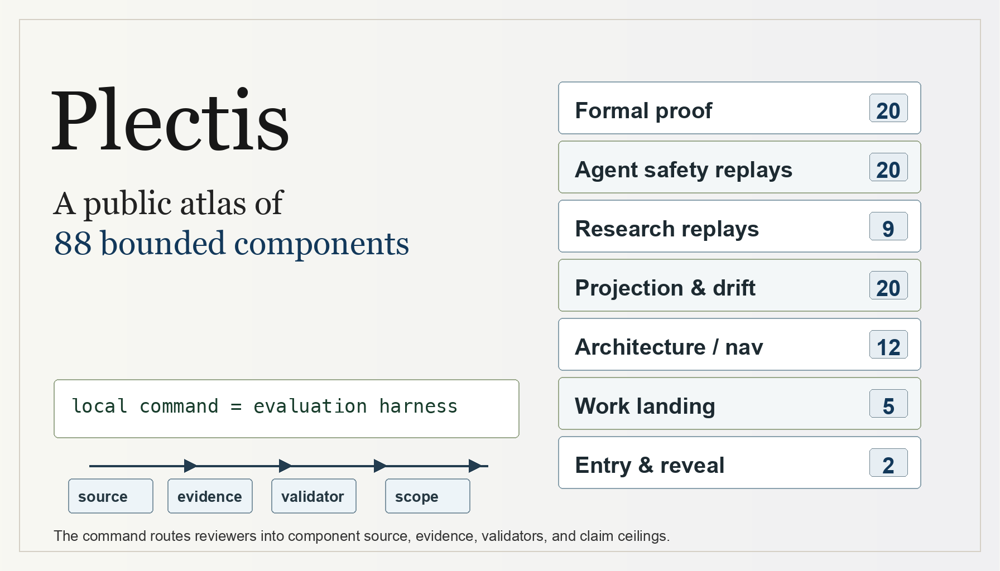

<p align="center">
  
</p>

# Plectis

**Run one command inside a code repository and get a local record you can read:
what Plectis found, where each finding came from, what backs it, and the point
where the claim stops.**

Plectis is a small, source-open tool. It runs entirely on your machine, makes no
network or model calls, and never changes the files it reads. It is the public,
runnable map of an AI-native workflow system: one person sets the direction, AI
agents do the building and upkeep, and every agent's work is kept as evidence a
separate check can read.

[Website](https://wcook04.github.io/plectis/) ·
[Quickstart](QUICKSTART.md) ·
[Architecture](ARCHITECTURE.md) ·
[System map](ORGANS.md) ·
[Coding agent entry](AGENTS.md)

## See it work

From a clone, point it at any project and ask for the plain-text summary:

```bash
plectis tour --format text .
```

It reads the project, picks a route through it, writes a record beside the
project, and prints what it did:

```text
Plectis read 5283 project files and wrote a local record.  repo -> .microcosm

  Route taken     readme_onboarding_route  (one of 5 it found)
  Record written  .microcosm/  (local files, written beside your project)
  Your source     unchanged

  Every finding in that record carries three handles:
    Evidence   .microcosm/evidence/   (what backs the finding)
    Source     .microcosm/events.jsonl   (where the finding came from)
    Scope      does not authorize release, provider calls, whole-system correctness

  The same record as a machine-readable card:  plectis tour --card .
```

The point is not the summary. The point is the record it leaves on your disk,
and the three things it holds for every line in it:

- **Rerunnable.** One command produced it, so you can run it again and check it
  instead of trusting this page.
- **Traceable.** Each consequential finding names the evidence that backs it and
  the source it came from, not a description of the behaviour.
- **Bounded.** Each finding records where its authority stops, kept as machine
  state rather than buried in disclaimers.

What one run does, step by step:

1. **You run Plectis locally on a repository.** It reads the project on your
   machine, with no network and no provider calls.
2. **It picks a route and writes the record.** It chooses a way through the
   project and leaves an inspectable local result, without changing your source.
3. **It binds each finding.** Every consequential finding names the evidence that
   backs it, the source it came from, and where its authority stops.
4. **You take control of the result.** Read the basis of any finding, run it
   again, challenge it, or follow a deeper route.

The actual component map lives in [Architecture](ARCHITECTURE.md), and as an
interactive map on the [website](https://wcook04.github.io/plectis/).

## Run it

From a clone, without installing anything:

```bash
PYTHONPATH=src python3 -m microcosm_core tour --format text .
PYTHONPATH=src python3 -m microcosm_core tour --card .
```

Or install the `plectis` command first:

```bash
python3 -m pip install -e '.[test]'
plectis tour --format text .
plectis tour --card .
```

[QUICKSTART.md](QUICKSTART.md) is the one-page version: the bootstrap probe, the
browser view, the offline checks, and the boundary notes, in the order a cold
clone needs them.

## What's inside

Underneath that one run, Plectis is a small runtime and a spine of **78 components
grouped into seven areas**. One person sets the direction; AI agents do the building
and upkeep; and every component's work is kept as evidence a separate check can read.

Each area groups related components. Open one to read a card for every component
inside it — one line at a glance, or expanded in full:

| Area | Components | What it is |
|---|---|---|
| [Entry & Reveal](ORGANS.md#entry--reveal) | 2 | The entry point, and what its short guided path actually proves. |
| [Architecture & Navigation](ORGANS.md#architecture--navigation) | 10 | The kernel primitives, pattern binding, doctrine grammar, route plane, and standards that give the system its shape and make it navigable. |
| [Formal Math & Proof](ORGANS.md#formal-math--proof) | 18 | The Lean proof-evidence pipeline: corpus readiness, premise retrieval, tactic routing, verifier-trace repair, bounded witnesses, and certificates. |
| [Agent Reliability & Safety Replays](ORGANS.md#agent-reliability--safety-replays) | 17 | Source-open replay specimens for agent failure modes: red-team monitors, sabotage, sandbox escape, prompt injection, tool authority, memory poisoning, benchmark gaming, route observability, and provider budgets. |
| [Research & Science Replays](ORGANS.md#research--science-replays) | 8 | Replay specimens for scientific and forecasting workflows: replication rubrics, spatial world models, materials-lab safety, mechanistic interpretability, and prediction reconciliation. |
| [Import, Projection & Drift](ORGANS.md#import-projection--drift) | 19 | The membrane that brings non-secret substrate into the public tree and keeps projections honest instead of letting them drift from their source. |
| [Work, Landing & Continuity](ORGANS.md#work-landing--continuity) | 4 | How reversible work transactions are recorded, how dirty-tree landing decisions are made, and how detached runs resume. |

For the full per-component cards, open the [System map](ORGANS.md).

## Choose a route

| You want to | Go to | What you get |
|---|---|---|
| Run the first local witness | [Quickstart](QUICKSTART.md) | The shortest path to a working local run. |
| Understand how it works | [Architecture](ARCHITECTURE.md) | The runtime loop, the evidence loop, and the component families. |
| Browse every component | [System map](ORGANS.md) | A generated card for each part, one line at a glance or in full. |
| Audit what is and is not claimed | [Release review](RELEASE_REVIEW.md) · [Source status](SOURCE_STATUS.md) | The claim under review, the evidence behind it, and the distribution boundary. |
| Work on Plectis with a coding agent | [AGENTS.md](AGENTS.md) | The durable agent contract: setup, authority, validation, and task routing. A coding agent's first action is `plectis comprehend --first-action "<your goal>"`. |
| Report a problem or contribute | [Contributing](CONTRIBUTING.md) · [Security](SECURITY.md) | The verification floor and how to raise an issue safely. |

## What Plectis does not claim

Plectis is an executable research prototype and a developer tool, offered for
inspection, experimentation, and learning. It is deliberately narrow about what
it proves:

- It is **not a hosted service** and does not authorize release or hosting.
- It makes **no provider calls**: nothing in a local run reaches an external
  model or API.
- It performs **no source mutation**: a run inspects the project and leaves its
  files unchanged, and the record reports `source_files_mutated=false`.
- It is **not a copy of any private system** and is not private-root
  equivalent: this public tree is a cross-section, not a reconstruction of a
  larger one.
- It carries **no proof authority** over whole-system correctness, formal
  results, benchmarks, or production readiness.

These are not apologies. They are the boundary that lets the smaller claims be
exact.

## How the result stays honest

Plectis is built so a sceptic can check it rather than take its word. Two things
make that possible, and both have a generated page you can open:

- **The component list has one source of truth.** The [System map](ORGANS.md) is
  generated from the repository's governed component records, so the parts it
  shows are the parts that exist. Being listed there is not a quality or progress
  score; it only records that a part is wired into the current public surface.
- **Each finding says what kind of thing backs it.** A finding may rest on a
  copied source body, a subprocess exit code, a deterministic projection, a
  validator, or a fixture. The [Release review](RELEASE_REVIEW.md) sets out the
  claim under review and the evidence behind it, so you can weigh a finding by
  its support rather than by a headline count.

## Name and history

This project was published under the name Microcosm until 21 June 2026, when
**Microcosm became Plectis** to avoid confusion with the earlier Southampton
Microcosm hypermedia system, and to acknowledge that lineage without implying any
endorsement or affiliation. **Microcosm remains only where compatibility or
historical continuity requires it**: the `microcosm_core` import name, the local
state directory, generated records, and older links. See [PROVENANCE.md](PROVENANCE.md)
for the full lineage.

## License and provenance

Plectis is Copyright 2026 William Cook and is licensed under the Apache License,
Version 2.0; see [LICENSE](LICENSE) and [NOTICE](NOTICE). It was developed by
William Cook as an independent, AI-native solo project. See
[PROVENANCE.md](PROVENANCE.md) for authorship, source-of-record, third-party, and
no-affiliation boundaries, [CONTRIBUTING.md](CONTRIBUTING.md) for the public
verification floor and how to contribute, and [SECURITY.md](SECURITY.md) for the
secret-exclusion and vulnerability-reporting boundary.
