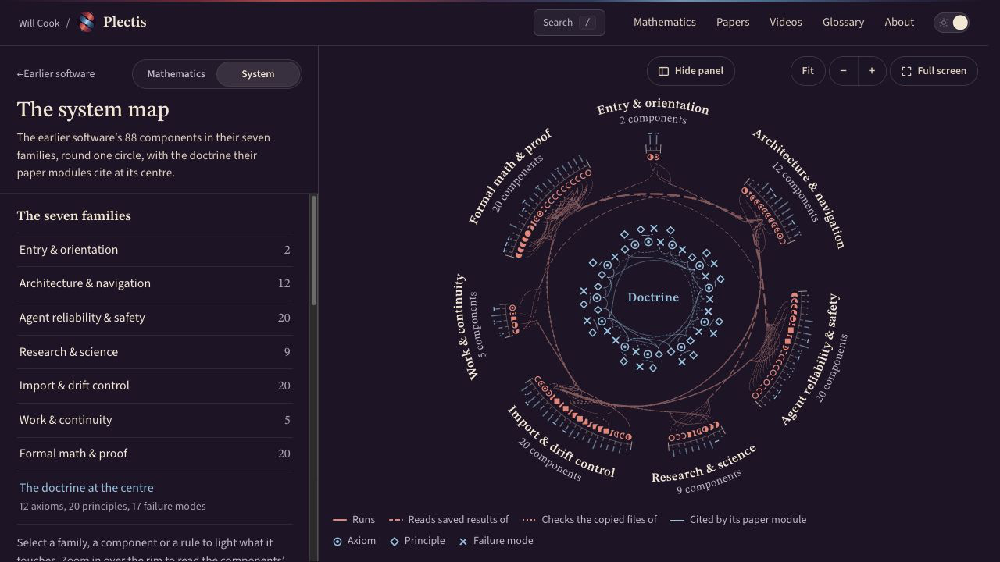

# Plectis

**Tools for making AI-assisted research easier to inspect and continue.**
Plectis is a public Python toolkit with programs and worked examples for
checking proofs, testing records of agent actions, comparing forecasts and
keeping generated documents consistent with their sources.

> **Looking for the mathematics?** Start with
> [**Plectis Erdős →**](https://github.com/wcook04/plectis-erdos), the main research
> repository for the Lean proofs, papers and open questions.
> [Read the guide](https://github.com/wcook04/plectis-erdos/blob/main/docs/READING_GUIDE.md)
> or [explore the mathematics map](https://wcook04.github.io/plectis/maths/universe.html).

This repository contains the earlier software toolkit. You can run its examples
independently, study how they work and adapt useful parts. The tools come from
a larger research workbench built by Will Cook with AI coding agents.

<a href="https://wcook04.github.io/plectis/docs/system-map.html">
  
</a>

[**Explore the system map →**](https://wcook04.github.io/plectis/docs/system-map.html)
<br>
<sub>Components around the rim; the doctrine they cite at the centre. Select a
component or rule on the website to follow its connections.</sub>

[Worked examples](#see-it-work) · [Quickstart](QUICKSTART.md) ·
[Documentation](docs/README.md) · [Contributing](CONTRIBUTING.md)

For a first look in a terminal, run the repository tour. Two commands, no
install, Python 3.11 or newer:

```bash
git clone https://github.com/wcook04/plectis && cd plectis
PYTHONPATH=src python3 -m plectis tour --format text .
```

This lists project files, suggests a starting task and saves a local run record.
It makes no model calls and leaves your source unchanged. The examples below
show what the individual tools do; the tour itself does not run your tests or
carry out the suggested task.

## Why this exists

AI-assisted research can span many sessions, files and failed approaches.
Plectis explores how to preserve that work so another person can understand
what was tried, check the results and choose a useful next step. Experts can
contribute a correction or direction without operating the AI themselves.

This toolkit publishes selected parts of that effort. The
[mathematics repository](https://github.com/wcook04/plectis-erdos) contains the
papers, proofs and open questions; the [website](https://wcook04.github.io/plectis/)
explains both. The larger private workbench shown in the videos is separate
from this clone. The [project overview](docs/overview.md) explains how the
parts fit together and relates them to other research tools.

<a id="choose-a-route"></a>

## Choose a starting point

| You want to… | Start here |
|---|---|
| Understand the project | [Why these tools belong together](docs/overview.md) |
| Run something locally | [Quickstart](QUICKSTART.md) |
| Follow a complete example | [Worked guides](docs/guides/README.md) |
| Find a tool in your field | [Component map](ORGANS.md) |
| Work on the code | [Contributing](CONTRIBUTING.md) and [implementation map](docs/maintainers/architecture.md#implementation-map) |
| Read the mathematics | [Companion reader's guide](https://github.com/wcook04/plectis-erdos/blob/main/docs/READING_GUIDE.md) |

## See it work

An AI says: “I committed the fix and the tests passed.” The
[completion-checking guide](docs/guides/checking-agent-completion.md) shows how
one component checks those claims using a sample Git repository and actual
pytest runs. It verifies three supplied claims and rejects four deliberately
incorrect ones. You can follow the result back to the code that checked it.

Two more [worked guides](docs/guides/README.md) show different uses:

- [Change a prompt-injection example](docs/guides/prompt-injection.md)
  and see a checker reject an inconsistent permission in saved records.
- [Prepare a research question](docs/guides/hypothesis-handoffs.md) with a
  tentative answer, alternatives and proposed observations for an expert.

Try the second example from the clone, without installing anything:

```bash
PYTHONPATH=src python3 -m plectis hypothesis-handoff \
  --input examples/hypothesis_handoff/independent_evaluation.json --format text
```

It validates the supplied file and prints the question and proposed
investigation. It does not answer the question, contact an expert or call a
model. Each guide explains what its example tests and what remains untested.

## What is in the toolkit?

There are **88 components**, grouped into seven areas. A component is a named
program or group of related programs, with its own instructions and stated
limits. Some run a computation or an external tool; others compare supplied
records against rules. An entry in the catalogue is not a promise that every
example can run in every environment: its page lists required tools and source
files, and the runner reports unavailable requirements.

| Area | Try it for… |
|---|---|
| [Entry and orientation](ORGANS.md#entry--reveal) | Checking that a suggested first step names an available command and result file. |
| [Architecture and navigation](ORGANS.md#architecture--navigation) | Comparing a selection of files and components with an expected selection. |
| [Mathematics and proof](ORGANS.md#formal-math--proof) | Trying proof steps on supplied theorems and asking Lean to check them. |
| [Agent reliability and safety](ORGANS.md#agent-reliability--safety-replays) | Testing records of prompt injection, poisoned memory or completion claims. |
| [Research and forecasting](ORGANS.md#research--science-replays) | Comparing forecast errors on synthetic data. |
| [Source and generated files](ORGANS.md#import-projection--drift) | Comparing file fingerprints and checking that declared outputs exist. |
| [Work and continuity](ORGANS.md#work-landing--continuity) | Checking that a work record names its changes, validation results and commits. |

You can [browse the components on the website](https://wcook04.github.io/plectis/docs/components.html)
or list and search their descriptions from the terminal:

```bash
PYTHONPATH=src python3 -m plectis comprehend --slice mechanism --format text
PYTHONPATH=src python3 -m plectis comprehend --first-action "prompt injection" --format text
```

The search uses phrase and word matching to suggest a command and relevant files.
It neither calls an AI model nor executes the suggested command.

## How it works

Most components run independently. They share command handling, file formats
and a catalogue that names each component's code, inputs, checks and saved
results. The catalogue also supplies the generated documentation and maps.
The connections between components are recorded where they exist; the seven
areas are a browsing aid, not seven stages that every run executes.

To understand a component, open its example input, the source function that
processes it and the output it produces. Compare that output with the test or
expected result. Then change an input in a disposable copy and check whether
the result changes as expected. The [worked guide](docs/guides/prompt-injection.md)
follows this path through one component.

The project tour is a separate orientation command. It mostly classifies
filenames and paths, with limited inspection of Python entry points. It
writes a file inventory, suggested tasks and a simulated task record under
`.microcosm/`, an ignored directory retained from the project's former name.
A saved run result is called a *receipt* in the source. It records what ran and
which inputs and results it refers to; it does not by itself prove a claim.
To see the tour's structured output:

```bash
PYTHONPATH=src python3 -m plectis tour --card .
```

[Architecture](ARCHITECTURE.md) maps the implementation. The
[maintainer guides](docs/maintainers/README.md) explain command dispatch,
data ownership and how to regenerate the maps.

## Explore with a coding agent

A coding agent is an AI assistant that can read files, run commands and edit
code. You can use your own to explore this repository. Open a current clone
and ask, for example:

> Read AGENTS.override.md. I want to understand how this project checks an
> agent's claim that a task is finished. Find the relevant example, explain
> its inputs, run it, and show me the result and the code that checks it.
> Explain what this run establishes and what it leaves untested. Include the
> checkout commit and commands so I can repeat it.

The [agent quickstart](QUICKSTART.md#use-your-own-coding-agent) explains where
to save results. [AGENTS.md](AGENTS.md) contains the editing instructions.
The toolkit's local examples do not require a model API key; your chosen
coding agent has its own account and provider requirements.

## Install

The basic commands run from a clone with **Python 3.11 or newer**, without
third-party runtime dependencies. The shell examples above work on macOS,
Linux and WSL. In Windows PowerShell, first set `$env:PYTHONPATH = 'src'`,
then use `python -m plectis` in place of `PYTHONPATH=src python3 -m plectis`.
Individual examples may require Git, pytest, Lean or other tools; follow the
selected example's instructions.

To install the shorter `plectis` command on macOS or Linux:

```bash
python3 -m venv .venv
.venv/bin/python -m pip install .
.venv/bin/plectis tour --format text .
```

Use the virtual environment if your system Python reports
[`externally-managed-environment`](https://peps.python.org/pep-0668/).
For development dependencies, Windows
installation commands and other options, see [Quickstart](QUICKSTART.md),
[Contributing](CONTRIBUTING.md) and [troubleshooting](docs/README.md#troubleshooting).
The older `microcosm` command remains an alias.

## Repository layout

Start with the guides and examples. The large reference files are indexes for
looking things up; you do not need to read them all before trying a component.

```text
plectis/
├── src/
│   ├── plectis/           Public command entry points
│   └── microcosm_core/    Python implementation; components in organs/
├── docs/                 Guides, reference, maintainer notes and paper guide
├── examples/             Runnable examples and checked source bundles
├── fixtures/             Prepared inputs and expected results
├── tests/                Executable checks
├── core/                 Component registry and configuration
├── atlas/                Generated maps and indexes
├── standards/            Requirements checked by the tools
├── skills/               Procedures for agents
├── paper_modules/        Component explanations
├── paper/                Toolkit paper source
├── receipts/             Recorded example results
├── assets/               README and social preview images
└── scripts/              Builders, validation and release tools
```

Start with the [examples](examples/README.md); use the
[fixtures](fixtures/README.md) and [recorded results](receipts/README.md) to
understand their checks. Your own runs go in the ignored `.microcosm/` directory.
The [paper guide](docs/papers/README.md) distinguishes the toolkit paper's
[source](paper/README.md) from the main research papers.

The root `ORGANS.md`, `ARCHITECTURE.md` and `AGENT_ROUTES.md` are generated
indexes. `AXIOMS.md`, `PRINCIPLES.md` and `ANTI_PRINCIPLES.md` contain the
[doctrine shown in the map](docs/reference/README.md#the-doctrine-in-the-map).
`Makefile` and `.github/workflows/` run the checks. The
[maintainer architecture guide](docs/maintainers/architecture.md) identifies
which files to edit and which builders to run.

The [documentation index](docs/README.md) separates human guides, reference
maps and maintainer instructions. Directory READMEs explain the examples and
reference collections. The [terminology guide](docs/reference/terminology.md)
translates older names you may encounter in source files.

<a id="how-the-result-stays-honest"></a>

## What a passing result means

A pass is about a particular input and check. The component records classify
the result: a computation run now, a replay of supplied data, or a comparison
of files. That is why the source, test and stated limits are published together.

<details>
<summary>Limits by kind of example</summary>

- **Formal proof:** Lean can check the supplied formal statement and proof.
  A successful toolkit example does not prove an unrelated theorem.
- **Agent safety:** a replay does not establish that a deployed agent is safe.
  Its prepared cases cover specific checks, not every possible attack.
- **Research and forecasting:** synthetic examples do not establish scientific
  expertise, investment returns or a forecasting track record. This is not
  professional advice or investment advice.
- **Generated files:** a match establishes agreement for the specified files.
  You do not gain permission to publish private material by comparing them.
- **Recording and resuming work:** you do not gain permission to edit someone
  else's source files or publish a release by recording a task as complete.

</details>

This is a research prototype containing selected public source files and
examples. It does not
contain enough code or data to reconstruct the private system. It is not a
hosted service or a production security product, and has no model-provider
affiliation or endorsement. Public examples do not establish the reliability
of the unseen private workbench.

## Develop and contribute

A useful contribution can be small: an input that exposes a mistaken check,
a clearer explanation, an easier first command or an improvement to one tool.
[Contributing](CONTRIBUTING.md) explains how to report a reproducible mismatch,
try an entry-route experiment or propose an infrastructure change. Mathematical
contributions belong in the [companion repository](https://github.com/wcook04/plectis-erdos/blob/main/CONTRIBUTING.md).

From the clone root:

```bash
make check   # fast registry and Lean-source checks; no installation
make ci      # tests, command smoke tests and a fresh package installation
```

`make ci` creates temporary environments and installs build and test
dependencies, so it may need network access. `make help` lists narrower checks.
The [validation guide](docs/maintainers/validation.md) explains how to reproduce
release records and check generated files. Edit their source and run the owning
builder rather than changing generated maps or recorded results by hand.
The [release review](RELEASE_REVIEW.md) records the candidate’s checks;
[source status](SOURCE_STATUS.md) explains which source material is included.

## Name and history

**How this was built.** William Cook sets the direction and is responsible for
the public claims; AI coding agents write and maintain most of the code.
[PROVENANCE.md](PROVENANCE.md) records authorship and third-party sources.

The project was called Microcosm until 21 June 2026. It became Plectis to avoid
confusion with Southampton's earlier Microcosm hypermedia system, without
implying endorsement or affiliation. Old names remain in package imports,
output paths and historical records for compatibility with existing tools.

For private security reports, see [SECURITY.md](SECURITY.md). To cite the
software, use [CITATION.cff](CITATION.cff). Copyright 2026 William Cook;
licensed under Apache 2.0, with details in [LICENSE](LICENSE) and [NOTICE](NOTICE).

## Mathematics companion snapshot

The companion's [current results guide](https://github.com/wcook04/plectis-erdos/blob/main/docs/RESULTS.md)
owns its mathematical claims. This toolkit's recorded source and release links
are preserved in the [companion reference](docs/reference/lean-companion.md).
