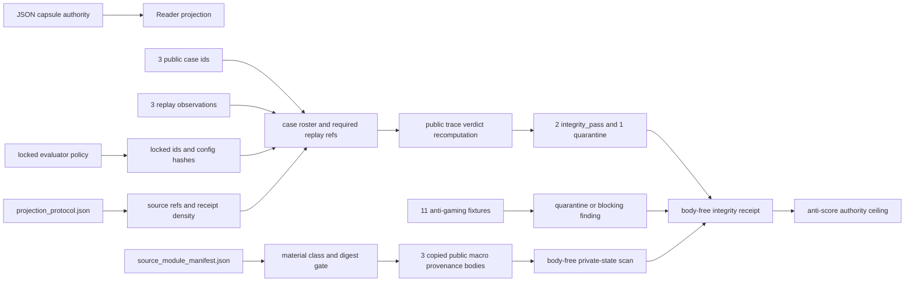

# Agent Benchmark Integrity Anti-Gaming Replay

This module is the public Microcosm projection of the rule that agent benchmark
claims must be replay-backed before they are score-backed. It now carries
copied source-open macro pattern provenance bodies for the benchmark-integrity
pattern row and reconstruction state, plus a body-free regression integrity
organ. It is not a benchmark runner or product-progress claim.

The fixture models a repository repair benchmark with public case ids, task and
patch hashes, locked evaluator ids, evaluator config hashes, file-access log
refs, contamination-check refs, trusted-reference score refs, output-replay
refs, held-out guard ids, and `body_in_receipt=false` rows. It deliberately
keeps issue bodies, oracle patch bodies, hidden-gold answers, provider payloads,
and live repository paths out of the public boundary.

The exported runtime bundle includes `source_module_manifest.json` and
`source_artifacts/` copies of the non-secret macro pattern provenance rows from
`state/microcosm_portfolio`. The validator verifies those copied bodies by
manifest digest and keeps body text out of receipts.

## JSON Capsule Binding

- Source authority: `core/paper_module_capsules.json::paper_modules[3:paper_module.agent_benchmark_integrity_anti_gaming_replay]` with `source_authority: json_capsule`; the generated instance is `paper_modules/agent_benchmark_integrity_anti_gaming_replay.json`.
- This Markdown is a reader projection. The generated Mermaid projection is `available_from_capsule_edges`; the generated Atlas projection is `blocked_until_organ_atlas_owner_lane_binds_edges`, so Atlas linkage is a builder-owned projection rather than page-local truth.
- The authority ceiling is the public macro-pattern provenance and body-free benchmark-integrity replay boundary. The proof boundary is restricted to manifest digests, fixture rows, negative cases, and validation receipts; it does not establish benchmark score, hidden-gold access, provider behavior, live repository mutation, publication, product-progress, or release authority.

## Reader Proof Boundary

A cold reader can validate this module by starting from the JSON capsule row,
then checking the generated JSON instance, exported source-module manifest,
public case roster, replay observations, negative cases, and focused test
receipt path. The page proves only that the fixture preserves a body-free
anti-gaming replay boundary over public case ids and locked evaluator refs.

The proof stops before benchmark scoring, hidden-gold or oracle access, live
repository mutation, provider capability, product-progress claims, publication,
and release. The generated Atlas residual remains with the organ-atlas owner
lane; this page may name that residual but must not fill it locally.

## Technical Mechanism

The organ turns a benchmark claim into a replay-verification problem. Its
inputs are the projection protocol, locked evaluator policy, benchmark case
roster, replay observations, exported bundle manifest, source-module manifest,
and copied `source_artifacts/` rows. `_build_result` loads those inputs,
validates source-module imports, scans public inputs and copied source bodies
against the private-state forbidden-class policy, checks projection protocol
density, validates the locked evaluator policy, validates the case roster, and
then validates each replay row against the same public boundary.

A positive replay cannot pass by declaring success. The replay row must name a
case id present in `benchmark_cases.json`, cite a locked evaluator id, carry an
evaluator config hash allowed by `locked_evaluator_policy.json`, expose
file-access, contamination-check, trusted-reference, and output-replay refs,
and cite source-artifact evidence refs that match the exported source-module
manifest targets. The validator recomputes whether each row is
`integrity_pass` or `quarantine`; missing refs, unregistered cases, unlocked or
mutated evaluators, score authorization, private issue bodies, oracle patch
bodies, hidden-gold access, provider payloads, pass-k cherry-picking, and
misleading tests force quarantine or a blocking finding.

The copied body floor is verified separately from the public receipt. The
source-module manifest must declare `copied_non_secret_macro_body` material,
public macro pattern body classes, `body_in_receipt=false`, and digest-stable
targets. `validate_source_module_imports` checks that each manifest row points
to an existing copied artifact and that its recorded SHA-256 digest matches
disk. Receipts and command cards then omit the bodies and carry only ids, refs,
digests, classes, counts, verdicts, findings, and authority ceilings.

The public trace is a second proof pass rather than a display copy of replay
rows. `build_public_benchmark_integrity_anti_gaming_trace` recomputes each
span from locked-evaluator status, contamination signals, file-access refs,
contamination-check refs, trusted-reference refs, and declared quarantine
reasons. The expected public fixture has three spans: two recompute as
`integrity_pass`, one recomputes as `quarantine`, and the trace must agree with
the declared replay verdicts before the organ can return `status=pass`.

## Named Proof Consumers

- `run` consumes the first-wave fixture and writes the result, board,
  validation receipt, acceptance receipt, and body-free command card. It is the
  proof consumer for the canonical fixture boundary and required negative-case
  floor.
- `run-benchmark-integrity-bundle` consumes the exported public bundle and
  proves that source-open body imports, bundle shape, manifest digests, and
  body-free receipt/card rules survive outside the fixture directory.
- `tests/test_agent_benchmark_integrity_anti_gaming_replay.py` is the focused
  regression consumer. It asserts negative-case observation, digest
  verification, source-artifact evidence refs, public trace verdict
  recomputation, positive/negative verdict handling, body-free receipts, bundle
  runtime shape, and command-card reuse of a fresh receipt.
- A cold reader consumes this Markdown only after checking the JSON capsule,
  generated JSON instance, exported source manifest, case roster, replay
  observations, focused test path, and authority ceiling. The reader may verify
  the replay boundary but must not infer a benchmark score, provider behavior,
  product-progress state, publication state, or release readiness.

## Validation Receipts

The focused proof consumer is
`tests/test_agent_benchmark_integrity_anti_gaming_replay.py`. A passing receipt
has to show that the fixture and exported-bundle validators recompute
benchmark-integrity replay from public case ids, locked evaluator ids, config
hashes, file-access refs, contamination-check refs, trusted-reference refs,
output-replay refs, source-module manifest digests, and negative-case rows
rather than trusting declared benchmark language.

```bash
PYTHONDONTWRITEBYTECODE=1 ./repo-pytest \
  microcosm-substrate/tests/test_agent_benchmark_integrity_anti_gaming_replay.py \
  -p no:cacheprovider
./repo-python microcosm-substrate/scripts/build_doctrine_projection.py \
  --check-paper-module-corpus
```

For the focused test, the receipt boundary is the asserted shape: three public
case ids, three replay rows, two recomputed `integrity_pass` rows, one
`quarantine` row, three public trace spans, locked-evaluator and config-hash
coverage, three copied source-module imports, nine source-artifact evidence
refs, three verified source-artifact evidence refs, `body_in_receipt=false`,
and negative cases for verdict mismatch, invalid declared verdict, evaluator
config hash swaps, missing replay/source evidence, digest mismatches, manifest
boundary violations, hidden-gold/oracle/provider/score overclaims, and unsafe
command-card body reuse. For the corpus check, the receipt only proves
capsule/instance parity; it does not create benchmark score,
product-progress, provider, publication, or release authority.

## Public Site Availability Boundary

This Markdown is safe to project on the public site as a reader instrument
because it exposes public ids, hashes, manifest refs, validator commands,
negative-case labels, and authority ceilings without publishing hidden issue
bodies, oracle patches, provider payloads, or live repository paths.

Public rendering may explain how to rerun the fixture and read the validation
output. It must not turn the page into a benchmark leaderboard, a
SWE-bench result, a production-capability claim, or a release signal.

## Public-Safe Body Handling

The public body floor is the exported source-module manifest plus the copied
non-secret macro provenance bodies in `source_artifacts/`. Receipts and cards
must stay body-free, carrying only refs, digests, material classes, counts,
verdicts, and anti-claims.

Any future body import for this organ must pass through the capsule and bundle
owner lanes. Markdown may point to manifest rows and validator evidence, but it
must not inline hidden-gold answers, oracle patches, private issue text,
provider payloads, or secret-adjacent source bodies.

## Shape



The page shape is a bounded replay spine, not a benchmark leaderboard. A reader
starts at the JSON capsule, follows the source-open manifest into three copied
public macro provenance bodies, then checks the public case roster, locked
evaluator policy, replay observations, recomputed trace verdicts, and
body-free receipts. The output is an integrity-boundary verdict: two public
case replays pass the boundary, one public case replay is quarantined, and no
score or hidden-gold authority is created.

## Source-Open Body Floor

The standard treats the bundle `source_module_manifest.json` as the body-row
authority for three copied non-secret macro pattern provenance bodies:
`benchmark_integrity_extracted_pattern_ledger_row_body_import`,
`benchmark_integrity_high_novelty_growth_receipt_body_import`, and
`benchmark_integrity_deterministic_pattern_order_body_import`.

Those rows stay in `source_artifacts/`; receipts and workingness/status cards
carry refs, digests, classes, counts, and authority ceilings only. The body
floor is accepted as regression-negative fixture evidence, not as a benchmark
score, SWE-bench performance claim, hidden-gold export, provider authority,
live repository mutation authority, product-progress evidence, publication, or
release authority.

## Claim Ceiling

This module may claim only that the public fixture and exported bundle preserve
a body-free benchmark-integrity replay boundary: public case ids, locked
evaluator refs, config hashes, contamination refs, output-replay refs,
manifest digests, negative cases, and authority ceilings are recomputed or
checked.

It must not claim benchmark performance, SWE-bench score, provider capability,
hidden-gold access, oracle patch access, private issue access, live repository
mutation, publication approval, product-progress evidence, or release approval.

## Reader Evidence Routing

- Capsule route: read `core/paper_module_capsules.json::paper_modules[3]`, then
  the generated JSON instance, before treating this Markdown as explanatory
  projection.
- Bundle route: read `examples/agent_benchmark_integrity_anti_gaming_replay/exported_benchmark_integrity_bundle/source_module_manifest.json`
  for `module_count=3`, `body_in_receipt=false`, copied body refs, digest
  refs, and the explicit secret-exclusion boundary.
- Case route: read `benchmark_cases.json` for `repo_issue_public_001`,
  `repo_issue_public_002`, and `repo_issue_public_003`; the rows expose ids,
  hashes, splits, and held-out guard ids, not issue bodies or oracle patches.
- Replay route: read `replay_observations.json` for the locked evaluator ids,
  config hashes, file-access refs, contamination refs, trusted-reference refs,
  output-replay refs, and the two `integrity_pass` plus one `quarantine`
  verdict pattern.
- Runtime route: run `tests/test_agent_benchmark_integrity_anti_gaming_replay.py`
  when the reader needs recomputation evidence. The focused tests assert
  source-module digest verification, public trace verdict recomputation,
  required negative cases, and body-free receipt boundaries.

## Public Mechanics

- A replay cannot pass unless the evaluator id and config hash are locked.
- A replay row cannot pass unless its case id appears in the declared
  `benchmark_cases.json` roster.
- File-access logs, contamination checks, trusted references, and output replay
  refs are required before any benchmark-style language can be considered.
- Train/test leakage, hidden-gold access, oracle patch bodies, provider
  payloads, final-answer-only grading, pass-k cherry-picking, misleading tests,
  private issue bodies, unregistered case replays, and score overclaims are
  quarantine cases.
- `integrity_pass` is evidence that a body-free regression replay respected the
  boundary, not evidence of a SWE-bench score, live agent capability, or
  product-spine substrate progress.
- Receipts expose ids, refs, verdicts, counts, negative cases, and authority
  ceilings only.
- Source body imports expose public-safe macro pattern provenance artifacts in
  the bundle, with receipts limited to refs, digests, classes, and validation
  status.

## Prior Art Grounding

This organ is grounded in the long-running observation that optimized metrics
can become targets and lose evidential force, plus the AI-safety literature on
reward hacking and specification gaming. [Concrete Problems in AI Safety](https://arxiv.org/abs/1606.06565)
frames reward hacking as a practical accident-risk problem, DeepMind's
[specification-gaming survey](https://deepmind.google/blog/specification-gaming-the-flip-side-of-ai-ingenuity/)
collects concrete examples of agents satisfying a proxy in the wrong way, and
benchmark-contamination work such as
[Benchmarking Benchmark Leakage in Large Language Models](https://arxiv.org/abs/2404.18824)
motivates explicit leakage and benchmark-use documentation.

Microcosm borrows the anti-gaming accounting pattern: evaluator ids, config
hashes, case rosters, file-access logs, contamination checks, trusted-reference
refs, and replay refs must be present before benchmark-style language is
allowed. It does not report or imply a model score.

## Governing Lattice Relation

The capsule binds this page to
`mechanism.agent_benchmark_integrity_anti_gaming_replay.validates_public_benchmark_integrity_replay`,
the `agent_reliability_and_safety_validator_bundle` concept, provisional
principles `P-1` and `P-2`, provisional axiom `AX-1`, and the
`paper_module.mission_transaction_work_spine` dependency. Within that lattice,
the mechanism is an evidence-before-score gate: benchmark-style language has no
paper authority unless the capsule row, copied-source manifest, locked policy,
case roster, replay observations, public trace, negative-case floor, and
body-free receipts agree.

The governing concept is accountability for validator bundles, not public
leaderboard construction. The principle/axiom ceiling is enforced as a refusal
surface: private issue bodies, hidden-gold answers, oracle patch bodies,
provider payloads, source mutation, live repository mutation, publication
approval, product-progress evidence, and release approval remain false even
when the replay fixture passes.

## Structured Lattice Bindings

- `source_authority`: `json_capsule`
- `capsule_id`: `paper_module.agent_benchmark_integrity_anti_gaming_replay`
- `reader_projection`: `paper_modules/agent_benchmark_integrity_anti_gaming_replay.md`
- `organ`: `agent_benchmark_integrity_anti_gaming_replay`
- `mechanism`: `mechanism.agent_benchmark_integrity_anti_gaming_replay.validates_public_benchmark_integrity_replay`
- `runtime_locus`: `src/microcosm_core/organs/agent_benchmark_integrity_anti_gaming_replay.py`
- `fixture_roster`: `fixtures/first_wave/agent_benchmark_integrity_anti_gaming_replay/input`
- `exported_bundle`: `examples/agent_benchmark_integrity_anti_gaming_replay/exported_benchmark_integrity_bundle`
- `source_open_body_floor`: three copied public macro pattern provenance bodies,
  each digest-verified and excluded from receipts.
- `negative_case_floor`: evaluator edit attempt, train/test leakage, oracle
  patch body leakage, hidden-gold access, final-answer-only grading, provider
  payload leakage, score overclaim, pass-k cherry-picking, misleading test
  admission, private issue body leakage, and unregistered case replay.
- `generated_mermaid_projection`: `available_from_capsule_edges`
- `generated_atlas_projection`: `blocked_until_organ_atlas_owner_lane_binds_edges`

## Receipt Expectations

A valid receipt exposes case ids, evaluator ids, config hashes, fixture refs,
manifest digests, trace counts, negative-case verdicts, and authority ceilings.
It must keep `body_in_receipt=false`, recompute trace integrity verdicts from
contamination, file-access, and locked-evaluator spans, and reject a declared
verdict mismatch. It may state that a public replay respected the benchmark
integrity boundary; it may not state a benchmark score, SWE-bench result,
provider capability, hidden-gold access, private issue access, oracle patch
body access, publication approval, product-progress evidence, or release
approval.

## Validation Receipt Path

Run the first-wave fixture validator from the repo root and write its receipt
outside the repo working tree:

```bash
cd microcosm-substrate && PYTHONPATH=src ../repo-python -m microcosm_core.organs.agent_benchmark_integrity_anti_gaming_replay run --input fixtures/first_wave/agent_benchmark_integrity_anti_gaming_replay/input --out /tmp/agent_benchmark_integrity_receipt --acceptance-out /tmp/agent_benchmark_integrity_acceptance.json --card > /tmp/agent_benchmark_integrity_card.json
```

Then run the exported bundle validator:

```bash
cd microcosm-substrate && PYTHONPATH=src ../repo-python -m microcosm_core.organs.agent_benchmark_integrity_anti_gaming_replay run-benchmark-integrity-bundle --input examples/agent_benchmark_integrity_anti_gaming_replay/exported_benchmark_integrity_bundle --out /tmp/agent_benchmark_integrity_bundle_receipt --card > /tmp/agent_benchmark_integrity_bundle_card.json
```

The focused regression test and corpus projection checks are:

```bash
cd microcosm-substrate && ../repo-pytest microcosm-substrate/tests/test_agent_benchmark_integrity_anti_gaming_replay.py
./repo-python microcosm-substrate/scripts/build_doctrine_projection.py --check-paper-module-corpus
```

## Anti-Claim

This module does not claim benchmark performance, run providers, expose private
issue or oracle patch bodies, access hidden-gold answers, mutate live
repositories, publish results, host a benchmark, or authorize release.
