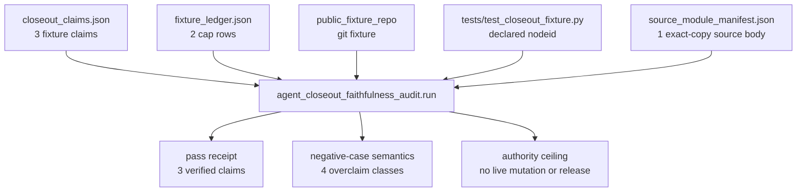

# Agent Closeout Faithfulness Audit

`agent_closeout_faithfulness_audit` checks the kind of sentence an agent writes
when it finishes a task: "I committed the change, closed the ledger item, and
the test passed." It runs the supplied public fixture evidence through real
`git` and `pytest` subprocesses and refuses any claim that the evidence does
not actually support.

## Purpose

When an agent reports that work is done, the report is prose. The commit may or
may not exist, the ledger row may or may not be there, and "the test passed" may
mean the test ran, or it may mean nothing was checked at all. This organ exists
to answer one question over a fixed fixture: is each closeout claim backed by an
evidence object that genuinely exists, and is a "passed" claim backed by an
explicit exit-zero status check rather than by the wording of the claim?

The approach is unusual in that it does not parse the closeout prose or score
it against a rubric. It rebuilds the evidence. The fixture's `public_fixture_repo`
is copied into a throwaway directory, initialised and committed with real `git`
subprocesses, and its `HEAD` is read back with `git rev-parse`. A commit claim
passes only when it points at that observed `HEAD`. A declared `pytest` span is
run with `python -m pytest <nodeid>` inside that temporary repo, and only the
exit code decides whether the span passed. The receipt records the run as bytes
of work that happened, not as a paraphrase of what the agent said.

The distinction the audit defends is narrow and easy to lose. "The span ran" and
"the span passed" are separate facts, and a closeout sentence that conflates them
is the precise failure mode here. A pass claim is admitted only when
`pass_status_checked` is true and the subprocess exited zero; a claim that
expected a pass without that check is rejected with
`CLOSEOUT_PYTEST_PASS_STATUS_NOT_CHECKED`. The same separation applies to commits
and ledger caps, so a referenced commit object is not treated as a landed change
and a named cap is not treated as closed work.

## Route Card

- Organ id: `agent_closeout_faithfulness_audit`
- Accepted-organ evidence class: `external_subprocess_witness`
- Standard: `standards/std_microcosm_agent_closeout_faithfulness_audit.json`
- Runner: `src/microcosm_core/organs/agent_closeout_faithfulness_audit.py`
- Fixture input: `fixtures/first_wave/agent_closeout_faithfulness_audit/input`
- Runtime bundle:
  `examples/agent_closeout_faithfulness_audit/exported_agent_closeout_faithfulness_audit_bundle`
- Source manifest:
  `examples/agent_closeout_faithfulness_audit/exported_agent_closeout_faithfulness_audit_bundle/source_module_manifest.json`
- Primary receipts:
  `receipts/first_wave/agent_closeout_faithfulness_audit/agent_closeout_faithfulness_audit_result.json`,
  `receipts/first_wave/agent_closeout_faithfulness_audit/agent_closeout_faithfulness_audit_board.json`,
  `receipts/first_wave/agent_closeout_faithfulness_audit/agent_closeout_faithfulness_audit_validation_receipt.json`,
  and
  `receipts/acceptance/first_wave/agent_closeout_faithfulness_audit_fixture_acceptance.json`
- Generated posture: this paper module is authored doctrine. Receipts,
  runtime-shell bundle receipts, source-module manifests, organ atlas rows, and
  Task/Work Ledger projections are validator- or builder-owned evidence. Refresh
  them through their owner commands instead of patching them by hand.

## JSON Capsule Binding

- Source row: `core/paper_module_capsules.json::paper_modules[12:paper_module.agent_closeout_faithfulness_audit]`
- `source_authority: json_capsule`
- This Markdown is a reader projection. The generated Mermaid projection is
  `available_from_capsule_edges`, and the generated Atlas projection is
  `linked_from_capsule_edges`; both are navigation projections derived from the
  capsule row rather than authority surfaces.
- The proof boundary is the public fixture repo, fixture Task Ledger rows,
  copied non-secret diagnostic body, git and pytest subprocess witnesses,
  negative closeout cases, source manifest, and validation receipts.
- The authority ceiling excludes arbitrary live closeout truth, live Task
  Ledger mutation, live Work Ledger mutation, live Git mutation, provider
  calls, source mutation, release, and whole-system correctness.

## Reader Proof Boundary

A cold reader can validate this module by starting from the capsule row, then
following the generated JSON instance, public fixture repo, fixture Task Ledger
rows, git and pytest subprocess witnesses, copied diagnostic body manifest,
negative closeout cases, and validation receipts. The proof is about whether
fixture closeout claims are backed by named evidence and explicit pass-status
checks.

The proof stops before live Task Ledger truth, live Work Ledger truth, live Git
mutation, arbitrary closeout correctness, all-agent faithfulness, provider
behavior, publication, release, or whole-system correctness. This page explains
the receipt boundary; it does not mutate or close live work.

## Public Site Availability Boundary

This Markdown is safe to project on the public site as a route card and reader
instrument because it exposes public fixture paths, subprocess witness classes,
receipt names, negative-case labels, and validator commands without exporting
private repo state, provider payloads, account/session material, or live ledger
authority.

Public rendering may show how the fixture distinguishes a referenced test from
a passed test. It must not claim that current HEAD, live Task Ledger rows, live
Work Ledger rows, or unrelated closeout prose have been certified.

## Public-Safe Body Handling

The source-open body floor is one exact non-secret diagnostic source module in
the exported bundle, with manifest digests and body-free receipt posture. The
copied body belongs in the bundle source-module path; receipts, cards, and this
Markdown should carry refs, hashes, counts, verdicts, and anti-claims.

Future body refreshes must run through the source-module manifest and validator
lanes. The public paper module must not inline copied body text, private root
paths, provider payloads, account/session state, or live Task/Work Ledger
records as authority.

## Claim Ceiling

This module may claim public fixture evidence that closeout claims are checked
against referenced commit objects, fixture Task Ledger rows, pytest subprocess
witnesses, explicit pass-status checks, negative closeout cases, a copied
non-secret diagnostic body, source-module manifest digest equality, body-free
receipt posture, and validation receipts.

This module may not claim live closeout truth, live Task Ledger mutation, live
Work Ledger mutation, live Git mutation, provider dispatch, source mutation,
release approval, publication readiness, production readiness, all-agent
faithfulness, proof correctness beyond the listed witnesses, or whole-system
correctness.

## Structured Lattice Bindings

| Binding | Reader route |
|---|---|
| Paper module id | `paper_module.agent_closeout_faithfulness_audit` |
| Capsule authority | `core/paper_module_capsules.json::paper_modules[12:paper_module.agent_closeout_faithfulness_audit]` |
| Markdown projection | `paper_modules/agent_closeout_faithfulness_audit.md` |
| Generated instance | `paper_modules/agent_closeout_faithfulness_audit.json::paper_module_payload` |
| Organ runtime | `src/microcosm_core/organs/agent_closeout_faithfulness_audit.py` |
| Mechanism source | `core/mechanism_sources.json::mechanism.agent_closeout_faithfulness_audit.validates_closeout_evidence_claims` |
| Standard | `standards/std_microcosm_agent_closeout_faithfulness_audit.json` |
| Fixture input | `fixtures/first_wave/agent_closeout_faithfulness_audit/input` |
| Exported bundle | `examples/agent_closeout_faithfulness_audit/exported_agent_closeout_faithfulness_audit_bundle` |
| Source manifest | `examples/agent_closeout_faithfulness_audit/exported_agent_closeout_faithfulness_audit_bundle/source_module_manifest.json` |
| Fixture manifest | `core/fixture_manifests/agent_closeout_faithfulness_audit.fixture_manifest.json` |
| First-wave result receipt | `receipts/first_wave/agent_closeout_faithfulness_audit/agent_closeout_faithfulness_audit_result.json` |
| First-wave board receipt | `receipts/first_wave/agent_closeout_faithfulness_audit/agent_closeout_faithfulness_audit_board.json` |
| First-wave validation receipt | `receipts/first_wave/agent_closeout_faithfulness_audit/agent_closeout_faithfulness_audit_validation_receipt.json` |
| Acceptance receipt | `receipts/acceptance/first_wave/agent_closeout_faithfulness_audit_fixture_acceptance.json` |
| Runtime-shell receipt | `receipts/runtime_shell/demo_project/organs/agent_closeout_faithfulness_audit/exported_agent_closeout_faithfulness_audit_bundle_validation_result.json` |

## Governing Lattice Relation

The capsule binds this reader projection to the
`agent_closeout_faithfulness_audit` organ and to
`mechanism.agent_closeout_faithfulness_audit.validates_closeout_evidence_claims`.
That mechanism is active in `core/mechanism_sources.json` and says the organ
validates public closeout evidence claims through fixture commit objects,
fixture HEAD evidence, `git` subprocesses, `pytest` span execution, explicit
pass-status checks, fixture-ledger cap rows, copied source-module digests, and
stable overclaim negative cases before writing body-free receipts.

The doctrine edge is narrow and constructive. The JSON instance reports
`concept.agent_reliability_and_safety_validator_bundle`, principles `P-1` and
`P-2`, axiom `AX-1`, and dependency
`paper_module.durable_agent_work_landing_replay`; those edges explain why this
module is a validator-bundle proof instrument rather than a general closeout
truth oracle. The generated Mermaid and Atlas edges are navigation receipts for
that binding, not release or correctness authority.

## Shape

This module is a closeout-claim accounting fixture, not a closeout oracle. Its
single question is: did the supplied public fixture evidence support the
closeout claims, and did the receipt refuse the overclaims that should not pass?



The accounting is source-backed:

| Evidence input | Runtime check | Receipt/accounting field |
|---|---|---|
| `closeout_claims.json` carries `claim_public_head_exists`, `claim_cap_exists`, and `claim_pytest_span_passed` | `evaluate()` loops over the three claim rows in `src/microcosm_core/organs/agent_closeout_faithfulness_audit.py` | `claim_count: 3`, `verified_claim_count: 3` |
| `public_fixture_repo` is copied into a temporary git repo | `_prepare_public_fixture_repo()` runs `git init`, config, add, commit, and `rev-parse HEAD` subprocesses | `git_subprocess_count: 6`, `head_verified_by_subprocess: true` |
| `fixture_ledger.json` names fixture cap rows | `task_ledger_cap` claims must match `task_ledger_caps[].cap_id` | `cap_fixture_closeout_receipt_exists` is accepted; missing caps emit `CLOSEOUT_FAKE_CAP_CLAIM` |
| `tests/test_closeout_fixture.py::test_public_fixture_addition` is the declared pytest span | `evaluate()` runs `python -m pytest <nodeid> -q` and records return code, `span_ran`, and explicit pass-status checking | `pytest_subprocess_count: 1`, `pytest_span_ran_count: 1`, `pytest_pass_status_checked_count: 1` |
| `source_module_manifest.json` names one copied non-secret macro source body | the bundle validator checks digest equality, line count, required anchors, and body-free receipt posture | `module_count: 1`, `line_count: 1703`, `sha256_match: true`, `body_in_receipt: false` |

Negative cases are part of the Shape rather than an appendix because they define
the claim boundary. `EXPECTED_NEGATIVE_CASES` names fake commit, fake cap, fake
pytest node, and unchecked-pytest-pass classes; the focused tests assert the
first three directly against fixture mutation and assert unchecked pass rejection
against `CLOSEOUT_PYTEST_PASS_STATUS_NOT_CHECKED`. The runtime-bundle receipt
observes all four classes, so a cold reader can distinguish "the span ran" from
"the pass claim had exit-zero evidence."

The source-body route is deliberately narrow. The exported bundle copies exactly
`system/lib/agent_experience_diagnostics.py` to
`examples/agent_closeout_faithfulness_audit/exported_agent_closeout_faithfulness_audit_bundle/source_modules/system/lib/agent_experience_diagnostics.py`;
the manifest carries the matching digest, `1703` lines, required anchors
`Agent Experience Grand Rounds` and `closeout`, and `body_in_receipt: false`.
Receipts carry refs, hashes, counts, verdicts, and anti-claims only. They do not
carry copied body text, private root paths, provider payloads, account/session
state, live Task Ledger authority, live Work Ledger authority, source mutation,
release approval, or whole-system closeout truth.

## Technical Mechanism

The fixture validator is centered on `evaluate()` in
`src/microcosm_core/organs/agent_closeout_faithfulness_audit.py`. It loads
`closeout_claims.json` and `fixture_ledger.json`, copies
`public_fixture_repo` into a temporary repository, initializes and commits that
copy with real `git` subprocesses, and records the resulting HEAD through
`git rev-parse HEAD`. Commit claims pass only when the claim ref is `HEAD` or
the actual subprocess-observed HEAD; fixture cap claims pass only when the cap id
appears in the fixture ledger.

For pytest claims, `evaluate()` runs `python -m pytest <nodeid> -q` inside the
temporary public fixture repo. A span can be counted as observed when the nodeid
runs, but a pass claim is accepted only when `pass_status_checked` is true and
the pytest subprocess exits zero. The same source file carries
`evaluate_negative_case()`, which mutates one claim row at a time to force the
fake commit, fake cap, fake pytest node, and unchecked pass paths. The expected
error codes are declared in `EXPECTED_NEGATIVE_CASES`, so the negative floor is
source-bound rather than inferred from prose.

The exported-bundle path uses `run_agent_closeout_bundle()` against
`examples/agent_closeout_faithfulness_audit/exported_agent_closeout_faithfulness_audit_bundle`.
That path reuses the same evaluator while making the source-module manifest
floor mandatory: the copied diagnostic body must match the manifest digest,
include required anchors, and remain absent from receipts. `AUTHORITY_CEILING`
then records the anti-claims in machine-readable form: no live repo mutation, no
release authorization, no Task Ledger closure, and no pytest-pass claim without
exit-zero evidence.

## Named Proof Consumers

- `microcosm_core.organs.agent_closeout_faithfulness_audit.run` is the
  first-wave fixture consumer. It materializes the public fixture repo, ledger,
  closeout-claim rows, semantic negative cases, validation receipt, board, and
  acceptance receipt.
- `microcosm_core.organs.agent_closeout_faithfulness_audit.run_agent_closeout_bundle`
  is the exported-bundle consumer. It validates the source-open bundle and the
  copied diagnostic body manifest while preserving `body_in_receipt: false`.
- `microcosm_core.organs.agent_closeout_faithfulness_audit.evaluate` is the
  subprocess witness consumer. It checks commit, cap, and pytest-span claims
  against actual fixture evidence instead of accepting closeout prose.
- `microcosm_core.organs.agent_closeout_faithfulness_audit.evaluate_negative_case`
  is the falsification consumer for fake commit, fake cap, fake nodeid, and
  unchecked pytest-pass overclaims.
- `tests/test_agent_closeout_faithfulness_audit.py` is the focused regression
  consumer. It asserts the public subprocess witness path, fake-claim
  rejections, semantic negative-case evaluation, exported-bundle body-free
  source manifest behavior, digest-mismatch rejection, and pytest-capable
  interpreter selection.

## First Commands

From `microcosm-substrate`:

```bash
PYTHONPATH=src python3 -m microcosm_core.organs.agent_closeout_faithfulness_audit run --input fixtures/first_wave/agent_closeout_faithfulness_audit/input --out receipts/first_wave/agent_closeout_faithfulness_audit --acceptance-out receipts/acceptance/first_wave/agent_closeout_faithfulness_audit_fixture_acceptance.json
```

Validate the exported runtime bundle when the question is whether the public
source-open copy still matches the declared macro body:

```bash
PYTHONPATH=src python3 -m microcosm_core.organs.agent_closeout_faithfulness_audit run-agent-closeout-bundle --input examples/agent_closeout_faithfulness_audit/exported_agent_closeout_faithfulness_audit_bundle --out receipts/runtime_shell/demo_project/organs/agent_closeout_faithfulness_audit
```

## What It Proves

This organ checks closeout claims against public fixture evidence instead of
trusting closeout prose. A positive run proves four things:

- the fixture repo exists and the referenced commit object is visible to real
  `git` subprocesses;
- fixture `HEAD` is checked by subprocess evidence rather than by prose;
- the declared `pytest` span actually ran;
- Task Ledger style cap claims only point at rows present in the fixture
  ledger.

The useful distinction is narrow: `verified` means the referenced evidence
object exists or the pytest span ran. A claim that a pytest span passed is valid
only when the receipt checked an explicit exit-zero status. That is the reader
value of this organ: it separates "I referenced a test" from "I proved the test
passed."

## Prior Art Grounding

This organ is grounded in claim-verification and reproducibility patterns rather
than in trust of summary prose. [FEVER](https://arxiv.org/abs/1803.05355)
popularized fact extraction and verification as a separate task over cited
evidence, while [TruthfulQA](https://arxiv.org/abs/2109.07958) made explicit
that fluent model answers can be misleading without a truthfulness check. The
artifact-review tradition also motivates separating a claim, its artifact, and
its validation evidence instead of treating a report as self-validating.

Microcosm borrows that verification posture for agent closeout: commit refs,
Task Ledger refs, pytest spans, subprocess witnesses, and pass-status checks
must line up before closeout language is admitted. It does not certify all live
closeout prose or turn a referenced test into a passed test without exit-zero
evidence.

## Source-Backed Substrate

The source-open body import is a single exact non-secret macro body:

- `system/lib/agent_experience_diagnostics.py`

The copied target is:

- `examples/agent_closeout_faithfulness_audit/exported_agent_closeout_faithfulness_audit_bundle/source_modules/system/lib/agent_experience_diagnostics.py`

The manifest records:

- `source_to_target_relation: exact_copy`;
- `body_copied: true`;
- `body_in_receipt: false`;
- a 1703-line body;
- matching source and target sha256 digests;
- required anchors `Agent Experience Grand Rounds` and `closeout`.

Receipts carry refs, hashes, counts, verdicts, and anti-claims only. They must
not embed the copied macro body or private paths.

## Receipt Floor

A passing fixture run emits:

- `agent_closeout_faithfulness_audit_result.json`
- `agent_closeout_faithfulness_audit_board.json`
- `agent_closeout_faithfulness_audit_validation_receipt.json`
- `agent_closeout_faithfulness_audit_fixture_acceptance.json`

A passing runtime-bundle run emits:

- `exported_agent_closeout_faithfulness_audit_bundle_validation_result.json`
- `agent_closeout_faithfulness_audit_board.json`
- `agent_closeout_faithfulness_audit_validation_receipt.json`

The first-wave result must show:

- `status: pass`;
- `real_substrate_disposition: real_substrate_capsule`;
- `body_in_receipt: false`;
- `source_module_manifest.status: pass`;
- `all_expected_digests_matched: true`;
- `all_required_anchors_present: true`;
- `secret_exclusion_scan.blocking_hit_count: 0`;
- `receipt_body_scan.status: pass`.

The exercise floor is:

- three verified closeout claims;
- six git subprocess witnesses;
- one pytest subprocess witness;
- one checked pass status;
- one ran pytest span;
- `head_verified_by_subprocess: true`.

## Validation Receipts

The focused proof consumer is
`tests/test_agent_closeout_faithfulness_audit.py`. A passing receipt has to show
that closeout language was checked against public fixture evidence: referenced
commit objects, fixture Task Ledger rows, `git` subprocess witnesses, `pytest`
subprocess witnesses, explicit pass-status checks, negative closeout cases, and
the exported source-module manifest. It must not rely on closeout prose as its
own proof.

Validate the reader projection from the repo root without mutating durable
receipt or generated projection surfaces:

```bash
./repo-pytest microcosm-substrate/tests/test_agent_closeout_faithfulness_audit.py -q --basetemp=/tmp/microcosm_agent_closeout_faithfulness_audit_pytest
./repo-python microcosm-substrate/scripts/build_doctrine_projection.py --check-paper-module-corpus
```

For the focused test, the receipt boundary is the asserted shape: three
verified closeout claims, at least five `git` subprocess witnesses, one
`pytest` subprocess witness, one ran pytest span, one checked pass-status row,
`head_verified_by_subprocess=true`, source-module digest and required-anchor
matches, body-free receipt posture, and semantic observation of the four
negative closeout classes. For the corpus check, the receipt only proves
capsule/instance parity; it does not close live Task Ledger work, mutate live
Work Ledger state, certify arbitrary closeout prose, prove release readiness,
or turn a referenced pytest span into a passed span without exit-zero evidence.

## Receipt Expectations

First-wave receipts are expected to bind the fixture claims to public evidence:
`status: pass`, `real_substrate_disposition: real_substrate_capsule`,
`observed_negative_cases` covering all four required negative cases, git witness
counts, pytest witness counts, checked pass-status counts, and body-free source
manifest fields.

Runtime-bundle receipts are expected to bind the exported bundle to the same
source-body floor: `input_mode: exported_agent_closeout_faithfulness_audit_bundle`,
one copied source module, `body_in_receipt: false`, matching source and target
digests, required anchors present, and a receipt body scan that remains clean.

These receipts are accounting evidence, not a release decision. A passing
receipt says the supplied fixture and exported bundle satisfied the declared
checks; it does not close live Task Ledger work, mutate Git, certify all agent
closeout prose, or authorize publication.

## Negative Cases

The current negative-case floor is:

- `fake_commit_claim` -> `CLOSEOUT_FAKE_COMMIT_CLAIM`
- `fake_cap_claim` -> `CLOSEOUT_FAKE_CAP_CLAIM`
- `fake_test_claim` -> `CLOSEOUT_FAKE_TEST_CLAIM`
- `unchecked_pass_claim` -> `CLOSEOUT_PYTEST_PASS_STATUS_NOT_CHECKED`

These cases are the claim-language guardrail. If they stop appearing in
observed negative cases, the organ no longer proves that public closeout
receipts reject fabricated commit, cap, test-node, or unchecked-pytest-pass
claims.

## Authority Ceiling

This organ is a public fixture witness for closeout evidence. It does not:

- prove arbitrary live commits landed;
- close or mutate Task Ledger work;
- mutate Git state;
- authorize release;
- call providers;
- certify all closeout prose;
- turn a ran pytest span into a passed span without an explicit exit-zero check.

Its useful claim is narrower: over the supplied fixture repo, fixture ledger,
closeout claims, and copied diagnostic body, the organ proves that closeout
evidence references are checked and that specific overclaims are refused.

## Validation Anchors

Focused coverage lives in `tests/test_agent_closeout_faithfulness_audit.py` and checks:

- public git and pytest subprocess witness behavior;
- fake commit rejection;
- unchecked pytest pass rejection;
- fake cap claim rejection;
- fake pytest node id rejection;
- body-free source manifest behavior in the exported bundle;
- source-module digest mismatch rejection;
- pytest-capable Python selection.

## Evidence Binding

- JSON capsule authority: `core/paper_module_capsules.json#paper_module.agent_closeout_faithfulness_audit`.
- Mechanism source: `core/mechanism_sources.json#mechanism.agent_closeout_faithfulness_audit.validates_closeout_evidence_claims`.
- Organ atlas edge: `core/organ_atlas.json#agent_closeout_faithfulness_audit`.
- Runtime source: `src/microcosm_core/organs/agent_closeout_faithfulness_audit.py`.
- First command:
  `PYTHONPATH=src python3 -m microcosm_core.organs.agent_closeout_faithfulness_audit run --input fixtures/first_wave/agent_closeout_faithfulness_audit/input --out receipts/first_wave/agent_closeout_faithfulness_audit --acceptance-out receipts/acceptance/first_wave/agent_closeout_faithfulness_audit_fixture_acceptance.json`.

## Reader Evidence Routing

- Start with the Route Card and JSON Capsule Binding to identify the organ,
  standard, source row, runner, fixture input, exported bundle, and receipt
  surfaces.
- For behavior questions, read
  `src/microcosm_core/organs/agent_closeout_faithfulness_audit.py` and the
  focused tests before trusting this prose.
- For source-open body questions, read the exported bundle's
  `source_module_manifest.json`; the manifest is the evidence for exact-copy
  relation, digest match, anchor match, and body-free receipt posture.
- For claim-language questions, read the Negative Cases and Receipt Expectations
  together; the pass path only matters if the overclaim cases still fail.
- Treat generated organ Markdown, atlas cards, graphs, health files, and runtime
  receipts as navigation or validation projections. They do not become source
  authority for broader closeout truth.

## Re-Entry Conditions

Re-enter this module when:

- `source_module_manifest.json` changes source refs, target refs, digest fields,
  line counts, `body_in_receipt`, or required anchors;
- `agent_closeout_faithfulness_audit.py` changes `EXPECTED_NEGATIVE_CASES`,
  `AUTHORITY_CEILING`, fixture input requirements, subprocess witness behavior,
  or bundle command names;
- receipts no longer report the four negative cases above;
- focused tests add or remove a public closeout overclaim class;
- runtime bundle receipts include copied body text, private root paths, provider
  payloads, account/session state, or live Task/Work Ledger authority;
- generated atlas or registry rows claim broader authority than the validator receipts prove.

On re-entry, patch the runner, fixture input, standard, source-module manifest,
or copied source body through its owning lane first. Regenerate receipts with
the commands above, run the focused tests, and then update this authored module
to reflect the verified source-backed state.
