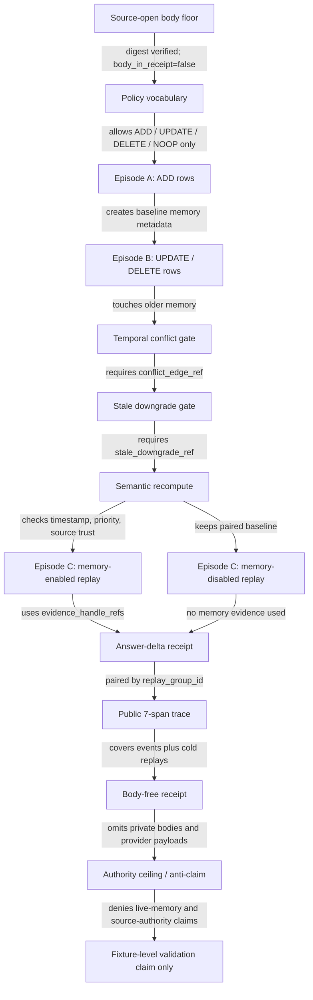

# Agent Memory Temporal-Conflict Replay

This module is the public Microcosm projection of an agent-memory honesty
contract. It is a synthetic replay fixture, not a live memory product, private
transcript export, source-authority claim, or release claim.

The fixture models three public episodes: episode A records a scoped preference
and a tool-result fact, episode B updates the preference scope and deletes the
now-stale fact through conflict-edge and downgrade receipts, and episode C
replays the task with memory enabled and disabled. The replay is admitted only
when ADD, UPDATE, DELETE, and NOOP decisions, metadata-only private refs,
evidence handles, cold replay refs, and an answer-delta receipt line up.

## Purpose

This organ exists because an agent that remembers can quietly start trusting
the wrong row. A user states a preference, the world changes, a later turn
contradicts the earlier one, and a naive memory store keeps serving the stale
fact as though it were still true. The single question this fixture answers is
narrow and checkable: when one memory write supersedes an earlier one, does the
record of that conflict actually hold up, or is it just a label?

The unusual choice is that the validator does not trust the labels it is given.
A row can declare `decision = UPDATE`, attach a plausible-looking conflict-edge
ref, and still be quarantined. In `_apply_conflict_semantic_recompute` the
checker re-derives the conflict lineage from the raw fields it can verify:
episode order, event timestamp, memory priority, and source-trust score. An
UPDATE or DELETE that claims to supersede a prior write but is not timestamped
after it, or that regresses priority or relies on lower-trust evidence than the
write it replaces, is rejected. `_apply_temporal_order_checks` adds the coarser
ordering rule that a conflict edge must land after some earlier accepted write
and a replay must land after the conflict it depends on. The label is treated
as a claim to be recomputed, not as authority.

The point of the paired memory-on and memory-off replay is the matching
discipline on the output side. Memory is only allowed to take credit for a
better answer through an explicit evidence handle and a cold-replay receipt, so
the gain is attributable rather than asserted. The interesting idea here is not
a memory product. It is a small, reproducible accounting method for one specific
failure: a stale row outranking newer evidence.

## Abstract

Agent memory becomes dangerous when a stored row is allowed to outrank later
evidence. This module turns that risk into a public, replayable checker: a
synthetic three-episode fixture exercises memory ADD, UPDATE, DELETE, and NOOP
decisions, then verifies that later conflicts can influence replay only through
typed evidence handles, temporal conflict edges, stale-downgrade receipts,
paired memory-on/off cold replays, and a body-free answer-delta receipt.

The technical contribution is not "better memory" and not a product claim. It
is a narrow public accounting method for temporal memory conflict: memory rows
are metadata under test, private refs are metadata-only, copied source-open
macro bodies are digest checked outside receipts, and seven negative fixtures
prove that common overclaim paths are rejected before any pass receipt is
written.

## Telos

The reader-facing aim is to make a hard memory-honesty boundary inspectable
without exporting private memory bodies. A cold reader should be able to answer
four questions from public-safe files and receipts:

1. Which memory decision was made, and under which public route ref?
2. Which evidence handle, timestamp, priority, and source-trust score justified
   the row?
3. Which prior row was conflicted or downgraded before later replay credit was
   allowed?
4. Did the memory-enabled replay use admissible evidence while the paired
   memory-disabled replay remained available for answer-delta accounting?

The accepted result is a body-free memory-conflict receipt. It supports only a
synthetic fixture-level claim: this replay respected the declared temporal
conflict contract under the checked inputs.

## JSON Capsule Binding

- source_ref:
  `core/paper_module_capsules.json::paper_modules[32:paper_module.agent_memory_temporal_conflict_replay]`
- source_authority: json_capsule
- Projection role: This Markdown is a reader projection of the JSON capsule
  row, not the source authority. The generated Mermaid projection is
  `paper_module.agent_memory_temporal_conflict_replay.mermaid` with status
  `available_from_capsule_edges`, and the generated Atlas projection is
  `organ_atlas.agent_memory_temporal_conflict_replay` with status
  `linked_from_capsule_edges`.
- validation boundary: the capsule binds the organ subject, the resolved runtime
  code locus, and 2 generated relationship edges. Concept, principle, axiom,
  and dependency edges remain residual pressure unless they are added to the
  JSON capsule by the capsule owner lane.
- proof boundary and authority ceiling: this page can explain the synthetic
  replay fixture and validation receipts, but it cannot upgrade memory replay
  into a live memory product, private transcript export, source-authority
  claim, release claim, or whole-system validation boundary.

## Reader Validation Boundary

A cold reader can validate this module by starting from the JSON capsule row,
then checking the generated JSON instance, source-module manifest, synthetic
episodes, memory-event decisions, temporal conflict-edge refs, stale-downgrade
refs, paired memory-on/off cold replays, negative cases, and focused tests. The
validation is limited to whether the synthetic replay preserved a body-free
memory-honesty boundary.

The validation stops before quality claims about any live memory system,
private transcript export, private candidate promotion, memory recall as source
authority, provider behavior, active-injection authority, publication, and
release. Unpopulated concept, principle, axiom, and dependency edges remain
residual pressure unless the JSON capsule owner lane adds real targets.

## Technical Mechanism

The runtime treats memory as public replay metadata, not as authority. The
validator loads `projection_protocol.json`, `memory_policy.json`,
`memory_episodes.json`, and `replay_observations.json`; the exported-bundle
mode also loads `bundle_manifest.json`, `source_module_manifest.json`, and the
copied source artifacts listed in the manifest. `_build_result` combines
secret scanning, public trace construction, protocol validation, policy
validation, episode validation, replay validation, source-module import
validation, negative-case coverage, and the authority ceiling before a pass
status is possible.

The mechanism has five reader-visible gates:

1. `validate_projection_protocol` requires source refs, source pattern ids,
   projection receipts, target refs, public runtime refs, target symbols,
   reimplemented mechanics, omissions, and an explicit denial that private
   thread bodies were copied.
2. `validate_memory_policy` requires ADD, UPDATE, DELETE, and NOOP as the only
   admitted decision vocabulary and denies live-memory product, transcript
   export, source-authority, active-injection, provider-call, and release
   authority.
3. `validate_memory_episodes` turns the five public event rows into accepted or
   quarantined memory metadata. Each row needs a route ref, decision, synthetic
   subject id, evidence handle, metadata-only private thread ref,
   body-export flag, source-authority flag, and active-injection flag. Positive
   replay credit requires all four decision classes, two conflict-edge refs,
   stale-downgrade refs, and a prompt-adoption observation ref.
4. `validate_replay_observations` checks the paired memory-enabled and
   memory-disabled replay rows. Memory-enabled replay must cite public evidence
   handles that resolve against the accepted event rows, both replays must carry
   cold-replay receipt refs, and the pair must share an answer-delta receipt.
5. `validate_source_module_imports` verifies the exported bundle's five copied
   public-safe macro bodies by digest, material class, relation, and
   `body_in_receipt=false`. The card path reports only counts, digest refs, and
   receipt paths; full memory rows, replay rows, source bodies, private
   transcript bodies, provider payloads, and active injection text stay out of
   receipts and public cards.

The mechanism is deliberately negative as well as constructive. Seven
falsification fixtures prove that raw transcript export, private candidate
auto-promotion, stale preference override, memory-as-source-authority, vector
recall without evidence, final-answer-only memory credit, and active injection
as authority are blocked. `build_public_memory_conflict_trace` gives the reader
a seven-span public trace over the same rows, with five memory-event spans and
two cold-replay spans, and audits coverage for evidence handles, metadata-only
private refs, no private body export, cold-replay refs, answer-delta refs, and
memory-enabled evidence.

## Temporal Conflict Mechanism

The central rule is evidence-before-memory-authority. A memory row may be
accepted as replay metadata only after it satisfies the public policy fields:
route ref, decision, synthetic subject id, event timestamp, memory priority,
source-trust score, evidence handle, metadata-only private thread ref, and
explicit false authority flags for body export, source authority, and active
injection.

UPDATE and DELETE decisions have an extra burden because they alter older
memory. The validator recomputes the conflict lineage instead of trusting the
label. `_apply_temporal_order_checks` verifies that conflict rows occur after
the prior writes they touch, and that replay NOOP rows occur after conflict and
downgrade evidence. `_apply_conflict_semantic_recompute` then checks the
semantic shape of the mutation: the prior event must exist, the conflict group
must be coherent, timestamps must advance, priority may not regress below the
allowed floor, and source trust must stay above the declared floor.

Only after those checks pass can episode C receive replay credit. The
memory-enabled replay must cite public evidence refs that resolve to accepted
memory rows. The memory-disabled replay stays paired by replay group. The
answer-delta receipt accounts for the difference between those cold replays
without reducing the evaluation to final-answer comparison alone.

## Real Sanitized Episode Evidence

The first-wave fixture is not merely shape-only synthetic data. Its
`memory_episodes.json`, `memory_policy.json`, and `replay_observations.json`
mirror the exported memory-temporal-conflict bundle, and the positive rows
carry `sanitized_real_episode=true`, source artifact refs, source event refs,
timestamps, memory priority, and source-trust scores. The source evidence
posture declares `real_source_floor` as
`copied_non_secret_macro_agent_memory_body_with_provenance`,
`body_in_receipt=false`, and `private_bodies_exported=false`.

The exported bundle contributes a source-open body floor without turning bodies
into receipt material. `source_module_manifest.json` lists five copied
public-safe macro bodies across tool, doctrine, standard, and pattern material
classes. The runtime verifies their digests and material classes, while public
cards and receipts expose only paths, counts, digest refs, omitted-material
reasons, and the authority ceiling. That is the realness proof this paper can
use: public-safe source provenance and receipt-level recomputation, not private
memory export.

## Perturbation and Rejection Contract

The fixture includes positive pass evidence and perturbation evidence. Focused
tests mutate the bundle to ensure that the validator rejects timestamp
incoherence, priority regression, source-trust regression, temporal order
breakage, unverified conflict evidence, source-event drift, stale override
without downgrade, downgrade receipt field swaps, positive rows without
evidence handles, unresolved replay refs, replay without memory evidence, and
source-body tampering.

Those rejection tests matter because temporal memory bugs often look plausible
in isolation. A stale row with a nice label is still rejected if its conflict
edge is absent or late; a memory-enabled replay is still rejected if its
evidence refs do not resolve; a digest-mismatched body floor blocks the source
import; and final-answer-only comparison remains a negative case rather than
utility evidence.

## Named Proof Consumers

- `python -m microcosm_core.organs.agent_memory_temporal_conflict_replay run`
  consumes the first-wave fixture, includes negative cases, and writes the
  result, board, validation, and acceptance receipts.
- `python -m microcosm_core.organs.agent_memory_temporal_conflict_replay run-memory-bundle`
  consumes the exported source-open bundle, digest-checks copied macro bodies,
  and emits the public bundle validation result.
- `tests/test_agent_memory_temporal_conflict_replay.py` consumes the same
  fixture and bundle to assert decision counts, conflict counts, stale
  downgrades, secret exclusion, public-relative receipts, unresolved replay
  rejection, source-module digest verification, body-free receipt cards, and
  seven-span trace construction.
- A cold public reader consumes the capsule row, manifest, event rows, replay
  rows, source-artifact digests, and validation receipts; that consumer can
  verify the synthetic honesty boundary but cannot infer quality of any live
  memory system or release readiness.

## Public Site Availability Boundary

This Markdown is eligible for public projection because it exposes synthetic
episode ids, decision classes, conflict refs, replay refs, manifest digests,
validator commands, and anti-claims without exposing raw transcripts, private
thread bodies, private memory candidates, provider payloads, credentials, or
operator voice.

Public rendering may explain the memory-on/off replay method and the stale-row
downgrade rule. It must not present the fixture as a live memory product, a
private memory export, or evidence that any live user memory has been handled.

## Public-Safe Body Handling

The public body floor is the exported bundle manifest plus five copied
public-safe macro bodies. Body text stays in bundle source artifacts; receipts
and cards carry refs, digests, material classes, counts, omission reasons,
secret-exclusion status, and authority ceilings only.

Any future body refresh must preserve the body-free receipt boundary and omit
raw transcripts, private memory candidate bodies, active injection text,
provider payloads, credentials, and secret-equivalent material from public
receipts and site projections.

## Shape



The page shape is a temporal-conflict replay, not a memory product surface. A
reader starts with the JSON capsule, follows the source module manifest to five
copied public-safe macro bodies, then checks three synthetic episodes: initial
memory writes, a later temporal conflict with stale downgrades, and paired cold
replays with memory enabled and disabled. The accepted outcome is a receipt
that says the replay respected the memory-honesty boundary; it does not make
memory recall into source authority.

## Source-Open Body Floor

The exported bundle manifest is the body-row authority for five copied
public-safe macro bodies spanning tool, doctrine, standard, and pattern
material classes. Those bodies stay in bundle source artifacts; receipts and
cards carry refs, digests, classes, counts, omission reasons, secret-exclusion
status, and authority ceilings only.

The floor is accepted as synthetic temporal-conflict replay evidence. It is not
live memory product evidence, private transcript export, private memory
candidate export, provider-behavior evidence, source-mutation authority,
publication authorization, or release authorization.

## Claim Ceiling

This module may claim only that a synthetic memory-temporal replay preserved a
body-free memory-honesty boundary: ADD/UPDATE/DELETE/NOOP decisions, temporal
conflict-edge refs, stale-downgrade refs, paired memory-on/off cold replay
refs, answer-delta accounting, public trace refs, manifest digests, negative
cases, and authority ceilings are checked.

It must not claim quality of any live memory system, readiness of a memory
product, private transcript export, private candidate auto-promotion,
source-authority status, provider behavior, active-injection authority, source
mutation, publication authorization, or release authorization.

## Failure Modes and Limitations

This module is intentionally narrow. It validates a public fixture and exported
bundle against a declared temporal conflict contract; it does not measure live
assistant memory quality, user satisfaction, recall coverage, provider
behavior, or production readiness. Passing receipts show that checked rows,
digests, traces, negative cases, and authority ceilings agreed for the fixture
under test.

Known failure modes are treated as checker inputs rather than prose caveats:
private transcript export, private candidate auto-promotion, stale preference
override, memory-as-source-authority, vector recall without evidence,
final-answer-only credit, active injection authority, missing source manifests,
source-body digest drift, source-event drift, missing conflict edges, missing
downgrade receipts, and unresolved replay evidence. If a future module wants a
stronger memory claim, it needs a new standard and new public-safe evidence;
this module cannot promote itself beyond its fixture ceiling.

## Reader Evidence Routing

- Capsule route: read `core/paper_module_capsules.json::paper_modules[35]`,
  then treat this Markdown as a reader projection rather than source authority.
- Bundle route: read `examples/agent_memory_temporal_conflict_replay/exported_memory_temporal_conflict_bundle/source_module_manifest.json`
  for `module_count=5`, `body_in_receipt=false`, material classes, digest refs,
  omitted-material reasons, and the explicit secret-exclusion boundary.
- Event route: read `memory_episodes.json` for the five memory events:
  `episode_a_preference_add`, `episode_a_tool_fact_add`,
  `episode_b_preference_scope_update`, `episode_b_tool_fact_delete`, and
  `episode_c_replay_noop`.
- Conflict route: verify that the UPDATE and DELETE events carry temporal
  conflict-edge refs and stale-downgrade refs before they can affect replay
  credit.
- Replay route: read `replay_observations.json` for the paired
  `episode_c_memory_enabled_replay` and `episode_c_memory_disabled_replay`
  rows, evidence refs, cold replay receipts, and answer-delta accounting.
- Runtime route: run `tests/test_agent_memory_temporal_conflict_replay.py` when
  the reader needs recomputation evidence. The focused tests assert digest
  verification, public-relative receipts, private-state exclusion, unresolved
  replay rejection, and the exported bundle runtime shape.

## Public Mechanics

- Memory update claims require route refs, evidence handles, and explicit
  ADD/UPDATE/DELETE/NOOP decisions.
- Updates and deletes that touch older memory require temporal conflict-edge
  refs plus stale-downgrade refs before memory can affect replay credit.
- Private thread references are metadata-only; transcript bodies and private
  memory candidate bodies stay omitted.
- Utility language requires paired memory-enabled and memory-disabled cold
  replay receipts; final-answer-only comparison is not enough to support a
  memory utility claim.
- Raw transcript export, private candidate auto-promotion, stale preference
  override, memory-as-source-authority, vector recall without evidence,
  final-answer-only memory credit, and active-injection authority are expected
  falsification fixtures.

## Prior Art Grounding

This organ is grounded in agent-memory architectures and the newer literature
on stale or poisoned memory. The constructive lineage includes
[Generative Agents](https://arxiv.org/abs/2304.03442), which made observation,
reflection, retrieval, and planning a concrete agent-memory pattern, and
[MemGPT](https://arxiv.org/abs/2310.08560), which treats long-context behavior
as a memory-management problem. The risk lineage includes
[AgentPoison](https://arxiv.org/abs/2407.12784) and
[STALE](https://arxiv.org/abs/2605.06527), which focus respectively on poisoned
retrieval stores and whether agents update invalid memories when new evidence
arrives.

Microcosm does not claim a live memory product. It borrows the useful accounting
questions: which memory decision was made, which evidence handle justified it,
which older row was conflicted or downgraded, and whether memory-on/off replay
supports any claim beyond a final-answer comparison.

## Governing Lattice Relation

The JSON capsule binds this module to
`mechanism.agent_memory_temporal_conflict_replay.validates_public_memory_conflict_replay`,
`concept.agent_reliability_and_safety_validator_bundle`, provisional
principle refs `P-1` and `P-2`, and provisional axiom ref `AX-1`. This Markdown
does not promote those placeholder refs into stronger doctrine ids; it explains
how the concrete mechanism satisfies the current capsule boundary.

Mechanically, the governing relation is evidence-before-memory-authority:
memory rows may influence replay only after they carry route refs, public
evidence handles, metadata-only private refs, conflict-edge or downgrade
receipts when stale state changes, and paired replay receipts. The concept
relation is validator-bundle accountability: the module is not a narrative
claim about agents remembering well, but an executable fixture whose policy,
trace, source-body manifest, negative cases, and receipts must all agree. The
axiom/principle ceiling is the same one enforced by the validator: private
state is not public source authority, synthetic replay is not live product
evidence, and projection-ready receipts cannot authorize source mutation,
provider calls, publication, or release.

## Structured Lattice Bindings

- `source_authority`: `json_capsule`
- `capsule_id`: `paper_module.agent_memory_temporal_conflict_replay`
- `reader_projection`: `paper_modules/agent_memory_temporal_conflict_replay.md`
- `organ`: `agent_memory_temporal_conflict_replay`
- `runtime_locus`: `src/microcosm_core/organs/agent_memory_temporal_conflict_replay.py`
- `fixture_roster`: `fixtures/first_wave/agent_memory_temporal_conflict_replay/input`
- `exported_bundle`: `examples/agent_memory_temporal_conflict_replay/exported_memory_temporal_conflict_bundle`
- `source_open_body_floor`: five copied public-safe macro bodies spanning tool,
  doctrine, standard, and pattern material classes; all bodies stay in bundle
  source artifacts and out of receipts.
- `decision_floor`: ADD twice, UPDATE once, DELETE once, and NOOP once across
  the three synthetic episodes.
- `conflict_floor`: two temporal conflict-edge refs and two stale-downgrade
  refs before memory can affect replay credit.
- `negative_case_floor`: raw transcript export, private candidate
  auto-promotion, stale preference override, memory-as-source-authority, vector
  recall without evidence, final-answer-only memory credit, and active
  injection as authority.
- `generated_mermaid_projection`: `paper_module.agent_memory_temporal_conflict_replay.mermaid`
  with status `available_from_capsule_edges`
- `generated_atlas_projection`: `organ_atlas.agent_memory_temporal_conflict_replay`
  with status `linked_from_capsule_edges`

## Receipt Expectations

A valid receipt exposes public-relative paths, route refs, evidence handles,
decision counts, conflict-edge counts, stale-downgrade counts, replay-pair refs,
answer-delta refs, manifest digests, trace status, negative-case verdicts, and
authority ceilings. It must omit raw transcripts, private thread bodies,
provider payloads, credentials, secret values, private memory candidate bodies,
raw operator voice, and active memory injection text as authority. It may state
that the synthetic replay respected temporal conflict handling; it may not
state quality of any live memory product, private transcript export,
source-authority status, provider behavior, source mutation, publication
authorization, or release authorization.

## Validation Receipt Path

Run the first-wave fixture validator from the repo root and write its receipt
outside the repo working tree:

```bash
cd microcosm-substrate && PYTHONPATH=src ../repo-python -m microcosm_core.organs.agent_memory_temporal_conflict_replay run --input fixtures/first_wave/agent_memory_temporal_conflict_replay/input --out /tmp/agent_memory_temporal_conflict_receipt --acceptance-out /tmp/agent_memory_temporal_conflict_acceptance.json --card > /tmp/agent_memory_temporal_conflict_card.json
```

Then run the exported bundle validator:

```bash
cd microcosm-substrate && PYTHONPATH=src ../repo-python -m microcosm_core.organs.agent_memory_temporal_conflict_replay run-memory-bundle --input examples/agent_memory_temporal_conflict_replay/exported_memory_temporal_conflict_bundle --out /tmp/agent_memory_temporal_conflict_bundle_receipt --card > /tmp/agent_memory_temporal_conflict_bundle_card.json
```

The focused regression test and corpus projection checks are:

```bash
cd microcosm-substrate && ../repo-pytest microcosm-substrate/tests/test_agent_memory_temporal_conflict_replay.py
./repo-python microcosm-substrate/scripts/build_doctrine_projection.py --check-paper-module-corpus
```

## Anti-Claim

This module does not run live memory, claim memory product quality, export
private transcripts, auto-promote private candidates, treat memory recall as
source authority, adopt active injection, call providers, mutate source,
publish results, or authorize release.
