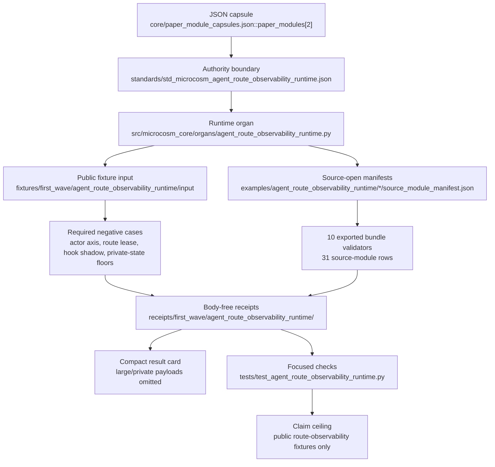

# Agent Route Observability Runtime

This public slice validates synthetic route-feedback fixtures for the agent
observability organ.

It checks actor-axis authority boundaries, route-lease consumption, duplicate
trace ids, hook-shadow advisory status, anti-pattern debt retirement, and
behavior-change evidence gates.

## Purpose

The observability surface is the place where a cold reader should see that a
local run produced a route, work transaction, event trail, evidence ref, and
authority boundary. It should not force that reader to start from raw JSON, and
it should not replace command-backed evidence with motion or dashboard style.

The useful first artifact is therefore a compact causal board: one command,
one selected route, one work/event/evidence chain, one receipt or validator
handle, and one authority ceiling. Browser views, screenshots, and videos are
allowed projections of that board, not separate claims.

Underneath the board, the organ is a replay validator rather than a live tap.
It reads recorded trace rows and turns them into paper-visible evidence only
after a set of authority-boundary checks agree, and the choice that does the
real work is the actor axis. A row tagged as an advisory actor cannot also
claim live mutation authority, and a behaviour-change claim is blocked unless it
names the trace ids that evidence it. This guards the specific failure mode of
observability that reads as proof: a trace that asserts it changed how an agent
behaved, with nothing recorded that a reader can check. Here the assertion is
rejected, the private transcript body it might carry is redacted, and the run
is marked blocked rather than green.

## Shape

The reader path starts at the capsule row, then follows the governed standard
into the runtime organ, public fixture inputs, source-open manifests, receipts,
and regression checks. The path is local and inspectable:
`core/paper_module_capsules.json::paper_modules[2:paper_module.agent_route_observability_runtime]`
points to
`standards/std_microcosm_agent_route_observability_runtime.json` and
`src/microcosm_core/organs/agent_route_observability_runtime.py`; the runtime
then writes bounded public receipts under
`receipts/first_wave/agent_route_observability_runtime/`.



## JSON Capsule Binding

- source_ref:
  `core/paper_module_capsules.json::paper_modules[2:paper_module.agent_route_observability_runtime]`
- source_authority: json_capsule
- Projection role: This Markdown is a reader projection of the JSON capsule
  row, not the source authority. The generated Mermaid projection is
  `paper_module.agent_route_observability_runtime.mermaid` with status
  `available_from_capsule_edges`, and the generated Atlas projection is
  `organ_atlas.agent_route_observability_runtime` with status
  `linked_from_capsule_edges`.
- proof boundary: the capsule binds the accepted organ, the resolved mechanism
  row, the runtime source locus, five dependency edges, concept/principle/axiom
  governance refs, and 12 generated relationship edges. New edges still belong
  in the JSON capsule owner lane, not in Markdown prose.
- authority ceiling: this page can explain public synthetic route-observability
  fixtures, copied non-secret macro body digests, exported-bundle receipts, and
  validation receipts, but it cannot read live sessions, mutate routes, control
  hooks, authorize providers, or widen the proof boundary.

## Reader Proof Boundary

The proof boundary is the JSON capsule row plus its generated relationship
projection. This Markdown may explain the reader path from capsule to organ,
mechanism, source locus, dependencies, and receipts, but it cannot infer new
doctrine edges or upgrade a projection into source authority.

Current generated-row proof: `edge_count: 12`,
`unresolved_selective_relation_count: 0`, Mermaid
`available_from_capsule_edges`, and Atlas `linked_from_capsule_edges`.
The positive reader claim is limited to public synthetic route-observability
fixtures and body-free receipts, not live session introspection, hook control,
provider authority, route mutation, benchmark proof, or release readiness.

## Technical Mechanism

The organ is a route-feedback replay validator, not a live observability tap.
`run` loads the first-wave fixture, streams JSONL trace rows without
materializing the whole file, scans public inputs for forbidden private-state
classes, and then composes six validation gates: route compliance,
hook-shadow coverage, anti-pattern debt retirement, route-lease mode control,
agent-principle-lens admission, and egress mirror boundaries. The result only
passes when the expected negative-case set is complete, the private-state scan
passes, hook-shadow coverage passes, agent-principle-lens rows do not mint
principles or promote candidate axioms, and the egress mirror keeps private
state, provider payloads, and browser/HUD/cockpit state false.

The first-wave fixture is deliberately small but adversarial. The focused test
expects 10 trace rows, one actor-axis mismatch, one authority rejection, one
route-miss replacement, six hook-shadow cases, six egress cases, one
anti-pattern debt retirement, and two route-lease control failures
(`KERNEL_BLOAT_BEFORE_DIRECT_ACTION` and `ROUTE_LEASE_NOT_CONSUMED`). The
negative-case floor covers wrong actor axis, missing route lease, private
transcript body, duplicate trace id, route-compliance overclaim, route miss
replacement, hook-shadow missing authority, banned-route intervention, command
displacement, live-state read attempt, and hook-shadow budget overrun.

The exported-bundle side is the source-open body floor. Ten
`source_module_manifest.json` files under
`examples/agent_route_observability_runtime/` declare 31 copied or sanitized
public source-module rows with `body_in_receipt=false`. Most rows are copied
non-secret macro bodies; the route-compliance-audit bundle is a mixed manifest
with one public-reference sanitized row and copied body rows. Bundle validators
check source-target digests, line counts, byte counts where declared, required
anchors, validation refs, and private-state scans. A manifest digest mismatch
or synthetic private-state regression token blocks the bundle and still keeps
receipt bodies redacted.

Receipts are generated as public-relative JSON proof surfaces. `write_receipts`
emits route-compliance, hook-shadow, debt-retirement, route-lease,
agent-principle-lens, and egress-mirror receipts with common fields:
validator id, command, status, expected and observed negative cases, findings,
anti-claim, private-state scan, authority ceiling, source pattern ids, and
receipt paths. `result_card` then exposes a compact card while omitting large
or private payload classes such as findings, private scans, source body
imports, and authority-ceiling bodies.

## Named Proof Consumers

- `run` is the first-wave fixture consumer. It proves the public trace-row,
  hook-shadow, route-lease, agent-principle-lens, egress, negative-case, and
  body-free receipt boundary for the local fixture.
- `run_observability_bundle` is the main exported-bundle consumer. It validates
  public route events, agent-path observations, session diagnostics,
  hook-shadow rows, actor-axis checks, debt rows, process-audit rows,
  observability policy, source-module manifest integrity, and receipt-card
  reuse for the exported observability bundle.
- The companion bundle consumers
  `run_route_compliance_audit_bundle`, `run_session_attribution_bundle`,
  `run_harness_configuration_audit_bundle`, `run_multi_agent_fanin_bundle`,
  `run_bridge_dispatch_yield_resume_bundle`, `run_controller_heartbeat_bundle`,
  `run_agent_trace_route_repair_bundle`, `run_agent_observability_store_bundle`,
  and `run_computer_use_action_trace_bundle` prove the same
  route-observability membrane across adjacent public route, session, bridge,
  controller, store, and computer-use evidence slices.
- `tests/test_agent_route_observability_runtime.py` is the focused regression
  consumer. It asserts source-module manifest body-copy contracts, digest and
  line-count checks, sanitized-row handling, duplicate-key rejection,
  streaming loaders, required negative cases, public-relative redacted
  receipts, bundle blocking on digest mismatch/private-state hits, and compact
  card omission of private scans.
- `tests/test_macro_projection_import_protocol.py::test_agent_execution_trace_body_import_is_unified_under_macro_projection_spine`
  is the cross-module consumer that keeps the route-observability body import
  under the macro projection import spine rather than a local-only copy story.

## Public Site Availability Boundary

This Markdown source page is public-safe input for the existing Microcosm site
builder. The reachable website material must still come from the generated site
feeds, object maps, search indexes, content graph, paper-module page, and
`llms.txt` entries produced by the builder; those projections are not source
authority and must not be hand-authored from this page.

The current source-ready handoff is
`receipts/public_site/agent_route_observability_runtime_source_prose_site_handoff_20260604T1935Z.json`.
It records the live JSON sidecar readback, the public-safety envelope, and the
builder re-entry command for tracked site output refresh. Website availability
does not widen this module beyond public synthetic route-observability
fixtures, copied non-secret macro body refs, body-free receipts, and the
authority ceiling above.

## Public-Safe Body Handling

Source-open evidence here is limited to refs, digests, copied non-secret body
targets, source-module manifests, and body-free receipts. The page must not
embed live operator traces, provider payloads, browser/HUD state, account data,
raw private bodies, or hook/session material; readers should follow the manifest
and receipt refs for proof without treating this prose as a source-body copy.

## Structured Lattice Bindings

- Capsule row:
  `core/paper_module_capsules.json::paper_modules[2:paper_module.agent_route_observability_runtime]`
- Subjects: `agent_route_observability_runtime` and
  `mechanism.agent_route_observability_runtime.validates_public_route_feedback`
- Runtime locus:
  `src/microcosm_core/organs/agent_route_observability_runtime.py`
- Depends on: `paper_module.navigation_hologram_route_plane`,
  `paper_module.cold_reader_route_map`,
  `paper_module.routing_anti_patterns_registry`,
  `paper_module.pattern_binding_contract`, and
  `paper_module.macro_projection_import_protocol`
- Generated relationship edges: the organ subject, mechanism subject,
  concept/principle/axiom governance refs, five dependency modules, and the
  runtime code locus listed above.
- Selective residuals: none in the current generated row.

## Governing Lattice Relation

The capsule binds this page to
`mechanism.agent_route_observability_runtime.validates_public_route_feedback`,
the `agent_reliability_and_safety_validator_bundle` concept, principles `P-1`
and `P-2`, axiom `AX-1`, and five dependency modules that supply route-plane,
cold-reader, anti-pattern, pattern-binding, and macro-import context. Within
that lattice, the mechanism is an evidence membrane: route feedback becomes
paper-visible only after trace rows, route leases, hook-shadow rows,
anti-pattern debt, egress boundaries, source manifests, private-state scans,
and receipt fields agree.

The governing relation is deliberately narrower than live observability. A
green run can show that a public fixture or exported bundle carries coherent
route feedback and body-free proof surfaces; it cannot infer live session
state, mutate a route, install hooks, authorize provider/browser/HUD access,
promote candidate axioms, prove benchmark behavior, or approve release.

## Prior Art Grounding

This organ is grounded in distributed tracing and agent trajectory work. The
[W3C Trace Context](https://www.w3.org/TR/trace-context/) recommendation and
[OpenTelemetry](https://opentelemetry.io/docs/reference/specification/overview/)
show the established observability pattern: propagate trace identity, collect
events, and preserve enough context to debug a distributed transaction. Agent
work such as [ReAct](https://arxiv.org/abs/2210.03629) also made the interleaved
reasoning/action trajectory a first-class object for interpreting agent
behavior.

Microcosm borrows the traceability shape for route feedback: selected route,
route lease, trace id, work/event/evidence chain, validator ref, and authority
ceiling are exposed together. It does not read live operator traces, provider
payloads, browser HUD state, or certify runtime behavior outside the public
fixture.

## Source-Backed Doctrine Packet

This module is source-backed only when a reader can move from the public
doctrine claim to the runtime organ, standard, source-module manifests,
receipts, and negative cases without guessing. The compact packet is:

Organ authority:

- `core/organ_registry.json::implemented_organs[organ_id=agent_route_observability_runtime]`
- `core/organ_evidence_classes.json::organ_evidence_classes[agent_route_observability_runtime]`
- These rows declare `status=accepted_current_authority`,
  `evidence_class=semantic_validator`, evidence strength rank 5, and the exact
  claim ceiling below.

Standard authority:

- `standards/std_microcosm_agent_route_observability_runtime.json`
- This governs the public route-observability schema, body import posture,
  authority boundary
  `public_route_observability_runtime_metadata_and_copied_macro_trace_bodies_not_live_session_provider_browser_hud_or_hook_authority`,
  and anti-claim language.

Capsule and mechanism authority:

- `core/paper_module_capsules.json#paper_module.agent_route_observability_runtime`
- `core/mechanism_sources.json#mechanism.agent_route_observability_runtime.validates_public_route_feedback`
- These bind the authored Markdown projection to the accepted organ, mechanism
  row, code locus, generated projection hooks, receipt refs, guardrails, and
  focused regression command without treating this prose as source authority.

Runtime and manifest evidence:

- `src/microcosm_core/organs/agent_route_observability_runtime.py`
- See the body-floor manifest list below.
- The runtime builds public fixture receipts, exported bundle validators,
  observability cards, source-manifest checks, private-state scans, and typed
  negative-case results. The manifests bind the copied non-secret
  route/observability macro body materials recorded by
  `microcosm workingness::agent_route_observability_runtime.source_open_body_imports`
  while preserving `body_in_receipt=false`.

Focused regression and receipts:

- `tests/test_agent_route_observability_runtime.py`
- `tests/test_macro_projection_import_protocol.py::test_agent_execution_trace_body_import_is_unified_under_macro_projection_spine`
- `receipts/first_wave/agent_route_observability_runtime/`
- These pin streaming loaders, digest helpers, bundle validators,
  source-module manifests, authority ceilings, macro-body import coupling,
  route compliance, hook-shadow advisory status, debt retirement,
  route-lease mode control, principle lensing, and egress mirror boundaries.

## Reader Evidence Routing

Reader evidence starts at the JSON capsule row, then follows the accepted organ
and mechanism refs into the runtime source, fixture manifests, receipt set, and
focused regression. The route is intentionally source-backed but not
source-authoritative: this Markdown helps a cold reader find the proof surfaces,
while the capsule, registry, standard, mechanism row, runtime source, and
receipts remain the authority.

## Claim Ceiling

The positive claim is limited to public recorded route-feedback and
observability metadata fixtures. The runtime can validate fixture receipts,
copied non-secret body refs, route-lease consumption, trace attribution,
hook-shadow advisory posture, debt retirement, and behavior-change evidence
gates. It does not read live sessions, mutate routes or source, install hooks,
authorize providers, or turn observability into release readiness.

Exact `claim_ceiling` from
`core/organ_registry.json::implemented_organs[organ_id=agent_route_observability_runtime]`:

```text
validates only public recorded route-feedback and observability metadata fixtures, including route-lease consumption, trace attribution, hook-shadow advisory status, anti-pattern debt retirement, behavior-change evidence gates, and public macro body import refs; does not read live operator/provider/browser/HUD/account state, mutate Task Ledger or source, install hooks, certify runtime behavior, authorize pattern assimilation, private-root equivalence, release, publication, or whole-system correctness
```

Receipt refs:

- `receipts/first_wave/agent_route_observability_runtime/route_compliance_audit.json`
- `receipts/first_wave/agent_route_observability_runtime/hook_shadow_coverage.json`
- `receipts/first_wave/agent_route_observability_runtime/debt_retirement_receipt.json`
- `receipts/first_wave/agent_route_observability_runtime/route_lease_mode_control_receipt.json`
- `receipts/first_wave/agent_route_observability_runtime/agent_principle_lens_receipt.json`
- `receipts/first_wave/agent_route_observability_runtime/egress_mirror_receipt.json`

## Source-Open Body Floor

The source-open body floor is the copied public route/observability body import
set plus its manifests and receipts, not live operator/provider/browser state.
The materials below must stay inspectable through `source_module_manifest.json`
refs, source-module digests, bundle validators, and body-free receipts.

Verified source-open body materials:

- `agent_execution_trace_body_import`
- `agent_trace_route_repair_body_import`
- `agent_observability_store_body_import`
- `route_compliance_audit_body_import`
- `agent_session_attribution_body_import`
- `agent_harness_configuration_audit_body_import`
- `continuation_packet_body_import`
- `bridge_resume_body_import`
- `controller_heartbeat_body_import`
- `computer_use_action_trace_body_import`

Body-floor manifest list:

- `examples/agent_route_observability_runtime/exported_observability_bundle/source_module_manifest.json`
- `examples/agent_route_observability_runtime/exported_agent_trace_route_repair_bundle/source_module_manifest.json`
- `examples/agent_route_observability_runtime/exported_agent_observability_store_bundle/source_module_manifest.json`
- `examples/agent_route_observability_runtime/exported_route_compliance_audit_bundle/source_module_manifest.json`
- `examples/agent_route_observability_runtime/exported_session_attribution_bundle/source_module_manifest.json`
- `examples/agent_route_observability_runtime/exported_harness_configuration_audit_bundle/source_module_manifest.json`
- `examples/agent_route_observability_runtime/exported_multi_agent_fanin_replay_bundle/source_module_manifest.json`
- `examples/agent_route_observability_runtime/exported_bridge_dispatch_yield_resume_bundle/source_module_manifest.json`
- `examples/agent_route_observability_runtime/exported_controller_heartbeat_bundle/source_module_manifest.json`
- `examples/agent_route_observability_runtime/exported_computer_use_action_trace_bundle/source_module_manifest.json`

Macro-projection companion body-floor manifests that feed the same shared
spine:

- `examples/macro_projection_import_protocol/exported_projection_import_bundle/agent_execution_trace_source_module_manifest.json`
- `examples/macro_projection_import_protocol/exported_projection_import_bundle/agent_observability_source_module_manifest.json`

First command from `microcosm-substrate/`:

```bash
PYTHONPATH=src python3 \
  -m microcosm_core.organs.agent_route_observability_runtime \
  run \
  --input fixtures/first_wave/agent_route_observability_runtime/input \
  --out receipts/first_wave/agent_route_observability_runtime
```

Registry-declared validator command:

```bash
python \
  -m microcosm_core.organs.agent_route_observability_runtime \
  run \
  --input fixtures/first_wave/agent_route_observability_runtime/input \
  --out receipts/first_wave/agent_route_observability_runtime
```

Exact registry command literal:

`python -m microcosm_core.organs.agent_route_observability_runtime run --input fixtures/first_wave/agent_route_observability_runtime/input --out receipts/first_wave/agent_route_observability_runtime`

## Validation Receipts

From `microcosm-substrate/`, reproduce this page's proof boundary with
temporary receipts:

```bash
PYTHONPATH=src ../repo-python \
  -m microcosm_core.organs.agent_route_observability_runtime \
  run \
  --input fixtures/first_wave/agent_route_observability_runtime/input \
  --out /tmp/microcosm-agent-route-observability-runtime
PYTHONPATH=src ../repo-python \
  -m microcosm_core.organs.agent_route_observability_runtime \
  validate-observability-bundle \
  --input examples/agent_route_observability_runtime/exported_observability_bundle \
  --out /tmp/microcosm-agent-route-observability-bundle
../repo-pytest \
  microcosm-substrate/tests/test_agent_route_observability_runtime.py \
  microcosm-substrate/tests/test_macro_projection_import_protocol.py::test_agent_execution_trace_body_import_is_unified_under_macro_projection_spine
PYTHONPATH=src ../repo-python scripts/build_doctrine_projection.py --check-paper-module-corpus
```

The focused regression file is the proof consumer for this receipt section. Its
51 tests cover the Markdown source-backed packet, streaming JSONL loaders,
duplicate-key rejection, source-module manifest contracts, digest and line
count helpers, exported observability and companion bundles, public-relative
redacted receipts, field-floor ratchets, card reuse, private-scan blockers,
exact or public-safe macro body imports, and computer-use action-trace
boundaries. The macro-projection focused test keeps the agent execution trace
body import under the shared macro projection spine.

That receipt path validates declared public metadata and writes bounded
receipts. It does not inspect live sessions, export transcript/provider bodies,
read browser HUD state, expose credentials or cookies, control accounts, send
recipients, mutate source, prove benchmark performance, authorize publication,
claim hosted readiness, or authorize release.

The negative-case floor is part of the doctrine, not an implementation detail.
Keep these cases visible when strengthening the module: actor-axis mismatch,
missing route lease, private transcript body, duplicate trace id,
route-compliance overclaim, kernel bloat before direct action, reusable-lease
metadata without trace feedback, route miss replacement, hook-shadow missing
authority, hook-shadow banned-route intervention, command displacement,
live-state read attempt, and hook-shadow budget overrun.

## Re-Entry Conditions

Re-entry conditions:

- If `core/doctrine_lattice_coverage.json` names this organ as missing a
  paper-module capsule, mechanism, or code-locus edge, clear that in the
  capsule/registry/atlas owner lane by adding resolved links to the owning
  source files and receipts; do not count this prose packet alone as a
  registry join.
- If any source-module manifest, fixture manifest, standard authority boundary,
  generated receipt, negative-case set, or validator command changes, refresh
  this module in the same pass as the focused test.
- If a browser or visual board is added, it must project the same command,
  selected route, evidence class, receipt ref, anti-claim, and authority ceiling
  before decorative or expanded state.

## Observable First Artifact Contract

The first observable artifact must fit a single browser or terminal viewport
and preserve this order:

Required cues:

- Local action: show the exact command, normally `microcosm hello <project>` or
  `microcosm tour --card <project>`. A visual board cannot be the first proof
  if the producing command is hidden.
- Selected route: show `selected_route_id` plus a short reason. Route
  explanation stays tied to the local project, not whole-system capability.
- Work transaction: show work id, state, and receipt ref when present. State
  changes are local substrate events, not source mutation or provider execution.
- Event and evidence chain: show event ids, evidence class, proof surface, and
  anti-claim. Counts remain accounting fields, not progress or release scores.
- Authority boundary: place the authority ceiling beside the positive claim.
  The board rejects hosted release, private-data equivalence, provider calls,
  and whole-system correctness.
- Structural scale bridge: name the larger substrate surface exercised by this
  run. Scale is a drilldown path, not an implied proof upgrade.

If a renderer cannot show all slots in one viewport, it should show the command,
route, evidence class, receipt ref, and authority ceiling first, then link to
the full route model as drilldown.

## Presentation Boundary

The observatory can be made browser-first or video-friendly only by projecting
the same compact causal board. It may animate route selection, highlight event
edges, or show a receipt reveal, but it must keep the command, receipt/evidence
ref, anti-claim, and authority ceiling visible before any decorative motion.

It must not expose live operator traces, provider payloads, account/session
state, private source bodies, HUD/browser/cockpit internals, or hosted-product
claims. It may point to public fixtures, exported public bundles, generated
receipts, and public-root card emitters.

## Validation Shape

Fixture validation should continue to require actor-axis boundaries,
route-lease consumption, duplicate trace-id detection, hook-shadow advisory
status, anti-pattern debt retirement, and behavior-change evidence gates.
When an observable-first board or endpoint is present, validation should also
prefer fields that prove the compact causal order:

- command ref before visual state;
- selected route before full route graph;
- work/event/evidence refs before explanation prose;
- evidence class and anti-claim beside any counter;
- authority ceiling before hosted, release, provider, or correctness language;
- compact endpoint or board ref before raw JSON drilldown.

Anti-claim: this module does not inspect live operator traces,
prompt/provider bodies, HUD/browser/cockpit state, live Task Ledger rows,
provider payloads, private source bodies, or runtime behavior. It only defines
the public fixture and projection boundary for observable route evidence.
