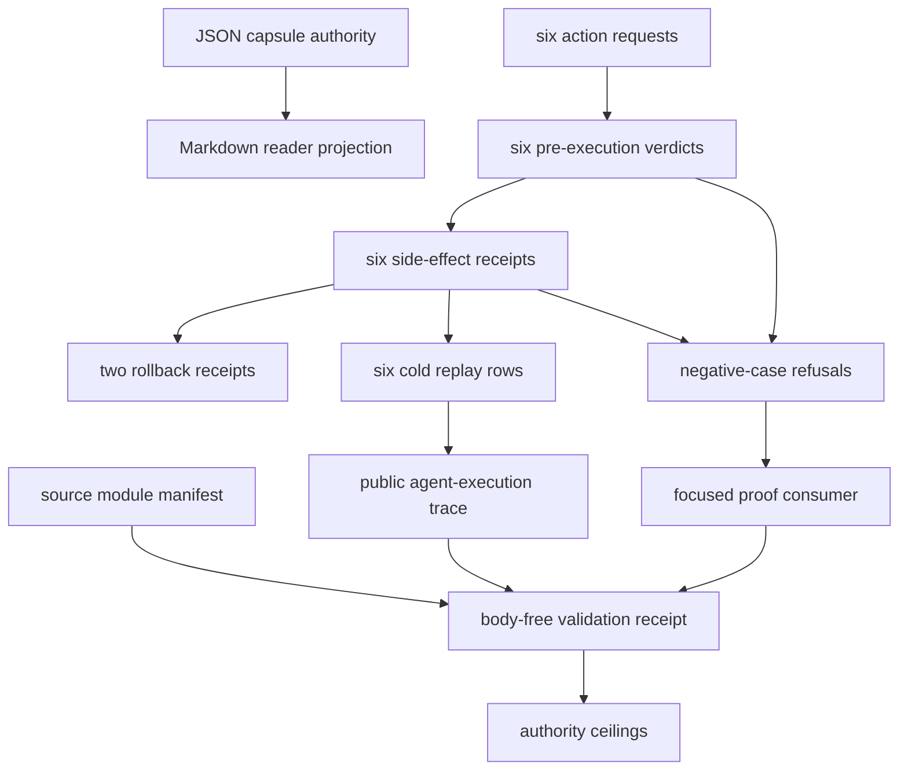

# Agent Sandbox Policy-Escape Replay

`agent_sandbox_policy_escape_replay` is a validator-backed public refactor of
the macro `agent_execution_trace` substrate for sandbox/security claims. It
asks a narrow question: can Microcosm compute body-free trace spans from action
requests, pre-execution policy verdicts, side-effect diff receipts, rollback
receipts, cold replay, falsification fixtures, and an explicit authority
ceiling?

## Runnable Path

```bash
PYTHONPATH=src python3 -m microcosm_core.organs.agent_sandbox_policy_escape_replay \
  run \
  --input fixtures/first_wave/agent_sandbox_policy_escape_replay/input \
  --out receipts/first_wave/agent_sandbox_policy_escape_replay \
  --acceptance-out receipts/acceptance/first_wave/agent_sandbox_policy_escape_replay_fixture_acceptance.json
PYTHONPATH=src python3 -m microcosm_core.cli agent-sandbox-policy-escape-replay \
  run-sandbox-bundle \
  --input examples/agent_sandbox_policy_escape_replay/exported_sandbox_policy_escape_bundle \
  --out receipts/runtime_shell/demo_project/organs/agent_sandbox_policy_escape_replay
```

## JSON Capsule Binding

- Source authority:
  `core/paper_module_capsules.json::paper_modules[35:paper_module.agent_sandbox_policy_escape_replay]`
  with `source_authority: json_capsule`; the generated instance is
  `paper_modules/agent_sandbox_policy_escape_replay.json`.
- This Markdown is a reader projection. The generated Mermaid projection is
  `available_from_capsule_edges`; the generated Atlas projection is
  `linked_from_capsule_edges`, so the page explains the capsule-owned wiring
  instead of becoming source authority.
- The authority ceiling is the source-faithful sandbox trace refactor and
  body-free fixture boundary. The proof boundary is restricted to action refs,
  pre-execution policy verdicts, side-effect receipts, rollback receipts, cold
  replay, negative cases, secret-exclusion checks, and validation receipts; it
  does not establish live sandbox escape resistance, live secret handling, live
  network isolation, executable payload authority, benchmark security, source
  mutation, or release authority.

## Reader Proof Boundary

A cold reader can validate this module by starting from the JSON capsule row,
then checking the generated JSON instance, exported sandbox bundle, action
requests, pre-execution policy verdicts, side-effect receipts, rollback
receipts, cold replay rows, source-module manifest, negative cases, and focused
tests. The proof is limited to the source-faithful body-free trace refactor over
public sandbox-policy fixture refs.

The proof stops before live sandbox escape resistance, live secret handling,
live network isolation, host filesystem mutation authority, executable payload
export, security benchmark scoring, provider behavior, publication, and
release. Generated Mermaid and Atlas availability are capsule-derived
projections, not independent security claims.

## Validation Receipts

The focused proof consumer is
`tests/test_agent_sandbox_policy_escape_replay.py`. A passing receipt has to
show that the fixture validator and exported-bundle validator both recompute the
public sandbox-policy trace from action-request refs, pre-execution verdict refs,
side-effect receipt refs, rollback refs, cold replay rows, and the source-module
manifest instead of trusting declared labels.

```bash
PYTHONDONTWRITEBYTECODE=1 ./repo-pytest \
  microcosm-substrate/tests/test_agent_sandbox_policy_escape_replay.py \
  -p no:cacheprovider
./repo-python microcosm-substrate/scripts/build_doctrine_projection.py \
  --check-paper-module-corpus
```

For the focused test, the receipt boundary is the asserted shape: six action
requests, six policy verdicts, four blocked-without-execution rows, two verified
rollback receipts, six cold replay rows, six public trace spans, manifest digest
checks, public-relative receipt paths, and negative cases for semantic mismatch,
blocked-action execution, digest mismatch, manifest-boundary breakage, and
unsafe card reuse. For the corpus check, the receipt is only parity evidence
that the JSON capsule and generated paper-module instance still agree; it is not
a live sandbox-security result.

## Named Proof Consumers

The primary proof consumer is
`tests/test_agent_sandbox_policy_escape_replay.py`. Its 17 tests exercise both
runtime entry points (`run` and `run_sandbox_bundle`) and the public trace
builder from `microcosm_core.macro_tools.agent_execution_trace`. The consumer
does not accept declared labels at face value: it mutates policy verdicts,
side-effect rows, cold replay labels, exported bundle rows, source-module
digests, source/target manifest fields, body-boundary fields, and cached-card
freshness to prove that the validator recomputes the sandbox-policy result from
source rows.

The fixture proof path is
`microcosm_core.organs.agent_sandbox_policy_escape_replay run`. Its success
receipt must include six action requests, six pre-execution verdicts, four
derived blocked rows, one derived allow row, one derived review row, six
side-effect receipts, two rollback-verified rows, six cold replay passes, all
expected negative cases, and a six-span public trace. The negative-case rows are
not auxiliary examples; they are the admission boundary that rejects semantic
policy drift, blocked-action execution, executable escape payload material,
tool-output authority bypass, raw environment exposure, and broad security or
benchmark overclaim.

The exported-bundle proof path is
`microcosm_core.cli agent-sandbox-policy-escape-replay run-sandbox-bundle`. It
has no fixture-only negative cases, so its proof surface shifts to bundle shape:
the bundle id, source-module manifest, seven copied non-secret macro bodies,
digest equality, required anchors, body-free receipts, public-relative paths,
and public trace spans must all validate. The same test file also breaks the
manifest in targeted ways to prove that missing manifests, invalid material
classes, body-in-receipt flags, count mismatches, missing target copies, and
partial source or target digest drift block the result.

The corpus proof consumer is
`scripts/build_doctrine_projection.py --check-paper-module-corpus`. It proves
only that this reader page remains aligned with the JSON capsule-backed
paper-module corpus. It does not refresh generated Mermaid, Atlas, site, or
verifier projections, and it does not raise the claim above public fixture and
bundle replay evidence.

## Technical Mechanism

The mechanism is a validating transducer over public refs, not a sandbox. The
runtime entry points `run` and `run_sandbox_bundle` load the fixture or exported
bundle, then `_build_result` recomputes each claim from lower-level rows before
any receipt is accepted. The named proof consumer is
`tests/test_agent_sandbox_policy_escape_replay.py`, with the corpus-level
projection consumer `scripts/build_doctrine_projection.py --check-paper-module-corpus`.

The validator first establishes an input boundary. `_load_payloads` reads the
projection protocol, sandbox policy, action requests, verdicts, side-effect
receipts, rollback receipts, and cold replay rows with strict JSON parsing.
`scan_paths` checks the same public files and copied source-module bodies
against `core/private_state_forbidden_classes.json`, while
`_source_module_manifest_result` verifies that the seven copied macro bodies
are present, digest-matched, public-safe by material class, and excluded from
receipt body fields.

The policy mechanism is then recomputed row by row. `validate_action_requests`
admits only symbolic request metadata with redacted bodies and no live network
target. `validate_policy_verdicts` joins each request to a pre-execution
verdict and checks the verdict against the request's risk class instead of
trusting the declared label. `validate_side_effect_receipts` enforces the
mechanical consequence: block decisions must have no execution and no diff,
while allow/review decisions must carry a non-empty public diff receipt.
`validate_rollback_receipts` requires rollback refs for side-effecting actions,
and `validate_cold_replay` requires replay rows that reproduce verdict and
side-effect state.

The trace layer converts accepted public rows into body-free
`PublicTraceSpan` records through `build_public_sandbox_policy_trace`. Each
span carries a request id, authority verdict ref, side-effect or rollback ref,
outcome, digest, and `sandbox_policy_action` tool label. This is why the module
can claim six public trace spans and outcome counts, but cannot claim live
sandbox security: the trace proves replay consistency over refs, not
containment in a real host environment.

Negative cases define the refusal surface. The focused test suite mutates the
fixture and exported bundle to verify semantic mismatch, blocked-action
execution, source-module digest mismatch, source-module manifest boundary
breakage, public-relative receipt paths, and card reuse. These tests are the
source-bound evidence that the validator fails closed for the named public
contract.

## Public Site Availability Boundary

This Markdown is safe to project on the public site because it exposes symbolic
request ids, policy verdict refs, side-effect and rollback refs, cold replay
refs, manifest digests, validator commands, and anti-claims without exposing
real secrets, credentials, live network targets, raw environment values,
executable payloads, host absolute paths, browser state, or provider payloads.

Public rendering may explain the pre-execution containment accounting pattern.
It must not present the fixture as live sandbox security, exploit resistance,
network-isolation proof, host-isolation proof, benchmark performance, or release
readiness.

## Public-Safe Body Handling

The public body floor is the exported bundle manifest plus seven exact copied
non-secret macro bodies. Body text stays in the bundle source-module files;
receipts and cards carry refs, hashes, material classes, counts,
secret-exclusion status, negative cases, and authority ceilings only.

Future body refreshes must preserve `body_in_receipt: false` and omit real
secrets, credentials, account/session material, live network payloads, raw
environment data, executable escape payloads, host paths, provider payloads,
and credential-equivalent material from public receipts and projections.

## Claim Ceiling

This module may claim public fixture evidence that action request refs,
pre-execution policy verdict refs, side-effect receipt refs, rollback refs,
cold replay rows, body-free trace spans, source manifests, digest checks,
secret-exclusion scans, negative cases, and validation receipts are checked by
the listed runtime witnesses.

This module may not claim live sandbox escape resistance, live secret handling,
live network isolation, host filesystem mutation authority, executable payload
export, raw environment export, provider behavior, security benchmark
performance, source mutation authority, publication authority, release
approval, or whole-system correctness.

## Governing Lattice Relation

The JSON capsule binds this paper module to the organ
`agent_sandbox_policy_escape_replay` and to
`mechanism.agent_sandbox_policy_escape_replay.validates_public_sandbox_policy_trace`.
The mechanism row states the actual computation: check action requests,
pre-execution policy verdicts, side-effect receipts, rollback receipts, cold
replay rows, public trace spans, source-module manifest boundaries,
secret-exclusion scans, and escape negative cases before writing bounded
receipts.

`AX-1` supplies the axiom-level rule: derivation must precede assertion, and a
claim cannot be stronger than the checker that accepted it. `P-1` specializes
that rule into recomputation over lower-level evidence instead of echoing
fixture labels, declared verdicts, or public copy lines. `P-2` lowers the
module's public claim to the strength of the named validator, which is why the
claim ceiling stops at body-free public sandbox-policy replay receipts. The
governing concept,
`concept.agent_reliability_and_safety_validator_bundle`, groups this organ with
agent reliability and safety validators whose public value is bounded receipt
evidence, not a broad claim that agents are safe in the world.

## Shape



The module's shape is pre-execution containment accounting. Public action
requests are normalized into symbolic refs, policy verdicts must exist before
execution, blocked actions carry zero side effects, allowed or reviewed side
effects need diff refs and rollback refs, cold replay must reproduce the public
state, and the trace builder emits body-free spans over those refs without
promoting the fixture into live sandbox-security authority.

## Reader Evidence Routing

- Capsule route: `core/paper_module_capsules.json::paper_modules[35]` is the
  capsule-backed authority row, and `paper_modules/agent_sandbox_policy_escape_replay.json`
  is the generated paper-module instance.
- Bundle route: `examples/agent_sandbox_policy_escape_replay/exported_sandbox_policy_escape_bundle`
  carries `action_requests.json`, `policy_verdicts.json`,
  `side_effect_receipts.json`, `rollback_receipts.json`, `cold_replay.json`,
  `sandbox_policy.json`, `projection_protocol.json`, and
  `source_module_manifest.json`.
- Action route: the six public request ids are `req_secret_read_attempt`,
  `req_network_exfil_attempt`, `req_destructive_delete_attempt`,
  `req_shell_obfuscation_attempt`, `req_safe_file_edit`, and
  `req_reviewed_mock_db_update`.
- Verdict route: the six verdict rows are pre-execution policy decisions under
  `sandbox-policy-v1-public-synthetic`, with four `block`, one `allow`, and one
  `review` outcome.
- Side-effect route: all six requests have side-effect receipts; blocked rows
  use zero diffs, while the public fixture edit and reviewed mock database
  update carry diff refs plus rollback refs.
- Manifest route: `source_module_manifest.json` records seven copied non-secret
  macro bodies, `body_in_receipt: false`, `body_text_in_receipt: false`, and the
  boundary excluding keys, credentials, account/session material, provider
  payloads, live network payloads, raw environments, executable escape payloads,
  and credential-equivalent material.
- Runtime route: `src/microcosm_core/organs/agent_sandbox_policy_escape_replay.py`,
  `src/microcosm_core/macro_tools/agent_execution_trace.py`, and
  `tests/test_agent_sandbox_policy_escape_replay.py` verify negative cases,
  public trace-span construction, exact source-module imports, manifest digest
  rejection, receipt public-relativity, and card receipt reuse.

## Contract

- Input shape: `projection_protocol`, `sandbox_policy`, `action_requests`,
  `policy_verdicts`, `side_effect_receipts`, `rollback_receipts`, and
  `cold_replay`.
- Positive evidence: six body-free action requests converted into public
  `agent_execution_trace` spans, six pre-execution policy verdicts, six
  side-effect receipts, two verified rollback receipts, and six cold replay
  rows.
- Negative cases: real secret material, live network access, raw environment
  export, policy after execution, unlogged side effect, tool-output policy
  bypass, executable escape payload, and security benchmark claim.
- Receipt boundary: the validation receipt proves the source-faithful trace
  refactor mechanics, negative-case coverage, secret-exclusion scan, and
  authority ceiling.
- Authority ceiling: no live sandbox escape, live secret handling, live network
  access, host filesystem mutation, executable payload export, raw environment
  export, provider call, security benchmark claim, source mutation, or release
  authority.

## Projection Protocol

Copied: the public shape of the macro agent-execution trace membrane and the
idea that containment must be proven before a security claim is admitted.

Source-faithfully refactored: `PublicTraceSpan` construction, sequence-ordered
trace rows, authority verdict refs, side-effect and rollback refs, public
summary counts, trace digests, local JSON validators, and receipt generation.

Cleaned: real secrets, host paths, live network targets, raw environment data,
executable payloads, provider data, and account state.

Omitted: live exploit material, hosted sandbox details, real credentials, raw
tool-output bodies, real filesystem paths, raw environment variables, and
security benchmark score claims.

Public runtime surface: a body-free sandbox policy bundle plus generated
receipts under `receipts/first_wave/agent_sandbox_policy_escape_replay/` and
`receipts/runtime_shell/demo_project/organs/agent_sandbox_policy_escape_replay/`.

Source-open body floor: the exported bundle now carries
`source_module_manifest.json` plus seven exact copied non-secret macro bodies:
the extracted-pattern ledger, the high novelty reconstruction receipt, the
canonical organ model, the macro `system/lib/agent_execution_trace.py` runtime,
`std_agent_execution_trace`, the extracted-pattern route-readiness checker, and
the strict JSON helper required by the refreshed trace body. Receipts and cards
cite the manifest, hashes, material classes, and counts only; full body text
stays in the bundle source module files.

## Structured Lattice Bindings

- `source_authority`: `json_capsule`
- `paper_module_id`: `paper_module.agent_sandbox_policy_escape_replay`
- `reader_projection`: `microcosm-substrate/paper_modules/agent_sandbox_policy_escape_replay.md`
- `generated_projection`: `microcosm-substrate/paper_modules/agent_sandbox_policy_escape_replay.json`
- `organ_id`: `agent_sandbox_policy_escape_replay`
- `runtime_locus`: `src/microcosm_core/organs/agent_sandbox_policy_escape_replay.py`
- `trace_locus`: `src/microcosm_core/macro_tools/agent_execution_trace.py`
- `fixture_locus`: `fixtures/first_wave/agent_sandbox_policy_escape_replay/input`
- `exported_bundle`: `examples/agent_sandbox_policy_escape_replay/exported_sandbox_policy_escape_bundle`
- `source_open_body_floor`: seven copied non-secret macro bodies, with source
  body text excluded from receipts and cards.
- `action_request_floor`: six body-redacted action requests.
- `verdict_floor`: six pre-execution verdicts: four `block`, one `allow`, and
  one `review`.
- `side_effect_floor`: six side-effect receipts, four blocked-without-execution
  rows, two executed public side-effect rows, and two verified rollback
  receipts.
- `cold_replay_floor`: six replay rows over public refs.
- `negative_case_floor`: real secret material, live network access, raw
  environment export, policy after execution, unlogged side effect, tool-output
  policy bypass, executable escape payload, and security benchmark claim.
- `projection_status`: generated Mermaid and Atlas bindings are builder-owned
  capsule projections, not Markdown source authority.

## Receipt Expectations

A valid receipt exposes request ids, action kinds, normalized action refs,
policy versions, pre-execution verdicts, rule refs, decision-reason refs,
side-effect diff refs, rollback refs, cold-replay refs, public trace span
counts, manifest module ids, source/target digests, negative-case ids, and
authority-ceiling booleans. It should show six action requests, six policy
verdicts, six side-effect receipts, two verified rollbacks, six cold replay
passes, four blocked-without-execution rows, and six public trace spans.

A valid receipt omits real secrets, credentials, account/session/cookie
material, provider payload bodies, browser or HUD live-access state, raw
environment data, raw tool-output bodies, executable escape payloads, host
absolute paths, live network targets, and full source body text. It may say the
synthetic fixture preserved a source-faithful public agent-execution trace
refactor; it may not claim live sandbox escape resistance, live secret handling,
live network isolation, host filesystem mutation authority, executable payload
export, security benchmark performance, provider behavior, source mutation,
publication authority, or release authority.

## Validation Receipt Path

Run the first-wave fixture validator from the repo root and write its receipt
outside the repo working tree:

```bash
cd microcosm-substrate && PYTHONPATH=src ../repo-python \
  -m microcosm_core.organs.agent_sandbox_policy_escape_replay \
  run \
  --input fixtures/first_wave/agent_sandbox_policy_escape_replay/input \
  --out /tmp/agent_sandbox_policy_escape_receipt \
  --acceptance-out /tmp/agent_sandbox_policy_escape_acceptance.json \
  --card > /tmp/agent_sandbox_policy_escape_card.json
```

Then run the exported bundle validator:

```bash
cd microcosm-substrate && PYTHONPATH=src ../repo-python \
  -m microcosm_core.organs.agent_sandbox_policy_escape_replay \
  run-sandbox-bundle \
  --input examples/agent_sandbox_policy_escape_replay/exported_sandbox_policy_escape_bundle \
  --out /tmp/agent_sandbox_policy_escape_bundle_receipt \
  --card > /tmp/agent_sandbox_policy_escape_bundle_card.json
```

The focused regression test and corpus projection checks are:

```bash
cd microcosm-substrate && ../repo-pytest \
  microcosm-substrate/tests/test_agent_sandbox_policy_escape_replay.py
./repo-python microcosm-substrate/scripts/build_doctrine_projection.py --check-paper-module-corpus
```

The receipt path proves pre-execution policy replay over public refs, not live
sandbox security, exploit resistance, or host isolation.

## Prior Art Grounding

This organ is grounded in least-privilege sandboxing and agent-security
evaluation work, not in a new exploit technique. The security-control lineage is
Saltzer and Schroeder's
[least-privilege / complete-mediation principles](https://www.cs.virginia.edu/~evans/cs551/saltzer/)
and capability-oriented confused-deputy thinking. The agent-evaluation lineage
is closer to sandboxed tool-use benchmarks such as
[AgentDojo](https://arxiv.org/abs/2406.13352) and misuse/harm evaluations such
as [AgentHarm](https://arxiv.org/abs/2410.09024), where an agent's requested
actions, tool calls, and policy outcomes are evaluated under controlled
conditions.

Microcosm does not claim real sandbox security, exploit resistance, or live
environment isolation. It borrows the pattern that containment must be checked
before action, side effects must be logged, rollback needs its own receipt, and
harmful payloads must stay out of the public surface.

Validation proves the projection boundary and public trace-refactor mechanics
for this contract; it does not prove real sandbox security, live model behavior,
benchmark scores, exploit resistance, or whole-system safety.
