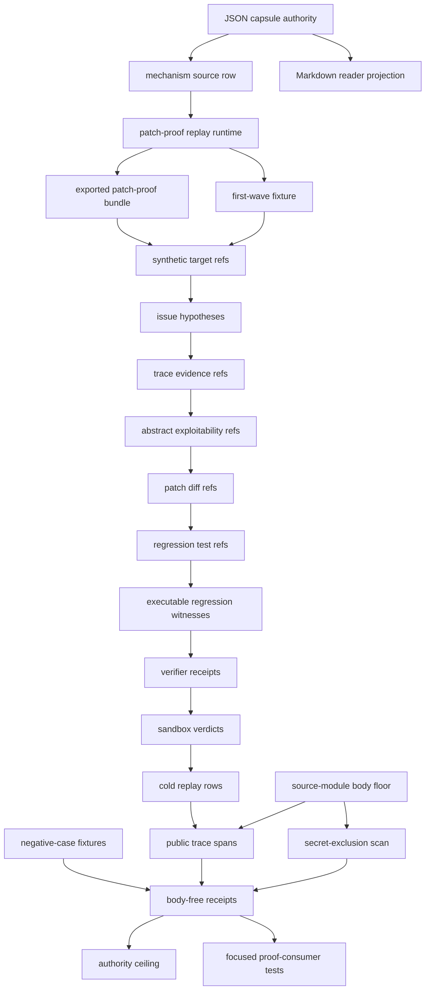

# Agentic Vulnerability Discovery Patch-Proof Replay

This module documents the source-available claim contract for
`agentic_vulnerability_discovery_patch_proof_replay`. It turns an agentic
vulnerability-discovery claim into a public trace-backed local replay: synthetic
body-free targets, issue hypotheses, trace evidence, abstract exploitability
refs, patch diffs, regression tests, verifier receipts, sandbox policy verdicts,
false-positive triage, cold replay, negative cases, and authority ceilings.

## Shape



The module shape is a body-free synthetic patch-proof replay, not a live
vulnerability discovery or fix-correctness claim. The runtime forces target
refs, hypotheses, trace refs, abstract exploitability refs, patch diff refs,
regression test refs, verifier receipts, sandbox verdicts, false-positive
triage, cold replay, public trace spans, source-module digests, negative cases,
and anti-claims to line up before bounded patch-proof language is admitted.

## Technical Mechanism

The mechanism is an evidence join, not a scanner. The JSON capsule names the
organ and mechanism row, and the organ resolves every claim through `_build_result`
in `src/microcosm_core/organs/agentic_vulnerability_discovery_patch_proof_replay.py`.
That function loads the projection protocol and vulnerability policy, then
validates targets, issue hypotheses, trace evidence, exploitability refs, patch
diffs, regression tests, executable regression witnesses, verifier receipts,
sandbox verdicts, false-positive triage, cold replay rows, optional
negative-case fixtures, the public trace builder, and the source-module
manifest. A result can pass only when those validators agree, the
secret-exclusion scan has zero blocking hits, the public trace status is `pass`,
all positive validators are `pass`, and the exported bundle's manifest digests
match copied public-safe source bodies.

The runtime deliberately keeps two evidence modes separate. The first-wave
fixture includes the negative-case authority, so it must observe the expected
overclaim failures such as live target material, real CVE exploitation,
weaponized payload export, exploit steps, patch-without-test claims, and
benchmark score claims. The exported bundle is the public runtime example, so
its `expected_negative_cases` can be empty while it still proves the body floor,
public trace, digest checks, regression witnesses, and authority ceiling. Both
modes write body-free receipts; copied bodies stay behind the
`source_module_manifest.json` refs and hashes.

## Named Proof Consumers

- `tests/test_agentic_vulnerability_discovery_patch_proof_replay.py::test_agentic_vulnerability_patch_proof_replay_observes_negative_cases`
  consumes the first-wave fixture and checks the expected counts, negative-case
  coverage, public trace status, body-import boundary, secret-exclusion scan,
  and authority-ceiling booleans.
- `tests/test_agentic_vulnerability_discovery_patch_proof_replay.py::test_agentic_vulnerability_exported_bundle_validates_runtime_shape`
  consumes the exported bundle and checks runtime mode, target/hypothesis/patch
  counts, executable regression witnesses, source-module manifest status,
  copied-body count, body-free import summary, secret-exclusion status, and
  public trace span count.
- The rejection tests in the same file are the claim ceiling in executable
  form: they mutate false-positive promotion, remove regression tests, tamper
  executable witnesses, omit exploitability proof, cross-wire verifier receipts,
  and alter source-module digests, then require `blocked` results and specific
  error codes instead of allowing patch-proof language.

## Governing Lattice Relation

The governing row is
`mechanism.agentic_vulnerability_discovery_patch_proof_replay.validates_public_agentic_vulnerability_patch_proof_replay`.
It binds this reader module to `concept.agent_reliability_and_safety_validator_bundle`,
`P-1`, `P-2`, `AX-1`, and the upstream
`paper_module.mission_transaction_work_spine` dependency. The relation matters
because the mechanism is a public safety validator bundle: the paper module can
claim that Microcosm checks a source-open, synthetic patch-proof evidence chain,
but the lattice ceiling prevents that claim from becoming live vulnerability
discovery, exploit proof, benchmark standing, source mutation authority, or
release approval.

## Cold-Reader Path

```bash
PYTHONPATH=src python3 -m microcosm_core.organs.agentic_vulnerability_discovery_patch_proof_replay \
  run \
  --input fixtures/first_wave/agentic_vulnerability_discovery_patch_proof_replay/input \
  --out receipts/first_wave/agentic_vulnerability_discovery_patch_proof_replay \
  --acceptance-out receipts/acceptance/first_wave/agentic_vulnerability_discovery_patch_proof_replay_fixture_acceptance.json

PYTHONPATH=src python3 -m microcosm_core.cli \
  agentic-vulnerability-discovery-patch-proof-replay \
  run-patch-proof-bundle \
  --input examples/agentic_vulnerability_discovery_patch_proof_replay/exported_patch_proof_bundle \
  --out receipts/runtime_shell/demo_project/organs/agentic_vulnerability_discovery_patch_proof_replay
```

## What It Admits

The validator admits only body-free patch-proof evidence where trace refs,
abstract proof refs, patch diff refs, regression tests, verifier receipts,
sandbox verdicts, and cold replay line up.

The receipt fields to inspect first are `target_count`,
`issue_hypothesis_count`, `patch_diff_count`, `regression_test_count`,
`verifier_receipt_count`, `observed_negative_cases`, `secret_exclusion_scan`,
`public_agent_execution_trace`, `body_import_verification`, and
`authority_ceiling`.

## Prior Art Grounding

This organ is grounded in the recent line of agentic software-engineering and
security-evaluation work that treats code repair as an executable, test-backed
claim rather than a prose claim. [SWE-bench](https://arxiv.org/abs/2310.06770)
popularized repository issue resolution as an LLM task with real codebases and
test-based patch evaluation, while [SWE-agent](https://arxiv.org/abs/2405.15793)
made the agent-computer interface itself part of the repair substrate. Security
benchmarks such as [CyberSecEval 2](https://arxiv.org/abs/2404.13161) and
[SecCodePLT](https://arxiv.org/abs/2410.11096) motivate separating secure-code
or vulnerability capability claims from uninspected generated patches.

Microcosm borrows the accountability pattern: issue hypotheses, trace evidence,
patch diffs, regression tests, verifier receipts, and negative cases must line
up before patch-proof language is allowed. It does not import live targets, CVE
exploitation authority, weaponized payloads, or benchmark performance claims.

## Source-Open Body Floor

The exported runtime bundle now carries nine exact copied non-secret
macro/control/standard/tool bodies under
`examples/agentic_vulnerability_discovery_patch_proof_replay/exported_patch_proof_bundle/source_modules/`.
The body floor is governed by `source_module_manifest.json`, which records
digest-verified copies of:

- the macro pattern ledger
- the high-novelty reconstruction receipt
- the organ projection IR
- the agent-execution trace runtime and standard
- the extracted-pattern route-readiness standard
- the mission-transaction preflight wrapper
- the mission-transaction landing preflight runtime
- the strict JSON helper

Receipts and cards do not duplicate those bodies. They carry
`source_module_manifest_ref`, `source_open_body_import_refs`,
`source_open_body_imports`, `body_material_status`, and
`body_copied_material_count` so a cold reader can open the real bodies.

The public receipt surface stays free of credentials, account/session state,
cookies, provider payload bodies, browser/HUD live access, recipient-send state,
weaponized payloads, live targets, exploit steps, and credential-equivalent
material.

## Source-Backed Doctrine Binding

- Organ: `src/microcosm_core/organs/agentic_vulnerability_discovery_patch_proof_replay.py`
- Capsule: `core/paper_module_capsules.json#paper_module.agentic_vulnerability_discovery_patch_proof_replay`
- Mechanism:
  `core/mechanism_sources.json#mechanism.agentic_vulnerability_discovery_patch_proof_replay.validates_public_agentic_vulnerability_patch_proof_replay`
- Standard: `standards/std_microcosm_agentic_vulnerability_discovery_patch_proof_replay.json`
- Evidence class:
  `core/organ_evidence_classes.json::agentic_vulnerability_discovery_patch_proof_replay`
  records `algorithmic_projection` at rank 3.
- Source-module manifest:
  `examples/agentic_vulnerability_discovery_patch_proof_replay/exported_patch_proof_bundle/source_module_manifest.json`
  declares nine copied non-secret macro/control/standard/tool bodies, including
  `strict_json_source_body_import`.
- Runtime receipt:
  `receipts/runtime_shell/demo_project/organs/agentic_vulnerability_discovery_patch_proof_replay/exported_patch_proof_bundle_validation_result.json`
- Acceptance receipts:
  `receipts/first_wave/agentic_vulnerability_discovery_patch_proof_replay/*`
  and
  `receipts/acceptance/first_wave/agentic_vulnerability_discovery_patch_proof_replay_fixture_acceptance.json`

## Reader Evidence Routing

- Capsule route:
  `core/paper_module_capsules.json::paper_modules[5:paper_module.agentic_vulnerability_discovery_patch_proof_replay]`
  is the JSON authority row. A diagram view is generated for this module;
  the Atlas card view is a staged exercise pending the organ-atlas lane.
- Mechanism route:
  `core/mechanism_sources.json::mechanism.agentic_vulnerability_discovery_patch_proof_replay.validates_public_agentic_vulnerability_patch_proof_replay`
  binds the validator command, exported-bundle validator command, focused
  regression, guardrails, input refs, receipt refs, and runtime code locus.
- Runtime route:
  `src/microcosm_core/organs/agentic_vulnerability_discovery_patch_proof_replay.py`
  owns `run`, `run_patch_proof_bundle`, `_source_module_manifest_result`,
  `_source_open_body_import_summary`, `_build_result`, `_freshness_basis`,
  `EXPECTED_NEGATIVE_CASES`, `AUTHORITY_CEILING`,
  `SOURCE_MODULE_MANIFEST_NAME`, `BUNDLE_RESULT_NAME`, and
  `CARD_SCHEMA_VERSION`.
- Exported-bundle route:
  `examples/agentic_vulnerability_discovery_patch_proof_replay/exported_patch_proof_bundle`
  is the public runtime bundle for the synthetic patch-proof replay. Open
  `source_module_manifest.json` before trusting copied-body counts, then inspect
  the runtime validation receipt.
- Focused-test route:
  `tests/test_agentic_vulnerability_discovery_patch_proof_replay.py` verifies
  negative cases, public-relative body-free receipts, exported-bundle runtime
  shape, exact copied source modules, digest mismatch rejection, command-card
  receipt reuse, and public trace construction.

## Structured Lattice Bindings

- `source_authority`: `json_capsule`
- `paper_module_id`:
  `paper_module.agentic_vulnerability_discovery_patch_proof_replay`
- `reader_projection`:
  `microcosm-substrate/paper_modules/agentic_vulnerability_discovery_patch_proof_replay.md`
- `organ_id`: `agentic_vulnerability_discovery_patch_proof_replay`
- `mechanism_id`:
  `mechanism.agentic_vulnerability_discovery_patch_proof_replay.validates_public_agentic_vulnerability_patch_proof_replay`
- `runtime_locus`:
  `src/microcosm_core/organs/agentic_vulnerability_discovery_patch_proof_replay.py`
- `standard_locus`:
  `standards/std_microcosm_agentic_vulnerability_discovery_patch_proof_replay.json`
- `fixture_input_locus`:
  `fixtures/first_wave/agentic_vulnerability_discovery_patch_proof_replay/input`
- `exported_bundle_locus`:
  `examples/agentic_vulnerability_discovery_patch_proof_replay/exported_patch_proof_bundle`
- `receipt_loci`:
  `receipts/first_wave/agentic_vulnerability_discovery_patch_proof_replay/agentic_vulnerability_discovery_patch_proof_replay_result.json`,
  `receipts/first_wave/agentic_vulnerability_discovery_patch_proof_replay/agentic_vulnerability_discovery_patch_proof_replay_board.json`,
  `receipts/first_wave/agentic_vulnerability_discovery_patch_proof_replay/agentic_vulnerability_discovery_patch_proof_replay_validation_receipt.json`,
  `receipts/acceptance/first_wave/agentic_vulnerability_discovery_patch_proof_replay_fixture_acceptance.json`,
  and
  `receipts/runtime_shell/demo_project/organs/agentic_vulnerability_discovery_patch_proof_replay/exported_patch_proof_bundle_validation_result.json`
- `source_open_body_floor`: nine copied non-secret macro/control/standard/tool
  source-module rows, body-excluded from receipts and digest-checked by
  `source_module_manifest.json`.
- `runtime_evidence_floor`: three synthetic targets, four issue hypotheses,
  five trace evidence refs, three abstract exploitability refs, three patch
  diffs, three regression test refs, four verifier receipts, four sandbox
  verdicts, one false-positive triage row, four cold replay passes, and five
  public trace spans.
- `negative_case_floor`: live target material, real CVE exploitation,
  weaponized payload export, credential material, network exfiltration,
  actionable exploit instruction steps, patch without tests, and benchmark
  score claims.
- `projection_status`: generated Mermaid is available from capsule edges; the
  generated Atlas card is blocked until the organ-atlas owner lane binds the
  atlas row, so this Markdown must not claim atlas completion.

## Receipt Expectations

A valid first-wave receipt exposes `target_count: 3`,
`issue_hypothesis_count: 4`, `patch_required_count: 3`,
`trace_evidence_count: 5`, `exploitability_proof_count: 3`,
`patch_diff_count: 3`, `regression_test_count: 3`,
`verifier_receipt_count: 4`, `valid_vulnerability_count: 3`,
`false_positive_count: 1`, `sandbox_policy_verdict_count: 4`,
`triage_false_positive_count: 1`, `cold_replay_pass_count: 4`, public trace
`span_count: 5`, all expected negative cases, no missing negative cases, and an
authority ceiling that leaves live targets, weaponized payload export, and
source mutation unauthorized.

A valid exported-bundle receipt may show `expected_negative_cases: []` because
the exported bundle is the runtime example, while the first-wave fixture remains
the negative-case authority. It should still show
`input_mode: exported_patch_proof_bundle`, bundle id
`agentic_vulnerability_discovery_patch_proof_replay_runtime_example`, three
targets, four issue hypotheses, three patch diffs, three regression tests, four
cold replay passes, source-module manifest status `pass`, body material status
`copied_non_secret_agentic_vulnerability_macro_body_landed`, nine source-open
body imports, secret-exclusion status `pass`, public trace status `pass`, and
public trace span count `5`.

A valid command card reuses fresh receipts when the freshness digest still
matches, exposes patch-proof counts, public trace counts, body-floor counts, and
validation counts, and omits target rows, hypothesis rows, trace rows, proof
rows, patch rows, regression-test rows, verifier rows, sandbox rows,
false-positive triage rows, cold replay rows, secret-exclusion scan bodies, and
copied source-module bodies.

## Cold-Agent Use

Open the source-module manifest first, then the runtime receipt, then the organ
source. The useful claim is not that a real vulnerability was discovered or
fixed.

The useful claim is that Microcosm can force an agentic security story to expose
synthetic target refs, issue hypotheses, trace evidence, abstract exploitability
refs, patch diffs, regression tests, verifier receipts, sandbox verdicts,
false-positive triage, cold replay, public trace spans, secret-exclusion scan,
negative-case receipts, and authority ceilings before patch-proof language is
allowed.

Re-entry condition: after the sibling `organ_atlas.json` lane releases, bind
this paper-module capsule, mechanism ref, and code locus into the atlas row and
rerun `python -m microcosm_core.doctrine_lattice --check`.

## Negative Cases

The contract rejects `live_target_material`, `real_cve_exploitation`,
`weaponized_payload_export`, `account_secret_material`, `network_exfiltration`,
`exploit_instruction_steps`, `patch_without_tests`, and
`benchmark_score_claim`. These are falsification fixtures, not product evidence.

## Authority Ceiling

The receipts do not authorize live target testing, real CVE exploitation,
weaponized payload export, credential handling, network exfiltration, actionable
exploit instructions, provider calls, source mutation, benchmark security
scores, release, or any whole-system security claim.

## JSON Capsule Binding

- Capsule row:
  `paper_module.agentic_vulnerability_discovery_patch_proof_replay` in
  `core/paper_module_capsules.json::paper_modules[5:paper_module.agentic_vulnerability_discovery_patch_proof_replay]`.
- source_authority: json_capsule
- This Markdown is a reader projection; the JSON capsule is source authority for
  subjects, code loci, doctrine refs, and generated projection state.
- The generated Mermaid projection is `available_from_capsule_edges`; the
  generated Atlas projection is
  `blocked_until_organ_atlas_owner_lane_binds_edges`.
- The proof boundary is the local validation receipts, synthetic patch-proof
  bundle, copied source-module manifest, and negative cases named above, not
  release, provider, target-testing, or whole-system security authority.
- authority ceiling: copied public macro/control/standard/tool bodies, body-free
  synthetic patch-proof replay receipts, public agent-execution trace spans, and
  fixture validation only; no live target testing, real CVE exploitation,
  weaponized payload export, credential handling, network exfiltration,
  actionable exploit instructions, provider call, source mutation, benchmark
  security score, release approval, publication approval, whole-system security
  claim, or product-progress evidence.

## Reader Proof Boundary

The proof boundary is the JSON capsule plus the generated JSON instance, not
this Markdown narration. Current generated-row proof is `edge_count: 8`,
`unresolved_selective_relation_count: 0`, Mermaid
`available_from_capsule_edges`, Atlas
`blocked_until_organ_atlas_owner_lane_binds_edges`, and `source_authority:
json_capsule`.

A cold reader may use those values to verify that the paper module has capsule
subjects, code loci, and doctrine edges, and that the agentic vulnerability
story is checked through synthetic replay receipts. They may not infer live
target testing, exploit correctness, benchmark security standing, source
mutation permission, release approval, publication approval, or whole-system
security from those values.

## Public Site Availability Boundary

This Markdown page does not prove that the public Microcosm site, content
manifest, docs bundle, Atlas page, or hosted artifact has been regenerated. The
site and Atlas surfaces are projection-owner outputs. If a public page,
generated card, or site manifest disagrees with this source page, the correction
route is the owning site/projection builder, not a hand edit to generated
assets.

## Public-Safe Body Handling

Reader-visible evidence may carry source-module refs, target refs, line counts,
sha256 digests, body-material classes, public trace span counts, negative-case
labels, and receipt paths. It must not carry live target material, weaponized
payloads, exploit steps, credentials, account/session state, provider payload
bodies, browser/HUD state, recipient-send state, raw operator voice, private
macro-root bodies, or copied source bodies inside receipts.

## Claim Ceiling

This module may claim public fixture evidence that synthetic target refs,
issue hypotheses, trace-evidence refs, abstract exploitability refs, patch
diff refs, regression-test refs, verifier receipts, sandbox verdicts,
false-positive triage rows, cold replay rows, public trace spans,
source-module digest checks, secret-exclusion scans, negative-case labels, and
body-free validation receipts are checked by the listed runtime witnesses.

This module may not claim live target testing, real CVE exploitation,
weaponized payload export, credential handling, network exfiltration,
actionable exploit instructions, live provider behavior, benchmark security
scores, patch correctness on real repositories, source mutation authority,
publication authority, release approval, product-progress evidence, or
whole-system security.

## Validation Receipt Path

Run the first-wave fixture validator from the repo root and write its receipt
outside the repo working tree:

```bash
cd microcosm-substrate && PYTHONPATH=src ../repo-python -m microcosm_core.organs.agentic_vulnerability_discovery_patch_proof_replay \
  run \
  --input fixtures/first_wave/agentic_vulnerability_discovery_patch_proof_replay/input \
  --out /tmp/agentic_vulnerability_patch_proof_receipt \
  --acceptance-out /tmp/agentic_vulnerability_patch_proof_acceptance.json \
  --card > /tmp/agentic_vulnerability_patch_proof_card.json
```

Then run the exported bundle validator:

```bash
cd microcosm-substrate && PYTHONPATH=src ../repo-python -m microcosm_core.organs.agentic_vulnerability_discovery_patch_proof_replay \
  run-patch-proof-bundle \
  --input examples/agentic_vulnerability_discovery_patch_proof_replay/exported_patch_proof_bundle \
  --out /tmp/agentic_vulnerability_patch_proof_bundle_receipt \
  --card > /tmp/agentic_vulnerability_patch_proof_bundle_card.json
```

The focused regression test and corpus projection checks are:

```bash
PYTHONPATH=microcosm-substrate/src ./repo-pytest \
  microcosm-substrate/tests/test_agentic_vulnerability_discovery_patch_proof_replay.py
cd microcosm-substrate && PYTHONPATH=src ../repo-python scripts/build_doctrine_projection.py \
  --check-paper-module-corpus
```
