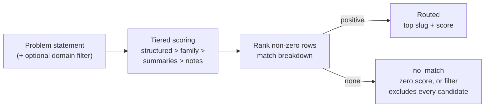

# Annex Knowledge Routing

`annex_knowledge_routing` takes a plain-English problem and a small catalog of
annex entries and returns the entries most likely to help, ranked, with a
breakdown of why each matched — and says `no_match` when nothing actually
overlaps rather than inventing a result.

## Purpose

A router that always returns its best guess hides the cases where it has nothing
useful to offer. This organ is a transparent keyword-overlap matcher that shows
its working and fails to `no_match` honestly.

It surfaces the public `annex_knowledge_router` capsule. It scores each entry of a
sanitized in-memory catalog across four descending-weight tiers — structured
routing fields highest, then family text, then open-first summaries, then curated
notes — combining exact-match, phrase-containment, and token-overlap signals per
tier into a ranked list with a per-row match breakdown. It is deliberately not
BM25, TF-IDF, or embedding search, and it routes only over the catalog handed to
it: no repository cloning, no private corpus, no licence authority.

## Shape



## JSON Capsule Binding

- source_ref:
  `core/paper_module_capsules.json::paper_modules[99:paper_module.annex_knowledge_routing]`
- source_authority: json_capsule
- Projection role: This Markdown is a reader projection of the JSON capsule row,
  not the source authority. The generated Mermaid projection is
  `paper_module.annex_knowledge_routing.mermaid` with status
  `available_from_capsule_edges`, and the generated Atlas projection is
  `organ_atlas.annex_knowledge_routing` with status
  `linked_from_capsule_edges`.
- proof boundary: the capsule binds the accepted organ, the resolved mechanism
  row, the runtime locus, the surfaced engine-room capsule, and the governing
  concept, principle, and axiom edges; the generated JSON projection carries the
  exact resolved relationship edges.
- authority ceiling: this page can explain the tiered-retrieval fixtures and the
  validation receipts, but it cannot become BM25, TF-IDF, embedding or semantic
  search, a repository cloner, a licence or provenance authority, or release
  authority.

## Structured Lattice Bindings

The structured capsule row is
`core/paper_module_capsules.json#paper_module.annex_knowledge_routing`. It binds
this Markdown projection to the organ, the resolved mechanism row
`mechanism.annex_knowledge_routing.verifies_annex_knowledge_router`, the runtime
locus `src/microcosm_core/organs/annex_knowledge_routing.py`, and the surfaced
capsule `src/microcosm_core/engine_room/annex_knowledge_router.py`. It abides by
axiom `AX-2` (a small checker decides claims over certificates) and principle
`P-3` (prefer a small, rerunnable verifier over narrative confidence).

Generated atlas docs remain builder-owned projections: refresh them with
`PYTHONPATH=src python3 scripts/build_organ_atlas.py --write` instead of editing
`ORGANS.md`, `ARCHITECTURE.md`, `AGENT_ROUTES.md`, or
`atlas/agent_task_routes.json` by hand.

## Reader Evidence Routing

The honest unit is the per-row match breakdown and the `no_match` outcome, not a
ranked list that always returns something:

- A safety/evals engineer should confirm the scores are catalog-relative weighted
  overlap, not a calibrated probability. The useful question is whether the router
  explains why each entry matched rather than asserting a black-box rank.
- A hiring reviewer should read the two negatives. The useful question is whether
  an unroutable problem returns `no_match` instead of a forced best guess.
- A peer developer should run the fixtures. The useful question is whether routing
  happens only over the supplied catalog, with no repository access or private
  corpus.

## Validation

```bash
PYTHONPATH=src python3 -m microcosm_core.organs.annex_knowledge_routing run --input fixtures/first_wave/annex_knowledge_routing/input --out receipts/first_wave/annex_knowledge_routing --acceptance-out receipts/acceptance/first_wave/annex_knowledge_routing_fixture_acceptance.json
```

The positive cases (`structured_route_ok`, `note_route_ok`) route to the expected
top slug above a minimum score — one via structured fields, one via the curated
notes tier. The negative cases are rejected by recomputation: `no_overlap_rejected`
shares no token with the catalog and `domain_filter_rejected` is excluded by a
domain filter, both recomputing to `no_match`. The registry, ledger, and runtime
spine checks in `make test` exercise the organ's acceptance receipt.

## Authority Ceiling

A green run shows that the router ranked a sanitized catalog with an explainable
breakdown and returned `no_match` when nothing overlapped. It is not BM25, TF-IDF,
embedding or semantic search, does not clone repositories or ship a private
corpus, does not adjudicate licence or provenance, and does not authorize release,
publication, provider calls, or source mutation.
