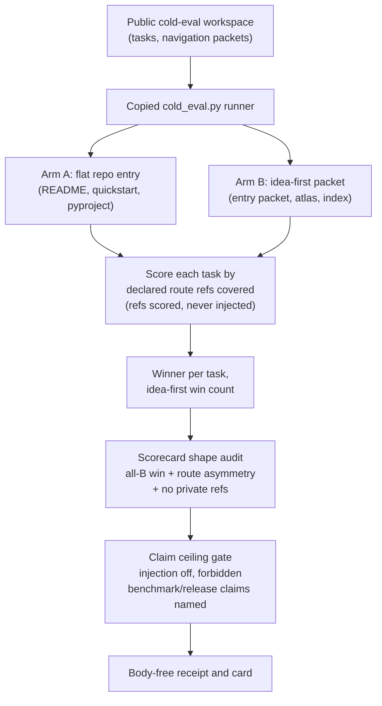

# Batch 10 Cold Eval Honesty Capsule

## Purpose

`batch10_cold_eval_honesty_capsule` answers one narrow question: can the public
Microcosm copy of the macro `cold_eval.py` route-quality simulator run over a
synthetic workspace, expose its measured scorecard shape, and refuse to promote
that shape into a benchmark or navigation-truth claim?

The useful evidence is deliberately small. A green run means the copied macro
body executed, the all-`B.idea_first_packet` winner shape was recomputed from
fixture rows, and the claim ceiling blocked benchmark, hosted-readiness, and
release language. It does not say idea-first routing wins in the live system.

## Shape



## Structured Lattice Bindings

- Capsule authority: `core/paper_module_capsules.json#paper_module.batch10_cold_eval_honesty_capsule`.
- Runtime organ: `organs/batch10_cold_eval_honesty_capsule.json` and `src/microcosm_core/organs/batch10_cold_eval_honesty_capsule.py`.
- Runtime symbols: `_run_original_cold_eval`, `_scorecard_shape_audit`, `_claim_ceiling_gate`, `_evaluate`, `run`, `run_batch10_cold_eval_bundle`, and `result_card`.
- Builder-owned projections: `paper_modules/batch10_cold_eval_honesty_capsule.json`, the per-module Mermaid edge set, and the Atlas card are generated from the capsule row.

## JSON Capsule Binding

- Source authority: `core/paper_module_capsules.json::paper_modules[69:paper_module.batch10_cold_eval_honesty_capsule]` with `source_authority: json_capsule`; the generated instance is `paper_modules/batch10_cold_eval_honesty_capsule.json`.
- This Markdown is a reader projection. The generated Mermaid projection is `available_from_capsule_edges`; the generated Atlas projection is `linked_from_capsule_edges`, so route-quality edges are builder projections from the capsule.
- The authority ceiling is fixture-bound route-quality scorecard and copied-source evidence only. The proof boundary is restricted to copied macro execution, scorecard-shape audit, claim-ceiling checks, negative fixtures, body-free cards, and validation receipts; it does not establish live benchmark results, navigation truth, hosted readiness, release approval, provider dispatch, source mutation, or whole-system correctness.

## Reader Proof Boundary

Read this page as a public reader projection over a JSON-capsule-backed
Microcosm paper-module row. The source row in
`core/paper_module_capsules.json` names the cold-eval honesty organ and binds
this Markdown to the generated sidecar, Mermaid projection, Atlas card, runtime
organ, and focused validation path. The useful proof is intentionally narrow:
the copied macro body can run over a synthetic workspace, recompute the
fixture scorecard shape, and refuse benchmark or release claims. It does not
prove live navigation quality, general route superiority, hosted readiness,
publication approval, source mutation authority, provider dispatch, or
whole-system correctness.

## Public Site Availability Boundary

The public Microcosm site may expose this page as a reader route to the
cold-eval honesty capsule: fixture scorecard receipts, copied-source refs,
negative-case policy, focused test paths, and authority ceilings are
public-safe because they describe the standalone `microcosm-substrate`
artifact and body-free receipts.

The site must not present that exposure as a live benchmark, navigation truth,
route-quality recommendation, hosted service, release approval, source
mutation authority, provider dispatch, private-root equivalence, or generated
lattice source authority. Public pages are availability projections generated
from source; they are not capsule authority or Mermaid/Atlas source truth.

## Public-Safe Body Handling

The fixture and bundle receipts may expose paths, digests, scorecard shape,
negative-case outcomes, acceptance JSON, and validation status. They must not
duplicate copied macro source bodies, private macro-root paths, provider
payloads, credential material, browser/session state, or raw command-output
bodies. Re-entry for source-body drift belongs to the exact-copy/source-open
owner lane, not to Markdown prose.

## Claim Ceiling

This module may claim public fixture evidence that the copied `cold_eval.py`
macro body executed over the synthetic workspace, the expected scorecard shape
was recomputed, expected-ref injection was refused, private refs were excluded,
negative fixtures were checked, body-free cards were emitted, and validation
receipts enforced the listed claim ceiling.

This module may not claim live benchmark results, navigation truth, hosted
readiness, route-quality superiority, provider dispatch, production readiness,
source mutation authority, publication authority, release approval, or
whole-system correctness.

## Prior Art Grounding

This organ is grounded in evaluation-transparency and benchmark-hygiene
practice: scorecards should expose what was measured, what fixture assumptions
were injected, and what claims the result can and cannot support. Useful anchors
include:

- [HELM](https://crfm.stanford.edu/helm/index.html), which frames model
  evaluation as a transparent, scenario-bound benchmark surface rather than a
  single global capability claim.
- [Model Cards for Model Reporting](https://arxiv.org/abs/1810.03993), which
  established the pattern of pairing performance results with intended use,
  limitations, and caveats.

Microcosm borrows the scorecard-plus-limitations shape, then narrows it to a
deterministic route-quality fixture. The all-`B.idea_first_packet` winner row is
accounting evidence for this fixture only; it is not promoted into navigation
truth, hosted readiness, or release approval.

## Reader Evidence Routing

Read the scorecard as evidence accounting, not as a leaderboard. The fixture
intentionally creates a public workspace where the idea-first packet wins. The
organ then checks that the expected-ref injection policy is off, that private
refs are not present, and that forbidden claims are named in the manifest.

The honesty of that win turns on one design choice in the copied scorer. Each
task lists the route refs an answer should reach, but those expected refs are
only ever used to *score* coverage. They are never added to either arm's route,
so neither arm is handed the answer. Arm A is scored on the refs a flat reader
reaches from `README.md`, `docs/quickstart.md`, and `pyproject.toml`. Arm B is
scored on the refs the navigation packets actually declare. The scoring policy
is named in every row as `declared_route_refs_no_expected_ref_injection_v1`, and
every row carries `expected_ref_injection_used: false`. The idea-first arm wins
because the entry packets genuinely declare more of the relevant files, not
because the scorer leaked the target into the route. That distinction is the
difference between a measured route-quality result and a rigged one, and the
claim-ceiling gate reports `blocked` rather than `pass` if the injection flag is
ever turned on.

The engine ids are:

- `cold_eval_original_runner`: dynamically loads the copied macro body and runs
  `run_cold_eval` in a temporary public workspace.
- `cold_eval_scorecard_shape_audit`: verifies the all-B winner shape and records
  visible route-surface asymmetry without upgrading it into proof.
- `cold_eval_claim_ceiling_gate`: checks expected-ref injection policy and
  forbidden benchmark/release claims.

## Validation Receipt Path

Reader-verifiable commands, run from the `microcosm-substrate/` public root:

```bash
PYTHONPATH=src python3 -m microcosm_core.organs.batch10_cold_eval_honesty_capsule run \
  --input fixtures/first_wave/batch10_cold_eval_honesty_capsule/input \
  --out /tmp/microcosm-batch10-cold-eval-vrp \
  --acceptance-out /tmp/microcosm-batch10-cold-eval-fixture-acceptance.json \
  --card
PYTHONPATH=src python3 -m microcosm_core.organs.batch10_cold_eval_honesty_capsule run-batch10-cold-eval-bundle \
  --input examples/batch10_cold_eval_honesty_capsule/exported_batch10_cold_eval_honesty_capsule_bundle \
  --out /tmp/microcosm-batch10-cold-eval-bundle-vrp \
  --acceptance-out /tmp/microcosm-batch10-cold-eval-bundle-acceptance.json \
  --card
PYTHONPATH=src ../repo-pytest --disk-pressure-policy=warn microcosm-substrate/tests/test_batch10_cold_eval_honesty_capsule.py -q --basetemp /tmp/microcosm-batch10-cold-eval-tests
```

The fixture command writes the route-quality scorecard receipt and acceptance
JSON. The bundle command validates copied macro source, source manifests,
body-free cards, expected-ref injection policy, and private-ref negative cases.
The focused test covers missing tasks, flat-route wins, expected-ref injection,
private fixture refs, and the no-benchmark/no-release authority ceiling.

This receipt path is reader-verifiable evidence only. It does not prove live
benchmark results, navigation truth, hosted readiness, release approval,
provider dispatch, source mutation, or whole-system correctness.

## Authority Ceiling

Fixture-bound route-quality scorecard and copied source refs only; no live
benchmark, navigation truth, hosted readiness, release approval, provider
dispatch, source mutation, or whole-system correctness.
