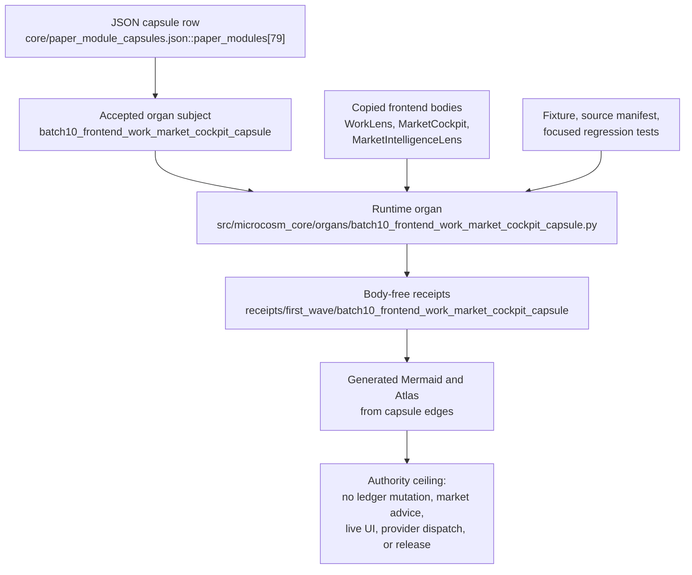

# Batch 10 Frontend Work/Market Cockpit Capsule

This Microcosm organ imports exact non-secret frontend source bodies for the work and market cockpit surfaces:

- `system/server/ui/src/components/intelligence/WorkLens.tsx`
- `system/server/ui/src/components/intelligence/__tests__/WorkLens.test.tsx`
- `system/server/ui/src/components/marketIntelligence/MarketCockpit.tsx`
- `system/server/ui/src/components/marketIntelligence/MarketIntelligenceLens.tsx`
- `system/server/ui/src/components/marketIntelligence/__tests__/MarketCockpit.test.tsx`

The capsule validates the copied bodies as real substrate by checking digest equality, source anchors, public fixtures, and the source tests that protect the intended frontend contracts.

The work lens contract is read-only: it can render WorkItems, dedupe queue rows, preserve local selection state, and point mutation to `task_ledger_apply` plus scoped commits, but it does not become Task Ledger or Work Ledger mutation authority.

The market cockpit contract is honest signal presentation: it normalizes raw entity ids, translates machine reason codes, demotes data defects, avoids fake time series, and preserves the boundary that market observations are not recommendations.

The market lens contract carries route-readiness and finance-assurance indicators without promoting the UI into backend evidence authority, market advice, release approval, browser access, or provider dispatch.

## Shape



The page is a reader route over a real capsule row. The useful shape is the
join between accepted organ authority, copied frontend source bodies, synthetic
fixtures, focused tests, and body-free receipts. It does not turn cockpit UI
copy into live browser proof, Task/Work Ledger mutation authority, backend
authority, market advice, or release approval.

## Reader Proof Boundary

Read this page as a public reader projection over a JSON-capsule-backed
Microcosm paper-module row. The source row in
`core/paper_module_capsules.json` names the accepted
`batch10_frontend_work_market_cockpit_capsule` organ as its subject, cites the
runtime code locus, and keeps the public claim ceiling bounded to source-body
import evidence. The useful proof here remains narrow: it makes the frontend
cockpit source capsule walkable without claiming live UI correctness, browser
state, ledger mutation authority, market advice, release approval, publication
approval, source mutation authority, provider dispatch, or private-root
equivalence.

## JSON Capsule Binding

This Markdown is a reader projection over the source-authority JSON capsule
row, not the source of capsule truth. Binding facts from the generated sidecar:

- source row:
  `core/paper_module_capsules.json::paper_modules[79:paper_module.batch10_frontend_work_market_cockpit_capsule]`.
- source_authority: json_capsule.
- paper module id:
  `paper_module.batch10_frontend_work_market_cockpit_capsule`.
- accepted subject:
  `organ:batch10_frontend_work_market_cockpit_capsule`.
- runtime locus:
  `src/microcosm_core/organs/batch10_frontend_work_market_cockpit_capsule.py`.
- generated Mermaid projection: `available_from_capsule_edges`.
- generated Atlas projection: `linked_from_capsule_edges`; the Atlas card is
  linked from the capsule subject and code-locus edges.

The proof boundary is the capsule row plus its builder-owned projections. This
page explains the route for readers; it does not hand-author source authority,
Mermaid edges, Atlas cards, coverage counts, or release claims.

## JSON Capsule Boundary

This paper module now has JSON capsule authority in
`core/paper_module_capsules.json`. The capsule binds this Markdown projection,
the accepted organ registry row, the runtime organ source locus, the copied
frontend source-module manifest, body-free receipts, and the bounded public
standard into one walkable source row.

The capsule still does not turn frontend source-body import evidence into live
UI correctness, market advice, backend authority, release claims, publication
claims, source mutation authority, or whole-system correctness. Concept edges
remain residual until a stable concept id is selected; site and Atlas
availability must come from generated projections, not hand-authored generated
HTML.

## Structured Lattice Bindings

- JSON capsule authority:
  `core/paper_module_capsules.json::paper_modules[79:paper_module.batch10_frontend_work_market_cockpit_capsule]`.
- generated paper-module projection:
  `paper_modules/batch10_frontend_work_market_cockpit_capsule.json`.
- subject edge:
  `paper_module.batch10_frontend_work_market_cockpit_capsule` explains
  `organ.batch10_frontend_work_market_cockpit_capsule`.
- code-locus edge:
  `src/microcosm_core/organs/batch10_frontend_work_market_cockpit_capsule.py`
  with the runtime and receipt-writing symbols listed in the generated row.
- focused validator:
  `tests/test_batch10_frontend_work_market_cockpit_capsule.py`.
- exported source snapshot bundle:
  `examples/batch10_frontend_work_market_cockpit_capsule/exported_batch10_frontend_work_market_cockpit_capsule_bundle/`.
- generated projection statuses: Mermaid `available_from_capsule_edges`; Atlas
  `linked_from_capsule_edges`.

Selective concept/principle edges remain governed by the JSON capsule row. Do
not add doctrine refs in Markdown to make counts look better; add them only
through `core/paper_module_capsules.json` when the ids are resolved and the
builder can regenerate the row.

## Reader Evidence Routing

| Evidence surface | Authority ref | What it supports | Boundary |
|---|---|---|---|
| Runtime organ | `src/microcosm_core/organs/batch10_frontend_work_market_cockpit_capsule.py` | Computes the Work Lens read-only contract, Market Cockpit honest-signal contract, route-readiness contract, source-test witness, private-ref guard, and receipt cards. | Runtime evidence only; it does not run a browser, mutate ledgers, authorize provider dispatch, or make market recommendations. |
| Focused regression tests | `tests/test_batch10_frontend_work_market_cockpit_capsule.py` | Exercises fixture pass cases, bundle validation, digest mismatch rejection, exact body parity, body-free receipt cards, and negative-case stability. | Local test proof only; it does not prove live UI correctness, release readiness, or aggregate doctrine coverage. |
| Fixture input manifest | `fixtures/first_wave/batch10_frontend_work_market_cockpit_capsule/input/batch10_frontend_work_market_cockpit_capsule_probe_manifest.json` | Names the bounded public fixture packet consumed by the fixture command. | Synthetic first-wave fixture scope only; it is not live market data or live Work Ledger authority. |
| Exported source manifest | `examples/batch10_frontend_work_market_cockpit_capsule/exported_batch10_frontend_work_market_cockpit_capsule_bundle/source_module_manifest.json` | Lists the copied non-secret frontend source modules, source refs, target refs, required anchors, and digests. | Body-floor manifest only; receipts carry refs, digests, and counts rather than source bodies. |
| Acceptance receipt | `receipts/acceptance/first_wave/batch10_frontend_work_market_cockpit_capsule_fixture_acceptance.json` | Records fixture acceptance for the public first-wave exercise. | Acceptance receipt only; it does not promote the Markdown row into JSON capsule authority. |
| Runtime receipt bundle | `receipts/first_wave/batch10_frontend_work_market_cockpit_capsule/` | Stores tracked result, board, and validation receipt artifacts for the organ. | Receipt evidence only; source bodies and private macro-root paths remain excluded from public claims. |

Selective relation boundary: this page now gives readers a walkable evidence
route to the frontend cockpit capsule and its accepted organ subject. It still
does not infer additional governed concept relations into the generated JSON
row; those edges belong in `core/paper_module_capsules.json` only after a
stable source row names the ids.

## Public Site Availability Boundary

The public Microcosm site may expose this page as a reader route to the
frontend Work/Market cockpit capsule: summary text, source refs, fixture and
receipt paths, digest-accounting surfaces, focused test routes, and authority
ceilings are public-safe because they point at the standalone
`microcosm-substrate` artifact and body-free receipts.

The site must not treat that exposure as frontend redesign, hosted-product
status, release approval, live browser execution, provider dispatch, Task
Ledger or Work Ledger mutation authority, market advice, private macro-root
equivalence, or generated-lattice source authority. Public site projections are
availability surfaces generated from source; they are not the source authority
for Mermaid edges, Atlas cards, or capsule admission.

## Public-Safe Body Handling

The public-safe receipt boundary is body-free. Public artifacts may expose
source refs, copied-body digests, required anchors, fixture manifests, negative
case labels, acceptance paths, and focused validation results. They must not
inline the copied frontend source bodies, private macro-root paths, provider
payloads, credential material, browser/session state, or raw command-output
bodies. Any exact-copy body refresh belongs to the source-open import lane;
this Markdown page only points readers to the bounded evidence surfaces.

## Capsule Re-entry Packet

- current source authority: `core/paper_module_capsules.json` row
  `paper_module.batch10_frontend_work_market_cockpit_capsule`.
- accepted subject:
  `organ:batch10_frontend_work_market_cockpit_capsule`.
- resolved code locus:
  `src/microcosm_core/organs/batch10_frontend_work_market_cockpit_capsule.py`.
- re-entry condition: run
  `scripts/build_doctrine_projection.py --write-paper-module-corpus` once the
  doctrine-lattice projection owner frontier is clear, then verify the Mermaid
  and Atlas statuses are generated from the capsule edge rather than the former
  required-subject gap.
- authority ceiling: this JSON capsule provides reader evidence only; it does
  not source market advice, backend authority, release claims, source mutation
  authority, live UI correctness, or aggregate doctrine-lattice correctness.

## Validation Receipt Path

Reader-verifiable commands, run from the `microcosm-substrate/` public root:

```bash
PYTHONPATH=src ../repo-python -m microcosm_core.organs.batch10_frontend_work_market_cockpit_capsule run \
  --input fixtures/first_wave/batch10_frontend_work_market_cockpit_capsule/input \
  --out /tmp/microcosm-batch10-frontend-work-market-vrp \
  --card
PYTHONPATH=src ../repo-python -m microcosm_core.organs.batch10_frontend_work_market_cockpit_capsule run-batch10-frontend-work-market-bundle \
  --input examples/batch10_frontend_work_market_cockpit_capsule/exported_batch10_frontend_work_market_cockpit_capsule_bundle \
  --out /tmp/microcosm-batch10-frontend-work-market-bundle-vrp \
  --card
PYTHONPATH=src ../repo-pytest microcosm-substrate/tests/test_batch10_frontend_work_market_cockpit_capsule.py -q --basetemp /tmp/microcosm-batch10-frontend-work-market-tests
```

## Receipt Expectations

The validation receipts for this projection should show:

- the fixture command produces a body-free card for the bounded frontend
  Work/Market exercise;
- the bundle command validates copied non-secret frontend source bodies against
  their public manifest, digests, and required anchors;
- the focused pytest rejects digest mismatch and private-reference regressions;
- paper-module corpus and coverage-contract checks can reproduce the JSON
  capsule sidecar without changing source authority; and
- generated Mermaid and Atlas availability stays tied to capsule edges, not to
  Markdown prose.

These receipts do not prove live UI correctness, live browser behavior, ledger
mutation authority, backend evidence authority, market advice, release
readiness, publication readiness, private-root equivalence, or whole-system
correctness.

The fixture command writes the bounded runtime receipt for the synthetic
first-wave exercise. The exported-bundle command validates the copied Work Lens
and Market Cockpit source modules against the public manifest while keeping
source bodies out of the receipt. The focused test file checks fixture
integrity, bundle validation, receipt body scans, negative-case labels, and the
claim ceiling.

This receipt path is reader-verifiable evidence only. It does not flip
Mermaid/Atlas status, create capsule authority, make market recommendations,
authorize backend mutation, run browser state, claim release readiness, or
aggregate doctrine-lattice coverage.

## Authority Ceiling

Fixture-bound frontend source-body import, deterministic exercise evidence,
source digest/anchor evidence, and body-free receipts only; no live UI
correctness, live Task Ledger or Work Ledger authority, browser/provider
access, source mutation, publication approval, release approval, market advice,
private-root equivalence, or whole-system correctness.

That authority ceiling is part of the proof boundary. A green local run shows
the copied frontend sources and their public fixtures remain inspectable; it
does not make the UI live, provide market advice, authorize ledger writes,
approve a release, or certify aggregate doctrine-lattice health.

## Claim Ceiling

This module supports only the reader-verifiable claim that selected
non-secret Work Lens and Market Cockpit source bodies were copied into the
public Microcosm bundle, checked against public manifests, anchors, focused
tests, and body-free receipts, and connected to Mermaid/Atlas projections by
JSON capsule edges. Those projections do not prove live UI behavior, live
browser state, ledger mutation authority, backend evidence authority, market
advice, release approval, publication approval, provider dispatch, private-root
equivalence, or aggregate doctrine-lattice correctness.

## Prior Art Grounding

The organ borrows from read-model UI and observability-dashboard practice:
presentation layers can query, transform, and organize operational signals
without becoming the system of record or the mutation authority. Useful anchors
include:

- Microsoft's [CQRS pattern](https://learn.microsoft.com/en-us/azure/architecture/patterns/cqrs),
  especially the separation of read models from write models and command
  handling.
- [Grafana dashboards](https://grafana.com/docs/grafana/latest/visualizations/dashboards/),
  as a practical precedent for composing data-source queries, transforms, and
  panels into an at-a-glance operational cockpit.

Microcosm borrows the read-only cockpit shape: Work Lens and Market Cockpit
render normalized signals, expose data defects, and point mutation back to the
proper ledger or scoped-commit lane. They do not become Task Ledger, Work
Ledger, provider dispatch, market advice, or backend evidence authority.
