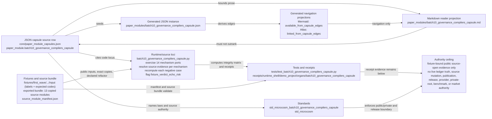

# Batch 10 Governance And Compilers Capsule

## Purpose

This capsule answers one question: when the wider system claims that a
governance gate, a compiler, or a release check behaves correctly, can a cold
reader confirm that claim from copied source and a re-run, rather than taking
the claim on trust? It collects fourteen mechanisms that already exist in the
main system, copies their non-secret source bodies into the public bundle, and
re-runs a small, source-faithful port of each one against controlled inputs.

The mechanisms span the work they were drawn from: a mutation gate that reads
the latest user message and blocks file writes when the intent is diagnostic;
an observe/apply compiler that turns an artifact into an apply plan and refuses
malformed input; a reviewer gauntlet that checks a public proof bundle from
several reader personas; release-blocker triage; a publication path-contract
check; receipt-reuse staleness; a no-lookahead finance horizon; a session
dependency wave; claim-conflict detection; role-aware blocking in a task graph;
and three frontend helpers for table shaping, annex grouping, and recent-change
coalescing.

What is unusual is the stance towards its own fixtures. The negative-case files
on disk hold only a label and an expected error code. The capsule does not
treat that error code as proof of anything. For each negative case it recomputes
the outcome itself, in code, and compares the computed result against the
expectation. A fixture that merely declares the right error code, without the
ported logic actually producing it, is flagged rather than passed. The point is
to stop a test from grading itself green by assertion.

## Route Card

- Organ id: `batch10_governance_compilers_capsule`
- JSON capsule authority: `core/paper_module_capsules.json::paper_module.batch10_governance_compilers_capsule`
- Accepted-organ evidence class: `verified_macro_body_import`
- Runtime source: `src/microcosm_core/organs/batch10_governance_compilers_capsule.py`
- Fixture input: `fixtures/first_wave/batch10_governance_compilers_capsule/input`
- Runtime bundle: `examples/batch10_governance_compilers_capsule/exported_batch10_governance_compilers_capsule_bundle`
- Exact-copy authority: the bundle `source_module_manifest.json` plus copied
  source modules; refresh through `macro_projection_import_protocol`, not by
  hand.

This Microcosm organ imports and exercises Batch-10 macro substrate for
governed mutation, observe/apply compilation, public-proof review, release
blocker triage, publication path contracts, receipt reuse, no-lookahead
horizons, session-wave execution, claim conflict wait tax, role-aware DAG
blocking, frontend data shaping, annex grouping, and recent-change coalescing.

The capsule carries exact non-secret macro source snapshots where safe.
`publication_manifest_selector_contract_verifier` is represented as a
source-faithful public refactor because the macro source contains a private
home-path example. `weighted_lane_width_apportionment_solver` is recorded as a
binding repair deferred to the Batch-9 RootNavigator body, not as a fresh
Batch-10 import.

Integrity hardening: negative-case fixture files are labels and stable-code rows
only. The receipt's `exercise.integrity_matrix` is the verdict surface: each
Batch-10 mechanism records source relation, positive computed output, negative
input shape, negative computed output, claim ceiling, and whether the result was
computed by the capsule evaluator. A fixture-supplied `error_codes` row is never
enough to prove refusal behavior.

## Shape

This module is a reader projection over the Batch-10 governance/compiler capsule
authority, not the authority itself. The source row is
`core/paper_module_capsules.json::paper_modules[75:paper_module.batch10_governance_compilers_capsule]`;
the generated instance is
`paper_modules/batch10_governance_compilers_capsule.json`; and the runtime
source locus is
`src/microcosm_core/organs/batch10_governance_compilers_capsule.py`. The
specific standard is
`standards/std_microcosm_batch10_governance_compilers_capsule.json`, with
Microcosm-wide coverage and entry boundaries governed by `std_microcosm`.



The capsule makes the module actual by binding five reader questions to typed
authority surfaces:

- What is the source of record? The capsule row and generated JSON instance,
  not this Markdown file and not generated Mermaid or Atlas output.
- What is being exercised? The accepted
  `batch10_governance_compilers_capsule` organ, the
  `mechanism.batch10_governance_compilers_capsule.validates_public_governance_compilers_capsule`
  mechanism, and the `concept.import_projection_and_drift_control_bundle`
  concept edge named by the capsule.
- Which runtime and source artifacts matter? The organ module computes the
  integrity matrix, negative-case verdicts, source evidence, fixture run,
  bundle validation, result card, and `AUTHORITY_CEILING`; the exported bundle
  carries `source_module_manifest.json`, copied non-secret source modules, and
  the declared public refactor for the private-path-bearing publication
  manifest selector body.
- Which receipts and tests are binding? The focused test file verifies the
  fixture run, bundle validation, digest mismatch rejection, private-body
  omission, negative-case semantics, source-evidence classifications, source
  helper parity, and reviewer-gauntlet behavior; the receipt directory under
  `receipts/runtime_shell/demo_project/organs/batch10_governance_compilers_capsule`
  holds the runtime shell validation result, board, and validation receipt.
- What is the honest ceiling? The module can claim fixture-bound public
  source-open import/refactor evidence, deterministic exercise evidence,
  integrity-matrix verdicts, body-free receipts, and validation receipts. It
  cannot claim live Work Ledger truth, live Task Ledger truth, source mutation
  authority, publication approval, release approval, provider dispatch, private
  root equivalence, neutral benchmark evidence, market advice, production
  readiness, or whole-system correctness.

## Capsule-Bound Reader Shape

The JSON capsule binds this paper module to one accepted subject: the
`batch10_governance_compilers_capsule` organ. The executable proof locus is
`src/microcosm_core/organs/batch10_governance_compilers_capsule.py`,
especially `_build_integrity_matrix`, `_source_evidence`, `_evaluate`, `run`,
`run_batch10_governance_compilers_bundle`, `result_card`,
`EXPECTED_MECHANISMS`, `EXPECTED_NEGATIVE_CASES`, and `AUTHORITY_CEILING`.

The capsule keeps the mechanism and concept layer intentionally narrow: it
names the resolving governance/compiler mechanism subject and the
`concept.import_projection_and_drift_control_bundle` concept, while additional
concept or mechanism edges stay residual until resolving Microcosm rows exist.
Its law edges are bounded to content-addressed reuse, provenance, freshness,
and projection-below-source rules: `P-2`, `P-5`, `P-9`, `P-15`, `AX-4`,
`AX-8`, `AX-10`, and `AX-11`. Its sibling paper-module dependencies are
`macro_projection_import_protocol`, `batch10_live_source_drift_capsule`, and
`batch9_macro_engines_capsule`.

The generated JSON instance, Mermaid projection, and atlas card are projections
from the capsule. If a projection disagrees with the capsule or refreshed
source-open bundle, refresh the projection; do not edit generated output by
hand.

## How it works

The run takes a public input directory, validates the source-module manifest,
and exercises each of the fourteen mechanisms against inputs the evaluator
constructs itself. `_build_integrity_matrix` then writes one row per mechanism.
Each row records the source evidence for that mechanism, the positive computed
output, the attached negative cases with their computed outputs, the claim
ceiling, and a `current_action` of keep, harden, or block.

Source evidence is resolved per mechanism by `_source_evidence`. A mechanism's
named source reference is looked up in the manifest. If the body was copied
exactly, the row carries the copy's digest status and anchor-match count. If the
body could not be copied verbatim, the row instead names a declared
source-faithful public refactor and records the original source digest. Two
mechanisms are honest about not being plain copies.
`publication_manifest_selector_contract_verifier` is a public refactor, because
the macro source carried a private home-path example that cannot ship.
`weighted_lane_width_apportionment_binding_repair` is recorded as an under-bound
repair deferred to the Batch-9 RootNavigator body, so it is held as a block
rather than presented as a fresh Batch-10 import.

The negative cases are handled the same way. For each case,
`_compute_negative_case_probe` runs the ported logic over the case's declared
input and reads the result at a named path. For example, the mutation case feeds
a diagnostic message and confirms `prohibit_file_writes` is true; the finance
case feeds an unparseable horizon and confirms it is rejected; the publication
case feeds a private path against a hard-exclude rule and confirms it is caught.
A row counts as proven only when the computed value matches the expectation. If
any negative case lacks computed evidence, the summary raises
`fixture_verdict_echo_risk`, and the run is blocked. The capsule also requires
exactly thirteen copied source modules, so a thinned bundle fails rather than
passes quietly.

## JSON Capsule Binding

- Source authority:
  `core/paper_module_capsules.json::paper_modules[75:paper_module.batch10_governance_compilers_capsule]`
  with `source_authority: json_capsule`; the generated instance is
  `paper_modules/batch10_governance_compilers_capsule.json`.
- This Markdown is a reader projection. The generated Mermaid projection is
  `available_from_capsule_edges`; the generated Atlas projection is
  `linked_from_capsule_edges`, so the governance/compiler wiring is
  capsule-owned even when the prose explains it.
- The authority ceiling is fixture-bound evidence over copied or declared
  governance/compiler macro substrate. The proof boundary is restricted to
  source evidence, computed positive and negative exercise rows,
  integrity-matrix verdicts, body-free receipts, and validation receipts. It
  does not establish live Work Ledger truth, live Task Ledger truth, source
  mutation authority, publication approval, release approval, provider
  dispatch, benchmark evidence, private-root equivalence, or investment advice.

## JSON Capsule Boundary

The JSON capsule is the source of record for this paper-module row. It binds
the reader projection to the `batch10_governance_compilers_capsule` organ, the
`mechanism.batch10_governance_compilers_capsule.validates_public_governance_compilers_capsule`
mechanism, and the resolved runtime locus
`src/microcosm_core/organs/batch10_governance_compilers_capsule.py`.

The generated JSON row currently exposes 15 capsule-derived relationship edges:
two subject explanation edges, one concept edge, four principle edges, four
axiom edges, three paper-module dependency edges, and one code-locus edge.
Mermaid is `available_from_capsule_edges`, Atlas is
`linked_from_capsule_edges`, and there are no unresolved selective relations.

Those generated projections make the capsule walkable; they do not convert the
fixture into live Work Ledger truth, live Task Ledger truth, source mutation
authority, release approval, publication approval, or neutral benchmark
evidence.

## Structured Lattice Bindings

- Capsule row:
  `core/paper_module_capsules.json::paper_modules[75:paper_module.batch10_governance_compilers_capsule]`
  is the source of record for this paper-module projection.
- Subject edges: `batch10_governance_compilers_capsule` and
  `mechanism.batch10_governance_compilers_capsule.validates_public_governance_compilers_capsule`
  are the only explained accepted organ/mechanism subjects.
- Concept edge: `concept.import_projection_and_drift_control_bundle` is the
  capsule-named concept boundary for source import and projection drift.
- Law edges: `P-2`, `P-5`, `P-9`, `P-15`, `AX-4`, `AX-8`, `AX-10`, and
  `AX-11` are the capsule-named provenance, reuse, freshness, and
  projection-below-source laws.
- Dependency edges: `paper_module.macro_projection_import_protocol`,
  `paper_module.batch10_live_source_drift_capsule`, and
  `paper_module.batch9_macro_engines_capsule` contextualize source import,
  live-source drift, and the deferred Batch-9 lane-width repair.
- Code locus:
  `src/microcosm_core/organs/batch10_governance_compilers_capsule.py` is the
  runtime and receipt-writing source for deterministic exercises, integrity
  matrix construction, bundle checks, and authority ceilings.
- Projection edges: Mermaid `available_from_capsule_edges` and Atlas
  `linked_from_capsule_edges` are generated navigation surfaces derived from
  capsule edges.

## Claim Ceiling

This module may claim public fixture evidence that the copied or declared
governance/compiler macro substrate produced source-evidence rows, computed
positive and negative exercise rows, integrity-matrix verdicts, body-free
receipts, and validation receipts with explicit claim ceilings.

This module may not claim live Work Ledger truth, live Task Ledger truth, source
mutation authority, publication approval, release approval, provider dispatch,
neutral benchmark evidence, private-root equivalence, investment advice,
production readiness, or whole-system correctness.

## Authority Ceiling

This is not live Work Ledger truth, not live Task Ledger truth, not source
mutation authority, not publication or release approval, not provider dispatch,
not neutral benchmark evidence, not private-root equivalence, and not
investment advice.

The useful claim is narrower: over the public fixtures and refreshed
source-open bundle, the organ shows that the Batch-10 governance/compiler
mechanisms have copied or declared source evidence, computed positive and
negative exercise rows, and body-free receipts with explicit claim ceilings.

## Prior Art Grounding

The organ is grounded in policy-as-code, admission-control, and supply-chain
assurance patterns: compile rules into deterministic checks, reject unsupported
actions before they mutate state, and preserve provenance for the decision.
Relevant anchors include:

- [Open Policy Agent](https://www.openpolicyagent.org/docs/latest), which
  decouples policy decisions from enforcement and evaluates structured input
  against machine-readable rules.
- Kubernetes [validating admission policies](https://kubernetes.io/docs/concepts/policy),
  which can block, warn, or audit non-compliant API requests before admission.
- [SLSA](https://slsa.dev/spec/) and [OpenSSF Scorecard](https://openssf.org/scorecard/),
  which represent the broader software-supply-chain pattern of typed assurance
  levels, checks, and provenance.

Microcosm borrows the compiler/gate shape for governed mutation, publication
path contracts, blocker triage, receipt reuse, and claim-conflict accounting.
The capsule remains fixture-bound evidence over copied or refactored macro
substrate; it is not live Work Ledger truth, source mutation authority,
publication approval, or investment advice.

## Reader Evidence Routing

A cold reader should inspect the evidence in this order:

1. Open the JSON capsule row to confirm source authority, subject ids,
   dependency ids, principle and axiom refs, code locus, Mermaid status, Atlas
   status, and the absence of unresolved selective relations.
2. Run the focused organ test to prove the public fixture still computes the
   integrity matrix and observes the required negative cases.
3. Run the exported bundle validator when copied source digests, declared public
   refactors, body-free receipts, or source-evidence rows are the question.
4. Treat generated JSON, Mermaid, Atlas, and coverage as projection evidence
   only; if they drift, refresh them through the doctrine-lattice builder.
5. Use the receipt floor to verify source relations, positive and negative
   computed outputs, claim ceilings, and body-free public-safe receipt payloads.

## Receipt Expectations

Receipts must prove fixture-bound governance/compiler evidence over public
inputs and copied or declared macro source rows. They should include source
relations, positive computed outputs, negative input shape, negative computed
outputs, claim ceilings, integrity-matrix verdicts, body-free source-module
checks, and explicit evaluator-computed status.

Receipts must not treat fixture labels, generated projections, copied-body
presence, or green exercise rows as live ledger truth, source mutation
authority, publication approval, release approval, provider dispatch, market
advice, neutral benchmark evidence, private-root equivalence, or whole-system
correctness.

## Validation Receipt Path

Reader-verifiable commands, run from the `microcosm-substrate/` public root:

```bash
PYTHONPATH=src python3 -m microcosm_core.organs.batch10_governance_compilers_capsule run \
  --input fixtures/first_wave/batch10_governance_compilers_capsule/input \
  --out /tmp/microcosm-batch10-governance-compilers-vrp \
  --acceptance-out /tmp/microcosm-batch10-governance-compilers-fixture-acceptance.json \
  --card
PYTHONPATH=src python3 -m microcosm_core.organs.batch10_governance_compilers_capsule validate-bundle \
  --input examples/batch10_governance_compilers_capsule/exported_batch10_governance_compilers_capsule_bundle \
  --out /tmp/microcosm-batch10-governance-compilers-bundle-vrp \
  --acceptance-out /tmp/microcosm-batch10-governance-compilers-bundle-acceptance.json \
  --card
PYTHONPATH=src ../repo-pytest --disk-pressure-policy=warn \
  microcosm-substrate/tests/test_batch10_governance_compilers_capsule.py -q \
  --basetemp /tmp/microcosm-batch10-governance-compilers-tests
```

The fixture command writes the governance/compiler integrity-matrix receipt and
acceptance JSON. The bundle command validates copied or source-faithful macro
substrate, source evidence, positive and negative exercise rows, body-free
receipts, and authority-ceiling fields. The focused test verifies the mechanism
matrix, negative floor, bundle validation, and claim ceiling.

This receipt path is reader-verifiable evidence only. It does not prove live
Work Ledger truth, live Task Ledger truth, source mutation authority,
publication approval, release approval, provider dispatch, neutral benchmark
evidence, private-root equivalence, or investment advice.
