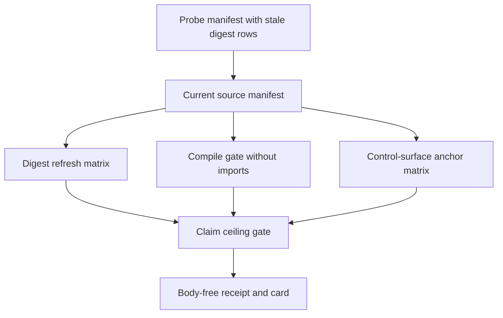

# Batch 10 Live Source Drift Capsule

## Purpose

`batch10_live_source_drift_capsule` answers one narrow question: can Microcosm
prove that selected public-safe control-plane source copies match the current
macro source bytes, still compile without import execution, and still carry the
claim ceiling that prevents copied code from becoming route or mutation
authority?

The organ imports exact current non-secret Python source bodies for four macro
control-plane files:

- `system/lib/standard_option_surface.py`
- `system/lib/mission_transaction_landing_preflight.py`
- `tools/meta/control/work_landing.py`
- `tools/meta/factory/work_ledger.py`

The capsule exists because the macro source moved ahead of older public
source-module records. It preserves stale digest rows as a visible regression
fixture, then proves the public copies match current macro digests byte-for-byte.

## Shape



## Structured Lattice Bindings

- Capsule authority: `core/paper_module_capsules.json#paper_module.batch10_live_source_drift_capsule`.
- Runtime organ: `organs/batch10_live_source_drift_capsule.json` and `src/microcosm_core/organs/batch10_live_source_drift_capsule.py`.
- Runtime symbols: `_digest_refresh_matrix`, `_compile_gate`, `_control_surface_anchor_matrix`, `_claim_ceiling_gate`, `_evaluate`, `run`, `run_batch10_live_source_drift_bundle`, and `result_card`.
- Builder-owned projections: `paper_modules/batch10_live_source_drift_capsule.json`, the per-module Mermaid edge set, and the Atlas card are generated from the capsule row.

## JSON Capsule Binding

- Source authority: `core/paper_module_capsules.json::paper_modules[70:paper_module.batch10_live_source_drift_capsule]` with `source_authority: json_capsule`; the generated instance is `paper_modules/batch10_live_source_drift_capsule.json`.
- This Markdown is a reader projection. The generated Mermaid projection is `available_from_capsule_edges`; the generated Atlas projection is `linked_from_capsule_edges`, so digest/compile/control-surface edges are produced from the capsule row.
- The authority ceiling is fixture-bound source-digest, anchor, compile, and claim-ceiling evidence only. The proof boundary is restricted to digest-refresh matrices, compile-without-import checks, control-surface anchor checks, stale-digest negative cases, claim-ceiling gates, and validation receipts; it does not establish route authority, Work or Task Ledger mutation authority, mission execution, git approval, source mutation, release, publication, provider dispatch, or private runtime export.

## Reader Proof Boundary

Read this page as a public reader projection over a JSON-capsule-backed
Microcosm paper-module row. The source row in
`core/paper_module_capsules.json` binds this Markdown to the generated sidecar,
Mermaid projection, Atlas card, runtime organ, and focused validation route.
The useful proof is intentionally narrow: selected public-safe control-plane
source copies can be compared with current macro source digests, compiled
without import execution, checked for expected anchors, and guarded by a claim
ceiling. It does not prove route authority, Work or Task Ledger mutation
authority, mission execution, git approval, release, publication, provider
dispatch, private runtime export, or whole-system correctness.

## Public Site Availability Boundary

The public Microcosm site may expose this page as a reader route to the live
source-drift capsule: digest matrices, compile status, source refs, required
anchors, stale-digest negative cases, focused test routes, and authority
ceilings are public-safe because they describe the standalone
`microcosm-substrate` artifact and body-free receipts.

The site must not present that exposure as route authority, ledger mutation
authority, mission execution, git approval, source mutation approval, release
approval, publication approval, provider dispatch, private runtime export, or
generated-lattice source authority. Public pages are availability projections
generated from source; they are not capsule authority or Mermaid/Atlas source
truth.

## Public-Safe Body Handling

Receipts may expose source refs, digests, anchor names, compile status,
negative-case labels, acceptance JSON, and validation status. They must not
duplicate copied source bodies, private macro-root paths, provider payloads,
credential material, browser/session state, raw command-output bodies, or
private runtime state. Re-entry for copied-source drift belongs to the
source-open exact-copy lane, not to Markdown prose.

## Prior Art Grounding

The organ borrows from reproducible-build and supply-chain provenance practice:
declared source inputs are fingerprinted, generated or copied artifacts are
checked against those fingerprints, and receipts avoid shipping unnecessary
private state. Useful anchors include:

- [Bazel hermeticity](https://bazel.build/concepts/hermeticity), especially the
  emphasis on source identity, declared inputs, and repeatable outputs.
- [SLSA provenance](https://slsa.dev/spec/), which records how software
  artifacts relate to build inputs and supply-chain guarantees.

Microcosm applies that pattern to live source-copy drift: stale digest rows
remain visible as regression fixtures, current public copies must match macro
digests byte-for-byte, and receipts carry digest/anchor/negative-case evidence
instead of private source bodies or runtime state.

## Reader Evidence Routing

The copied bodies are real substrate, not receipt-only metadata. The evidence
route is still body-free at receipt time: receipts keep digest rows, required
anchors, negative-case outcomes, compile status, and claim-ceiling evidence.

The engine ids are:

- `live_source_drift_digest_refresh_matrix`: compares stale recorded digests,
  current macro digests, copied target digests, and target digest status.
- `copied_python_source_compile_gate`: compiles each copied Python target
  without importing or executing it.
- `control_surface_anchor_matrix`: checks that each copied body still exposes
  expected command, route, landing, claim, or read-receipt anchors.
- `claim_ceiling_gate`: verifies the copied-body import does not authorize live
  route decisions, Work Ledger mutation, Task Ledger mutation, mission
  execution, git staging, source mutation, release, publication, provider
  dispatch, or private runtime export.

## Validation Receipt Path

Reader-verifiable commands, run from the `microcosm-substrate/` public root:

```bash
PYTHONPATH=src python3 -m microcosm_core.organs.batch10_live_source_drift_capsule run \
  --input fixtures/first_wave/batch10_live_source_drift_capsule/input \
  --out /tmp/microcosm-batch10-live-source-drift-vrp \
  --acceptance-out /tmp/microcosm-batch10-live-source-drift-fixture-acceptance.json \
  --card
PYTHONPATH=src python3 -m microcosm_core.organs.batch10_live_source_drift_capsule run-batch10-live-source-drift-bundle \
  --input examples/batch10_live_source_drift_capsule/exported_batch10_live_source_drift_capsule_bundle \
  --out /tmp/microcosm-batch10-live-source-drift-bundle-vrp \
  --acceptance-out /tmp/microcosm-batch10-live-source-drift-bundle-acceptance.json \
  --card
PYTHONPATH=src ../repo-pytest --disk-pressure-policy=warn microcosm-substrate/tests/test_batch10_live_source_drift_capsule.py -q --basetemp /tmp/microcosm-batch10-live-source-drift-tests
```

This organ is also a drift sentinel. The fixture command writes
digest-refresh, compile-gate, anchor-matrix, and claim-ceiling receipts, and it
is allowed to exit blocked when copied public source no longer matches current
macro source. That blocked result is evidence for the exact-copy/source-refresh
owner lane, not a paper-module corpus defect. Re-entry after a blocked result is
to refresh the copied public source bodies and manifest digests through the
source-open exact-copy lane, then rerun the fixture, bundle, and focused test.

The bundle command validates current copied source digests, source manifests,
compile-without-import checks, stale-digest negative cases, body-free cards,
and authority-ceiling fields when the exact-copy refresh is current. The
focused pytest command is therefore a green-gate after refresh: if the sentinel
is blocked, that test file is expected to fail on pass-status or exact-body
equality and should be reported with the same exact-copy refresh residual. When
current, the focused test covers stale digest replay, compile bypass, private
runtime state export, and live mutation-authority claims.

This receipt path is reader-verifiable evidence only. It does not provide route
authority, Work or Task Ledger mutation authority, mission execution, git
approval, source mutation, release, publication, provider dispatch, or private
runtime export.

## Authority Ceiling

Fixture-bound source-digest, anchor, compile, and claim-ceiling evidence only;
no route authority, Work or Task Ledger mutation, mission execution, git
approval, source mutation, release, publication, provider dispatch, or private
runtime export.

## Claim Ceiling

This module supports only the reader-verifiable claim that selected
public-safe control-plane source copies can be compared with current macro
digests, compiled without import execution, checked for required anchors, and
guarded by stale-digest and claim-ceiling negative cases when the exact-copy
lane is current. A green result does not grant route authority, Work or Task
Ledger mutation authority, mission execution, git approval, source mutation,
release approval, publication approval, provider dispatch, private runtime
export, or whole-system correctness.
