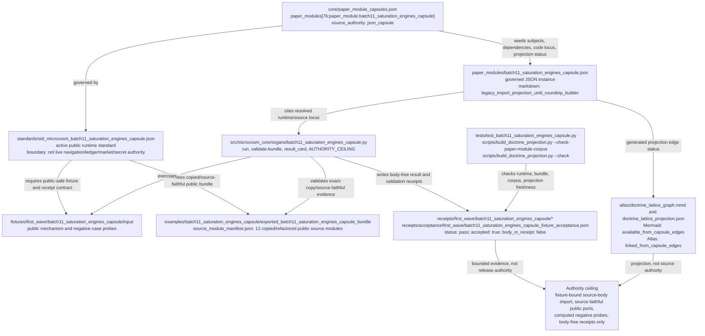

# Batch 11 Saturation Engines Capsule

## Purpose

`batch11_saturation_engines_capsule` is a public-safe Microcosm organ for the Batch-11 saturation pass. It imports exact copied non-secret macro source bodies and runs source-faithful public exercises for thirteen target mechanisms:

- run affinity session scoring
- calculator cluster insight derivation
- std_python delta ratchet gating
- exogenous navigation ladder grading
- portability gate supersession rollup
- shard browse context-priority sectioning
- holographic research evidence selection
- projection secret scanning
- stockgrid flow multisource merge and unit normalization
- macro regime bucketing and z-score board construction
- frontend navigation wayfinding
- agent session diagnostic lenses
- demo-take story coverage auditing

## Boundary

This capsule is not live Work Ledger truth, navigation authority, complete secret detection, live market data, investment advice, raw transcript authority, video capture, publication authority, or release approval. Receipts expose only refs, digests, counts, computed verdicts, public negative-case probe digests, and omission receipts; copied macro source bodies remain under the public bundle's `source_modules` tree.

## JSON Capsule Binding

Source authority for this paper module is the row `paper_module.batch11_saturation_engines_capsule` in `core/paper_module_capsules.json`. This Markdown file is the reader projection: it explains the proof boundary, first command, fixture scope, and prior-art grounding, but it does not create subject, law, dependency, or code-locus edges by itself.

The capsule row binds one accepted organ subject, one mechanism-validation
edge, one resolved concept bundle, one resolved runtime code locus, four
governing principles, four axiom boundaries, and four sibling paper-module
dependencies. Generated JSON/Mermaid/Atlas surfaces are projections from that
capsule row; this Markdown explains the row without becoming source authority.

- Capsule row source ref: `core/paper_module_capsules.json::paper_modules[76:paper_module.batch11_saturation_engines_capsule]`.
- source_authority: json_capsule
- This Markdown is a reader projection; the JSON capsule is source authority for subjects, code loci, doctrine refs, and generated projection state.
- The generated Mermaid projection is `available_from_capsule_edges`; the generated Atlas projection is `linked_from_capsule_edges`.
- authority ceiling: Fixture-bound public source-body import, source-faithful public port evidence, computed negative-probe evidence, and body-free receipts only; no live Work Ledger truth, navigation authority, complete secret detection, live market data, investment advice, raw transcript authority, video capture, source mutation, publication approval, release approval, provider dispatch, private-root equivalence, or whole-system correctness.

## Shape

This module's shape is a reader map over source-backed artifacts, not a new authority layer. The capsule row in `core/paper_module_capsules.json` is the source of record for subjects, code loci, doctrine refs, dependency edges, and projection status; `paper_modules/batch11_saturation_engines_capsule.json` is the governed JSON parity seed; this Markdown only narrates the public-safe proof boundary.



The public/private and release boundary stays narrow: the fixture inputs, source refs, digest rows, computed values, negative-probe labels, acceptance status, and body-free receipts are public-safe evidence for the standalone `microcosm-substrate` capsule. They do not authorize live Work Ledger claims, navigation decisions, market or investment conclusions, complete secret detection, transcript or video authority, source mutation, provider dispatch, publication approval, release approval, private-root equivalence, generated-lattice source authority, or whole-system correctness.

## Structured Lattice Bindings

The generated JSON row currently contributes 16 relationship edges: one
`paper_module.explains.organ_or_mechanism` edge, one
`paper_module.validates.mechanism` edge, one resolved
`paper_module.governed_by.concept` edge, one resolved
`paper_module.cites.code_locus` edge, four
`paper_module.governed_by.principle` edges, four
`paper_module.abides_by.axiom` edges, and four sibling
`paper_module.depends_on.paper_module` edges.

The Mermaid projection is `available_from_capsule_edges`; the Atlas projection
is `linked_from_capsule_edges`. There are no unresolved selective relations in
the generated row; future concept, principle, axiom, or dependency changes
must still be made through `core/paper_module_capsules.json` and regenerated by
the builder.

## Reader Evidence Routing

Read this module through the fixture, exported-bundle, focused-test, and
generated-row surfaces. The fixture and bundle commands prove public
source-body import discipline: exact copied-source digests, source-faithful
public ports, computed negative-probe values, and body-free result cards. The
generated JSON sidecar proves that the paper module is capsule-backed and that
Mermaid and Atlas availability come from capsule edges rather than prose.

The mixed Batch-11 target list remains evidence routing, not an authority
expansion. The reader should treat each target as a public fixture exercise
inside the accepted saturation-engines organ, not as live Work Ledger truth,
complete secret detection, live market data, investment advice, raw transcript
authority, video capture, publication authority, or release approval.

## Reader Proof Boundary

This page is a public reader projection over a JSON-capsule-backed Microcosm
paper-module row. The useful proof is intentionally narrow: selected
non-secret macro bodies were copied into a public bundle, exercised against
synthetic Batch-11 fixtures, checked for expected source-faithful values and
negative-probe behavior, and summarized in body-free receipts. It does not
prove live navigation authority, live Work Ledger truth, complete secret
detection, live market data, investment advice, raw transcript authority,
video capture, provider dispatch, source mutation, publication approval,
release approval, private-root equivalence, or whole-system correctness.

## Public Site Availability Boundary

The public Microcosm site may expose this page as a reader route to the
Batch-11 saturation capsule: source refs, digest rows, computed fixture values,
negative-probe labels, focused validation paths, generated edge counts, and
authority ceilings are public-safe because they describe the standalone
`microcosm-substrate` artifact and body-free receipts.

The site must not present that exposure as live Work Ledger truth, navigation
authority, complete secret detection, live market intelligence, investment
advice, transcript authority, video evidence, source mutation authority,
publication approval, release approval, provider dispatch, private-root
equivalence, or generated-lattice source authority.

## Public-Safe Body Handling

Receipts may expose source refs, digests, anchor names, computed fixture
values, negative-probe outcomes, acceptance JSON, generated-row status, and
validation verdicts. They must not inline copied macro source bodies, private
macro-root paths, provider payloads, credential material, raw transcripts,
browser/session state, audio/video bodies, live market data, or raw
command-output bodies. Exact-copy body drift belongs to the source-open
refresh lane, not to Markdown prose.

## Prior Art Grounding

The organ borrows from overload management, backpressure, and observability
practice: systems need explicit signals for saturation, queue pressure,
freshness, and recoverability instead of relying on a single success/failure
bit. Relevant anchors include:

- Google's SRE guidance on
  [identifying and recovering from overload](https://sre.google/workbook/overload/),
  which treats overload as a measurable operational condition with mitigation
  strategies.
- The Reactive Streams [backpressure specification](https://www.reactive-streams.org/),
  which standardizes asynchronous stream processing with non-blocking
  backpressure.
- Google's SRE chapter on
  [monitoring distributed systems](https://sre.google/sre-book/monitoring-distributed-systems/),
  especially the distinction between symptoms and causes.

Microcosm borrows the saturation-signal and pressure-accounting pattern across
its mixed Batch-11 targets: route affinity, delta gates, shard browse
priorities, evidence selection, secret scanning, market boards, wayfinding, and
diagnostic lenses. The capsule computes public fixture verdicts; it is not live
Work Ledger truth, complete secret detection, live market data, or release
approval.

## Binding Dispositions

Batch-11 contained a mixed target set. The capsule records the distinction explicitly:

- New or under-bound imports: run affinity, calculator insight, exogenous nav grading, shard browsing, holographic evidence selection, quant stockgrid, macro regime board, frontend wayfinding, and session diagnostics.
- Already-bound validations: projection secret scan and portability gate are covered by the engine-room public projection leak gate family; demo-take coverage is already represented by the Batch-7 demo-take organ. Batch-11 validates the relevant scoring or gate behavior rather than claiming a standalone authority surface.
- Partial existing substrate: the std_python ratchet path had existing assay coverage; the Batch-11 capsule adds a bounded delta-regression witness.

## Receipt Expectations

A complete local receipt includes the fixture command, the exported-bundle command, the focused pytest, the paper-module corpus check, and generated-row proof showing 16 relationship edges, Mermaid `available_from_capsule_edges`, Atlas `linked_from_capsule_edges`, `source_authority: json_capsule`, and zero unresolved selective relations.

Fixture and bundle receipts must preserve copied source-module digest equality, public negative-case probe digests, computed fixture/mechanism values, body-free card posture, and the authority ceiling that excludes live Work Ledger truth, navigation authority, complete secret detection, live market data, investment advice, raw transcript authority, video capture, source mutation, publication approval, release approval, provider dispatch, private-root equivalence, and whole-system correctness.

## Validation Receipt Path

Negative-case fixture files are inputs, not verdicts. Each file carries a public `probe_input`; the organ computes the corresponding fixture probe and records `fixture_probe_input_digest`, `fixture_computed_value`, and `mechanism_computed_value` in the integrity matrix before counting a negative case as verified.

Reader-verifiable commands, run from the `microcosm-substrate/` public root:

```bash
PYTHONPATH=src ../repo-python -m microcosm_core.organs.batch11_saturation_engines_capsule run \
  --input fixtures/first_wave/batch11_saturation_engines_capsule/input \
  --out /tmp/microcosm-batch11-saturation-engines-fixture-vrp \
  --acceptance-out /tmp/microcosm-batch11-saturation-engines-fixture-acceptance.json \
  --card
PYTHONPATH=src ../repo-python -m microcosm_core.organs.batch11_saturation_engines_capsule validate-bundle \
  --input examples/batch11_saturation_engines_capsule/exported_batch11_saturation_engines_capsule_bundle \
  --out /tmp/microcosm-batch11-saturation-engines-bundle-vrp \
  --acceptance-out /tmp/microcosm-batch11-saturation-engines-bundle-acceptance.json \
  --card
PYTHONPATH=src ../repo-python -m pytest -p no:cacheprovider --basetemp=/tmp/microcosm-batch11-saturation-engines-tests -q tests/test_batch11_saturation_engines_capsule.py
PYTHONPATH=src ../repo-python scripts/build_doctrine_projection.py --check-paper-module-corpus
PYTHONPATH=src ../repo-python scripts/build_doctrine_projection.py --check
```

The fixture command writes the Batch-11 saturation-engine receipt and
acceptance JSON. The bundle command validates copied macro-source digests,
source-faithful public port evidence, computed negative-probe evidence, and
body-free cards. The focused test covers the runtime organ, exported bundle
shape, exact-copy imports, private body omission, stable negative cases, and
tier-B mechanism output coverage. The corpus and projection checks prove only
that the generated paper-module instance remains fresh for this capsule-backed
Markdown state.

This receipt path is public fixture evidence only. It does not prove live Work
Ledger truth, navigation authority, complete secret detection, live market
data, investment advice, raw transcript authority, video capture, source
mutation, publication approval, release approval, provider dispatch, or
whole-system correctness.

## Authority Ceiling

This capsule is fixture-bound public source-body import, source-faithful public port evidence, computed negative-probe evidence, and body-free receipt evidence only. It does not prove live Work Ledger truth, navigation authority, complete secret detection, live market data, investment advice, raw transcript authority, video capture, source mutation, publication approval, release approval, provider dispatch, private-root equivalence, or whole-system correctness.

## Claim Ceiling

This module supports only the reader-verifiable claim that the Batch-11
saturation capsule imports selected non-secret macro bodies, exercises them
against public fixtures, preserves computed negative-probe evidence, and emits
body-free receipts tied to generated JSON/Mermaid/Atlas projections. Those
receipts do not prove live Work Ledger truth, navigation authority, complete
secret detection, live market data, investment advice, raw transcript
authority, video capture, provider dispatch, source mutation, publication
approval, release approval, private-root equivalence, or whole-system
correctness.

## Shared Wiring Status

The organ-owned substrate can validate independently. Shared registry, atlas, acceptance, ORGANS, ARCHITECTURE, preflight, and package wiring must be serialized behind the live shared Microcosm binding owner before this organ is promoted to whole-surface discoverability.
