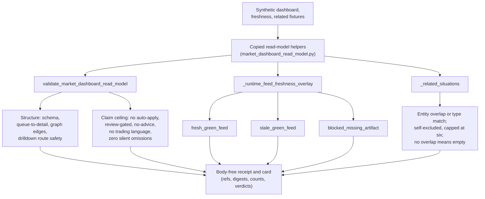

# Batch 12 market dashboard read-model capsule

This organ executes copied non-secret macro substrate for Batch 12 over public synthetic fixtures.

## Purpose

The underlying macro module compiles a generated market-situation graph into a
backend read model: a trust strip, a ranked situation queue, a detail index, a
graph slice, facets, drilldowns, and an API contract. The read model is the
shape a dashboard consumes. This capsule does not rebuild that pipeline. It runs
the copied read-model helpers over small synthetic fixtures and asks one
question: does the read-model layer hold its own claim boundary, or does it
quietly become a market-truth or advice surface?

The interesting part is what the validator refuses rather than what it accepts.
A presentation layer is the easy place for an overclaim to leak in: a label like
"strong buy", an `auto_apply_allowed` flag left true, a freshness state that
reports green from a stale or missing artifact. The copied
`validate_market_dashboard_read_model` scans for trading and action-claim
language, requires `oracle_evolve.auto_apply_allowed` to be false and
`review_gated` to be true, requires `no_advice_mode` to be enabled, and requires
the silent-omission count to be zero. The capsule drives those checks with
fixtures designed to trip each one, then records whether the source actually
flagged them.

The other two mechanisms guard the read path itself. A feed-freshness overlay
classifies the current run into a small set of honest states so historical green
proof cannot stand in for live-feed capability, and a related-situations scorer
groups situations by shared entities or matching type without inventing links.
Everything is fixture-bound: there is no live market data, no provider call, and
no investment advice anywhere in scope.

## JSON Capsule Binding

- Source authority: `core/paper_module_capsules.json::paper_modules[66:paper_module.batch12_market_dashboard_read_model_capsule]` with `source_authority: json_capsule`; the generated instance is `paper_modules/batch12_market_dashboard_read_model_capsule.json`.
- This Markdown is a reader projection. The generated Mermaid projection is `available_from_capsule_edges`; the generated Atlas projection is `linked_from_capsule_edges`, so read-model mechanism edges are capsule-derived projections.
- The authority ceiling is fixture-bound market-dashboard read-model evidence only. The proof boundary is restricted to copied non-secret macro substrate, synthetic dashboard/read-model fixtures, freshness overlays, related-situation joins, negative cases, and validation receipts; it does not establish release authority, provider dispatch, private-root equivalence, market truth, investment advice, or whole-system correctness.

## Reader Proof Boundary

A cold reader can validate this module by starting from the JSON capsule row,
then checking the generated JSON instance, exported market-dashboard read-model
bundle, synthetic dashboard/read-model fixtures, freshness overlays,
related-situation joins, negative cases, body-free receipts, and focused test.
The proof is limited to copied non-secret macro substrate exercised over public
synthetic fixtures.

The proof stops before live market truth, provider dispatch, investment advice,
release approval, production readiness, source mutation, and whole-system
correctness. Generated Mermaid and Atlas availability are capsule projections,
not independent proof surfaces.

## Public Site Availability Boundary

This Markdown is safe to project on the public site because it exposes public
fixture ids, source refs, digest checks, validator commands, generated-row
counts, and authority ceilings without exporting provider payloads, private
workspace state, market positions, browser/session state, or live feed access.

Public rendering may explain read-model validation and freshness accounting. It
must not imply live market truth, investment advice, provider execution,
publication approval, or release readiness.

## Public-Safe Body Handling

The public body floor is the exported bundle manifest plus copied non-secret
macro read-model substrate. Reader-facing receipts and cards should carry refs,
digests, anchors, counts, validation rows, negative-case verdicts, and
authority ceilings only.

Future body refreshes must keep private macro bodies outside public receipts
and site projections; copied source text stays in the bundle source-module
area, while public copy names only hashes, anchors, counts, and verdicts.

## Structured Lattice Bindings

The generated JSON row currently contributes 15 relationship edges: two `paper_module.explains.organ_or_mechanism` edges, one `paper_module.governed_by.concept` edge, four `paper_module.governed_by.principle` edges, four `paper_module.abides_by.axiom` edges, three sibling `paper_module.depends_on.paper_module` edges, and one resolved `paper_module.cites.code_locus` edge.

The Mermaid projection is `available_from_capsule_edges`; the Atlas projection is `linked_from_capsule_edges`. At this HEAD the generated instance reports zero unresolved selective relations. If future capsule edits introduce residuals, this Markdown may name them but must not invent concept ids or promote candidate doctrine.

## Claim Ceiling

This module may claim public fixture evidence that the copied non-secret macro
substrate produced market-dashboard read-model rows, runtime feed freshness
overlays, related-situation joins, negative-case checks, body-free receipt
posture, and validation receipts over synthetic inputs.

This module may not claim release authority, provider dispatch, private-root
equivalence, live market truth, investment advice, production readiness, source
mutation authority, publication authority, or whole-system correctness.

## Mechanisms

- `validate_market_dashboard_read_model`
- `_runtime_feed_freshness_overlay`
- `_related_situations`

## What the checks do

`validate_market_dashboard_read_model` is the structural and overclaim gate. It
first checks the read model is well formed: the schema version matches, every
situation in the queue resolves to a detail entry, every graph-slice edge points
at a node that exists, and each drilldown source-ref returns metadata only with
no arbitrary file read and no `..` traversal in its route. It then enforces the
claim boundary. `auto_apply_allowed` must be false, `review_gated` must be true,
`no_advice_mode` must be enabled, the silent-omission count must be zero, and any
copied source text is scanned for trading or action-claim language (buy, sell,
short, price target, stop loss, and similar). The capsule feeds it five negative
fixtures, one per failure shape, and confirms the source emits the matching error
string for each. A read model that passed these checks but stayed silent on a
planted overclaim would be the real failure, so the capsule treats a missing
error as a finding.

`_runtime_feed_freshness_overlay` reads a per-run readiness summary and reports
one of three honest states. `fresh_green_feed` requires the run to be ready, all
targets met, no blockers, and same-day generation. `stale_green_feed` is
artifact-backed but no longer same-day. `blocked_missing_artifact` covers the run
that is missing its readiness file, falls short on targets, or carries blockers.
The point is that a stale or absent run never reports green: historical proof
cannot stand in for live-feed capability, and the state carries a plain
truth-statement saying so. The capsule writes synthetic readiness files for each
case and checks the classifier returns the expected state.

`_related_situations` builds the "see also" cohort for a situation. It collects
other situations that either share an entity or match the situation type, ranks
them, excludes the focus situation itself, and caps the list at six. The capsule
checks one boundary case in particular: a situation with no entity overlap and a
different type produces an empty cohort rather than a spurious link.

## Shape



## Reader Evidence Routing

Start with `paper_modules/batch12_market_dashboard_read_model_capsule.json` for
capsule-derived source authority, then read this Markdown as the explanatory
projection. Use
`examples/batch12_market_dashboard_read_model_capsule/exported_batch12_market_dashboard_read_model_capsule_bundle/source_module_manifest.json`
to inspect copied-source digest status before opening copied source modules.
Use `tests/test_batch12_market_dashboard_read_model_capsule.py` to verify the
fixture and bundle expectations.

The useful evidence is dashboard read-model accounting over synthetic public
fixtures: validation rows, freshness overlays, related-situation joins, negative
cases, body-free receipts, and claim-ceiling fields.

## Receipt Expectations

A complete local receipt includes the fixture command, the exported-bundle command, the focused pytest, the paper-module corpus check, and generated-row proof showing 15 relationship edges, Mermaid `available_from_capsule_edges`, Atlas `linked_from_capsule_edges`, `source_authority: json_capsule`, and zero unresolved selective relations.

Fixture and bundle receipts must preserve copied non-secret macro substrate digest equality, dashboard read-model validation rows, runtime feed freshness overlays, related-situation joins, negative cases, body-free receipt posture, and claim-ceiling fields. Passing receipts remain fixture evidence only; they do not authorize release, provider dispatch, private-root equivalence, market truth, investment advice, production readiness, source mutation, publication authority, or whole-system correctness.

## Validation Receipt Path

Reader-verifiable commands, run from the `microcosm-substrate/` public root:

```bash
PYTHONPATH=src python3 -m microcosm_core.organs.batch12_market_dashboard_read_model_capsule run \
  --input fixtures/first_wave/batch12_market_dashboard_read_model_capsule/input \
  --out /tmp/microcosm-batch12-market-dashboard-read-model-vrp \
  --acceptance-out /tmp/microcosm-batch12-market-dashboard-read-model-fixture-acceptance.json \
  --card
PYTHONPATH=src python3 -m microcosm_core.organs.batch12_market_dashboard_read_model_capsule run-market-dashboard-bundle \
  --input examples/batch12_market_dashboard_read_model_capsule/exported_batch12_market_dashboard_read_model_capsule_bundle \
  --out /tmp/microcosm-batch12-market-dashboard-read-model-bundle-vrp \
  --acceptance-out /tmp/microcosm-batch12-market-dashboard-read-model-bundle-acceptance.json \
  --card
PYTHONPATH=src ../repo-pytest --disk-pressure-policy=warn microcosm-substrate/tests/test_batch12_market_dashboard_read_model_capsule.py -q --basetemp /tmp/microcosm-batch12-market-dashboard-read-model-tests
```

The fixture command writes the dashboard read-model receipt and acceptance JSON.
The bundle command validates copied non-secret macro substrate, manifest
digests, freshness overlay rows, related-situation joins, negative cases, and
body-free receipt posture. The focused test checks fixture validation, bundle
validation, digest/anchor coverage, and claim ceilings.

This receipt path is reader-verifiable evidence only. It does not authorize
release, provider dispatch, private-root equivalence, market truth, investment
advice, or whole-system correctness.

## Authority Ceiling

This is fixture-bound market-dashboard read-model mechanism evidence. It does not authorize release, provider dispatch, private-root equivalence, market truth, investment advice, production readiness, source mutation, publication authority, or whole-system correctness.

## Prior Art Grounding

The organ is grounded in CQRS/read-model and dashboard-observability patterns:
derive presentation-ready projections from source data, make freshness visible,
and keep the read surface separate from mutation authority. Useful anchors
include:

- Microsoft's [CQRS pattern](https://learn.microsoft.com/en-us/azure/architecture/patterns/cqrs),
  where read models are optimized for queries and presentation rather than
  command handling.
- [Grafana dashboards](https://grafana.com/docs/grafana/latest/visualizations/dashboards/),
  which query and transform data sources into operational panels.

Microcosm borrows the read-model shape for dashboard validation, runtime feed
freshness overlays, and related-situation joins. The result is fixture-bound
mechanism evidence; it does not become market truth, provider dispatch,
investment advice, or release authority.
