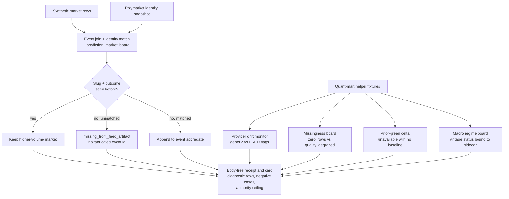

# Batch 12 prediction market board capsule

This organ executes copied non-secret macro substrate for Batch 12 over public synthetic fixtures.

## Purpose

Market and macro dashboards have a recurring failure: a row looks like a fact when it is really a guess. A duplicate listing inflates a volume figure, an unmatched market slug grows a fabricated identity, a feed reports zero rows but the board shows it as healthy, and a "change since last time" number appears even when there is no prior baseline to compare against. The single question this organ answers is whether the copied presentation-mart logic keeps those distinctions honest when run over public synthetic inputs.

It does that by importing the real `quant_presentation_mart` helper body and running it against fixtures that are built to expose each trap, then asserting the exact diagnostic the body should produce. The interesting choice is that the board never asserts what a market price means. It computes accounting about the data: which event a market belongs to, whether its identity was actually matched, how providers drifted, where rows went missing, and whether a vintage date is genuinely present. Aggregation is deliberately conservative. A missing value stays missing rather than defaulting to a confident zero, and an unmatched slug is reported as `missing_from_feed_artifact` instead of being given a synthetic event id.

The result is fixture-bound evidence, not a forecast. The board is a diagnostic surface over public synthetic rows. It does not read live markets, call providers, or claim that any number is tradeable.

## JSON Capsule Binding

- Source authority: `core/paper_module_capsules.json::paper_modules[67:paper_module.batch12_prediction_market_board_capsule]` with `source_authority: json_capsule`; the generated instance is `paper_modules/batch12_prediction_market_board_capsule.json`.
- This Markdown is a reader projection. The generated Mermaid projection is `available_from_capsule_edges`; the generated Atlas projection is `linked_from_capsule_edges`, so prediction-market board wiring is generated from the capsule, not inferred from public copy.
- The authority ceiling is fixture-bound prediction-market joining, quant-mart diagnostics, and macro-lifecycle enrichment evidence. The proof boundary is restricted to copied non-secret macro substrate, synthetic provider/market fixtures, identity and drift diagnostics, missingness boards, lifecycle/vintage rows, negative cases, and validation receipts; it does not establish release authority, provider dispatch, private-root equivalence, market truth, provider truth, investment advice, or whole-system correctness.

## Reader Proof Boundary

A cold reader can validate this module by starting from the JSON capsule row,
then checking the generated JSON instance, exported prediction-market board
bundle, synthetic provider/market fixtures, identity and drift diagnostics,
missingness boards, lifecycle/vintage rows, negative cases, body-free receipts,
and focused test. The proof is limited to copied non-secret macro substrate
exercised over public synthetic fixtures.

The proof stops before live market truth, provider truth, provider dispatch,
investment advice, release approval, source mutation, and whole-system
correctness. Generated Mermaid and Atlas availability are capsule projections,
not independent proof surfaces.

## Public Site Availability Boundary

This Markdown is safe to project on the public site because it exposes public
fixture ids, source refs, digest checks, validator commands, generated-row
counts, and authority ceilings without exporting provider payloads, private
workspace state, account/session state, market positions, or live provider
access.

Public rendering may explain provider identity matching, drift diagnostics,
missingness, prior-green deltas, and lifecycle/vintage accounting. It must not
claim live market truth, provider truth, provider execution, investment advice,
publication approval, or release readiness.

## Public-Safe Body Handling

The public body floor is the exported bundle manifest plus copied non-secret
macro prediction-market board substrate. Reader-facing receipts and cards
should carry refs, digests, anchors, counts, diagnostic rows, negative-case
verdicts, and authority ceilings only.

Future body refreshes must keep private macro bodies, provider payloads,
account/session state, market-sensitive private data, and copied body text out
of public receipts and site projections.

## Structured Lattice Bindings

The generated JSON row currently contributes 15 relationship edges: two `paper_module.explains.organ_or_mechanism` edges, one `paper_module.governed_by.concept` edge, four `paper_module.governed_by.principle` edges, four `paper_module.abides_by.axiom` edges, three sibling `paper_module.depends_on.paper_module` edges, and one resolved `paper_module.cites.code_locus` edge.

The Mermaid projection is `available_from_capsule_edges`; the Atlas projection is `linked_from_capsule_edges`. At this HEAD the generated instance reports zero unresolved selective relations. If future capsule edits introduce residuals, this Markdown may name them but must not invent concept ids or promote candidate doctrine.

## Mechanisms

- `_prediction_market_board`
- `_polymarket_identity_by_slug`
- `_provider_drift_monitor`
- `_missingness_board`
- `_delta_since_previous_green`
- `_macro_lifecycle_by_slug`
- `_macro_regime_board`

## How it works

The capsule loads three fixtures, runs the copied helpers, and checks eight named invariants. Each check targets a specific way a board can quietly mislead.

The event-join engine (`_prediction_market_board` with `_polymarket_identity_by_slug`) groups raw market rows into events using the Polymarket identity snapshot. Identity is matched by `market_slug`. When two rows share the same slug and outcome, only the higher-volume one is kept, so a duplicate listing cannot double a market count or inflate an aggregate. A slug with no identity match is not dropped and is not given a made-up event id. Its `event_identity_status` becomes `missing_from_feed_artifact` and its `max_liquidity` stays at `0.0`. The fixture proves all three: the duplicate fold (top volume 900000 with one surviving market), the orphan with a null event id, and the deduped aggregate.

The provider-drift monitor (`_provider_drift_monitor`) reads each feed's diagnostics and raises typed flags rather than a single health score. Generic transport problems (`provider_fallback_used`, `html_response_seen`, `fetch_failures`) are kept distinct from FRED-specific ones (`fred_invalid_series`, `fred_network_warning`). The fixture checks that the stock feed surfaces the generic set, the news feed stays clean, and the macro feed surfaces the FRED set. Keeping the families apart means a macro data-source fault is not laundered into a generic warning.

The missingness board (`_missingness_board`) lists only feeds that are not both non-empty and `ok`. A feed with zero rows is labelled `zero_rows`; a populated but low-quality feed is labelled `quality_degraded`; a healthy feed is omitted entirely. The fixture confirms the healthy feed is absent and the two failing lanes carry the correct reason, so an empty feed cannot read as present.

The prior-green delta (`_delta_since_previous_green`) only computes a "change since last run" when a previous green run actually exists. With no baseline it returns `status: unavailable` and an empty `row_deltas_by_lane`, which the fixture asserts directly. This is the guard against a delta number that has nothing to compare against.

The macro lifecycle enrichment (`_macro_lifecycle_by_slug` feeding `_macro_regime_board`) buckets macro series, then binds each bucket's `vintage_status` and `release_calendar_status` to whether the lifecycle sidecar genuinely carries that metadata. The fixture proves a series with a present vintage reads `available` with the expected observation date, while a series whose lifecycle row is absent reads `missing_from_feed_artifact`. A vintage date is shown only when it is really there.

## Shape



## Reader Evidence Routing

Start with `paper_modules/batch12_prediction_market_board_capsule.json` for
capsule-derived source authority, then read this Markdown as the explanatory
projection. Use
`examples/batch12_prediction_market_board_capsule/exported_batch12_prediction_market_board_capsule_bundle/source_module_manifest.json`
to inspect copied-source digest status before opening copied source modules.
Use `tests/test_batch12_prediction_market_board_capsule.py` to verify the
fixture and bundle expectations.

The useful evidence is diagnostic accounting over synthetic public fixtures:
provider identity matching, drift rows, missingness boards, prior-green deltas,
lifecycle/vintage rows, macro-regime enrichment, negative cases, body-free
receipts, and claim-ceiling fields.

## Receipt Expectations

A complete local receipt includes the fixture command, the exported-bundle command, the focused pytest, the paper-module corpus check, and generated-row proof showing 15 relationship edges, Mermaid `available_from_capsule_edges`, Atlas `linked_from_capsule_edges`, `source_authority: json_capsule`, and zero unresolved selective relations.

Fixture and bundle receipts must preserve copied non-secret macro substrate digest equality, provider identity and drift diagnostics, missingness rows, prior-green deltas, lifecycle/vintage rows, macro-regime enrichment, negative cases, body-free receipt posture, and claim-ceiling fields. Passing receipts remain fixture evidence only; they do not authorize release, provider dispatch, private-root equivalence, market truth, provider truth, investment advice, source mutation, publication authority, or whole-system correctness.

## Validation Receipt Path

Reader-verifiable commands, run from the `microcosm-substrate/` public root:

```bash
PYTHONPATH=src python3 -m microcosm_core.organs.batch12_prediction_market_board_capsule run \
  --input fixtures/first_wave/batch12_prediction_market_board_capsule/input \
  --out /tmp/microcosm-batch12-prediction-market-board-vrp \
  --acceptance-out /tmp/microcosm-batch12-prediction-market-board-fixture-acceptance.json \
  --card
PYTHONPATH=src python3 -m microcosm_core.organs.batch12_prediction_market_board_capsule run-prediction-market-board-bundle \
  --input examples/batch12_prediction_market_board_capsule/exported_batch12_prediction_market_board_capsule_bundle \
  --out /tmp/microcosm-batch12-prediction-market-board-bundle-vrp \
  --acceptance-out /tmp/microcosm-batch12-prediction-market-board-bundle-acceptance.json \
  --card
PYTHONPATH=src ../repo-pytest --disk-pressure-policy=warn microcosm-substrate/tests/test_batch12_prediction_market_board_capsule.py -q --basetemp /tmp/microcosm-batch12-prediction-market-board-tests
```

The fixture command writes the prediction-market board receipt and acceptance
JSON. The bundle command validates copied non-secret macro substrate, manifest
digests, provider identity and drift diagnostics, missingness rows, lifecycle
rows, negative cases, and body-free receipt posture. The focused test checks
fixture validation, bundle validation, digest/anchor coverage, and claim
ceilings.

This receipt path is reader-verifiable evidence only. It does not authorize
release, provider dispatch, private-root equivalence, market truth, provider
truth, investment advice, or whole-system correctness.

## Authority Ceiling

This is fixture-bound mechanism evidence for prediction-market joining, quant-mart diagnostics, and macro-lifecycle vintage enrichment. It does not authorize release, provider dispatch, private-root equivalence, market truth, provider truth, investment advice, source mutation, publication authority, or whole-system correctness.

## Claim Ceiling

This module supports only the reader-verifiable claim that copied non-secret
prediction-market board substrate can run over public synthetic fixtures,
produce provider identity, drift, missingness, lifecycle, and macro-regime
diagnostics, and keep body-free receipt evidence linked to JSON-capsule
Mermaid/Atlas projections. It does not establish live market truth, provider
truth, provider dispatch, investment advice, source mutation, release approval,
publication approval, private-root equivalence, or whole-system correctness.

## Prior Art Grounding

The organ borrows from prediction-market information aggregation and public
market-data integration practice: event contracts expose market prices and
settlement states, while dashboards must keep provider identity, missingness,
and vintage drift visible. Relevant anchors include:

- Robin Hanson's
  [information markets](https://mason.gmu.edu/~rhanson/infomkts.html) framing,
  where markets are used to aggregate dispersed information about uncertain
  events.
- The CFTC's [prediction markets explainer](https://www.cftc.gov/LearnandProtect/PredictionMarkets),
  which frames event contracts, market prices, and consumer cautions.
- [Polymarket API documentation](https://docs.polymarket.com/api-reference),
  as a concrete public API family for market, event, tag, series, and profile
  data.

Microcosm borrows the information-aggregation and provider-join shape, then
keeps the board explicitly diagnostic: identity matching, provider drift,
missingness, prior-green deltas, lifecycle vintage, and macro-regime enrichment
are tested over public synthetic fixtures. It is not market truth, provider
truth, investment advice, or release approval.
