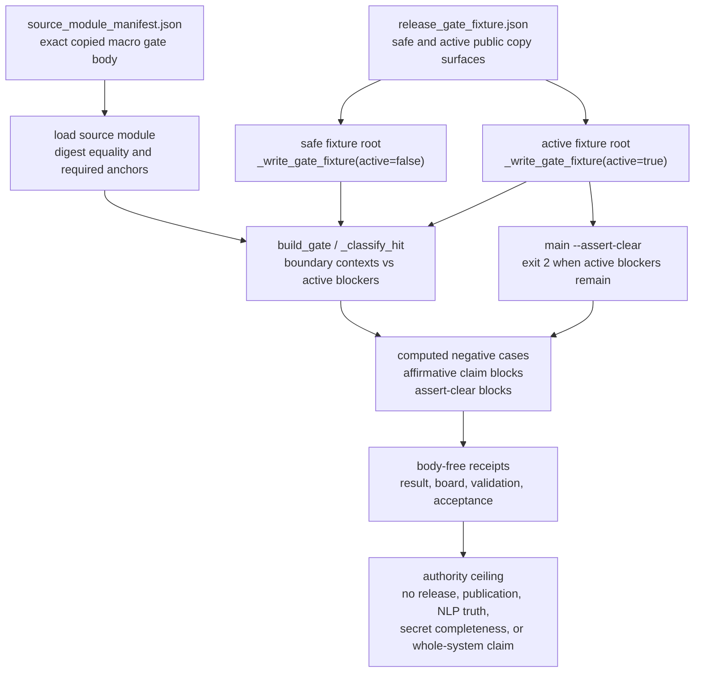

# Batch 12 release claim-language gate

This organ executes copied non-secret macro substrate for Batch 12 over public synthetic fixtures.

## JSON Capsule Binding

- Source authority:
  `core/paper_module_capsules.json::paper_modules[68:paper_module.batch12_release_claim_language_gate]`
  with `source_authority: json_capsule`.
- Generated instance:
  `paper_modules/batch12_release_claim_language_gate.json::paper_module_payload`.
- Capsule subjects: organ `batch12_release_claim_language_gate` and mechanism
  `mechanism.batch12_release_claim_language_gate.validates_public_release_claim_language_gate`.
- Capsule governance names principles `P-2`, `P-6`, `P-13`, and `P-15`,
  axioms `AX-5`, `AX-7`, `AX-11`, and `AX-12`, and dependencies
  `paper_module.public_reveal_walkthrough`,
  `paper_module.proof_derived_governed_mutation_authorization`, and
  `paper_module.batch8_validator_checker_capsule`.
- This Markdown is a reader projection. The generated Mermaid projection is
  `available_from_capsule_edges`; the generated Atlas projection is
  `linked_from_capsule_edges`, so claim-language gate edges remain generated
  from capsule authority.
- The authority ceiling is fixture-bound release claim-language gate evidence
  only. The proof boundary is restricted to copied non-secret macro substrate,
  typed claim hits, evidence-strength ranks, real-substrate flags,
  boundary-context classification, fail-closed defaults, negative cases, and
  validation receipts; it does not establish release approval, provider
  dispatch, private-root equivalence, market truth, investment advice, or
  whole-system correctness.

## Reader Proof Boundary

A cold reader can validate this module by starting from the JSON capsule row,
then checking the generated JSON instance, claim-language standard, exported
release-claim bundle, synthetic safe/active fixtures, active-blocker and
boundary-context classification, negative cases, body-free receipts, and
focused test. The proof is limited to copied non-secret macro substrate
exercised over public synthetic release-language fixtures.

The proof stops before release approval, publication readiness, semantic NLP
truth, complete secret detection, provider dispatch, private-root equivalence,
source mutation, production readiness, and whole-system correctness. Generated
Mermaid and Atlas availability are capsule projections, not release authority.

## Public Site Availability Boundary

This Markdown is safe to project on the public site because it exposes public
fixture ids, source refs, digest checks, validator commands, generated-row
counts, and authority ceilings without exporting private release packets,
provider payloads, browser/session state, raw operator voice, or copied private
macro bodies.

Public rendering may explain claim-language classification, evidence-strength
accounting, active blockers, and fail-closed defaults. It must not imply
release approval, publication readiness, provider execution, investment advice,
or complete secret detection.

## Public-Safe Body Handling

The public body floor is the exported bundle manifest plus copied non-secret
macro release-claim gate substrate. Reader-facing receipts and cards should
carry refs, digests, anchors, counts, classifier verdicts, active blockers,
body-scan status, secret-exclusion status, and authority ceilings only.

Future body refreshes must keep private release packets, provider payloads,
raw operator voice, browser/session state, copied body text, and
credential-equivalent material out of public receipts and site projections.

## Claim Ceiling

This module may claim fixture-bound evidence that the Batch 12 public
release-language gate can classify receipt-backed public copy against an
authority ceiling. Positive claims stay within typed claim hits, evidence
strength ranks, real-substrate flags, boundary-context classification,
fail-closed defaults, active blockers, negative cases, copied non-secret macro
source-module refs and bodies, source-manifest pass status, body-free receipt
scan status, secret-exclusion scan status, and validation receipts.

This module may not claim release approval, publication readiness, hosted
product status, provider dispatch authority, semantic NLP truth, complete secret
detection, private-root equivalence, portability proof, market truth,
investment advice, source mutation authority, production readiness, proof
correctness beyond the listed witnesses, or whole-system correctness.

## Limitations

The gate is a lexical and fixture-driven proof consumer, not a release oracle.
It exercises copied `release_claim_language_gate.py` behavior over bounded
public markdown fixtures, so it can detect active over-claiming phrases,
boundary-context exceptions, digest drift, fixture path hazards, and stable
negative-case regressions. It cannot prove that public copy is semantically
complete, market-accurate, legally sufficient, safe for publication, or free of
all secrets.

The exact-copy evidence floor is intentionally narrow. The source-module
manifest proves one copied non-secret macro body, required anchors, digest
equality, and body-free receipt posture; it does not authorize refreshing the
source module, accepting private-root equivalence, mutating release policy, or
publishing copied bodies into receipts. Any change to the copied macro body,
fixture corpus, negative cases, or authority ceiling belongs in the source,
standard, and capsule lanes before this Markdown can expand its claim.

The focused test proves the runtime contract only for the shipped fixtures and
bundle shape. Passing `test_batch12_release_claim_language_gate.py` means the
public proof consumer still rejects digest mismatch, unsafe fixture names,
duplicate fixture inputs, unstable negative labels, and receipt body leakage in
that bundle. It does not prove release readiness for other documents, providers,
frontends, markets, or future site projections.

## Structured Lattice Bindings

| Binding | Reader route |
|---|---|
| Paper module id | `paper_module.batch12_release_claim_language_gate` |
| Capsule authority | `core/paper_module_capsules.json::paper_modules[68:paper_module.batch12_release_claim_language_gate]` |
| Markdown projection | `paper_modules/batch12_release_claim_language_gate.md` |
| Generated instance | `paper_modules/batch12_release_claim_language_gate.json::paper_module_payload` |
| Organ runtime | `src/microcosm_core/organs/batch12_release_claim_language_gate.py` |
| Mechanism source | `core/mechanism_sources.json::mechanism.batch12_release_claim_language_gate.validates_public_release_claim_language_gate` |
| Standard | `standards/std_microcosm_batch12_release_claim_language_gate.json` |
| Fixture input | `fixtures/first_wave/batch12_release_claim_language_gate/input` |
| Exported bundle | `examples/batch12_release_claim_language_gate/exported_batch12_release_claim_language_gate_bundle` |
| Source manifest | `examples/batch12_release_claim_language_gate/exported_batch12_release_claim_language_gate_bundle/source_module_manifest.json` |
| Acceptance receipt | `receipts/acceptance/first_wave/batch12_release_claim_language_gate_fixture_acceptance.json` |
| First-wave result receipt | `receipts/first_wave/batch12_release_claim_language_gate/batch12_release_claim_language_gate_result.json` |
| First-wave board receipt | `receipts/first_wave/batch12_release_claim_language_gate/batch12_release_claim_language_gate_board.json` |
| First-wave validation receipt | `receipts/first_wave/batch12_release_claim_language_gate/batch12_release_claim_language_gate_validation_receipt.json` |
| Runtime-shell receipt | `receipts/runtime_shell/demo_project/organs/batch12_release_claim_language_gate/exported_batch12_release_claim_language_gate_bundle_validation_result.json` |

## Governing Lattice Relation

This paper module sits under
`concept.import_projection_and_drift_control_bundle`: a copied macro mechanism
is imported into the public substrate, exercised through public fixtures, and
held behind digest, receipt, and projection boundaries. The capsule therefore
does not treat Markdown prose as authority; it treats the JSON capsule,
generated instance, mechanism row, standard, source manifest, and receipts as
the lattice that the prose must explain.

The governing principles `P-2`, `P-6`, `P-13`, and `P-15` map onto the organ's
operational checks. Typed evidence ranks and real-substrate flags keep public
claims below the receipt-backed ceiling; public/private boundary rules keep
source bodies and private release state out of receipts; negative fixtures and
fail-closed defaults prevent optimistic marketing language from bypassing the
validator; and generated Mermaid/Atlas rows remain projections of capsule
edges, not independent release authority.

The axiom boundary is the hard claim ceiling. `AX-5`, `AX-7`, `AX-11`, and
`AX-12` require the gate to preserve source truth, avoid projection drift,
route public copy through explicit authority checks, and block unsupported
release language. That is why the mechanism couples `_write_gate_fixture`,
`_evaluate`, `run_batch12_release_claim_language_gate_bundle`, exact-copy
source manifest validation, and body-free receipts instead of asking a prose
reviewer to decide whether a claim sounds acceptable.

The sibling dependencies define how to read the result. `public_reveal_walkthrough`
supplies the public-copy setting, `proof_derived_governed_mutation_authorization`
supplies the proof-before-mutation posture, and
`batch8_validator_checker_capsule` supplies the validator/checker pattern. This
module is the claim-language checker within that lattice, not the public release
decision itself.

The generated JSON row currently contributes 15 relationship edges: two
`paper_module.explains.organ_or_mechanism` edges, one
`paper_module.governed_by.concept` edge, four
`paper_module.governed_by.principle` edges, four
`paper_module.abides_by.axiom` edges, three sibling
`paper_module.depends_on.paper_module` edges, and one resolved
`paper_module.cites.code_locus` edge.

The Mermaid projection is `available_from_capsule_edges`; the Atlas projection
is `linked_from_capsule_edges`. At this HEAD the generated instance reports
zero unresolved selective relations. If future capsule edits introduce
residuals, this Markdown may name them but must not invent concept ids or
promote candidate doctrine.

## Mechanisms

- `_classify_hit`
- `build_gate`
- `main --assert-clear`

## Shape

- Runtime locus:
  `src/microcosm_core/organs/batch12_release_claim_language_gate.py`,
  especially `_blocked_exercise`, `_write_gate_fixture`,
  `_run_main_assert_clear`, `_evaluate`, `run`,
  `run_batch12_release_claim_language_gate_bundle`, `result_card`,
  `EXPECTED_NEGATIVE_CASES`, and `AUTHORITY_CEILING`.
- Macro source import:
  `tools/meta/dissemination/release_claim_language_gate.py`, copied into the
  exported bundle as one non-secret macro body with digest equality and anchors
  `RISKY_PHRASES`, `NEGATIVE_CONTEXT_MARKERS`, `def _classify_hit`, and
  `def build_gate`.
- Positive fixture shape: one safe boundary-context claim surface passes
  because limiting language keeps `does_not_authorize_release: true`.
- Active fixture shape: two active claim blockers are reported for bare
  unsupported release-language surfaces, while boundary/negative context remains
  counted separately.
- Negative floor: `affirmative_open_source_production_ready_blocks` and
  `assert_clear_returns_exit_2`, with stable error codes
  `BATCH12_RELEASE_CLAIM_ACTIVE_BLOCKER` and
  `BATCH12_RELEASE_CLAIM_ASSERT_CLEAR_EXIT_2`.
- Public receipt posture: real-substrate capsule, source manifest pass,
  secret-exclusion scan pass, receipt body scan pass, and a false
  `body_in_receipt` flag.



This organ is the public copy gate for receipt-backed evidence accounting. It
does not ask whether a phrase sounds impressive; it asks whether the phrase is
within the evidence class and authority ceiling that receipts can support.

Evidence strength is typed ordinal data, not vibes: ranks, real-substrate flags,
and fail-closed defaults constrain how far public language may climb. Independent
validators reconcile each organ's declared class against receipt-backed facts so
over-claiming is blocked and stale under-claiming can be surfaced for review.
Receipt scanners may downgrade when bodies or credential-equivalent payloads
leak; they cannot upgrade merely because a narrative is strong.

The boundary-context classifier is allowed to pass negated or limiting language
such as "not a hosted product" while blocking bare claims such as
"production-ready" when no release authority exists. Marketing copy is therefore
treated as another claim surface with an accounting ledger, not as a looser mode
of speech.

## Reader Evidence Routing

- Start with `paper_modules/batch12_release_claim_language_gate.json` for source
  authority, then read this Markdown as the projection.
- Open `standards/std_microcosm_batch12_release_claim_language_gate.json` for
  the required witnesses, negative floor, denied authority, receipt contract,
  validator command, and runtime bundle command.
- Open
  `core/fixture_manifests/batch12_release_claim_language_gate.fixture_manifest.json`
  for source-open body import count, source manifest refs, and durable receipt
  refs.
- Open
  `examples/batch12_release_claim_language_gate/exported_batch12_release_claim_language_gate_bundle/source_module_manifest.json`
  before inspecting copied source modules; receipts carry refs, hashes, counts,
  verdicts, and omissions rather than copied body text.
- Open `tests/test_batch12_release_claim_language_gate.py` for assertions on
  pass receipts, digest mismatch rejection, fixture path safety, duplicate-key
  rejection, duplicate fixture names, exact macro body import, and card body
  omission.
- Run fixture and bundle routes from `microcosm-substrate/`. The CLI supports
  `--card`, but it does not expose a `--json` flag.
- Use `scripts/build_doctrine_projection.py --check-paper-module-corpus` to
  verify this Markdown projection still satisfies the shared paper-module
  coverage contract.

## Validation Receipt Path

Reader-verifiable commands, run from the `microcosm-substrate/` public root:

```bash
PYTHONPATH=src python3 -m microcosm_core.organs.batch12_release_claim_language_gate run \
  --input fixtures/first_wave/batch12_release_claim_language_gate/input \
  --out /tmp/microcosm-batch12-release-claim-language-gate-vrp \
  --acceptance-out /tmp/microcosm-batch12-release-claim-language-gate-fixture-acceptance.json \
  --card
PYTHONPATH=src python3 -m microcosm_core.organs.batch12_release_claim_language_gate run-release-claim-language-gate-bundle \
  --input examples/batch12_release_claim_language_gate/exported_batch12_release_claim_language_gate_bundle \
  --out /tmp/microcosm-batch12-release-claim-language-gate-bundle-vrp \
  --acceptance-out /tmp/microcosm-batch12-release-claim-language-gate-bundle-acceptance.json \
  --card
PYTHONPATH=src ../repo-pytest --disk-pressure-policy=warn microcosm-substrate/tests/test_batch12_release_claim_language_gate.py -q --basetemp /tmp/microcosm-batch12-release-claim-language-gate-tests
```

The fixture command writes the claim-language gate receipt and acceptance JSON.
The bundle command validates copied non-secret macro substrate, source manifest
digests, active-blocker and boundary-context classification, negative cases,
body-free receipts, and authority-ceiling fields. The focused test checks pass
receipts, digest mismatch rejection, fixture path safety, duplicate-key and
duplicate-fixture rejection, exact macro body import, and card body omission.

This receipt path is reader-verifiable evidence only. It does not authorize
release, publication, provider dispatch, semantic NLP truth, complete secret
detection, private-root equivalence, portability proof, market truth,
investment advice, source mutation, or whole-system correctness.

## Receipt Expectations

- Fixture execution writes `batch12_release_claim_language_gate_result.json`,
  `batch12_release_claim_language_gate_board.json`, and
  `batch12_release_claim_language_gate_validation_receipt.json`.
- Acceptance output writes
  `receipts/acceptance/first_wave/batch12_release_claim_language_gate_fixture_acceptance.json`.
- Exported-bundle execution writes
  `exported_batch12_release_claim_language_gate_bundle_validation_result.json`
  under the selected output directory.
- Passing evidence must preserve one mechanism, one copied source module, source
  digest equality, required anchors, two observed negative cases, two active
  blockers in the active fixture, one boundary-or-negative context count in both
  safe and active fixture summaries, and `does_not_authorize_release: true`.
- Receipts must preserve `body_in_receipt: false`,
  `receipt_body_scan.status: pass`, source manifest pass status, and
  secret-exclusion scan pass status.
- Receipt success does not authorize release, publication, provider dispatch,
  semantic NLP truth, complete secret detection, private-root equivalence,
  portability proof, market truth, investment advice, source mutation, or
  whole-system correctness.

## Authority Ceiling

This is fixture-bound release claim-language gate evidence. It does not authorize release approval, publication readiness, provider dispatch, semantic NLP truth, complete secret detection, private-root equivalence, portability proof, market truth, investment advice, source mutation, production readiness, proof correctness beyond the listed witnesses, or whole-system correctness.

## Prior Art Grounding

The organ borrows a narrow pattern from advertising-substantiation and
regulated-communication practice: public claims should stay within evidence
actually held, and stronger language requires stronger support. This is prior
art for the proof-consumer shape only. The module does not implement legal
compliance, authorize release, or decide whether public copy is fit to publish.

External source receipt, checked 2026-06-05:

| Source | Exact URL | Why it matters here | Local boundary |
|---|---|---|---|
| FTC advertising substantiation policy | `https://www.ftc.gov/legal-library/browse/ftc-policy-statement-regarding-advertising-substantiation` | Objective claims need a reasonable basis before dissemination, and express or implied support claims must match the support actually held. | Microcosm maps this to receipt-backed evidence classes and fail-closed release-language blockers, not to legal sufficiency. |
| FINRA Rule 2210 | `https://www.finra.org/rules-guidance/rulebooks/finra-rules/2210` | Public communications must be fair and balanced, give a sound factual basis, and avoid false, exaggerated, unwarranted, promissory, or misleading claims. | The module only uses this as a prior-art analogue for keeping benefits, risks, and qualifications in the same local claim context. |
| SEC investment adviser marketing guide | `https://www.sec.gov/resources-small-businesses/small-business-compliance-guides/investment-adviser-marketing` | The marketing rule guide summarizes general prohibitions on untrue or misleading material statements, unsupported material facts, unfair treatment of risks, and constrained performance or endorsement claims. | The module's investment-advice anti-claim stays negative: a green receipt is not adviser marketing compliance or investment advice. |
| SEC marketing compliance FAQ | `https://www.sec.gov/rules-regulations/staff-guidance/division-investment-management-frequently-asked-questions/marketing-compliance-frequently-asked-questions` | Current staff FAQ entries still route extracted performance and characteristics through Rule 206(4)-1 general prohibitions. | This is a currency/source-link receipt for claim-ceiling posture, not a new Microcosm capability or finance claim. |

Microcosm adapts the substantiation pattern to release and evidence language.
Receipt-backed classes, ordinal evidence strength, real-substrate flags,
boundary-context exceptions, and fail-closed defaults constrain what public
copy may say. The gate blocks unsupported elevation without turning itself into
release approval, market truth, investment advice, legal review, or
whole-system correctness.
