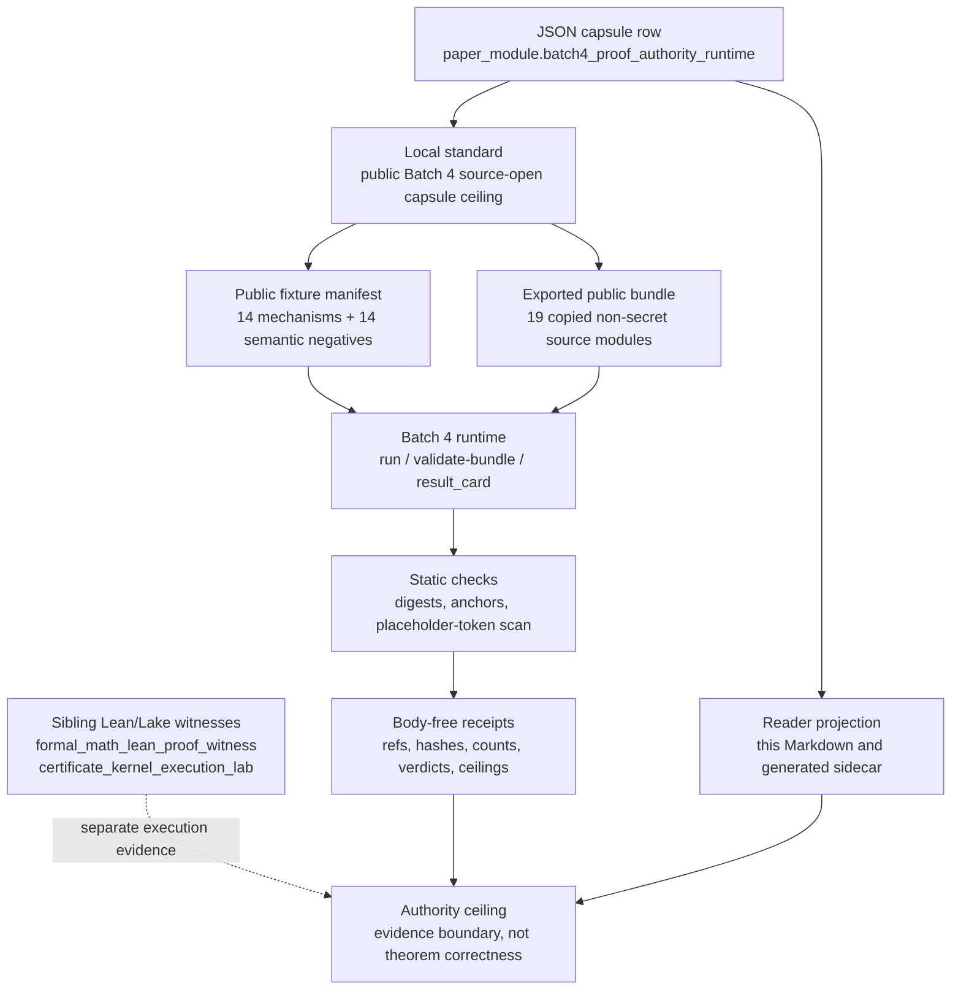

# Batch 4 Proof Authority Runtime

## Abstract

`batch4_proof_authority_runtime` is a public-safe technical paper module for
the Batch 4 proof/authority/runtime capsule. Its positive claim is deliberately
narrow: Microcosm imports exact copied non-secret macro source modules into a
public bundle, checks source digests and required anchors, runs bounded fixture
and bundle validators, records semantic negative cases, and emits body-free
receipts with explicit authority ceilings.

This module does not claim formal theorem correctness. It is not a Lean/Lake
execution organ, not an Erdos #257 solution, not an official benchmark result,
not live sandbox enforcement, not live Codex orchestration, not provider
dispatch, not source mutation authority, not publication approval, not release
approval, not private-root equivalence, and not whole-system correctness. Where
the paper mentions Lean/Lake, it distinguishes Batch 4's static copied-source
checks from sibling witness organs that actually run local Lean/Lake processes.

## Telos

The Batch 4 capsule exists to make proof-adjacent runtime claims inspectable
without leaking private roots or inflating source import into proof authority.
It gathers fourteen mechanism families that otherwise invite overclaiming:
strategy-control proof search, prover-skill foundry work, VeriSoftBench harness
diagnostics, Erdos #257 certificate-kernel source anchors, Lean packet replay,
dry-run authority grants, closeout planning, Codex runtime diagnostics,
bitemporal coordination, macOS taskpolicy wrapping, and context-yield
attribution.

The paper's job is not to make those systems authoritative by prose. Its job is
to explain the public receipt membrane: what was copied, what was checked, what
negative cases were observed, what was omitted from receipts, and which
authority ceiling remains in force.

## Source Authority And Projection Boundary

The source authority for this paper-module identity is the JSON capsule row:

- `core/paper_module_capsules.json::paper_modules[77:paper_module.batch4_proof_authority_runtime]`
- generated sidecar: `paper_modules/batch4_proof_authority_runtime.json`
- local standard: `standards/std_microcosm_batch4_proof_authority_runtime.json`
- runtime locus: `src/microcosm_core/organs/batch4_proof_authority_runtime.py`
- focused validator: `tests/test_batch4_proof_authority_runtime.py`

This Markdown is a reader projection. It may explain the capsule row, the
generated relationship set, and the validation route, but it does not mint new
subject edges, proof authority, Mermaid authority, Atlas authority, or release
status. Future relationship changes belong in the capsule row plus builder
regeneration, not in hand-authored Markdown.

## Mechanism Overview

The public fixture manifest names fourteen mechanism rows and one stable
negative case per mechanism:

- `lean_strategy_control_benchmark`
- `prover_skill_foundry`
- `verisoftbench_harness_differential`
- `verisoftbench_calibration_executor`
- `erdos257_certificate_kernel`
- `lean_full_fidelity_packet_verifier`
- `reasoning_execution_authority_grant`
- `forward_integration_policy_fence`
- `closeout_executor_state_machine`
- `codex_cdp_driver`
- `codex_idle_heartbeat_fsm`
- `metabolism_bitemporal_claim_log`
- `macos_taskpolicy_actuator`
- `context_yield_attribution`

The exported bundle contains nineteen exact copied non-secret macro source
modules. Validation checks their manifest rows, SHA-256 digests, line counts,
required anchors, and per-mechanism public exercise clauses. Receipts carry
source refs, digests, anchors, counts, verdicts, negative-case ids, and
authority ceilings; they do not inline copied body text or private runtime
state.

## Runtime Mechanism

The runtime has two public entry shapes:

1. `run` consumes `fixtures/first_wave/batch4_proof_authority_runtime/input`,
   evaluates the Batch 4 fixture manifest, writes the public result board, and
   emits acceptance JSON.
2. `validate-bundle` consumes
   `examples/batch4_proof_authority_runtime/exported_batch4_proof_authority_runtime_bundle`,
   validates the copied-source manifest, and emits a bundle validation receipt.

Both paths enforce the same ceiling. They validate public fixture evidence and
copied-source integrity; they do not run providers, dispatch live Codex state,
execute a live sandbox, mutate source, submit benchmark results, approve
publication, approve release, or establish theorem correctness.

For the Erdos #257 certificate-kernel row, Batch 4 performs a static
placeholder-token scan over copied Lean source and ties that scan to target-runner
anchor evidence. That scan may reject `sorry`, `admit`, and `axiom` mutations in
the copied source floor. It is not a Lean proof check and not a certificate that
the open problem has been solved.

## Lean/Lake Witness Boundary

Batch 4 should be read as the import/receipt capsule, not as the Lean/Lake
executor. Actual local Lean/Lake subprocess evidence lives in sibling public
organs:

- `formal_math_lean_proof_witness` runs a tiny public Lean/Lake fixture and
  exported witness bundle, records local tool availability, build status,
  declaration metadata, four negative-case observations, and body-free receipts.
  Its authority ceiling is toy public witness evidence only; it rejects Mathlib,
  Aesop, and Batteries authority unless a wider authority plane is introduced.
- `certificate_kernel_execution_lab` runs a bounded public certificate-kernel
  lab through Lean/Lake machinery, records command identity, transition rows,
  accepted/residual counts, copied-source manifest status, negative cases, and
  body-free receipts. Its authority ceiling is bounded certificate-kernel
  evidence, not general theorem authority.

Therefore the correct reading is layered:

- Batch 4 validates source-open macro-body import, static placeholder scanning,
  authority-boundary fields, and semantic negatives.
- The Lean/Lake witness organs validate that specific public fixtures can route
  through local Lean/Lake subprocesses under their own ceilings.
- None of these pages, individually or together, claim arbitrary theorem
  correctness, Mathlib-dependent proof authority, benchmark standing, Erdos #257
  solution status, publication approval, release approval, or private-root
  equivalence.

## Diagram



The dashed edge is intentional. Lean/Lake subprocess evidence informs the
technical boundary, but Batch 4 itself does not inherit proof authority from
sibling organs.

## Semantic Negatives And Threat Model

The negative cases are not decoration. They are the public failure floor that
prevents a source-import capsule from becoming an unbounded proof or runtime
claim. The fixture includes negatives for weak proof skeletons, low-repair
foundry promotion, benchmark truth leakage, prefix-answer leakage, Erdos
solution overclaim, packet hash corruption, forbidden authority grants, dirty
forward integration targets, stale closeout heads, absent CDP ports, stale idle
snapshots, expired bitemporal claims, missing taskpolicy binaries, and accepted
read guards.

The threat model is overclaiming. A green receipt must not be interpreted as:

- a formal proof of a theorem;
- a solution to Erdos #257;
- an official benchmark result or leaderboard submission;
- a live provider, browser, sandbox, Codex, or metabolism run;
- authorization to mutate source, publish, release, or export private state;
- evidence that public copied modules are equivalent to a private root.

## Public/Private Boundary

Allowed public material:

- mechanism ids, source-module ids, negative-case ids, and stable error codes;
- exact copied non-secret source modules in the exported public bundle;
- source refs, SHA-256 digests, line counts, required anchors, and bounded
  outcomes;
- authority ceilings, anti-claims, and body-free validation verdicts.

Forbidden public material:

- keys, credentials, cookies, account/session state, provider payload bodies,
  browser/HUD live-access material, live Codex state exports, live metabolism DB
  exports, private runtime state, raw operator voice, prompt-shelf bodies,
  theorem work-product bodies, raw command-output bodies, publication operation
  state, and official benchmark submission state.

The exported bundle may contain approved copied non-secret source modules. The
receipts are stricter: they identify copied modules by refs, digests, anchors,
classes, counts, and verdicts, not by inlining source bodies.

## Reproducibility Route

Run these commands from `microcosm-substrate/` when validating this module
without changing durable generated projections:

```bash
PYTHONPATH=src ../repo-python -m microcosm_core.organs.batch4_proof_authority_runtime run \
  --input fixtures/first_wave/batch4_proof_authority_runtime/input \
  --out /tmp/microcosm-batch4-proof-authority-runtime-fixture-vrp \
  --acceptance-out /tmp/microcosm-batch4-proof-authority-runtime-fixture-acceptance.json \
  --card

PYTHONPATH=src ../repo-python -m microcosm_core.organs.batch4_proof_authority_runtime validate-bundle \
  --input examples/batch4_proof_authority_runtime/exported_batch4_proof_authority_runtime_bundle \
  --out /tmp/microcosm-batch4-proof-authority-runtime-bundle-vrp \
  --acceptance-out /tmp/microcosm-batch4-proof-authority-runtime-bundle-acceptance.json \
  --card

PYTHONPATH=src ../repo-python -m pytest -p no:cacheprovider \
  --basetemp=/tmp/microcosm-batch4-proof-authority-runtime-tests \
  -q tests/test_batch4_proof_authority_runtime.py
```

The projection checks for the broader paper-module corpus remain:

```bash
PYTHONPATH=src ../repo-python scripts/build_doctrine_projection.py --check-paper-module-corpus
PYTHONPATH=src ../repo-python scripts/build_doctrine_projection.py --check
```

The direct runtime commands and focused pytest are the minimum useful
validation. The projection checks verify that the generated corpus remains
consistent with the source capsule and this reader projection.

## Result Interpretation

A passing fixture command evidences that the public manifest, mechanism rows,
negative cases, receipt body scan, and authority ceiling are internally
consistent for the Batch 4 fixture. A passing bundle command evidences that the
exported copied-source manifest matches expected digests and anchors while
keeping receipts body-free. A passing focused pytest evidences regression
coverage for fixture execution, bundle validation, source digest mismatch,
mutated Lean body rejection, exact-copy imports, private-body omission, and
semantic negative-case evaluation.

These are engineering receipts. They are not formal proof certificates. They
support public reader confidence in the capsule's source-open evidence membrane;
they do not certify theorem truth, benchmark standing, release readiness, or
whole-system correctness.

## Relationship To Formal-Proof Concepts

Batch 4 relates to formal-proof practice through boundary discipline, not
through theorem authority. The local concept edge is
`concept.formal_math_and_proof_witness_bundle`: proof-adjacent claims must pass
through explicit witness artifacts, source refs, digests, declaration or anchor
metadata, negative cases, and body-free receipts before they become reader
evidence.

The sibling `formal_math_lean_proof_witness` organ supplies the small public
Lean/Lake witness pattern. The sibling `certificate_kernel_execution_lab` organ
supplies the bounded certificate-kernel execution pattern. Batch 4 imports and
validates copied macro-body evidence around those themes, but it keeps the
authority delta at `none`.

This distinction is the main technical result of the paper: a source-open
public capsule can be useful without pretending to be a formal proof. It can
make evidence auditable, show exactly where a proof-adjacent route stops, and
force every tempting stronger claim into a visible anti-claim.

## Limitations

The current module has these hard limits:

- Batch 4 does not execute Lean/Lake; it performs static checks over copied
  source and validates public manifest evidence.
- Static placeholder-token scanning is not proof checking.
- Digest and anchor equality do not prove semantic equivalence to a private
  root.
- Negative-case coverage is finite and fixture-bound.
- Body-free receipts improve public safety, but they are not a substitute for
  formal proof review.
- Generated Mermaid, Atlas, and JSON sidecars are projections; they do not
  create source authority.
- Accepted-organ status means accepted current public receipt inventory for this
  verified macro-body import, not release, publication, benchmark, or theorem
  authority.

## Data And Artifact Availability

The public artifact boundary is the standalone `microcosm-substrate` root. A
cold reader should use the paper module, generated sidecar, standard, fixture
manifest, exported bundle manifest, focused test, and body-free receipts inside
that root. Public links and publication surfaces must resolve to the public
Microcosm substrate, not private macro roots, provider payload stores, browser
state, prompt-shelf bodies, or operator-voice material.

## Claim Ceiling

This module may claim fixture-bound public source-body import, exact copied
non-secret source-module digest checks, required-anchor checks, static
placeholder-token scan evidence, dry-run authority-boundary evidence, semantic
negative-case evidence, and body-free receipt discipline.

It may not claim theorem success, Lean proof correctness, Erdos #257 solution
status, official benchmark standing, live sandbox enforcement, live Codex
orchestration, provider dispatch, source mutation, publication approval, release
approval, private-root equivalence, or whole-system correctness. If any of those
claims becomes supported later, the authority must come from changed source
capsule/standard/runtime evidence plus regenerated projections, not from this
Markdown projection alone.
