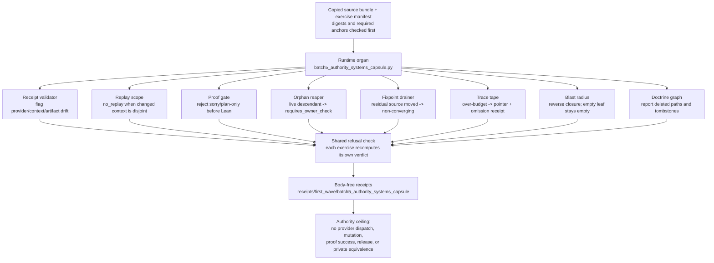

# Batch 5 Authority and Systems Capsule

Batch 5 imports the next authority/systems contour as a public-safe capsule:
post-execution receipt validation, reasoning replay scope and lineage,
verifier-gated Lean repair harnessing, process orphan classification, generated
state fixpoint settlement, trace-tape compaction, code blast radius, and
doctrine graph compilation.

The capsule carries exact copied macro bodies in
`examples/batch5_authority_systems_capsule/exported_batch5_authority_systems_capsule_bundle/source_modules/`
and tests those copies against macro-root digests and anchors. The runnable
Microcosm exercise is deliberately bounded: it uses synthetic public inputs to
prove the negative claim fences while preserving the real macro source as the
source-open substrate.

## Purpose

This page answers one question: can a cold reader inspect eight separate
authority and systems mechanisms, and confirm each one refuses the wrong thing,
without the reader having to run any of the real machinery?

The eight mechanisms are unrelated in subject. One validates post-execution
receipts; another decides when a reasoning step needs re-running; another gates
a Lean proof attempt; another classifies a stray process; another settles
generated-state residuals; another compacts a trace tape; another computes a
code blast radius; another compiles a doctrine graph. What they share is a
single discipline: each must decline to claim more than it has earned. The
receipt validator must not accept a drifted receipt; the proof gate must not
hand a placeholder proof to Lean; the orphan reaper must not signal a live
process; the blast-radius pass must not invent coverage for a leaf with no
dependents.

The unusual choice is that the capsule does not replay the real tools. It
carries an exact copy of each macro source body, checks those copies against
the macro-root digests and required anchors, and then runs a small synthetic
re-derivation for each mechanism. Each re-derivation recomputes its own verdict
from the fixture input rather than echoing a stored answer, so a negative case
passes only when the exercise itself reaches the refusal, not when a fixture
asserts it. The page is therefore a way to read eight refusal behaviours at
once, with the genuine source bodies kept verifiable alongside.

## Shape



The diagram starts where the runtime starts: the copied source bundle and the
exercise manifest, checked against macro-root digests and anchors. The organ
then fans out to the eight mechanism exercises, each recomputing its own pass or
refusal verdict, and folds the results into body-free receipts under a single
authority ceiling. Generated-state mutation, provider dispatch, proof-success
claims, and release authority all stay outside that ceiling.

## What the eight exercises check

Each exercise reads a small synthetic block from the fixture manifest and
recomputes a verdict. None of them call a provider, run Lean, signal a process,
or mutate generated state. What follows is the specific question each one
answers.

- Receipt validator. Given a runtime grant and two post-execution receipts, it
  recomputes the drift codes for the second receipt: a substituted provider, a
  context class outside the grant's allowed set, an output artifact hash that
  diverges from the grant, or `runtime_execution` claimed when no runtime grant
  was issued. The valid receipt must pass and the drifted one must be flagged;
  the exercise will not call drift "absent".
- Replay scope. It compares the context classes a step consumed against the
  classes that changed. When the two sets are disjoint, the classification is
  `no_replay`. In the fixture, a step consumed a task spec and a public fixture
  while only ambient browser state changed, so re-running the step is not
  demanded.
- Proof gate. It scans a candidate proof string before any Lean call. A `sorry`
  token, a plan-only phrasing such as "plan:" or "I will", or a proof that
  merely restates the declared theorem without an `exact` are each treated as
  failure classes, and the gate verdict becomes `rejected_before_lean`. The
  exercise records `0/8 historical banked attempts; no proof-success claim`.
- Orphan reaper. A process marked as a live-session descendant is classified
  `requires_owner_check`, not `safe_close_candidate`, and no signal is sent even
  when the fixture requests `SIGKILL`. The refusal is the point: a stray-looking
  process that belongs to a live session must not be killed on inventory alone.
- Fixpoint drainer. It walks residual signatures. If the same residual id
  reappears under a moved source signature, the settlement is classified
  `settlement_residual_source_moved`, which marks a non-converging residual
  rather than a settled one. No generated-state mutation is authorised either
  way.
- Trace tape. When the joined trace text exceeds the byte budget, the exercise
  truncates to a head budget and appends a pointer row plus an omission receipt
  that records the omitted byte count. A budget breach with no omission receipt
  is treated as a failure, so compaction can never silently drop trace bytes.
- Blast radius. It builds the reverse-dependency graph and takes the transitive
  closure of dependents for a target. A target with real dependents reports
  them; a leaf with no dependents reports an honestly empty bucket rather than
  inventing coverage.
- Doctrine graph. It scans doctrine nodes for two conditions: a node whose code
  path no longer exists, reported as an authority gap, and a node marked
  `tombstone`, reported with its replacement id. The exercise passes only when
  both a drift finding and a tombstone candidate are present, so a deleted code
  path behind a doctrine claim cannot pass unnoticed.

## Reader Proof Boundary

Read this page as a public reader projection over a JSON-capsule-backed
Microcosm paper-module row. The generated JSON row now reports
`paper_module_payload.source_authority: json_capsule`, and the source row is
`core/paper_module_capsules.json::paper_modules[81:paper_module.batch5_authority_systems_capsule]`.
The useful proof boundary is still narrow: this page can point readers to the
mechanism subject, source locus, exported public-safe bundle, validation receipts,
generated Mermaid projection, and generated Atlas projection status
without claiming accepted-organ authority, provider dispatch, proof success,
generated-state mutation authority, publication authority, release authority,
or whole-system correctness.

## JSON Capsule Binding

This Markdown is a reader projection, not source authority. The source
authority row is the JSON capsule in
`core/paper_module_capsules.json::paper_modules[81:paper_module.batch5_authority_systems_capsule]`,
and the generated sidecar at
`paper_modules/batch5_authority_systems_capsule.json` is rebuilt from that row.
Its current binding facts are:

- source authority: `source_authority: json_capsule`.
- generated JSON sidecar: `paper_modules/batch5_authority_systems_capsule.json`.
- subject: `mechanism.batch5_authority_systems_capsule.validates_public_authority_systems_capsule`.
- resolved code locus: `src/microcosm_core/organs/batch5_authority_systems_capsule.py`.
- generated Mermaid projection: `available_from_capsule_edges`.
- generated Atlas projection: `linked_from_capsule_edges`.

The generated Mermaid projection is available from the capsule edge. The
generated Atlas projection is linked from capsule edges, but that link still
does not let this slice invent a broader accepted-organ atlas row. The
accepted-organ owner boundary remains part of the authority ceiling, not a
release-readiness claim.

## Structured Lattice Bindings

- paper module id: `paper_module.batch5_authority_systems_capsule`.
- current generated projection:
  `microcosm-substrate/paper_modules/batch5_authority_systems_capsule.json`.
- source authority row:
  `core/paper_module_capsules.json::paper_modules[81:paper_module.batch5_authority_systems_capsule]`.
- current source authority:
  `paper_module_payload.source_authority: json_capsule`.
- mechanism subject:
  `mechanism.batch5_authority_systems_capsule.validates_public_authority_systems_capsule`.
- reader runtime locus:
  `src/microcosm_core/organs/batch5_authority_systems_capsule.py`.
- focused validator:
  `tests/test_batch5_authority_systems_capsule.py`.
- exported source snapshot bundle:
  `examples/batch5_authority_systems_capsule/exported_batch5_authority_systems_capsule_bundle/`.
- generated Mermaid projection:
  `available_from_capsule_edges`.
- generated Atlas projection: `linked_from_capsule_edges`.

Generated lattice surfaces remain projections. They should be refreshed only
through the doctrine projection builder after source authority changes; this
Markdown does not hand-author Mermaid edges, Atlas cards, coverage counts, or
entry-card status.

## Public Site Availability Boundary

This module is public-safe to expose as a reader route because the visible page
names source paths, copied-bundle locations, standards, tests, receipts, prior
art, and authority ceilings without claiming release authority or generated
lattice availability. Website availability should come from the existing
Microcosm site builder reading this source page and generated Microcosm data;
generated site HTML, object maps, search indexes, and content graphs are
projections, not source authority.

## Public-Safe Body Handling

This page may name macro source module paths, exported-bundle paths, fixture
ids, standards, focused tests, receipt paths, manifest digests, required
anchors, copied-body counts, negative claim fences, and authority ceilings. It
must not embed provider payloads, generated-state snapshots, process/live state,
raw operator voice, credentials, private macro bodies outside the public-safe
copied-source bundle, or any payload that would imply generated-state mutation
authority.

Copied public-safe source bodies stay in the exported bundle source-module
area. Reader cards, receipts, generated site projections, and this Markdown
should represent them by refs, hashes, line counts, anchors, booleans,
summaries, and explicit ceilings rather than by duplicating private or
live-state payloads.

## Reader Evidence Routing

- A source-authenticity reader starts with the exported bundle
  `source_module_manifest.json`, then checks the copied files under
  `examples/batch5_authority_systems_capsule/exported_batch5_authority_systems_capsule_bundle/source_modules/`
  against the macro source refs and anchor rows. The useful question is
  whether the public bundle is source-faithful, not whether it grants live
  generated-state authority.
- A runtime reader runs the fixture command and the `run-batch5-bundle` command
  in the Validation Receipt Path. The useful question is whether the synthetic
  exercise and exported bundle return bounded `pass` evidence while keeping
  body material out of receipts.
- A release-boundary reader opens `tests/test_batch5_authority_systems_capsule.py`
  and the Claim Ceiling before trusting any card copy. The useful question is
  whether negative fences block provider dispatch, generated-state mutation,
  Lean proof-success claims, and release authority.

If any digest or exact-copy test is red, treat that as source-body import drift
for the body-import owner. It does not make this Markdown a capsule source row,
and it must not be patched here by hand.

## Capsule Re-entry Packet

- current source authority: generated JSON reports
  `paper_module_payload.source_authority: json_capsule`.
- generated row source ref:
  `core/paper_module_capsules.json::paper_modules[81:paper_module.batch5_authority_systems_capsule]`.
- current generated projection status: Mermaid `available_from_capsule_edges`;
  Atlas `linked_from_capsule_edges`.
- resolved code locus:
  `src/microcosm_core/organs/batch5_authority_systems_capsule.py`.
- admitted subject edge:
  `mechanism.batch5_authority_systems_capsule.validates_public_authority_systems_capsule`.
- remaining re-entry condition: only an accepted-organ owner can add an organ
  subject or linked Atlas card. Until that lands, the mechanism-backed capsule
  is source authority for paper-module edges while accepted-organ authority
  remains false.
- authority ceiling: this Markdown and its generated sidecar provide reader
  evidence only; they do not grant generated-state mutation authority, provider
  dispatch, proof-success claims, source mutation, publication authority,
  release authority, private-root equivalence, or whole-system correctness.

## Prior Art Grounding

This capsule borrows from provenance interchange, trace instrumentation, and
software supply-chain attestation practice. Useful anchors include:

- W3C [PROV](https://www.w3.org/TR/prov-overview/), which models the entities,
  activities, and agents involved in producing data so readers can assess
  reliability and trustworthiness.
- [OpenTelemetry](https://opentelemetry.io/docs/), as a vendor-neutral pattern
  for traces, metrics, and logs across composed systems.
- [SLSA provenance](https://slsa.dev/spec/v1.2/provenance), which treats
  artifact origin, builder identity, and build parameters as explicit
  attestable metadata.

Microcosm borrows the lineage, trace, and attestation shape, but keeps the
exercise bounded to copied public source bodies, synthetic inputs, and negative
claim fences. It does not authorize generated-state mutation, provider
dispatch, proof success, or release.

## Claim Ceiling

- No live model/provider dispatch.
- No Lean proof-success or benchmark claim.
- No process signals are sent.
- No generated-state mutation is authorized.
- No private-root equivalence, publication, or release authority.

## First Command

```bash
PYTHONPATH=src python3 -m microcosm_core.organs.batch5_authority_systems_capsule run --input fixtures/first_wave/batch5_authority_systems_capsule/input --out /tmp/batch5_authority_systems_capsule --card
```

## Receipt Expectations

A valid reader receipt should prove only the bounded Batch5 exercise:

- the synthetic fixture run produces a local receipt/card without live provider
  dispatch or generated-state mutation;
- the exported-bundle command verifies copied source-module manifests, digests,
  anchors, and secret-exclusion posture;
- the focused test file exercises positive behavior plus the negative claim
  fences; and
- the paper-module corpus check keeps the legacy sidecar reproducible while the
  subject gap remains explicit.

The receipt is not expected to make Mermaid or Atlas available. Those generated
projections should stay blocked until the JSON capsule registry admits a real
subject row and the owner builder regenerates the corpus.

## Validation Receipt Path

Reader-verifiable commands, run from the `microcosm-substrate/` public root:

```bash
PYTHONPATH=src ../repo-python -m microcosm_core.organs.batch5_authority_systems_capsule run \
  --input fixtures/first_wave/batch5_authority_systems_capsule/input \
  --out /tmp/microcosm-batch5-authority-systems-vrp \
  --card
PYTHONPATH=src ../repo-python -m microcosm_core.organs.batch5_authority_systems_capsule run-batch5-bundle \
  --input examples/batch5_authority_systems_capsule/exported_batch5_authority_systems_capsule_bundle \
  --out /tmp/microcosm-batch5-authority-systems-bundle-vrp \
  --card
PYTHONPATH=src ../repo-pytest microcosm-substrate/tests/test_batch5_authority_systems_capsule.py -q --basetemp /tmp/microcosm-batch5-authority-systems-tests
```

The fixture command writes the bounded synthetic exercise receipt. The
exported-bundle command validates the copied authority-system source modules,
manifest digests, anchor rows, and secret-exclusion posture while keeping
source bodies out of the receipt. The focused test file checks the runtime
exercise, exported bundle, omission receipts, body-scan boundary, and negative
claim fences.

This receipt path is reader-verifiable evidence only. It does not flip
Mermaid/Atlas status, create capsule authority, authorize generated-state
mutation, dispatch providers, certify Lean proof success, claim release
readiness, or aggregate doctrine-lattice coverage.

## Authority Ceiling

Legacy Markdown path inventory only; no JSON capsule authority, typed subject
coverage, runtime correctness, or release proof.

This ceiling is deliberately lower than the runnable organ evidence. The code
and tests can show that the public-safe Batch5 exercise is inspectable and that
its negative claim fences hold, but this page cannot promote itself into capsule
authority, typed doctrine coverage, generated-state mutation permission, Lean
proof success, provider correctness, publication readiness, or aggregate
doctrine-lattice health.

## Source Bodies

The capsule imports these macro bodies as exact public snapshots:

- `tools/meta/factory/validate_reasoning_execution_receipt.py`
- `tools/meta/factory/build_reasoning_execution_replay_scope.py`
- `tools/meta/factory/build_reasoning_execution_lineage.py`
- `tools/meta/factory/build_reasoning_execution_schedule_preflight.py`
- `tools/meta/factory/run_verisoftbench_micro10_c_arm_provider_repair.py`
- `tools/meta/control/orphan_reaper.py`
- `system/lib/generated_state_drainer.py`
- `system/lib/agent_execution_trace.py`
- `system/lib/code_architecture_projection.py`
- `system/lib/doctrine_graph.py`
