# Batch 6 Unsurfaced Primitives Capsule

This organ imports the Batch-6 macro primitives that the scout identified as real but under-surfaced. It is a source-open capsule: exact copied non-secret macro source bodies plus bounded public exercises and stable negative cases.

The capsule covers text structuring, provenance reconciliation, epistemic display guards, governance policy judgment, clone-local concurrency, market-clock scheduling, provider recovery scoping, and demo-take temporal remapping. It does not import raw operator transcripts, prompt-shelf private logs, browser/provider state, live market data, credentials, audio, video, or publication state.

## Prior Art Grounding

This capsule borrows from provenance modeling, risk-governance frameworks,
policy-engine design, and temporal modeling. Useful anchors include:

- W3C [PROV](https://www.w3.org/TR/prov-overview/), for reconciling derived
  artifacts back to entities, activities, and responsible agents.
- NIST's [AI Risk Management Framework](https://www.nist.gov/itl/ai-risk-management-framework),
  as a governance vocabulary for mapping, measuring, and managing system risk
  without turning every guard into a release claim.
- [Open Policy Agent](https://www.openpolicyagent.org/docs/latest), which
  separates policy evaluation from application code through a general-purpose
  policy engine.
- Martin Fowler's
  [bitemporal history](https://martinfowler.com/articles/bitemporal-history.html),
  as a prior pattern for preserving event time separately from record time.

Microcosm borrows the provenance, governance, policy-evaluation, and temporal
separation patterns, but keeps this capsule at source-open public fixtures. It
does not expose private operator memory, live market data, provider state, or
publication authority.

## Shape

Start from the capsule JSON, not from this prose. The source row
`core/paper_module_capsules.json::paper_modules[78:paper_module.batch6_unsurfaced_primitives_capsule]`
is the authority for the organ subject, mechanism subject, concept edge,
principle and axiom refs, dependency modules, runtime locus, generated
projection statuses, and the claim ceiling. The generated JSON instance is
`paper_modules/batch6_unsurfaced_primitives_capsule.json`; it is the parity
projection that carries `source_authority: json_capsule`, the resolved
relationship edges, the generated Mermaid and Atlas statuses, and the explicit
anti-claims. This Markdown remains the cold-reader projection.

```mermaid
flowchart LR
  Capsule["JSON capsule source row<br/>core/paper_module_capsules.json<br/>paper_module.batch6_unsurfaced_primitives_capsule"]
  Instance["Generated JSON instance<br/>paper_modules/batch6_unsurfaced_primitives_capsule.json<br/>source_authority: json_capsule"]
  Markdown["Markdown reader projection<br/>paper_modules/batch6_unsurfaced_primitives_capsule.md"]
  Standards["Standards<br/>standards/std_microcosm_batch6_unsurfaced_primitives_capsule.json<br/>std_microcosm public Microcosm boundary"]
  Runtime["Runtime/source loci<br/>src/microcosm_core/organs/batch6_unsurfaced_primitives_capsule.py<br/>runtime_shell and macro_engines_gallery routes"]
  Fixtures["Fixtures, examples, source bundle<br/>fixtures/first_wave/batch6_unsurfaced_primitives_capsule/input<br/>examples/.../exported_batch6_unsurfaced_primitives_capsule_bundle<br/>source_module_manifest.json"]
  Receipts["Tests and receipts<br/>tests/test_batch6_unsurfaced_primitives_capsule.py<br/>receipts/first_wave/... validation/result/board<br/>receipts/acceptance/... fixture_acceptance.json"]
  Projections["Generated navigation projections<br/>Mermaid: available_from_capsule_edges<br/>Atlas: linked_from_capsule_edges"]
  Ceiling["Authority ceiling<br/>fixture-bound public source-body import<br/>digest/anchor checks, synthetic exercises, negative cases, body-free receipts only"]
  Forbidden["Not authorized<br/>live operator memory, prompt capture authority, live market data,<br/>provider/browser state, media release, source mutation,<br/>publication or release approval, private-root equivalence, whole-system correctness"]

  Capsule -->|seeds| Instance
  Capsule -->|bounds| Markdown
  Capsule -->|names standard contract and ceiling| Standards
  Capsule -->|cites resolved code locus| Runtime
  Runtime -->|runs fixture and bundle validators| Receipts
  Fixtures -->|public inputs and exact copied non-secret macro bodies| Runtime
  Fixtures -->|26 copied modules; sha256 and anchor checks; body_in_receipt false| Receipts
  Instance -->|derives relationship edges| Projections
  Projections -->|navigation projection only| Markdown
  Standards -->|public/private and release boundary| Ceiling
  Receipts -->|pass/fail evidence remains bounded by| Ceiling
  Ceiling -->|excludes| Forbidden
  Markdown -->|must not outrank| Capsule
```



The module is "actual" only because the reader can traverse these concrete
surfaces:

- **Capsule/source row:** `paper_module.batch6_unsurfaced_primitives_capsule`
  binds the accepted `batch6_unsurfaced_primitives_capsule` organ, the
  `mechanism.batch6_unsurfaced_primitives_capsule.validates_public_unsurfaced_primitives_capsule`
  mechanism, `concept.import_projection_and_drift_control_bundle`, principles
  `P-2`, `P-5`, `P-9`, `P-15`, axioms `AX-4`, `AX-8`, `AX-10`, `AX-11`, and
  the dependency modules named in the structured lattice table below.
- **Generated instance:** `paper_modules/batch6_unsurfaced_primitives_capsule.json`
  reports active status, `public_paper_module_json_seeded_from_capsule_registry_not_legacy_markdown_authority`,
  generated Mermaid `available_from_capsule_edges`, generated Atlas
  `linked_from_capsule_edges`, no unpopulated selective relations, and
  anti-claims that the row is not runtime-correctness, release-readiness, or
  whole-system authority.
- **Standards:** `standards/std_microcosm_batch6_unsurfaced_primitives_capsule.json`
  is the specific public capsule standard, backed by `std_microcosm` for the
  wider Microcosm entry and public/private boundary. It allows public mechanism
  ids, source refs, digests, anchors, exact copied non-secret macro modules,
  synthetic outcomes, authority ceilings, and anti-claims; it forbids
  credentials, account/session state, provider payload bodies, browser/HUD
  live-access material, raw operator transcripts, prompt-shelf private logs,
  live market data responses, media assets, and publication operation state.
- **Runtime/source loci:** the resolved locus is
  `src/microcosm_core/organs/batch6_unsurfaced_primitives_capsule.py`, with
  the runtime shell bundle-validation route and macro-engines gallery route as
  readers over the same public organ. The source bundle manifest records 26
  copied non-secret macro bodies with exact-copy source-to-target relations,
  SHA-256 matches, required anchors, and `body_in_receipt: false`.
- **Fixtures/examples/source bundle:** fixture inputs live under
  `fixtures/first_wave/batch6_unsurfaced_primitives_capsule/input`; the
  exported bundle lives under
  `examples/batch6_unsurfaced_primitives_capsule/exported_batch6_unsurfaced_primitives_capsule_bundle`;
  `source_module_manifest.json` is the source-open body-floor manifest for
  copied modules and body-free receipt handling.
- **Tests/receipts:** `tests/test_batch6_unsurfaced_primitives_capsule.py`
  covers the runtime organ, copied subengine proofs, exact-copy imports,
  bundle shape, and private body omission. Receipt authority is the fixture
  acceptance row plus
  `receipts/first_wave/batch6_unsurfaced_primitives_capsule/batch6_unsurfaced_primitives_capsule_result.json`,
  `batch6_unsurfaced_primitives_capsule_board.json`,
  `batch6_unsurfaced_primitives_capsule_validation_receipt.json`, and
  `receipts/acceptance/first_wave/batch6_unsurfaced_primitives_capsule_fixture_acceptance.json`;
  the validation receipt reports pass for source-module manifest status,
  exercise status, negative-case status, secret exclusion, and receipt body
  scan.
- **Authority ceiling:** this page can claim fixture-bound public source-body
  import, copied-module digest/anchor evidence, synthetic source-exercise
  evidence, negative-case coverage, and body-free receipts only. It cannot
  claim live operator memory, prompt-shelf capture authority, live market data,
  provider/browser state, media release, source mutation, publication approval,
  release approval, private-root equivalence, or whole-system correctness.

## Validation Receipt Path

Reader-verifiable commands, run from the `microcosm-substrate/` public root:

```bash
PYTHONPATH=src ../repo-python -m microcosm_core.organs.batch6_unsurfaced_primitives_capsule run \
  --input fixtures/first_wave/batch6_unsurfaced_primitives_capsule/input \
  --out /tmp/microcosm-batch6-unsurfaced-primitives-fixture-vrp \
  --acceptance-out /tmp/microcosm-batch6-unsurfaced-primitives-fixture-acceptance.json \
  --card
PYTHONPATH=src ../repo-python -m microcosm_core.organs.batch6_unsurfaced_primitives_capsule validate-bundle \
  --input examples/batch6_unsurfaced_primitives_capsule/exported_batch6_unsurfaced_primitives_capsule_bundle \
  --out /tmp/microcosm-batch6-unsurfaced-primitives-bundle-vrp \
  --acceptance-out /tmp/microcosm-batch6-unsurfaced-primitives-bundle-acceptance.json \
  --card
PYTHONPATH=src ../repo-python -m pytest -p no:cacheprovider --basetemp=/tmp/microcosm-batch6-unsurfaced-primitives-tests -q tests/test_batch6_unsurfaced_primitives_capsule.py
PYTHONPATH=src ../repo-python scripts/build_doctrine_projection.py --check-paper-module-corpus
PYTHONPATH=src ../repo-python scripts/build_doctrine_projection.py --check
```

The fixture command writes the Batch-6 public primitive-import receipt and
acceptance JSON. The bundle command validates copied source digests, anchor
evidence, synthetic source exercises, negative cases, and body-free cards. The
focused test covers the runtime organ, copied subengine proofs, exported bundle
shape, exact-copy imports, and private body omission. The corpus and projection
checks prove only that the generated paper-module instance remains fresh for
this capsule-backed Markdown state.

This receipt path is public fixture evidence only. It does not prove live
operator memory, capture authority, live market data, provider/browser state,
media release, source mutation, publication approval, release approval, or
whole-system correctness.

## Claim Ceiling

This is not live operator memory, not capture authority, not trading advice, not live provider recovery, not demo media release, not publication authority, and not release approval. It is an exact-source public capsule with digest checks, source exercises, and negative-case coverage.

## Source Modules

The exported bundle copies the relevant macro sources under `examples/batch6_unsurfaced_primitives_capsule/exported_batch6_unsurfaced_primitives_capsule_bundle/source_modules/`. Receipts carry source refs, digests, anchors, counts, and exercise outcomes, not copied body text or private state.

## JSON Capsule Binding

The source authority for this paper module is the
`paper_module.batch6_unsurfaced_primitives_capsule` row in
`core/paper_module_capsules.json`. This Markdown remains the cold-reader
projection; generated JSON, Mermaid, and Atlas cards are projections from that
capsule row. The generated row now resolves the mechanism-validation edge and
import-projection concept bundle; exact-copy refresh for copied bundle bodies
remains a separate source-coupled lane.

- Capsule row source ref: `core/paper_module_capsules.json::paper_modules[78:paper_module.batch6_unsurfaced_primitives_capsule]`.
- source_authority: json_capsule
- This Markdown is a reader projection; the JSON capsule is source authority for subjects, code loci, doctrine refs, and generated projection state.
- The generated Mermaid projection is `available_from_capsule_edges`; the generated Atlas projection is `linked_from_capsule_edges`.
- The proof boundary is the fixture-bound source-body import, copied-module digest/anchor evidence, synthetic source exercises, and body-free receipts, not live operator memory, capture authority, live market data, provider/browser state, release, or whole-system correctness.
- authority ceiling: Fixture-bound public source-body import, copied-module digest/anchor evidence, synthetic source-exercise evidence, and body-free receipts only; no live operator memory, prompt-shelf capture authority, live market data, provider/browser state, media release, source mutation, publication approval, release approval, private-root equivalence, or whole-system correctness.

## JSON Capsule Boundary

The JSON capsule row is the source authority for this page; this Markdown is a
reader projection over that row. The generated instance is
`paper_modules/batch6_unsurfaced_primitives_capsule.json`, and the legacy
reader page is `paper_modules/batch6_unsurfaced_primitives_capsule.md`. Readers
should follow the capsule row's `legacy_markdown_projection` field rather than
deriving authority from the Markdown filename.

The capsule resolves the accepted organ subject, mechanism-validation edge,
import-projection concept bundle, runtime source locus, four governing
principles, four governing axioms, and four sibling paper-module dependencies.
There are no unresolved selective relations in the generated row. Future edge
changes still belong to the JSON capsule route plus builder regeneration, not
to Markdown inference.

## Structured Lattice Bindings

| Binding | Source |
|---|---|
| Capsule authority | `core/paper_module_capsules.json::paper_modules[78:paper_module.batch6_unsurfaced_primitives_capsule]` |
| Generated instance | `paper_modules/batch6_unsurfaced_primitives_capsule.json` |
| Reader projection | `paper_modules/batch6_unsurfaced_primitives_capsule.md` |
| Organ subject | `batch6_unsurfaced_primitives_capsule` |
| Mechanism validation | `mechanism.batch6_unsurfaced_primitives_capsule.validates_public_unsurfaced_primitives_capsule` |
| Concept bundle | `concept.import_projection_and_drift_control_bundle` |
| Runtime locus | `src/microcosm_core/organs/batch6_unsurfaced_primitives_capsule.py` |
| Governing principles | `P-2`, `P-5`, `P-9`, `P-15` |
| Governing axioms | `AX-4`, `AX-8`, `AX-10`, `AX-11` |
| Dependency modules | `paper_module.macro_projection_import_protocol`, `paper_module.agent_route_observability_runtime`, `paper_module.batch12_market_dashboard_read_model_capsule`, `paper_module.batch7_demo_take_console_capsule` |
| Generated Mermaid | `paper_module.batch6_unsurfaced_primitives_capsule.mermaid` is `available_from_capsule_edges` |
| Generated Atlas card | `organ_atlas.batch6_unsurfaced_primitives_capsule` is `linked_from_capsule_edges` |
| Residual relations | None in the generated selective relation list. |

The generated instance currently carries sixteen relationship edges: one organ
subject, one mechanism-validation edge, one concept-bundle edge, four
governing principles, four governing axioms, four sibling paper-module
dependencies, and one resolved code locus. That edge set is the source-backed
lattice boundary for this reader page.

## Reader Evidence Routing

Read this module through the fixture command, exported-bundle validation,
focused pytest, generated JSON sidecar, and receipt paths. The fixture proves a
public source-open Batch-6 exercise, while the bundle proves copied source
digests, anchors, synthetic source exercises, negative cases, copied-subengine
proofs, and body-free cards. The generated sidecar proves that Mermaid and
Atlas availability come from capsule edges.

The validator's mechanism set remains evidence for the accepted Batch-6 organ
receipt. It does not turn this page into live operator memory, prompt-shelf
capture authority, trading advice, live provider recovery, browser state,
demo media release, source mutation authority, publication approval, release
approval, or whole-system correctness.

## Reader Proof Boundary

This page is a public reader projection over a JSON-capsule-backed Microcosm
paper-module row. The useful proof is intentionally narrow: non-secret macro
source bodies were copied into a public bundle, checked by digest and anchors,
exercised through synthetic source cases, and summarized in body-free receipts.
It does not prove live operator memory, capture authority, live market data,
provider/browser state, media release, source mutation, publication approval,
release approval, private-root equivalence, or whole-system correctness.

## Public Site Availability Boundary

The public Microcosm site may expose this page as a reader route to the
Batch-6 unsurfaced-primitives capsule: source refs, digest rows, synthetic
exercise labels, copied-subengine proof labels, negative-case outcomes,
focused validation paths, generated edge counts, and authority ceilings are
public-safe because they describe the standalone `microcosm-substrate`
artifact and body-free receipts.

The site must not present that exposure as live operator memory,
prompt-shelf capture authority, live market data, provider/browser state,
media release, source mutation approval, publication approval, release
approval, trading advice, private-root equivalence, or generated-lattice
source authority.

## Public-Safe Body Handling

Receipts may expose source refs, digests, anchor names, synthetic exercise
outcomes, copied-subengine proof labels, negative-case outcomes, acceptance
JSON, generated-row status, and validation verdicts. They must not inline
copied macro source bodies, private macro-root paths, raw operator
transcripts, prompt-shelf private logs, provider payloads, credentials,
browser/session state, live market data, audio/video bodies, or raw
command-output bodies. Exact-copy body drift belongs to the source-open
refresh lane, not to Markdown prose.

## Receipt Expectations

A usable receipt for this module should include the fixture run, the exported
bundle validation run, the focused Batch-6 test, the shared paper-module
coverage contract, the paper-module corpus check, and the release-claim
language gate. A full doctrine projection check is useful when the generated
lattice owner lane is settled, but this Markdown update does not mutate the
capsule row or generated lattice surfaces.

The expected evidence is public source-body import discipline: copied-module
digests, source anchors, synthetic source exercises, negative cases, and
body-free cards. Passing receipts do not prove live operator memory, prompt
capture authority, live market data, provider/browser recovery, media release,
source mutation, publication approval, release approval, private-root
equivalence, or whole-system correctness.

## Mechanism Set

The validator requires exactly these 11 mechanism rows: raw-seed keyphrase engine, schema-loose distillation index, operator handoff linkage, observed-turn window merge, market situation graph, finance numeric assurance, fail-closed status judge, idea-microcosm concurrency guard, metabolism market clock, population-lane provider recovery, and demo-take temporal join.

The source module manifest requires 14 exact copied macro source/support modules. The fixture requires 11 stable negative cases, one per mechanism row. The command card is the intended cold-reader first surface; the full receipt is the drilldown.

## Copied-Subengine Proofs

The post-Batch-12 proof surface exercises two copied dormant subengines directly from the exported source bundle:

- `operator_thread_memory` is loaded from the copied manifest and checked with synthetic observed-window cases for `observed_window_within_memory` and `preserved_existing_no_overlap`.
- `market_situation_graph` is loaded from the same copied bundle and checked with a public synthetic mart that covers fixture scoring, counterevidence, context rows, and source refs.

These are public test-level proofs in `tests/test_batch6_unsurfaced_primitives_capsule.py`. They do not add an accepted organ, do not widen the fixture authority ceiling, and do not export private thread memory or live market data.
