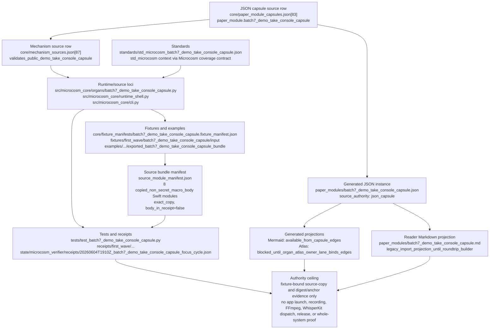

# Batch 7 Demo Take Console Capsule

This page documents the public-safe Swift source-body import for the Demo
Take Console capture app as a mechanism-backed Microcosm paper-module capsule.
This Markdown is a reader projection; source authority now lives in
`core/paper_module_capsules.json` and the resolving mechanism row lives in
`core/mechanism_sources.json`.

The organ capsule verifies the SwiftPM app target, exact copied source-body
digests, helper-bridge command contracts, recording state gates, hotkey and
audio-meter guards, and the transcription payload builder. It does not launch
the app, start FFmpeg, access screen or microphone devices, export recording
sessions, or dispatch WhisperKit.

Authority ceiling: source-open capture-console mechanics over public fixtures only; not recording authority, release approval, or proof of complete UI coverage.

## Shape

This module is a reader projection over a JSON-capsule source row, not an
authority source by itself. The source row is
`core/paper_module_capsules.json::paper_modules[83:paper_module.batch7_demo_take_console_capsule]`;
the resolving source mechanism is
`core/mechanism_sources.json::mechanisms[87:mechanism.batch7_demo_take_console_capsule.validates_public_demo_take_console_capsule]`.
The generated instance is
`paper_modules/batch7_demo_take_console_capsule.json`, which carries
`paper_module_payload.source_authority: json_capsule`.



The runtime organ is the executable validation locus: it names six expected
engines, six negative cases, source-copy anchor checks, body-free receipt
rules, and the local command/card surfaces. `runtime_shell.py` exposes the
bundle validation step, while `cli.py` routes the capsule command. The fixture
manifest binds fixture input to the exported source bundle manifest; the source
bundle manifest records eight exact-copy public Swift modules with
`body_in_receipt: false` and digest matches.

Validation receipts keep the proof narrow. The focused verifier receipt reports
fixture and bundle passes, tampered copied-source digest/anchor swaps blocked,
focused pytest passing, and private-token scan matches at zero for the scratch
cycle. Those receipts support reader walkability and public-safe source-copy
evidence only. They do not admit an accepted organ/card edge, clear the Atlas
block, authorize recording or device access, dispatch FFmpeg or WhisperKit, or
make a release/publication claim.

## Structured Lattice Bindings

These bindings are reader-visible projections over the JSON capsule source row.
The generated JSON row now carries `source_authority: json_capsule`, a resolved
mechanism subject, and a resolved code locus. Its generated Mermaid projection
is available from capsule edges; its generated Atlas projection remains blocked
until the organ-atlas owner lane admits or links the corresponding organ edge.

- paper-module id:
  `paper_module.batch7_demo_take_console_capsule`.
- source row:
  `core/paper_module_capsules.json::paper_modules[83:paper_module.batch7_demo_take_console_capsule]`.
- resolving mechanism:
  `mechanism.batch7_demo_take_console_capsule.validates_public_demo_take_console_capsule`.
- resolved code locus:
  `src/microcosm_core/organs/batch7_demo_take_console_capsule.py`.
- governing standard:
  `standards/std_microcosm_batch7_demo_take_console_capsule.json`.
- fixture manifest:
  `core/fixture_manifests/batch7_demo_take_console_capsule.fixture_manifest.json`.
- validation tests:
  `tests/test_batch7_demo_take_console_capsule.py`.
- copied source manifest:
  `examples/batch7_demo_take_console_capsule/exported_batch7_demo_take_console_capsule_bundle/source_module_manifest.json`.
- existing generated inbound references:
  `paper_module.batch6_unsurfaced_primitives_capsule` and
  `paper_module.batch8_audio_level_rms_port` already point at this paper-module
  id; this page does not create new outbound edges.

The safe JSON-capsule splice, once the shared lattice writers release, is to
carry the organ, standard, fixture manifest, validation tests, and copied
source manifest as explicit source rows rather than inferring them from this
Markdown.

## Reader Evidence Routing

Readers can walk the local evidence without private payloads:

- `src/microcosm_core/organs/batch7_demo_take_console_capsule.py` defines the
  organ id, fixture id, validator id, authority ceiling, anti-claim, expected
  engines, negative cases, and required anchors for the eight imported Swift
  source files.
- `standards/std_microcosm_batch7_demo_take_console_capsule.json` records the
  same authority ceiling, `body_in_receipt: false`, the required source refs,
  the SwiftPM witness command, negative-case count, and
  `copied_non_secret_macro_body` import class.
- `core/fixture_manifests/batch7_demo_take_console_capsule.fixture_manifest.json`
  binds the fixture input to the exported source bundle manifest.
- `tests/test_batch7_demo_take_console_capsule.py` validates the engine set,
  exact source-body copy digests, required anchors, negative cases,
  no-private-body card shape, and absence of local absolute paths in receipts.
- `receipts/import_binding/partial_import_binding_report.json` records the
  acceptance receipt, fixture manifest, source bundle manifest, test file, and
  organ source refs for this capsule.

This routing is public-safe because receipts and cards keep source bodies out
of receipt payloads. It is not evidence for app launch, recording permission,
provider/model dispatch, release approval, or whole-UI coverage.

## Public Site Availability Boundary

The public site can expose this page and its generated coverage-gap row as
reader drilldown material. The site must not treat this Markdown as a source
authority flip, hand-authored generated HTML, a release card, or proof that the
paper module has closed its required subject gap. The availability value is
walkability: readers can reach the local organ, standard, fixture, manifest,
tests, and receipts that define the safe re-entry packet.

## Public-Safe Body Handling

This page may name Swift source paths, helper-bridge command contracts,
recording state gates, hotkey and audio-meter guards, transcription payload
builder refs, fixture ids, standard and test files, receipt paths, source
manifest digests, and authority ceilings. It must not embed recordings, screen
or microphone data, FFmpeg output, WhisperKit payloads, device/session state,
provider payloads, raw operator voice, private source bodies, or live app state.

Copied public-safe Swift bodies stay in the bundle source-module area. Reader
cards, receipts, generated site projections, and this Markdown should represent
them by refs, hashes, line counts, required anchors, booleans, summaries, and
explicit boundaries rather than by duplicating private or live capture payloads.

## Reader Proof Boundary

Read this page as a public reader projection over a mechanism-backed Microcosm
paper-module row. The generated JSON row now reports
`paper_module_payload.source_authority: json_capsule`, so the generated Mermaid
projection may leave the required-subject-gap state through the resolving
mechanism edge. The generated Atlas projection remains blocked until an
organ-atlas owner lane binds an accepted organ/card edge.

The useful proof remains bounded: the page names the JSON source row, resolving
mechanism, runtime source locus, source manifest, focused tests, validation
receipts, and authority ceiling. It does not claim accepted-organ authority,
app launch authority, recording authority, model dispatch, publication, release,
or whole-system correctness.

The validation receipts prove body-free fixture replay, digest anchors, and
negative-case behavior only within this proof boundary.

## Claim Ceiling

This paper module can claim that the Demo Take Console capsule has a walkable
reader route to its organ file, standard, fixture manifest, source manifest,
focused tests, receipt path, public-safe Swift source-copy evidence, resolving
mechanism row, and generated Mermaid availability. It cannot claim
accepted-organ authority, Atlas-card linkage, app launch, recording permission,
device access, FFmpeg execution, WhisperKit/model dispatch, release approval,
or complete UI coverage.

The generated sidecar is now sourced from the JSON capsule row. A green fixture
run or focused pytest receipt proves only bounded replay, source-copy
provenance, body hygiene, and negative-case behavior for the public-safe
fixture. The remaining authority ceiling can only rise through a separate
organ-atlas owner lane that binds accepted organ/card edges; this paper module
does not create those edges by prose.

## JSON Capsule Binding

`paper_module.batch7_demo_take_console_capsule` is now present in
`core/paper_module_capsules.json` with
`paper_module_payload.source_authority: json_capsule`. Its subject is the
resolving mechanism
`mechanism.batch7_demo_take_console_capsule.validates_public_demo_take_console_capsule`,
and its code locus is
`src/microcosm_core/organs/batch7_demo_take_console_capsule.py`.

This Markdown is a reader projection over that JSON row. The generated Mermaid
projection is available from capsule edges. The generated Atlas projection is
still `blocked_until_organ_atlas_owner_lane_binds_edges`, because this slice
does not admit an accepted organ or mutate organ-atlas authority.

## JSON Capsule Boundary

This paper module is now a JSON-capsule-backed source row in the generated
paper-module corpus. `paper_module_payload.source_authority` is
`json_capsule`, the Mermaid projection is generated from capsule edges, and the
Atlas projection remains honestly blocked until organ-atlas authority binds
the corresponding edge. The copied Swift source-body evidence makes the
capture-console mechanics inspectable to readers, but it is still bounded to
fixture replay and body-free receipts.

Re-entry is exact for the remaining gap: after an accepted organ/card edge is
admitted by the organ-atlas owner lane, regenerate the doctrine projections
with `scripts/build_doctrine_projection.py --write-paper-module-corpus` and
the doctrine-lattice builder, then verify the generated Atlas status leaves
`blocked_until_organ_atlas_owner_lane_binds_edges`. Until that happens, this
Markdown explains the proof boundary; it does not source Atlas cards,
recording authority, device access, WhisperKit dispatch, release claims, or
aggregate doctrine-lattice coherence by itself.

## Capsule Re-entry Packet

- current source authority: generated JSON reports
  `paper_module_payload.source_authority: json_capsule`.
- generated row source ref:
  `paper_modules/batch7_demo_take_console_capsule.md`.
- source row ref:
  `core/paper_module_capsules.json::paper_modules[83:paper_module.batch7_demo_take_console_capsule]`.
- resolving mechanism:
  `mechanism.batch7_demo_take_console_capsule.validates_public_demo_take_console_capsule`.
- current generated projection status: Mermaid `available_from_capsule_edges`;
  Atlas `blocked_until_organ_atlas_owner_lane_binds_edges`.
- resolved code locus:
  `src/microcosm_core/organs/batch7_demo_take_console_capsule.py`.
- remaining authority edge: no accepted organ/card edge is admitted by this
  slice, so the Atlas projection remains blocked for the organ-atlas owner lane.
- re-entry condition: after organ-atlas admission lands, regenerate the
  paper-module corpus and doctrine lattice, then verify the generated Atlas
  projection leaves `blocked_until_organ_atlas_owner_lane_binds_edges`.
- authority ceiling: this Markdown is a reader projection over JSON capsule
  authority; it does not source accepted-organ edges, Atlas cards, app launch,
  recording authority, WhisperKit dispatch, release claims, or aggregate
  doctrine-lattice coverage.

## Validation Receipt Path

Reader-verifiable fixture command, run from `microcosm-substrate/`:

```bash
PYTHONPATH=src ../repo-python -m microcosm_core.organs.batch7_demo_take_console_capsule run \
  --input fixtures/first_wave/batch7_demo_take_console_capsule/input \
  --out receipts/first_wave/batch7_demo_take_console_capsule \
  --acceptance-out receipts/acceptance/first_wave/batch7_demo_take_console_capsule_fixture_acceptance.json \
  --card
```

The fixture run writes
`receipts/first_wave/batch7_demo_take_console_capsule/batch7_demo_take_console_capsule_result.json`,
`receipts/first_wave/batch7_demo_take_console_capsule/batch7_demo_take_console_capsule_validation_receipt.json`,
and
`receipts/first_wave/batch7_demo_take_console_capsule/batch7_demo_take_console_capsule_board.json`;
the acceptance file records fixture acceptance. The exported-bundle re-run
uses the `validate-bundle` action over
`exported_batch7_demo_take_console_capsule_bundle`, and any bundle-validation
receipts stay under
`receipts/first_wave/batch7_demo_take_console_capsule/bundle_validation/`.

This receipt path is reader-verifiable evidence only. It does not flip
organ-atlas status, launch the app, start capture devices, run FFmpeg, dispatch
WhisperKit, or aggregate doctrine-lattice coverage.

## Prior Art Grounding

The organ borrows from desktop media-capture and local transcription tooling:
capture apps commonly combine OS capture APIs, command-line media encoders,
recording state gates, hotkeys, level meters, and transcription handoff
contracts. Useful anchors include:

- Apple's [ScreenCaptureKit](https://developer.apple.com/documentation/ScreenCaptureKit)
  framework for selecting and streaming screen/audio content in macOS apps.
- [FFmpeg](https://www.ffmpeg.org/ffmpeg.html), the established command-line
  media recording, conversion, and streaming toolchain.
- [WhisperKit](https://github.com/argmaxinc/WhisperKit), an on-device speech
  recognition toolkit for Apple Silicon.

Microcosm borrows the capture-console contract shape but keeps the exercise at
source-body and fixture validation. The capsule does not start capture devices,
launch FFmpeg, invoke WhisperKit, or claim recording/release authority.
