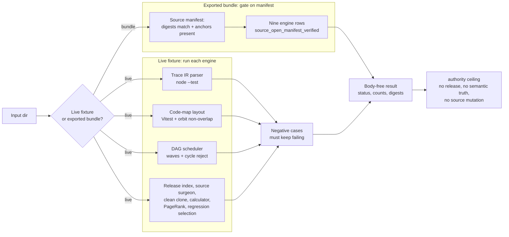

# Batch 7 Macro Engines Capsule

## TLDR

`batch7_macro_engines_capsule` imports the Batch-7 macro engines as public-safe
source bodies and runs focused exercises around them. It is a real-substrate
capsule: source copies, original JS/TS witnesses, deterministic Python
exercises, negative cases, digest checks, and fenced claims.

## What It Makes Visible

- `tools/agent_trace_structurer/parser.mjs` as a trace-IR/edit-claim witness
  with `node --test parser.test.mjs`.
- `system/server/ui/src/lib/codemap/` as a code-map layout witness with Vitest.
- DAG wave scheduling, source indexing, patch context validation, network
  blocking, robust numeric center/scale, PageRank mass preservation, and
  never-empty regression-test selection.

## What Each Exercise Proves

Each engine has a single deterministic check with a known answer, plus a paired
negative case that must keep failing. The exercises are concrete:

- **Trace IR parser** (`agent_trace_ir_compiler`). Runs `node --test
  parser.test.mjs` against the copied parser. The paired negative case is a
  commit claim with no diff evidence, which the parser's own test rejects, so a
  pass means the edit-claim gate is intact rather than merely that the file
  copied.
- **Code-map layout** (`codemap_orbit_layout`). Runs the Vitest suite for the
  layout module and, in process, places five nodes on an orbit and measures
  every pair distance. The pass condition requires zero circle overlaps, so the
  layout proves geometric non-collision, not route meaning.
- **DAG scheduler** (`constitutional_dag_kernel`). Calls `compute_waves` on a
  six-node graph and checks the schedule is exactly `[["a","f"], ["b","c"],
  ["d"], ["e"]]`. A two-node cycle must raise, and an impure config path must be
  flagged, so the kernel proves wave ordering and cycle rejection together.
- **Release-root index** (`release_root_compiler`). Parses the copied module's
  AST and confirms the expected report-building functions exist and that a
  missing-reference count is reported. This is source indexing, not release
  approval.
- **Source surgeon** (`source_surgeon_patch`). Applies a one-line unified diff
  and checks the result is exactly `a = 'B'`. A diff whose context does not
  match must raise, and broken Python must fail to parse, so the engine proves
  patch-context and syntax validation, not semantic correctness.
- **Clean clone** (`hermetic_clean_clone`). Temporarily replaces the socket
  factory and confirms an outbound connection raises a network-disabled error.
  It proves a hermetic baseline, not complete sandboxing.
- **Robust calculator** (`calculator_standard_actor`). Feeds
  `[1, 2, 3, 4, 5, 100]` to the robust centre/scale routine. The robust centre
  stays at `3.5` while the naive mean is dragged above `19`, so the outlier is
  resisted. It is a numeric primitive, not market data or investment advice.
- **PageRank ranker** (`personalized_pagerank_ranker`). Ranks a four-node graph
  and checks the score mass sums to `1.0`; an unknown source node must return an
  empty map. It proves the rank invariant and missing-source refusal, not
  semantic understanding.
- **Regression selection** (`regression_test_selection`). Confirms the impacted-
  test selector never returns an empty set: an empty selection must fall back to
  a non-empty bundle. It proves the never-empty contract, not that the selected
  tests are sufficient.

When the input is the exported source-open bundle rather than the live fixture,
the same nine engine rows are gated on the copied source manifest instead:
every expected digest must match and every required anchor must be present
before any row passes. The exercises stay body-free throughout; receipts carry
status, counts, digests, and refs, never the copied source or command output.

## First Command

```bash
cd microcosm-substrate
PYTHONPATH=src ../repo-python -m microcosm_core.organs.batch7_macro_engines_capsule run \
  --input fixtures/first_wave/batch7_macro_engines_capsule/input \
  --out /tmp/microcosm-batch7-macro-engines-first-command \
  --acceptance-out /tmp/microcosm-batch7-macro-engines-first-command-acceptance.json \
  --card
```

## Claim Ceiling

This capsule is not release approval, hosted-public authority, semantic truth,
investment advice, a complete sandbox, or proof that selected tests are
sufficient. It excludes raw operator transcripts, provider/browser state,
wallet/account state, credentials, and live market fetches.

## Prior Art Grounding

The organ is grounded in trace instrumentation, graph analysis, and regression
selection practice: parse execution traces into structured spans, project code
or route graphs into navigable layouts, preserve graph-rank invariants, and
choose focused tests without claiming sufficiency. Relevant anchors include:

- [OpenTelemetry](https://opentelemetry.io/docs/), especially traces/spans as a
  vendor-neutral model for representing units of work and their relationships.
- [D3 force layouts](https://github.com/d3/d3-force), a common graph layout
  pattern for visualizing networks and hierarchies.
- [NetworkX PageRank](https://networkx.org/documentation/stable/reference/algorithms/generated/networkx.algorithms.link_analysis.pagerank_alg.pagerank.html),
  which documents the PageRank family for graph-link analysis.

Microcosm borrows the structured-trace, graph-layout, and invariant-checking
shape across its mixed Batch-7 engines. The capsule remains a bundle of focused
source witnesses and deterministic exercises; it is not a complete sandbox,
semantic truth engine, or proof that selected tests are sufficient.

## Source Body Imports

The source-module manifest at
`examples/batch7_macro_engines_capsule/exported_batch7_macro_engines_capsule_bundle/source_module_manifest.json`
lists the exact copied macro bodies and required anchors. Receipts store
digests and counts, not source bodies.

## Purpose

This module is the reader-facing instrument for the accepted
`batch7_macro_engines_capsule` organ. Its source authority is the JSON capsule
row in `core/paper_module_capsules.json`; this Markdown explains the proof
boundary for a cold reader and points back to the runtime organ, copied source
manifest, and focused tests.

The organ answers one narrow question: do nine unrelated macro engines, copied
out of the larger system as public-safe source, still behave the way their own
tests and invariants say they should? Rather than describe them in prose, the
capsule runs each one. A trace-IR parser is checked by its own Node test
runner; a code-map layout is checked by its Vitest suite; a dependency-graph
scheduler, a robust numeric scorer, a PageRank ranker, a patch applier, a
network-isolation guard, an AST source index, and a regression-test selector
are each driven through a small deterministic exercise with a known correct
answer.

What is worth noting is the mix. Most validators in this set check one shape of
evidence. This one deliberately binds several kinds under a single fixture and a
single authority ceiling: an external JavaScript test process, an external
TypeScript test process, in-process Python function calls, and static AST
reads. The point is not that any one engine is impressive in isolation. It is
that nine engines with quite different runtimes can be exercised together,
each with a concrete pass condition, while every exercise stays below release,
semantic-truth, and source-mutation authority.

The failure mode this guards against is the comfortable assumption that copied
code still works. A source body can be copied faithfully, pass a digest check,
and still be broken or subtly different from the original. The capsule refuses
to treat a digest match as behaviour: each engine has to produce the expected
output, and each negative case has to keep failing, before the row is allowed
to pass.

## JSON Capsule Binding

- Source row: `core/paper_module_capsules.json::paper_modules[71:paper_module.batch7_macro_engines_capsule]`
- `source_authority: json_capsule`
- This Markdown is a reader projection. The generated Mermaid projection and
  generated Atlas projection are navigation surfaces derived from the capsule
  edges; they are not source authority.
- The Atlas card is linked from capsule edges, and the Mermaid projection is
  available from the same fixture-bound subject, principle, axiom, dependency,
  and code-locus row set.
- The proof boundary is the Batch-7 public source-body import fixture,
  deterministic macro-engine exercises, negative cases, digest checks, and
  validation receipts.
- The authority ceiling excludes live macro execution authority,
  private-root equivalence, source mutation, release, provider dispatch,
  selected-test sufficiency proof, and whole-system correctness.

## Shape



## Structured Lattice Bindings

- Subject: `organ:batch7_macro_engines_capsule`
- Mechanism validation:
  `mechanism.batch7_macro_engines_capsule.validates_public_macro_engines_capsule`
- Concept bundle: `concept.import_projection_and_drift_control_bundle`
- Code locus: `src/microcosm_core/organs/batch7_macro_engines_capsule.py`
- Governing principles: `P-2`, `P-5`, `P-9`, `P-15`
- Axiom boundaries: `AX-4`, `AX-8`, `AX-10`, `AX-11`
- Sibling modules: `paper_module.macro_projection_import_protocol`,
  `paper_module.agent_route_observability_runtime`,
  `paper_module.computer_use_action_trace_replay`

The generated JSON row contributes 15 capsule-derived edges: two explained
subject edges, one concept edge, one code-locus edge, four principle edges,
four axiom edges, and three sibling paper-module dependency edges. There are no
unpopulated selective relations in the generated row. Future edge changes must
come from `core/paper_module_capsules.json` and builder regeneration, not from
Markdown inference.

## Reader Evidence Routing

Start from the organ source when checking behavior:

- `EXPECTED_NEGATIVE_CASES` names the rejected cases.
- `AUTHORITY_CEILING` names the forbidden claims.
- `_source_open_bundle_exercises` and `_evaluate` assemble the accepted public
  witness set.
- `run_batch7_bundle` and `result_card` expose the reproducible command and
  body-free summary.

## Reader Proof Boundary

This page is a public reader projection over a JSON-capsule-backed Microcosm
paper-module row. The useful proof is intentionally narrow: selected Batch-7
macro source bodies are copied into a public bundle, checked by digest and
anchors, exercised through deterministic public fixtures, and summarized in
body-free receipts. It does not prove semantic truth, selected-test
sufficiency, sandbox completeness, private-root equivalence, hosted release
readiness, provider dispatch, source mutation authority, or whole-system
correctness.

## Public Site Availability Boundary

The public Microcosm site may expose this page as a reader route to the
Batch-7 macro-engines capsule: capsule source refs, digest rows, anchor names,
negative-case labels, generated edge counts, focused validation paths, and
authority ceilings are public-safe because they describe the standalone
`microcosm-substrate` artifact and body-free receipts.

The site must not present that exposure as live macro execution authority,
semantic truth, selected-test sufficiency, sandbox completeness, private-root
equivalence, provider dispatch, source mutation approval, release approval, or
generated-lattice source authority.

## Public-Safe Body Handling

Receipts may expose source refs, digests, anchor names, exercise names,
negative-case outcomes, acceptance JSON, generated-row status, and validation
verdicts. They must not inline copied macro source bodies, private macro-root
paths, provider payloads, credential material, raw operator transcripts,
browser/session state, live market data, or raw command-output bodies.
Exact-copy body drift belongs to the source-open refresh lane, not to Markdown
prose.

## Validation Receipt Path

Reader-verifiable commands, run from the `microcosm-substrate/` public root:

```bash
PYTHONPATH=src ../repo-python -m microcosm_core.organs.batch7_macro_engines_capsule run \
  --input fixtures/first_wave/batch7_macro_engines_capsule/input \
  --out /tmp/microcosm-batch7-macro-engines-fixture-vrp \
  --acceptance-out /tmp/microcosm-batch7-macro-engines-fixture-acceptance.json \
  --card
PYTHONPATH=src ../repo-python -m microcosm_core.organs.batch7_macro_engines_capsule run-batch7-bundle \
  --input examples/batch7_macro_engines_capsule/exported_batch7_macro_engines_capsule_bundle \
  --out /tmp/microcosm-batch7-macro-engines-bundle-vrp \
  --acceptance-out /tmp/microcosm-batch7-macro-engines-bundle-acceptance.json \
  --card
PYTHONPATH=src ../repo-python -m pytest -p no:cacheprovider --basetemp=/tmp/microcosm-batch7-macro-engines-tests -q tests/test_batch7_macro_engines_capsule.py
PYTHONPATH=src ../repo-python scripts/build_doctrine_projection.py --check-paper-module-corpus
PYTHONPATH=src ../repo-python scripts/build_doctrine_projection.py --check
```

The fixture command writes the Batch-7 macro-engine receipt and acceptance JSON.
The exported-bundle command validates copied trace, codemap, DAG, source-rank,
and regression-selection witnesses without emitting private bodies. The focused
test covers the runtime organ, exported bundle shape, exact-copy source imports,
negative cases, card body omission, and numeric dependencies. The corpus and
projection checks prove only that the generated paper-module instance remains
fresh for this capsule-backed Markdown state.

This receipt path is public fixture evidence only. It does not prove semantic
truth, selected-test sufficiency, sandbox completeness, private-root
equivalence, release readiness, provider dispatch, source mutation, or
whole-system correctness.

## Authority Ceiling

The module can support only fixture-bound public source-body import evidence and
deterministic exercise receipts. It cannot authorize provider dispatch, source
mutation, release, publication, investment advice, private-root equivalence, or
whole-system correctness.
