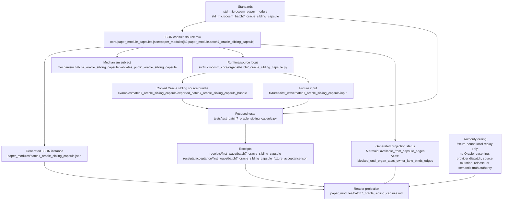

# Batch 7 Oracle Sibling Capsule

## Purpose

This organ imports the real deterministic Oracle sibling substrate into Microcosm as an executable public-safe capsule. It covers `tools/oracle/subject_index.py`, `tools/oracle/subject_snapshot.py`, `tools/oracle/truth_diff_macro.py`, deterministic `tools/oracle/run_quartet.py` planning/materialization, and focused original pytest witnesses.

## Shape



The source of record is the JSON capsule row
`core/paper_module_capsules.json::paper_modules[82:paper_module.batch7_oracle_sibling_capsule]`.
The generated JSON instance at
`paper_modules/batch7_oracle_sibling_capsule.json` carries
`paper_module_payload.source_authority: json_capsule` and derives its
`relationships.edges` from that capsule, including the mechanism subject,
concept, principles, axioms, and resolved code locus. This Markdown page is
therefore a reader projection over the capsule and generated instance; it is
not an independent authority surface.

The governing standard stack is two-layered. The general paper-module contract
is `standards/std_microcosm_paper_module.json`: JSON capsules carry typed
subjects and code loci, while Markdown, Mermaid, and Atlas surfaces are
projections. The local capsule standard is
`standards/std_microcosm_batch7_oracle_sibling_capsule.json`, which requires
exact public-safe Oracle source copies, direct execution of subject-index,
subject-snapshot, truth-diff, and quartet-plan paths, an original pytest
witness, explicit exclusion of `run_missing_quartet` and `GodModeEngine`,
negative cases, and the local authority ceiling.

The runtime locus is
`src/microcosm_core/organs/batch7_oracle_sibling_capsule.py`, especially the
capsule row's resolved symbols `_subject_index_engine`,
`_subject_snapshot_engine`, `_truth_diff_macro_engine`,
`_quartet_repair_engine`, `_run_original_pytest_witness`, `_evaluate`, `run`,
`run_batch7_oracle_sibling_bundle`, `result_card`, `EXPECTED_ENGINES`,
`EXPECTED_NEGATIVE_CASES`, `AUTHORITY_CEILING`, and `main`. The reader-facing
source bundle lives at
`examples/batch7_oracle_sibling_capsule/exported_batch7_oracle_sibling_capsule_bundle/`
with `source_module_manifest.json`; the fixture entrypoint is
`fixtures/first_wave/batch7_oracle_sibling_capsule/input/batch7_oracle_sibling_exercise_manifest.json`.

Validation is grounded in `tests/test_batch7_oracle_sibling_capsule.py`, the
fixture receipts under `receipts/first_wave/batch7_oracle_sibling_capsule/`,
the bundle-validation receipts under
`receipts/first_wave/batch7_oracle_sibling_capsule/bundle_validation/`, and the
acceptance receipt
`receipts/acceptance/first_wave/batch7_oracle_sibling_capsule_fixture_acceptance.json`.
Generated lattice status is intentionally split: the capsule-backed Mermaid
projection is `available_from_capsule_edges`, while the Atlas projection is
`blocked_until_organ_atlas_owner_lane_binds_edges`. That split is part of the
truthful authority ceiling: this module proves a fixture-bound, public-safe,
local Oracle sibling source-import replay and body-free receipt path only. It
does not prove Oracle reasoning authority, semantic truth authority, provider
dispatch, bridge-backed reasoning, `GodModeEngine` invocation, source mutation,
publication approval, release approval, private-root equivalence, complete
Oracle coverage, accepted-organ authority, or whole-system correctness.

## Imported Substrate

- `oracle_subject_index_grounding_map` executes `tools.oracle.subject_index.run` against a temporary subject run and verifies admissible versus contextual grounding.
- `oracle_subject_snapshot_hydration` executes `tools.oracle.subject_snapshot.run` and verifies subject artifact provenance hydration.
- `oracle_truth_diff_macro_series_delta` executes `tools.oracle.truth_diff_macro.run` and verifies changed, new, and dropped macro series.
- `oracle_quartet_repair_alias_plan` executes `run_quartet.build_quartet_repair_plan` and `materialize_missing_aliases` on a temporary truth run.
- `oracle_original_pytest_witness` runs the focused original pytest witness for the Oracle v1 tools and quartet planner tests.

## Authority Ceiling

This is a deterministic local substrate capsule. It does not invoke `run_missing_quartet`, `GodModeEngine`, bridge-backed reasoning, browser access, provider dispatch, release authority, source mutation authority, or semantic truth authority.

## Reader Proof Boundary

Read this page as a public reader projection over a Microcosm JSON capsule row.
The generated JSON row now reports
`paper_module_payload.source_authority: json_capsule`, and the source row is
`core/paper_module_capsules.json::paper_modules[82:paper_module.batch7_oracle_sibling_capsule]`.
The useful proof boundary is still narrow: this page can point readers to the
mechanism subject, source locus, exported public-safe bundle, original pytest
witnesses, validation receipts, generated Mermaid projection, and generated
Atlas projection status without claiming accepted-organ authority, semantic
truth authority, provider dispatch, source mutation authority, publication
authority, release authority, or whole Oracle coverage.

## Claim Ceiling

This paper module can claim mechanism-backed JSON capsule authority for the
Oracle sibling source-import slice and a walkable reader route to deterministic
subject-index, subject-snapshot, truth-diff, quartet-plan, original-pytest
witness, standard, fixture, source manifest, and receipt evidence. It cannot
claim accepted-organ authority, linked Atlas-card authority, semantic truth
authority, bridge-backed reasoning, provider dispatch, source mutation
authority, release approval, or whole Oracle coverage.

The generated sidecar is rebuilt from a JSON capsule row with one resolved
mechanism subject and a resolved code locus. A green fixture run or focused
pytest receipt proves only bounded local replay, source-copy provenance, body
hygiene, negative-case behavior, and body-free receipts for the public-safe
Oracle sibling slice. Only an accepted-organ owner can raise the Atlas ceiling
from a blocked generated Atlas projection to linked organ-atlas authority.

## JSON Capsule Binding

This Markdown is a reader projection, not source authority. The source
authority row is the JSON capsule in
`core/paper_module_capsules.json::paper_modules[82:paper_module.batch7_oracle_sibling_capsule]`,
and the generated sidecar at
`paper_modules/batch7_oracle_sibling_capsule.json` is rebuilt from that row.
Its current binding facts are:

- source authority: `source_authority: json_capsule`.
- generated JSON sidecar: `paper_modules/batch7_oracle_sibling_capsule.json`.
- subject:
  `mechanism.batch7_oracle_sibling_capsule.validates_public_oracle_sibling_capsule`.
- resolved code locus:
  `src/microcosm_core/organs/batch7_oracle_sibling_capsule.py`.
- generated Mermaid projection: `available_from_capsule_edges`.
- generated Atlas projection:
  `blocked_until_organ_atlas_owner_lane_binds_edges`.

The generated Mermaid projection is available from the capsule edge. The
generated Atlas projection remains blocked from accepted-organ linkage because
this slice deliberately did not add an accepted-organ atlas row. That blocked
Atlas status is part of the authority ceiling, not a contradiction.

## JSON Capsule Boundary

This paper module is JSON-capsule-backed in the generated paper-module corpus:
`paper_module_payload.source_authority` is `json_capsule`, Mermaid edges are
available from the mechanism subject, and Atlas linkage remains blocked until
an accepted-organ owner admits the organ-side authority. The deterministic
Oracle-source evidence makes the sibling substrate inspectable to readers, but
it still does not provide semantic truth authority, provider dispatch, release
claims, source mutation authority, or aggregate doctrine-lattice correctness.

## Structured Lattice Bindings

The generated sidecar `paper_modules/batch7_oracle_sibling_capsule.json`
currently binds the mechanism subject, code locus, and source authority from
`core/paper_module_capsules.json::paper_modules[82:paper_module.batch7_oracle_sibling_capsule]`:

- paper module id: `paper_module.batch7_oracle_sibling_capsule`.
- current source authority:
  `paper_module_payload.source_authority: json_capsule`.
- mechanism subject:
  `mechanism.batch7_oracle_sibling_capsule.validates_public_oracle_sibling_capsule`.
- reader runtime locus:
  `src/microcosm_core/organs/batch7_oracle_sibling_capsule.py`.
- focused validator:
  `tests/test_batch7_oracle_sibling_capsule.py`.
- exported source snapshot bundle:
  `examples/batch7_oracle_sibling_capsule/exported_batch7_oracle_sibling_capsule_bundle/`.
- generated Mermaid projection: `available_from_capsule_edges`.
- generated Atlas projection:
  `blocked_until_organ_atlas_owner_lane_binds_edges`.

Generated lattice surfaces remain projections. They should be refreshed only
through the doctrine projection builder after source authority changes; this
Markdown does not hand-author Mermaid edges, Atlas cards, coverage counts, or
entry-card status.

## Reader Evidence Routing

| Evidence surface | Authority ref | What it supports | Boundary |
|---|---|---|---|
| Runnable organ | `src/microcosm_core/organs/batch7_oracle_sibling_capsule.py` | The Microcosm capsule executes deterministic subject-index, subject-snapshot, truth-diff, quartet-plan, and original-pytest witness paths. | Code locus evidence only; not a doctrine-lattice subject edge until JSON capsule admission. |
| Standard | `standards/std_microcosm_batch7_oracle_sibling_capsule.json` | Required exact public-safe source copies, direct oracle tool execution, original pytest witness, run-missing exclusion, negative cases, and authority ceiling. | Standard requirements are local capsule requirements, not release authority. |
| Focused tests | `tests/test_batch7_oracle_sibling_capsule.py` | Runtime shape, exact source-module copies, private-body omission, and negative-case stability. | Focused witness only; not whole Oracle coverage. |
| Fixture manifest | `core/fixture_manifests/batch7_oracle_sibling_capsule.fixture_manifest.json` | Fixture root, exported bundle, and source manifest routing for reproducible local runs. | Fixture availability is not semantic truth authority. |
| Source manifest | `examples/batch7_oracle_sibling_capsule/exported_batch7_oracle_sibling_capsule_bundle/source_module_manifest.json` | Exact-copy hashes and required anchors for public-safe Oracle sibling source modules. | Non-secret copied bodies remain source evidence; receipts keep bodies out. |
| Acceptance receipts | `receipts/acceptance/first_wave/batch7_oracle_sibling_capsule_fixture_acceptance.json` and `receipts/first_wave/batch7_oracle_sibling_capsule/` | Prior fixture acceptance, board, validation receipt, and bundle validation outputs. | Receipt presence does not flip Mermaid/Atlas status or aggregate coverage. |

The selective relation boundary is intentionally narrow: this Markdown names
walkable source routes for readers, but it does not infer governed concepts,
principles, axioms, dependencies, or code-locus relations into the generated
JSON row. Those edges must be populated through `core/paper_module_capsules.json`
and the doctrine projection builder after an admitted source row exists.

## Public Site Availability Boundary

This module is public-safe to expose as a reader route because the visible page
contains summaries, paths, checks, digests, and authority ceilings rather than
private source bodies, provider payloads, raw operator voice, or browser/wallet
material. Website availability should come from the existing Microcosm site
builder reading this source page and generated Microcosm data; generated site
HTML, object maps, search indexes, and content graphs are projections, not
source authority.

## Capsule Re-entry Packet

- current source authority: generated JSON reports
  `paper_module_payload.source_authority: json_capsule`.
- generated row source ref:
  `core/paper_module_capsules.json::paper_modules[82:paper_module.batch7_oracle_sibling_capsule]`.
- current generated projection status: Mermaid `available_from_capsule_edges`;
  Atlas `blocked_until_organ_atlas_owner_lane_binds_edges`.
- resolved code locus:
  `src/microcosm_core/organs/batch7_oracle_sibling_capsule.py`.
- admitted subject edge:
  `mechanism.batch7_oracle_sibling_capsule.validates_public_oracle_sibling_capsule`.
- remaining re-entry condition: only an accepted-organ owner can add an organ
  subject or linked Atlas card. Until that lands, the mechanism-backed capsule
  is source authority for paper-module edges while accepted-organ authority
  remains false.
- authority ceiling: this Markdown and its generated sidecar provide reader
  evidence, mechanism-backed Mermaid availability, and bounded source-import
  traceability only; they do not source accepted-organ authority, linked Atlas
  authority, semantic truth authority, provider dispatch, release claims,
  source mutation authority, complete Oracle coverage, or aggregate
  doctrine-lattice correctness.

## Validation Receipt Path

Reader-verifiable fixture command, run from `microcosm-substrate/`:

```bash
PYTHONPATH=src ../repo-python -m microcosm_core.organs.batch7_oracle_sibling_capsule run \
  --input fixtures/first_wave/batch7_oracle_sibling_capsule/input \
  --out receipts/first_wave/batch7_oracle_sibling_capsule \
  --acceptance-out receipts/acceptance/first_wave/batch7_oracle_sibling_capsule_fixture_acceptance.json \
  --card
```

The fixture run writes
`receipts/first_wave/batch7_oracle_sibling_capsule/batch7_oracle_sibling_capsule_result.json`,
`receipts/first_wave/batch7_oracle_sibling_capsule/batch7_oracle_sibling_capsule_validation_receipt.json`,
and
`receipts/first_wave/batch7_oracle_sibling_capsule/batch7_oracle_sibling_capsule_board.json`;
the acceptance file records fixture acceptance. The exported-bundle re-run
uses the `run-batch7-oracle-sibling-bundle` action over
`exported_batch7_oracle_sibling_capsule_bundle`, and any bundle-validation
receipts stay under
`receipts/first_wave/batch7_oracle_sibling_capsule/bundle_validation/`.

This receipt path is reader-verifiable evidence only. It does not create
accepted-organ authority, link the Atlas card, invoke bridge-backed reasoning,
dispatch providers, mutate source, promote semantic truth authority, or prove
aggregate doctrine-lattice coverage.

## Prior Art Grounding

The organ is grounded in software-test-oracle and data-provenance practice:
automated checks compare observed outputs against admissible references, while
provenance records make artifact origin and transformation visible. Useful
anchors include:

- Survey work on the [test oracle problem](https://discovery.ucl.ac.uk/1471263/),
  where an oracle determines whether a system's output is acceptable for a
  given test.
- The W3C [PROV](https://www.w3.org/TR/prov-overview/) family, which defines a
  provenance model for describing entities, activities, agents, and derivation.

Microcosm borrows those ideas for deterministic subject indexing, snapshot
hydration, truth-diff series deltas, and quartet alias planning. The capsule
does not promote local oracle checks into semantic truth authority, provider
dispatch, source mutation authority, or release approval.

## Public-Safe Body Handling

The exported bundle carries exact source-body copies under `source_modules/` plus `source_module_manifest.json` with hashes, line counts, required anchors, and secret-exclusion validation. Receipts store summaries, counts, digests, and booleans only; source bodies and stdout/stderr bodies stay out of receipts.
