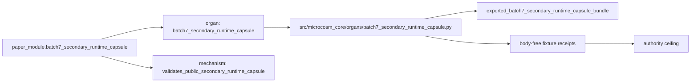

# Batch 7 Secondary Runtime Capsule

`batch7_secondary_runtime_capsule` imports a second Batch-7 runtime slice into
Microcosm. It exact-copies public-safe runtime view-model, lane-progress,
graph-lens, graph-projection, cartography, stockgrid, and Polymarket source
bodies into a public bundle, runs the bounded witness path, and exercises the
Python market/numeric cores against synthetic public fixtures.

## Imported Macro Bodies

- `system/server/ui/src/components/world/agentTraceViewModel.ts`
- `system/server/ui/src/components/world/laneProgress.ts`
- `system/server/ui/src/components/graph/universalGraphLens.ts`
- `system/server/ui/src/components/graph/graphProjection.ts`
- `system/server/ui/src/lib/capCartographyShadowRender.ts`
- their focused Vitest witnesses where public-safe
- `tools/stockgrid/stockgrid.py`
- `tools/polymarket/clob_snapshot.py`
- `tools/polymarket/score.py`
- `tools/polymarket/models.py`

## Purpose

This module is the reader-facing instrument for the accepted
`batch7_secondary_runtime_capsule` organ. Its source authority is the JSON
capsule row in `core/paper_module_capsules.json`; this Markdown explains what a
cold reader may trust from the public secondary-runtime fixture and what remains
out of scope.

## JSON Capsule Binding

- Source row:
  `core/paper_module_capsules.json::paper_modules[95:paper_module.batch7_secondary_runtime_capsule]`
- `source_authority: json_capsule`
- Subject: `organ:batch7_secondary_runtime_capsule`
- Mechanism validation:
  `mechanism.batch7_secondary_runtime_capsule.validates_public_secondary_runtime_capsule`
- Code locus:
  `src/microcosm_core/organs/batch7_secondary_runtime_capsule.py`
- This Markdown is a reader projection. The generated Mermaid projection and
  generated Atlas projection are navigation surfaces derived from the capsule
  edges. They are not source authority.
- The proof boundary is the Batch-7 secondary runtime public source-body import
  fixture, graph/cartography/market exercises, required-anchor checks, negative
  cases, digest checks, and body-free validation receipts.
- The authority ceiling excludes browser/session export, wallet authority, live
  market data, investment advice, provider dispatch, private-root equivalence,
  source mutation, release approval, publication, semantic truth, and complete
  UI or ranking coverage.

## Shape



## Structured Lattice Bindings

- Subject: `organ:batch7_secondary_runtime_capsule`
- Mechanism validation:
  `mechanism.batch7_secondary_runtime_capsule.validates_public_secondary_runtime_capsule`
- Concept bundle: `concept.import_projection_and_drift_control_bundle`
- Code locus: `src/microcosm_core/organs/batch7_secondary_runtime_capsule.py`
- Governing principles: `P-2`, `P-5`, `P-9`, `P-15`
- Axiom boundaries: `AX-4`, `AX-8`, `AX-10`, `AX-11`

The generated JSON row contributes capsule-derived subject, mechanism,
concept, code-locus, principle, and axiom edges. Future edge changes must come
from `core/paper_module_capsules.json` and builder regeneration, not from
Markdown inference.

## Reader Evidence Routing

Start from the organ source when checking behavior:

- `EXPECTED_ENGINES` names the eight fixture engines for trace view-models,
  lane progress, graph lenses, graph projection, cartography, stockgrid, CLOB
  microstructure, and Polymarket scoring.
- `EXPECTED_NEGATIVE_CASES` names the planted regressions for raw-authority
  omission, unknown lane state, hidden descendants, self edges, observe-only
  cartography, extreme stock momentum, sorted-book traps, and resolved-market
  gating.
- `AUTHORITY_CEILING` keeps release, publication, provider/model dispatch,
  browser or wallet access, source mutation, investment advice, semantic-truth
  authority, and test-completeness proof false.
- `run`, `run_batch7_secondary_bundle`, and `result_card` expose the
  reproducible command and body-free summary.

## Reader Proof Boundary

This page is a public reader projection over a JSON-capsule-backed Microcosm
paper-module row. The useful proof is intentionally narrow: selected runtime,
graph, cartography, stockgrid, and Polymarket source bodies are copied into a
public bundle, checked by digest and anchors, exercised through synthetic
runtime and market fixtures, and summarized in body-free receipts. It does not
prove browser/session export, wallet authority, live market data, investment
advice, complete UI/ranking coverage, provider access, private-root
equivalence, source mutation authority, release readiness, publication, or
whole-system correctness.

## Public Site Availability Boundary

The public Microcosm site may expose this page as a reader route to the Batch-7
secondary runtime capsule: capsule source refs, digest rows, witness names,
negative-case labels, generated edge counts, focused validation paths, and
authority ceilings are public-safe because they describe the standalone
`microcosm-substrate` artifact and body-free receipts.

The site must not present that exposure as browser/session export, wallet
authority, live market data, investment advice, provider access, complete
UI/ranking coverage, source mutation approval, release approval, private-root
equivalence, or generated-lattice source authority.

## Public-Safe Body Handling

Receipts may expose source refs, digests, witness names, anchor names,
negative-case outcomes, acceptance JSON, generated-row status, and validation
verdicts. They must not inline copied macro source bodies, private macro-root
paths, provider payloads, credential material, browser/session state, wallet or
account state, live market data, raw UI fixture bodies, or raw command-output
bodies. Exact-copy body drift belongs to the source-open refresh lane, not to
Markdown prose.

## Claim Ceiling

This capsule can claim fixture-bound public source-body import evidence and
secondary runtime/market witness receipts. It cannot authorize browser/session
export, wallet authority, live market data, investment advice, provider
dispatch, source mutation, release, publication, private-root equivalence,
semantic truth, complete UI/ranking coverage, or whole-system correctness.

## Prior Art Grounding

The organ borrows from MVVM/read-model UI architecture, graph visualization,
and market-data board patterns: view models shape raw state for views, graph
projections make relationships inspectable, and market rows must preserve
provider identity and missingness. Useful anchors include:

- Microsoft's [MVVM guidance](https://learn.microsoft.com/en-us/dotnet/architecture/maui/mvvm),
  where view models encapsulate presentation state while separating UI from
  underlying model logic.
- [D3 force layouts](https://github.com/d3/d3-force) as a common graph
  visualization family for networks and hierarchies.
- The CFTC's [prediction markets explainer](https://www.cftc.gov/LearnandProtect/PredictionMarkets),
  as a boundary reference for event-market data and consumer caution.

Microcosm borrows the view-model, graph-projection, and market-diagnostic
shapes, but runs them only over synthetic runtime packets and synthetic market
rows. It is not browser/session export, live market data, trading advice, or
proof that frontend projections are complete.

## Validation Receipt Path

Reader-verifiable fixture command, run from `microcosm-substrate/`:

```bash
PYTHONPATH=src ../repo-python -m microcosm_core.organs.batch7_secondary_runtime_capsule run \
  --input fixtures/first_wave/batch7_secondary_runtime_capsule/input \
  --out receipts/first_wave/batch7_secondary_runtime_capsule \
  --acceptance-out receipts/acceptance/first_wave/batch7_secondary_runtime_capsule_fixture_acceptance.json \
  --card
```

Focused test receipt, run from the repository root:

```bash
PYTHONPATH=microcosm-substrate/src ./repo-pytest \
  microcosm-substrate/tests/test_batch7_secondary_runtime_capsule.py \
  -q --basetemp /tmp/microcosm-batch7-secondary-runtime-tests
```

The fixture run writes
`receipts/first_wave/batch7_secondary_runtime_capsule/batch7_secondary_runtime_capsule_result.json`,
`receipts/first_wave/batch7_secondary_runtime_capsule/batch7_secondary_runtime_capsule_validation_receipt.json`,
and
`receipts/first_wave/batch7_secondary_runtime_capsule/batch7_secondary_runtime_capsule_board.json`;
the acceptance file records fixture acceptance. The exported-bundle re-run uses
the `run-batch7-secondary-bundle` action over
`exported_batch7_secondary_runtime_capsule_bundle`.

This receipt path is public fixture evidence only. It does not export browser
or account sessions, fetch live market data, provide investment advice,
complete UI/ranking coverage, authorize release or publication, or aggregate
doctrine-lattice coverage.
