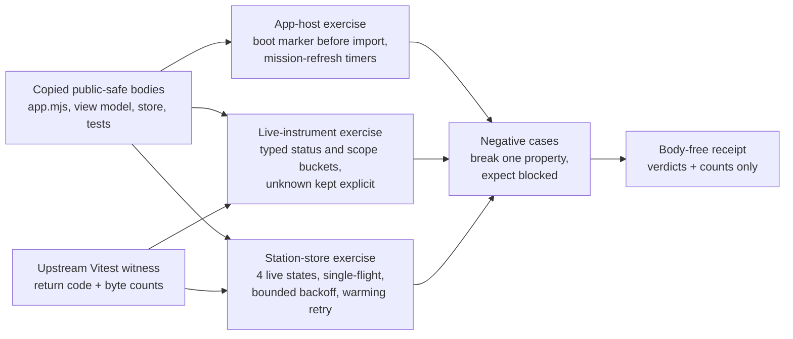

# Batch 7 Station Runtime Capsule

`batch7_station_runtime_capsule` imports the Batch-7 station runtime vein named
in the scout packet after the primary tier: the Agent Trace Structurer
workbench host, the live agent instrument view model, and the Station store
resilience loop.

## Imported Macro Bodies

- `tools/agent_trace_structurer/app.mjs`
- `system/server/ui/src/components/world/agentLiveInstrumentViewModel.ts`
- `system/server/ui/src/stores/useStation.ts`
- `system/server/ui/src/stores/__tests__/useStation.liveUpdates.test.ts`
- `system/server/ui/src/stores/__tests__/useStation.launcher.test.ts`

The original `agentLiveInstrumentViewModel.test.ts` remains the upstream
Vitest witness but is not copied into the public bundle because its fixture
body contains a real workstation path. The receipt records only the witness
return code and byte counts, not the test body or output.

## Public Exercise

```bash
PYTHONPATH=src ../repo-python -m microcosm_core.organs.batch7_station_runtime_capsule run \
  --input fixtures/first_wave/batch7_station_runtime_capsule/input \
  --out /tmp/microcosm-batch7-station-runtime-first-command \
  --acceptance-out /tmp/microcosm-batch7-station-runtime-first-command-acceptance.json \
  --card
```

The organ runs the original Vitest witnesses for the live instrument and
station store, checks the copied `app.mjs` boot-probe and mission-refresh
guards, and preserves body-free receipts.

## How it works

Three exercises run against the copied source bodies, each producing a `pass`
or `blocked` verdict with the evidence it relied on.

`_app_host_exercise` reads `tools/agent_trace_structurer/app.mjs` as text and
locates byte offsets for the boot marker and the first static `import`. It
passes only when `window.__aiwBoot.script_started = true` appears before that
import, when the dropdown state is declared before the freshness logic that uses
it, and when the three mission auto-refresh timer constants are present. The
property under check is ordering: the boot marker has to be set before the
module's own dependencies run, otherwise a host that fails to start would look
the same as one that started cleanly.

`_live_instrument_exercise` reads `agentLiveInstrumentViewModel.ts` and confirms
the typed buckets are complete. Status must keep all six of `pass`, `fail`,
`running`, `blocked`, `observed`, and `unknown`; scope must keep `owned`,
`unowned`, `generated`, and `unknown`. It also checks the stream-health guards
(including the explicit `attentionUnderfiring` signal) and the file-impact
grouping. The point of retaining `unknown` is that an unresolved case stays
labelled as unresolved rather than being rounded up to a green status. This
exercise also folds in the upstream Vitest witness: if that test run did not
pass, the exercise is blocked regardless of the token checks.

`_station_store_exercise` reads `useStation.ts` and looks for the four live-update
states (`live`, `catching_up`, `paused`, `stale`), the bounded backoff schedule
`[500, 1000, 2000, 4000, 4000]`, the warming-retry scheduler, the in-flight map
that enforces single-flight launches, and the stale-timer gate. These keep the
store from issuing duplicate launches under load and from showing live data that
has gone stale.

Each property is paired with a mutation in `EXPECTED_NEGATIVE_CASES`. The organ
copies the bundle to a temporary directory, applies one breaking change, for
example flipping the boot marker to `false` or replacing `return 'unknown'` with
`return 'pass'`, and requires the matching exercise to go blocked. The receipt
records the verdict and byte counts only; copied source bodies, command output,
and test bodies are never inlined.

## Claim Ceiling

This capsule is a public-safe source-body import and witness. It is not a
hosted UI, not browser or operator-thread authority, not provider access, not
release approval, and not proof that all frontend runtime states are covered.

## Prior Art Grounding

The organ is grounded in frontend state-store and observability workbench
patterns: live runtime state is projected into view models, stores preserve a
single inspectable state tree, and instrument panels separate display from
provider authority. Useful anchors include:

- [Redux's single-source-of-truth principle](https://redux.js.org/understanding/thinking-in-redux/three-principles),
  a common reference point for centralized application state.
- React's [`useSyncExternalStore`](https://react.dev/reference/react/useSyncExternalStore),
  which formalizes subscribing React components to external stores.
- [OpenTelemetry](https://opentelemetry.io/docs/) as the broader observability
  lineage for instrumenting and exporting traces, metrics, and logs.

Microcosm borrows the state-store and live-instrument projection shape for the
Station runtime witnesses. The capsule remains body-safe source import and
fixture evidence; it is not a hosted UI, browser/operator authority, provider
access, or proof of complete frontend-state coverage.

## Purpose

Frontend runtime code is usually trusted by eye. A view model that buckets
states, a store that throttles refreshes, a boot script that wires a panel:
these read as plausible and rarely get a check that the safety-relevant shape
survived an edit. This organ exists to give three such pieces of the Station
frontend a mechanical witness, so that a reader can confirm specific properties
hold rather than assume they do.

It answers one question: do the copied Station runtime bodies still carry the
properties that keep their displayed state honest? Three properties are at
issue. The Agent Trace workbench host must set its boot marker before anything
it depends on loads, so a failed boot is visible rather than silent. The live
instrument view model must keep an explicit `unknown` bucket for status and
scope it cannot resolve, instead of quietly defaulting an unresolved case to
`pass`. The Station store must run one launch at a time and retry while the
backend is warming, so a slow start does not stampede the backend or strand the
view in a stale state.

What is unusual is that the organ never runs the UI. It reads the copied source
text and the upstream Vitest witnesses, then asserts the presence and ordering
of named tokens. The interesting move is the set of negative cases: for each
property the organ mutates the copied body to break it, for example renaming the
`unknown` return to `pass` or removing the single-flight map, and requires the
exercise to go blocked. A check that only ever passes proves nothing, so each
guard is paired with a deliberate failure it must catch.

The source authority is the JSON capsule row in
`core/paper_module_capsules.json`; this Markdown explains what a cold reader may
trust from the public Station runtime fixture and what remains out of scope.

## JSON Capsule Binding

- Source row: `core/paper_module_capsules.json::paper_modules[72:paper_module.batch7_station_runtime_capsule]`
- `source_authority: json_capsule`
- This Markdown is a reader projection. The generated Mermaid projection and
  generated Atlas projection are navigation surfaces derived from the capsule
  edges; they are not source authority.
- The Atlas card is linked from capsule edges, and the Mermaid projection is
  available from the same fixture-bound subject, principle, axiom, dependency,
  and code-locus row set.
- The proof boundary is the Batch-7 Station runtime public source-body import
  fixture, app-host/live-instrument/store witnesses, negative cases, digest
  checks, and validation receipts.
- The authority ceiling excludes hosted UI or product-readiness claims,
  private browser, HUD, or session state, source mutation, release, provider
  dispatch, private-root equivalence, and whole-system correctness.

## Shape



## Structured Lattice Bindings

- Subject: `organ:batch7_station_runtime_capsule`
- Mechanism validation:
  `mechanism.batch7_station_runtime_capsule.validates_public_station_runtime_capsule`
- Concept bundle: `concept.agent_reliability_and_safety_validator_bundle`
- Code locus: `src/microcosm_core/organs/batch7_station_runtime_capsule.py`
- Governing principles: `P-2`, `P-6`, `P-9`, `P-15`
- Axiom boundaries: `AX-5`, `AX-8`, `AX-10`, `AX-11`
- Sibling modules: `paper_module.agent_route_observability_runtime`,
  `paper_module.batch8_station_surface_atlas_layout_port`,
  `paper_module.batch8_tools_tail_primitives_capsule`

The generated JSON row contributes 15 capsule-derived edges: two explained
subject edges, one concept edge, one code-locus edge, four principle edges,
four axiom edges, and three sibling paper-module dependency edges. There are no
unpopulated selective relations in the generated row. Future edge changes must
come from `core/paper_module_capsules.json` and builder regeneration, not from
Markdown inference.

## Reader Evidence Routing

Start from the organ source when checking behavior:

- `EXPECTED_NEGATIVE_CASES` names the boot-probe, underfiring, unknown-proof,
  stampede, and retry failures that must stay visible.
- `AUTHORITY_CEILING` names the forbidden hosted-UI and operator-authority
  claims.
- `_app_host_exercise`, `_live_instrument_exercise`, and
  `_station_store_exercise` are the runtime proof boundary for the public
  fixture.
- `run_batch7_station_bundle` and `result_card` expose the reproducible command
  and body-free summary.

## Reader Proof Boundary

This page is a public reader projection over a JSON-capsule-backed Microcosm
paper-module row. The useful proof is intentionally narrow: selected Station
runtime source witnesses are copied into a public bundle, checked by digest and
anchors, exercised through app-host/live-instrument/store fixtures, and
summarized in body-free receipts. It does not prove a hosted UI, complete
frontend-state coverage, browser/session authority, provider access,
private-root equivalence, source mutation authority, release readiness, or
whole-system correctness.

## Public Site Availability Boundary

The public Microcosm site may expose this page as a reader route to the
Batch-7 Station runtime capsule: capsule source refs, digest rows, witness
names, negative-case labels, generated edge counts, focused validation paths,
and authority ceilings are public-safe because they describe the standalone
`microcosm-substrate` artifact and body-free receipts.

The site must not present that exposure as a hosted UI, operator-browser
authority, provider access, complete frontend-state coverage, source mutation
approval, release approval, private-root equivalence, or generated-lattice
source authority.

## Public-Safe Body Handling

Receipts may expose source refs, digests, witness names, anchor names,
negative-case outcomes, acceptance JSON, generated-row status, and validation
verdicts. They must not inline copied macro source bodies, private macro-root
paths, provider payloads, credential material, browser/session state,
workstation paths, raw UI fixture bodies, or raw command-output bodies.
Exact-copy body drift belongs to the source-open refresh lane, not to Markdown
prose.

## Validation Receipt Path

Reader-verifiable commands, run from the `microcosm-substrate/` public root:

```bash
PYTHONPATH=src ../repo-python -m microcosm_core.organs.batch7_station_runtime_capsule run \
  --input fixtures/first_wave/batch7_station_runtime_capsule/input \
  --out /tmp/microcosm-batch7-station-runtime-fixture-vrp \
  --acceptance-out /tmp/microcosm-batch7-station-runtime-fixture-acceptance.json \
  --card
PYTHONPATH=src ../repo-python -m microcosm_core.organs.batch7_station_runtime_capsule run-batch7-station-bundle \
  --input examples/batch7_station_runtime_capsule/exported_batch7_station_runtime_capsule_bundle \
  --out /tmp/microcosm-batch7-station-runtime-bundle-vrp \
  --acceptance-out /tmp/microcosm-batch7-station-runtime-bundle-acceptance.json \
  --card
PYTHONPATH=src ../repo-python -m pytest -p no:cacheprovider --basetemp=/tmp/microcosm-batch7-station-runtime-tests -q tests/test_batch7_station_runtime_capsule.py
PYTHONPATH=src ../repo-python scripts/build_doctrine_projection.py --check-paper-module-corpus
PYTHONPATH=src ../repo-python scripts/build_doctrine_projection.py --check
```

The fixture command writes the Station runtime receipt and acceptance JSON. The
exported-bundle command validates copied app-host, live-instrument, and station
store witnesses without emitting private bodies. The focused test covers the
runtime organ, exported bundle shape, exact-copy source imports, negative cases,
and card body omission. The corpus and projection checks prove only that the
generated paper-module instance remains fresh for this capsule-backed Markdown
state.

This receipt path is public fixture evidence only. It does not prove a hosted
UI, browser/session authority, provider access, release readiness, complete
frontend-state coverage, source mutation, or whole-system correctness.

## Authority Ceiling

The module can support only fixture-bound public source-body import evidence and
Station runtime witness receipts. It cannot authorize hosted UI claims,
operator-browser authority, provider dispatch, source mutation, release,
publication, private-root equivalence, or whole-system correctness.
