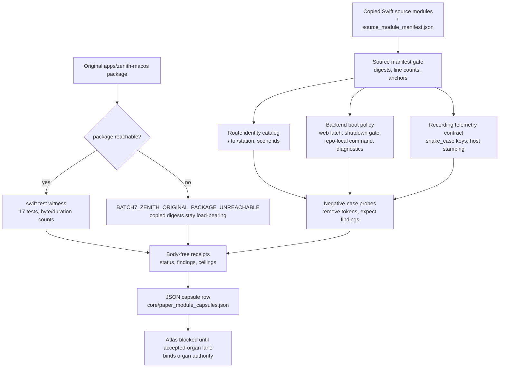

# Batch 7 Zenith macOS Capsule

## Purpose

`batch7_zenith_macos_capsule` imports the first macOS Swift app substrate from
the Batch-7 next-vein list into Microcosm. It exact-copies the public-safe Swift
bodies for the Zenith app route/window catalog, backend boot evidence policy,
recording telemetry contract, API client, WebKit bridge, runtime supervisor,
hot-key center, and Swift tests.

The page answers one question: can a cold reader see what the macOS shell does,
and trust that the copied Swift matches the real app, without the app being
launched or the private source tree being shipped? The interesting part is that
the Zenith package lives outside the public slice, so the capsule carries two
kinds of witness for the same code. Inside the slice it reads the copied Swift
bodies and checks specific contract tokens against the copied Swift tests. When
the original package is reachable it also runs `swift test` in
`apps/zenith-macos` as an external witness, recording the status and the
expected count of 17 tests. When the
package is severed from the checkout, the organ types that absence honestly
(`BATCH7_ZENITH_ORIGINAL_PACKAGE_UNREACHABLE`) and falls back to the copied
digest, line-count, and anchor checks rather than reporting a misleading pass.

## Real Substrate Boundary

- Real substrate: copied Swift source modules and original SwiftPM test witness.
- Fixture role: bounded public manifest plus negative cases for web latch,
  shutdown command gate, recording snake-case encoding, and missing SwiftPM
  witness.
- Receipt role: digest/provenance, witness status/byte counts, authority
  ceiling, and body hygiene.
- Public-safe carve-out:
  `apps/zenith-macos/Sources/ZenithApp/ZenithApp.swift` contains
  workstation-path defaults. It is not copied into the public bundle; the full
  package behavior is still covered by the SwiftPM witness. See
  `cap_quick_batch_7_zenith_macos_capsule_needs_narro_c099bd13f9ca`.

## Engines

Each engine reads copied Swift bodies and asserts that named tokens are present.
A missing token flips the engine to `blocked` and emits a specific finding code,
so the failure a check guards against is named rather than implied.

1. `zenith_route_identity_catalog` checks that route resolution is
   deterministic: an empty or `/` route normalizes to `/station`, `/station`
   maps to the cockpit scene, native lenses such as `rawSeedCapture`,
   `gateQueue`, and `runtimePanel` carry their own scene ids, and the Swift
   tests covering those rules are present. The failure it guards against is a
   window resolving to the wrong scene, or two routes collapsing to one.
2. `zenith_backend_boot_policy` checks the safety rules around starting and
   stopping the local backend. A loaded web lens latches so the boot overlay is
   suppressed for that window (`loadedWebViewWindowIDs.contains(windowID)`); the
   managed-shutdown path only acts on processes that look like the Zenith
   backend (`commandLooksLikeZenithBackend`), so an external or unrecognised
   process is never killed; the start command is the repo-local
   `./repo-python run_server.py` rather than an absolute host path; and the boot
   diagnostic surfaces evidence (`recoveryReason`, `lastProbeFailureMessage`,
   `backendLaunchInFlight`) instead of a bare spinner. The matching Swift tests
   must exist for each rule.
3. `zenith_recording_telemetry_contract` checks the wire shape of recording
   telemetry: `RecordingViewEventBody` is declared `Codable, Sendable`, the API
   client encodes with `.convertToSnakeCase` and posts to
   `/api/recording/view-event`, and host- and web-originated events are both
   stamped (`hostStampedWebRecordingEvent`, `makeWebRecordingEvent`,
   `zenith_host`). The failure it guards against is a telemetry body whose keys
   no longer match what the backend expects. The check confirms the schema and
   stamping contract; it posts no event.
4. `zenith_swiftpm_witness` runs the original SwiftPM test suite when the package
   is reachable and records only status, return code, expected and observed test
   count (17), and stdout/stderr byte counts. The receipt also stores the
   observed duration against a 240-second timeout budget, so a future hang is
   diagnosable rather than silent. No stdout or stderr body enters the receipt.

## Anti-Claim

This organ is not an app launch, not macOS permission authority, not backend
control, not browser/provider authority, not release approval, and not proof
that every UI path is covered.

## Shape



The shape is the runtime evaluation flow, not an app-control route. Copied Swift
modules pass a manifest gate, three token-checking engines and the dual SwiftPM
witness produce evidence, negative-case probes confirm that removing a contract
token is rejected, and the body-free receipt feeds the paper-module capsule row.
Throughout it preserves the boundary that no accepted-organ, macOS permission,
backend control, browser/provider access, app launch, complete UI coverage, or
release authority is created.

## Reader Proof Boundary

Read this page as a public reader projection over a mechanism-backed Microcosm
paper-module capsule. The source authority is the row in
`core/paper_module_capsules.json`, which names
`mechanism.batch7_zenith_macos_capsule.validates_public_zenith_macos_capsule`
as the subject and cites the current runtime locus. The useful proof is still
bounded: it proves a source-open, body-free, fixture-bound Zenith mechanism
capsule, not app launch, macOS permission, backend control, complete app
coverage, release approval, or accepted-organ authority.

## Claim Ceiling

This paper module can claim that the Zenith macOS capsule has a walkable reader
route to Swift source-copy evidence, the SwiftPM witness posture, the public-safe
carve-out, route/window identity checks, backend boot policy checks, recording
telemetry checks, hot-key center evidence, standard, fixture, source manifest,
focused tests, receipt evidence, and the mechanism-backed JSON capsule subject.
It cannot claim accepted-organ authority, app launch, macOS permission
authority, backend control, provider or browser authority, release approval,
complete app coverage, Atlas-card linkage, or aggregate doctrine-lattice
coverage.

The generated sidecar should report `source_authority: json_capsule`, a
mechanism subject, and a resolved code locus after the doctrine projection
builder runs. A green fixture run, SwiftPM witness summary, or focused pytest
receipt proves only bounded local replay, source-copy provenance, body hygiene,
carve-out preservation, negative-case behavior, and mechanism-capsule evidence
for the public-safe Zenith slice.

## JSON Capsule Binding

- Source authority: `core/paper_module_capsules.json::paper_modules[83:paper_module.batch7_zenith_macos_capsule]` with `source_authority: json_capsule`; the generated instance is `paper_modules/batch7_zenith_macos_capsule.json`.
- This Markdown is a reader projection of that JSON capsule row, not the source authority. The generated Mermaid projection is `available_from_capsule_edges`, and the generated Atlas projection is blocked until the organ-atlas owner lane binds its edges.
- The proof boundary is the capsule-bound organ, mechanism row, runtime locus, and the doctrine edges the capsule resolves. The authority ceiling is narrow: Fixture-bound public Swift app-shell source-body import, copied-module digest and anchor evidence, deterministic local exercise evidence, SwiftPM witness evidence, and body-free receipts only;. Reproduce it with the validation receipts named in the Validation Receipt Path section.

Binding status: a source-authority JSON capsule row is active for this paper
module. It binds the authored Markdown projection, the active Zenith mechanism
row, the resolved runtime code locus, public-safe Swift source-copy manifest,
SwiftPM witness posture, focused tests, and body-free receipt paths.

The copied Swift source-body and SwiftPM witness evidence make the macOS shell
inspectable to readers, while the mechanism subject keeps authority below the
accepted-organ boundary. The generated JSON sidecar may source Mermaid edges
from the capsule row, but Atlas-card linkage remains blocked until the organ
atlas owner lane admits accepted-organ authority.

## JSON Capsule Boundary

The capsule boundary is source-row first. `core/paper_module_capsules.json`
owns the structured subject, code-locus, doctrine-ref, and projection-status
edges. This Markdown is still a public reader projection and must stay aligned
with that source row rather than acting as independent lattice authority.

## Structured Lattice Bindings

The generated sidecar `paper_modules/batch7_zenith_macos_capsule.json`
should bind one structured lattice subject:
`mechanism.batch7_zenith_macos_capsule.validates_public_zenith_macos_capsule`.
It should also bind the resolved runtime code locus, the selected
`concept.import_projection_and_drift_control_bundle` concept, the declared
principle refs, and the declared axiom refs from the capsule source row.

That populated state is narrow. This Markdown may route readers to runnable
evidence and public-safe receipt paths, but it must not infer accepted-organ,
dependency, Atlas-card, app-launch, backend-control, release, or complete
coverage edges beyond the capsule row.

## Subject Admission Audit

Current intended generated status: one active mechanism subject is bound to
`paper_module.batch7_zenith_macos_capsule`. The source locus
`src/microcosm_core/organs/batch7_zenith_macos_capsule.py` is now a generated
`code_loci[]` edge after corpus regeneration.

This is mechanism admission only. `batch7_zenith_macos_capsule` remains outside
accepted-current organ authority unless a future organ-owner lane admits the
organ row and updates the registry, atlas, standard posture, and companion
proofs under claim.

## Source Authority Re-entry Guard

The remaining guard is accepted-organ authority, not mechanism subject
authority. `standards/std_microcosm_batch7_zenith_macos_capsule.json` remains a
draft/inventory standard, and any `standard.used_by.organ` edge tied to
accepted-current organ authority must stay unresolved while
`batch7_zenith_macos_capsule` is absent from accepted-current organ authority.

The future accepted-organ pass must be serialized through the owner lane:

1. admit the organ row and its receipt-backed authority ceiling;
2. update registry, atlas, standard posture, companion package, and focused
   tests under claim;
3. regenerate organ and aggregate lattice projections with the doctrine
   projection builder;
4. prove any accepted-organ gaps close only because the source rows exist.

Generated site availability follows the same boundary: the website may expose
this page and generated JSON capsule through existing builder surfaces, but
generated site files should only be regenerated and committed after source
coupling is clean and the public-site builder plus secret scan pass under
claim.

## Reader Evidence Routing

- Runnable organ:
  `src/microcosm_core/organs/batch7_zenith_macos_capsule.py`. Supports route
  identity, backend boot-screen latching, managed-backend shutdown gating,
  recording telemetry encoding, and the SwiftPM witness summary. Boundary:
  mechanism code-locus evidence only; not accepted-organ authority.
- Standard:
  `standards/std_microcosm_batch7_zenith_macos_capsule.json`. Supports exact
  public-safe Swift source copies, original SwiftPM witness posture, no
  stdout/stderr body leakage, negative cases, and the app-launch/host-control
  authority ceiling. Boundary: local capsule requirements, not app launch,
  macOS permission, backend-control, or release authority.
- Focused tests:
  `tests/test_batch7_zenith_macos_capsule.py`. Support runtime shape,
  exported-bundle validation, exact macro-body imports, source-body omission
  from cards, and stable negative cases. Boundary: focused witness only; not
  complete app, UI, backend, or permission coverage.
- Fixture manifest:
  `core/fixture_manifests/batch7_zenith_macos_capsule.fixture_manifest.json`.
  Supports fixture root, exported bundle, source manifest routing, SwiftPM
  witness command metadata, and the public-safe carve-out ref. Boundary:
  fixture availability is not a live app run, host control, or private-root
  equivalence.
- Source manifest:
  `examples/batch7_zenith_macos_capsule/exported_batch7_zenith_macos_capsule_bundle/source_module_manifest.json`.
  Supports exact-copy hashes, line counts, required anchors, and the deliberate
  exclusion of the public-unsafe app entry body. Boundary: copied non-secret
  source bodies remain source evidence; receipts keep bodies out.
- Acceptance receipts:
  `receipts/acceptance/first_wave/batch7_zenith_macos_capsule_fixture_acceptance.json`
  and `receipts/first_wave/batch7_zenith_macos_capsule/`. Support prior fixture
  acceptance, validation receipt, board, result, and bundle-validation routing
  for reader re-runs. Boundary: receipt presence supports the mechanism capsule
  but does not flip accepted-organ, Atlas-card, or aggregate doctrine-lattice
  coverage.

The selective relation boundary is intentionally narrow: this Markdown names
walkable source routes for readers, but it does not infer governed concepts,
principles, axioms, dependencies, or code-locus relations into the generated
JSON row. Those edges must be populated through `core/paper_module_capsules.json`
and the doctrine projection builder.

## Public Site Availability Boundary

This module is public-safe to expose as a reader route because the visible page
contains summaries, paths, checks, digests, witness counts, carve-out refs, and
authority ceilings rather than private source bodies, provider payloads, raw
operator voice, browser/session material, credentials, workstation defaults, or
live host-control state. Website availability should come from the existing
Microcosm site builder reading this source page and generated Microcosm data;
generated site HTML, object maps, search indexes, content graphs, and copy-all
packets are projections, not source authority.

## Public-Safe Body Handling

This page may name Swift source paths, route/window ids, WebKit bridge refs,
API-client and telemetry contracts, SwiftPM witness metadata, fixture ids,
standard and test files, receipt paths, copied-source manifest digests, and the
public-safe carve-out ref. It must not embed credentials, provider payloads,
browser/session state, host-control state, workstation defaults, raw operator
voice, private source bodies, or the excluded app-entry body that carries
workstation-path defaults.

Copied public-safe Swift bodies stay in the bundle source-module area. Reader
cards, receipts, generated site projections, and this Markdown should represent
them by refs, hashes, line counts, required anchors, booleans, summaries, witness
counts, and explicit authority ceilings rather than by duplicating private or
host-specific payloads.

## Capsule Re-entry Packet

- current source authority: generated JSON should report
  `paper_module_payload.source_authority: json_capsule`.
- generated row source ref:
  `core/paper_module_capsules.json::paper_module.batch7_zenith_macos_capsule`.
- current generated projection status: Mermaid available from capsule edges;
  Atlas blocked until the organ-atlas owner lane binds accepted-organ edges.
- resolved code locus:
  `src/microcosm_core/organs/batch7_zenith_macos_capsule.py`.
- bound mechanism subject:
  `mechanism.batch7_zenith_macos_capsule.validates_public_zenith_macos_capsule`.
- re-entry condition: after accepted-organ admission lands, update the organ
  registry/atlas/standard posture under claim and rerun the doctrine projection
  builder to prove the accepted-organ edge.
- authority ceiling: the JSON row and mechanism subject do not source Atlas
  cards, accepted-organ authority, app launch authority, macOS permission
  authority, backend control, release claims, or aggregate doctrine-lattice
  coverage.

## Receipt Expectations

Expected receipts are local replay and bundle-validation artifacts for the
public-safe Zenith capsule: the fixture acceptance JSON, the first-wave result,
validation receipt, board, and any exported-bundle validation receipt under the
Batch 7 Zenith receipt tree. These receipts can show bounded replay, SwiftPM
witness posture, digest/provenance, body hygiene, and negative-case behavior.

Receipt success supports capsule authority only because the mechanism source
row and paper-module capsule row are present. Even a clean fixture or
bundle-validation receipt does not create accepted-organ, app-launch,
backend-control, release, Atlas-card, or aggregate coverage authority.

## Validation Receipt Path

Reader-verifiable fixture command, run from `microcosm-substrate/`:

```bash
PYTHONPATH=src ../repo-python -m microcosm_core.organs.batch7_zenith_macos_capsule run \
  --input fixtures/first_wave/batch7_zenith_macos_capsule/input \
  --out receipts/first_wave/batch7_zenith_macos_capsule \
  --acceptance-out receipts/acceptance/first_wave/batch7_zenith_macos_capsule_fixture_acceptance.json \
  --card
```

Focused test receipt, run from the repository root:

```bash
PYTHONPATH=microcosm-substrate/src ./repo-pytest \
  microcosm-substrate/tests/test_batch7_zenith_macos_capsule.py \
  -q --basetemp /tmp/microcosm-batch7-zenith-macos-tests
```

The fixture run writes
`receipts/first_wave/batch7_zenith_macos_capsule/batch7_zenith_macos_capsule_result.json`,
`receipts/first_wave/batch7_zenith_macos_capsule/batch7_zenith_macos_capsule_validation_receipt.json`,
and
`receipts/first_wave/batch7_zenith_macos_capsule/batch7_zenith_macos_capsule_board.json`;
the acceptance file records fixture acceptance. The exported-bundle re-run
uses the `run-batch7-zenith-bundle` action over
`exported_batch7_zenith_macos_capsule_bundle`, and any bundle-validation
receipts stay under
`receipts/first_wave/batch7_zenith_macos_capsule/bundle_validation/`.

This receipt path is reader-verifiable evidence for the mechanism capsule. It
does not flip accepted-organ or Atlas status, launch the macOS app, grant macOS
permissions, control a backend, authorize provider/browser authority, approve
release, or aggregate doctrine-lattice coverage. The focused pytest receipt
checks the same boundary from source and fixture assertions rather than from
generated paper-module edges alone.

## Authority Ceiling

This page is a reader evidence route for a mechanism-backed paper-module
projection. It can identify the Zenith source locus, active mechanism subject,
standard, tests, fixture manifest, source manifest, receipts, carve-out, and
accepted-organ re-entry condition. It cannot provide accepted-organ authority,
Atlas cards, app-launch authority, macOS permission authority, backend control,
provider/browser authority, release approval, complete UI coverage, or aggregate
doctrine-lattice coverage.

## Prior Art Grounding

The organ borrows from native macOS Swift app architecture and hybrid
native/web shell practice: SwiftUI owns app lifecycle and scene structure,
WKWebView embeds web surfaces, typed API clients carry backend contracts, and
hot-key/telemetry code is guarded by tests. Useful anchors include:

- Apple's [SwiftUI app overview](https://developer.apple.com/documentation/technologyoverviews/swiftui),
  including the `App` entry point and declarative app model.
- Apple's [WKWebView](https://developer.apple.com/documentation/webkit/wkwebview),
  the platform-native view for embedding interactive web content.
- Apple's [Swift ArgumentParser](https://www.swift.org/blog/argument-parser/),
  as a type-safe Swift command-line argument parsing pattern used in native
  tooling.

Microcosm borrows the native-shell, route/window catalog, WebKit bridge, API
client, telemetry, and supervised-backend contract shape. It does not launch
the app, assert macOS permission authority, control the backend, or approve
release.
