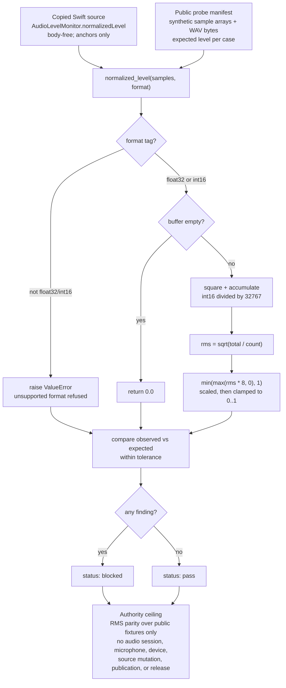

# Batch 8 Audio Level RMS Port

This organ ports the pure `AudioLevelMonitor.normalizedLevel` RMS math from Swift to Python and exercises it over public synthetic sample arrays.

The capsule is bounded to numeric parity. It does not start an
`AVCaptureSession`, request microphone permission, read recorded audio, capture
a device, claim UI readiness, authorize publication, or approve release.

## Purpose

The Swift `AudioLevelMonitor` feeds a live microphone level meter in a recording
app. Most of that file is platform machinery: opening a capture session,
selecting a device, reading sample buffers off a callback. Buried inside is one
small, pure function, `normalizedLevel`, that turns a block of audio samples
into a single number between zero and one. That number is the only part that can
be checked without a microphone, so it is the only part this organ ports.

The single question this organ answers is: does the Python re-implementation of
that calculation produce the same level value as the Swift original, on inputs
we can publish? Everything device-specific, permission-gated, or stateful is
deliberately left on the Swift side. What crosses into Python is the arithmetic
alone.

The interesting choice here is what is held out, not what is included. A live
level meter is hard to test because it depends on real audio hardware and OS
permissions that cannot live in a public fixture. By isolating the pure
amplitude maths and exercising it over synthetic sample arrays, the organ keeps
a checkable parity claim about the part that matters for the meter reading,
while making no claim at all about capture, permission, or device state. The
test is scoped to being a maths port and nothing more.

## How it works

`normalized_level` takes a sequence of samples and a format tag. It accepts only
`float32` and `int16`; any other tag raises `ValueError`, which is how the
"unsupported format" case is exercised. An empty buffer returns `0.0`
immediately, before any arithmetic.

For each sample it accumulates the square of the value. Float samples are used
as-is; int16 samples are first divided by `32767.0` (the Swift `Int16.max`) to
map the integer range onto roughly minus-one to one. It then takes the root mean
square, `sqrt(total / count)`, which summarises the block's energy as a single
amplitude. That value is multiplied by `8.0` and clamped to the `[0.0, 1.0]`
range with `min(max(rms * 8.0, 0.0), 1.0)`. The gain of eight is a display
choice carried over verbatim from the Swift source: quiet speech sits low on a
zero-to-one meter without it, so the level is scaled up and then capped so loud
input cannot overshoot one. These two lines, the int16 divisor and the
`rms * 8` clamp, are the anchors the bundle requires to match the copied Swift
text.

The runtime checks three reference cases drawn from a public probe manifest
(`float32`, `int16`, and an over-one buffer that must clamp), optionally decodes
mono 16-bit PCM WAV byte fixtures and recomputes their level from the raw bytes,
and runs three negative exercises: empty buffer must read zero, an over-one
buffer must clamp to one, and an unknown format must be refused. Each case
compares the observed level against the manifest's expected value within a small
tolerance. A mismatch, a missing expected case, or a failed refusal is recorded
as a finding, and any finding turns the verdict from `pass` to `blocked`.

## JSON Capsule Binding

Source authority for this reader page is
`core/paper_module_capsules.json::paper_modules[59:paper_module.batch8_audio_level_rms_port]`;
the generated instance is `paper_modules/batch8_audio_level_rms_port.json`
with `source_authority: json_capsule`.

This Markdown is a reader projection over the capsule, not the authority plane.
The generated Mermaid projection is `available_from_capsule_edges`, and the
Atlas card is linked from the same capsule edges; those projections help
navigation but do not expand the authority ceiling.

The proof boundary is deterministic RMS parity over public fixture inputs and
copied source refs only. A cold reader should not treat this page, Mermaid
availability, or Atlas linkage as macOS audio-session evidence, microphone
permission authority, device capture proof, UI readiness, publication approval,
or release approval.

## JSON Capsule Boundary

The JSON capsule is the source of record for this reader projection. It binds
the page to the `batch8_audio_level_rms_port` organ, the resolving public
audio-level RMS mechanism subject, the import/projection drift concept, the RMS
port runtime locus, and the law/dependency edges listed below.

The generated row currently exposes 19 capsule-derived relationship edges.
Mermaid is `available_from_capsule_edges`, Atlas is
`linked_from_capsule_edges`, and there are no unresolved selective relations.
Those projections make the capsule walkable; they do not start an audio
session, request microphone permission, prove device capture, approve UI
readiness, approve publication, or approve release.

## Shape

Read this module as a bounded RMS-parity pipeline: the JSON capsule names the
reader authority, runtime locus, standard, and generated navigation edges; the
runtime ports Swift `normalizedLevel` math over public fixture arrays; tests and
receipts verify numeric parity and body-free evidence. Generated Mermaid and
Atlas links are navigation status, not macOS audio-session, microphone, device,
source-mutation, publication, or release authority.



## Reader Proof Boundary

A cold reader can validate this module by starting from the JSON capsule row,
then checking the generated JSON instance, exported Swift source bundle,
synthetic sample arrays, RMS parity receipt, bundle validation receipt, and
focused test. The proof is limited to deterministic numeric parity for the
ported RMS calculation over public fixture inputs.

The proof stops before microphone access, recorded-audio handling, device
capture, `AVCaptureSession` behavior, UI readiness, publication, and release.
Generated Mermaid and Atlas availability are navigation projections derived
from the capsule row, not macOS runtime evidence.

## Public Site Availability Boundary

This Markdown is safe to project on the public site because it exposes fixture
sample classes, source refs, digest anchors, validator commands, and authority
ceilings without exposing recorded audio, device identifiers, microphone state,
private runtime state, or UI screenshots.

Public rendering may explain the pure RMS-port parity route. It must not imply
audio capture, permission handling, product UI readiness, or release approval.

## Public-Safe Body Handling

The source body floor is the copied non-secret Swift source in the exported
bundle. Receipts and cards should carry refs, digests, anchors, sample counts,
and parity verdicts only; copied body text and audio samples stay out of
receipts.

Future body refreshes must preserve the bundle manifest boundary and keep
recorded audio, private device state, microphone permission state, and
credential-equivalent material out of public receipts and site projections.

## Reader Evidence Routing

- Capsule route: read `core/paper_module_capsules.json::paper_modules[59]`
  before treating this Markdown as explanation.
- Generated route: inspect `paper_modules/batch8_audio_level_rms_port.json`
  for the current generated instance derived from the capsule row.
- Bundle route: inspect `examples/batch8_audio_level_rms_port/exported_batch8_audio_level_rms_port_bundle`
  for copied Swift source refs and digest evidence.
- Runtime route: run `tests/test_batch8_audio_level_rms_port.py` and the
  commands in `## Validation Receipt Path` for recomputation evidence.

## Structured Lattice Bindings

The generated JSON row currently contributes 19 relationship edges derived from
the capsule's organ subject, resolved code locus, doctrine refs, and sibling
paper-module dependencies. The Mermaid projection is
`available_from_capsule_edges`; the Atlas projection is
`linked_from_capsule_edges`.

At this HEAD the generated instance reports zero unresolved selective
relations. If future capsule edits introduce residuals, this Markdown page may
name them but must not invent concept ids or promote candidate doctrine.

## First Command

```bash
PYTHONPATH=src python3 -m microcosm_core.organs.batch8_audio_level_rms_port run \
  --input fixtures/first_wave/batch8_audio_level_rms_port/input \
  --out receipts/first_wave/batch8_audio_level_rms_port \
  --acceptance-out receipts/acceptance/first_wave/batch8_audio_level_rms_port_fixture_acceptance.json
```

## Validation Receipt Path

Reader-verifiable commands, run from the `microcosm-substrate/` public root:

```bash
PYTHONPATH=src python3 -m microcosm_core.organs.batch8_audio_level_rms_port run \
  --input fixtures/first_wave/batch8_audio_level_rms_port/input \
  --out /tmp/microcosm-batch8-audio-level-rms-port-vrp \
  --acceptance-out /tmp/microcosm-batch8-audio-level-rms-port-fixture-acceptance.json
PYTHONPATH=src python3 -m microcosm_core.organs.batch8_audio_level_rms_port validate-bundle \
  --input examples/batch8_audio_level_rms_port/exported_batch8_audio_level_rms_port_bundle \
  --out /tmp/microcosm-batch8-audio-level-rms-port-bundle-vrp
PYTHONPATH=src ../repo-pytest --disk-pressure-policy=warn \
  microcosm-substrate/tests/test_batch8_audio_level_rms_port.py -q \
  --basetemp /tmp/microcosm-batch8-audio-level-rms-port-tests
```

The fixture command writes the bounded RMS parity receipt and acceptance JSON.
The bundle command validates the copied Swift source module, digest anchors,
negative exercises, body-exclusion scan, and source-ref boundary. The focused
test checks the Python port, bundle validation, receipt body scan, and authority
ceiling.

This receipt path is reader-verifiable evidence only. It does not start an
audio session, request microphone permission, read recorded audio, prove device
capture, approve UI readiness, mutate source, authorize publication, or approve
release.

## Receipt Expectations

A complete local receipt should include the organ run output, bundle validation
output, focused pytest result, and the generated-row proof from
`paper_modules/batch8_audio_level_rms_port.json`. The expected generated-row
proof is `edge_count: 19`, Mermaid `available_from_capsule_edges`, Atlas
`linked_from_capsule_edges`, `source_authority: json_capsule`, and
`unresolved_selective_relation_count: 0`.

## Authority Ceiling

This is deterministic Python-port evidence over fixture inputs only. It is not
macOS audio-session evidence, not microphone permission authority, not device
capture, not UI readiness, not source mutation authority, and not release
approval.

## Claim Ceiling

This paper module can claim a deterministic Python port of the audio-level RMS
calculation with a diagram view generated for this module and navigation links
available from the same source row. It can explain deterministic numeric
RMS/level behavior over fixture inputs and body-free receipts.

It cannot claim macOS audio-session evidence, microphone permission authority,
device capture, UI readiness, source mutation, publication approval, release
approval, or whole-system correctness. Those claims would need new supporting
evidence before this module could narrate them.

## Prior Art Grounding

The organ is grounded in standard digital-audio metering practice: root mean
square amplitude is a common way to summarize signal energy for level displays,
while OS capture APIs and media tools are kept outside pure numeric tests.
Useful anchors include:

- Apple's [AVFoundation](https://developer.apple.com/av-foundation/) media
  framework family for time-based audiovisual capture and processing on Apple
  platforms.
- [FFmpeg audio/video documentation](https://www.ffmpeg.org/documentation.html),
  as a broad media-processing toolchain where audio streams and levels are
  handled as explicit inputs and transforms.

Microcosm borrows only the pure RMS-level calculation shape and ports it to
fixture-bound Python parity tests. It does not start an audio session, request
microphone permission, read recorded audio, capture a device, or approve UI or
release readiness.

## Source Reference

The exported bundle copies
`apps/demo-take-console/Sources/DemoTakeConsoleApp/AudioLevelMonitor.swift`
under
`examples/batch8_audio_level_rms_port/exported_batch8_audio_level_rms_port_bundle/source_modules/`.
Receipts carry refs, digests, anchors, sample counts, and parity verdicts, not
copied body text, recorded audio, or private device state.

## Mechanism Set

The validator requires float32 parity, int16 parity, over-one clamp behavior,
empty-buffer zero behavior, and unsupported-format refusal. Shared registry,
acceptance, runtime-shell, CLI, atlas, package-data, and generated docs wiring
is intentionally deferred while the existing shared Microcosm core lease is
active.
