# Batch 8 Compliance Pipeline Capsule

## Role

This module imports the macro compliance scanner registry, the bounded
compliance ledger builder, and the observe-loop pipeline stages into Microcosm
as copied public-safe source bodies with a runnable organ.

## Imported substrate

- `system/lib/compliance/__init__.py`
- `system/lib/compliance/compliance_coverage_adapter.py`
- `system/lib/compliance/standard_baseline_adapter.py`
- `system/lib/compliance/microcosm_adapter.py`
- `tools/meta/factory/build_compliance_ledger.py`
- `system/lib/pipeline/stage_extract.py`
- `system/lib/pipeline/stage_select.py`
- `system/lib/pipeline/stage_emit.py`
- `system/lib/pipeline/stage_compile.py`
- `system/lib/pipeline/stage_execute.py`
- `system/lib/pipeline/stage_process.py`

## JSON Capsule Binding

Source authority for this reader page is
`core/paper_module_capsules.json::paper_modules[60:paper_module.batch8_compliance_pipeline_capsule]`;
the generated instance is
`paper_modules/batch8_compliance_pipeline_capsule.json` with
`source_authority: json_capsule`.

This Markdown is a reader projection over the capsule, not the authority plane.
The generated Mermaid projection is `available_from_capsule_edges`, and the
Atlas card is linked from the same capsule edges; those projections help
navigation but do not expand the authority ceiling.

The proof boundary is declared public compliance and pipeline fixture evidence
plus copied source-module digest checks only. Validation stays with bounded
registry and helper checks; broader compliance refresh, bridge/provider work,
source-record changes, complete branch certification, public sharing, and launch
are outside this fixture.

## JSON Capsule Boundary

The JSON capsule is the source of record for this reader projection. It binds
the page to the `batch8_compliance_pipeline_capsule` organ, the resolving
public compliance-pipeline mechanism subject, the import/projection drift
concept, the compliance and pipeline runtime locus, and the law/dependency
edges listed below.

The generated row currently exposes 23 capsule-derived relationship edges.
Mermaid is `available_from_capsule_edges`, Atlas is
`linked_from_capsule_edges`, and there are no unresolved selective relations.
Those projections make the capsule walkable; they do not certify the full
compliance ledger, authorize bridge/provider dispatch, approve publication, or
approve release.

## Shape

The authoritative capsule row is
`core/paper_module_capsules.json::paper_modules[60:paper_module.batch8_compliance_pipeline_capsule]`.
The generated JSON instance is
`paper_modules/batch8_compliance_pipeline_capsule.json`, whose `source_refs`
mark that capsule row as the source of record and this Markdown as
`legacy_markdown_projection_not_source_authority`. This section is therefore a
reader projection over JSON/source artifacts, not a second authority plane.

```mermaid
flowchart LR
  capsule["JSON capsule row<br/>core/paper_module_capsules.json[60]"]
  instance["Generated JSON instance<br/>paper_modules/batch8_compliance_pipeline_capsule.json<br/>edges: 23; unresolved selective relations: 0"]
  md["Reader Markdown projection<br/>paper_modules/batch8_compliance_pipeline_capsule.md"]
  standard["Local standard<br/>standards/std_microcosm_batch8_compliance_pipeline_capsule.json<br/>active public-safe source-open capsule"]
  organ["Runtime organ<br/>src/microcosm_core/organs/batch8_compliance_pipeline_capsule.py"]
  bundle["Fixture and source bundle<br/>fixtures/first_wave/.../input<br/>examples/.../exported_batch8_compliance_pipeline_capsule_bundle<br/>source_module_manifest.json: 11 copied modules"]
  receipts["Tests and receipts<br/>tests/test_batch8_compliance_pipeline_capsule.py<br/>receipts/first_wave/... result, board, validation receipt<br/>receipts/runtime_shell/... exported validation result<br/>state/microcosm_verifier/receipts/20260604T0346Z_..._cycle.json"]
  projections["Generated projections<br/>Mermaid: available_from_capsule_edges<br/>Atlas: linked_from_capsule_edges"]
  ceiling["Authority ceiling<br/>fixture evidence plus copied source digest checks only<br/>no full ledger refresh, provider dispatch, raw-seed mutation,<br/>publication approval, release approval, or whole-system correctness"]

  capsule -->|"source_authority: json_capsule"| instance
  instance -->|"legacy Markdown path"| md
  capsule -->|"organ + mechanism subjects"| organ
  capsule -->|"depends_on + concept/law edges"| instance
  standard -->|"expected 11 source modules; 6 negative cases"| organ
  organ -->|"run / validate-bundle"| bundle
  bundle -->|"exact copied non-secret macro bodies; body_in_receipt=false"| receipts
  instance -->|"projection statuses"| projections
  receipts -->|"evidence bounded by"| ceiling
  standard -->|"public/private boundary"| ceiling
  md -->|"explains, does not expand"| ceiling
```



The shape is a bounded compliance and observe-pipeline witness. The capsule
names the organ subject
`batch8_compliance_pipeline_capsule`, the mechanism subject
`mechanism.batch8_compliance_pipeline_capsule.validates_public_compliance_pipeline_capsule`,
the resolved runtime/source locus
`src/microcosm_core/organs/batch8_compliance_pipeline_capsule.py`, and the
dependency/concept/law edges. The generated JSON instance materializes those
relationships as 23 edges with
`unpopulated_selective_relations: []`; its Mermaid projection is
`available_from_capsule_edges` and its Atlas projection is
`linked_from_capsule_edges`.

The local standard, when read as
`standards/std_microcosm_batch8_compliance_pipeline_capsule.json`, keeps the
same boundary: public engine ids, stable negative-case codes, source refs,
digests, line counts, required anchors, bounded synthetic outcomes, authority
ceilings, and anti-claims are public-safe; keys, credentials, cookies,
account/session state, provider payload bodies, browser/HUD live-access
material, raw operator transcripts, private artifact bodies, live observe
dispatch state, and raw seed bodies are forbidden public inputs. Its validator
contract expects eleven copied non-secret macro source modules and six negative
cases, with the runtime command routed through
`microcosm_core.organs.batch8_compliance_pipeline_capsule`.

The runtime locus writes and validates receipts through `run`,
`run_batch8_compliance_pipeline_bundle`, `result_card`,
`EXPECTED_NEGATIVE_CASES`, and `AUTHORITY_CEILING`. The fixture path
`fixtures/first_wave/batch8_compliance_pipeline_capsule/input` and the example
bundle
`examples/batch8_compliance_pipeline_capsule/exported_batch8_compliance_pipeline_capsule_bundle`
carry the public exercise inputs, source-module manifest, and copied
compliance/pipeline source bodies. The manifest currently records
`source_import_class: copied_non_secret_macro_body`, `module_count: 11`, and
`body_in_receipt: false`.

Validation evidence is the focused test
`tests/test_batch8_compliance_pipeline_capsule.py`, the first-wave receipt set
under `receipts/first_wave/batch8_compliance_pipeline_capsule/`, the acceptance
receipt
`receipts/acceptance/first_wave/batch8_compliance_pipeline_capsule_fixture_acceptance.json`,
the runtime-shell exported validation receipt under
`receipts/runtime_shell/demo_project/organs/batch8_compliance_pipeline_capsule/`,
and the verifier cycle receipt
`state/microcosm_verifier/receipts/20260604T0346Z_batch8_compliance_pipeline_capsule_cycle.json`.
Those receipts can show pass status, exact-copy digest/anchor checks, stable
negative cases, no-write behavior, secret/body exclusion scans, and
`body_in_receipt: false`; they do not become full compliance-ledger freshness,
pipeline dispatch, provider dispatch, source mutation, publication, release, or
whole-system correctness authority.

## Reader Proof Boundary

A cold reader can validate this module by starting from the JSON capsule row,
then checking the generated JSON instance, copied compliance and pipeline source
manifest, bounded no-write fixture receipt, bundle validation receipt, and
focused test. The proof is limited to registry shape, bounded compliance
scanner behavior, pipeline helper mechanics, and source-module digest checks.

The proof stops before full compliance ledger refresh, bridge or provider
dispatch, raw-seed mutation, every-branch compliance certification,
publication, and release. Generated Mermaid and Atlas availability are capsule
projections, not extra compliance authority.

## Public Site Availability Boundary

This Markdown is safe to project on the public site because it exposes imported
module refs, no-write validator commands, digest checks, negative cases, and
authority ceilings without exporting private compliance findings, raw seed
bodies, bridge payloads, provider payloads, or live ledger mutation authority.

Public rendering may explain how the bounded fixture exercises scanner and
pipeline mechanics. It must not claim the live compliance ledger was refreshed
or that every compliance route is certified.

## Public-Safe Body Handling

The public body floor is the exported bundle manifest plus copied non-secret
compliance and pipeline source modules. Receipts and cards should carry refs,
digests, anchors, counts, omission posture, and authority ceilings only.

Future body refreshes must keep private findings, raw seed text, bridge or
provider payloads, account/session state, and private runtime material out of
public receipts and site projections.

## Reader Evidence Routing

- Capsule route: read `core/paper_module_capsules.json::paper_modules[60]`
  before treating this Markdown as explanation.
- Generated route: inspect `paper_modules/batch8_compliance_pipeline_capsule.json`
  for the current generated instance (relationship graph, diagram availability, and lattice position).
- Bundle route: inspect `examples/batch8_compliance_pipeline_capsule/exported_batch8_compliance_pipeline_capsule_bundle`
  for copied compliance and pipeline source refs.
- Runtime route: run `tests/test_batch8_compliance_pipeline_capsule.py` and
  the commands in `## Validation Receipt Path` for recomputation evidence.

## Structured Lattice Bindings

The generated JSON row currently contributes 23 relationship edges derived from
the capsule's organ subject, resolved code locus, doctrine refs, and sibling
paper-module dependencies. The Mermaid projection is
`available_from_capsule_edges`; the Atlas projection is
`linked_from_capsule_edges`.

At this HEAD the generated instance reports zero unresolved selective
relations. If future capsule edits introduce residuals, this Markdown page may
name them but must not invent concept ids or promote candidate doctrine.

## Prior Art Grounding

This capsule borrows from control-assessment, policy-as-code, provenance, and
observability practice. Useful anchors include:

- NIST [SP 800-53 Rev. 5](https://csrc.nist.gov/pubs/sp/800/53/r5/upd1/final),
  as a control-catalog pattern for naming, assessing, and reporting control
  posture.
- [Open Policy Agent](https://www.openpolicyagent.org/docs/latest), as a
  general-purpose policy engine pattern for evaluating structured inputs
  without embedding every rule in the caller.
- [SLSA provenance](https://slsa.dev/spec/v1.2/provenance), for treating
  artifact origin and process metadata as explicit attestations.
- [OpenTelemetry](https://opentelemetry.io/docs/), for instrumentation
  patterns around pipeline stages, traces, metrics, and logs.

Microcosm borrows the scanner, policy, provenance, and pipeline-stage shape,
but the organ only validates bounded no-write behavior and pure helper
mechanics. It stays with bounded registry/helper checks; broader compliance
refresh, provider work, source-record changes, and complete branch
certification are outside this fixture.

## Authority Ceiling

The capsule validates registry shape, bounded no-write compliance checks,
baseline scanner truth accounting, and pure pipeline helper behavior. It does
not refresh the full compliance ledger, dispatch bridge/provider work, change
source records, or certify every compliance and pipeline branch.

## Claim Ceiling

This paper module can claim a compliance pipeline fixture with a diagram view generated for this module and a navigable atlas card. It can explain registry shape checks, bounded no-write compliance probes, scanner truth accounting, pure pipeline helper behavior, and body-free receipts.

It cannot claim full compliance-ledger refresh, bridge or provider dispatch,
source-record changes, complete compliance branch certification, public sharing,
launch, or whole-system correctness. Higher claims belong in the JSON capsule
and regenerated projections first.

## Validation Receipt Path

Reader-verifiable commands, run from the `microcosm-substrate/` public root:

```bash
PYTHONPATH=src:.. python3 -m microcosm_core.organs.batch8_compliance_pipeline_capsule run \
  --input fixtures/first_wave/batch8_compliance_pipeline_capsule/input \
  --out /tmp/microcosm-batch8-compliance-pipeline-vrp \
  --acceptance-out /tmp/microcosm-batch8-compliance-pipeline-fixture-acceptance.json
PYTHONPATH=src:.. python3 -m microcosm_core.organs.batch8_compliance_pipeline_capsule validate-bundle \
  --input examples/batch8_compliance_pipeline_capsule/exported_batch8_compliance_pipeline_capsule_bundle \
  --out /tmp/microcosm-batch8-compliance-pipeline-bundle-vrp
PYTHONPATH=src ../repo-pytest --disk-pressure-policy=warn \
  microcosm-substrate/tests/test_batch8_compliance_pipeline_capsule.py -q \
  --basetemp /tmp/microcosm-batch8-compliance-pipeline-tests
```

The fixture command writes the bounded compliance/pipeline exercise receipt and
acceptance JSON. The bundle command validates copied compliance and pipeline
source modules, manifest digests, observed negative cases, receipt body scans,
and public/private boundary checks. The focused test confirms the no-write
runtime boundary, bundle validation, omission posture, and claim ceiling.

This receipt path is reader-verifiable evidence only. It does not refresh the
full compliance ledger, dispatch bridge or provider work, change source records,
certify every compliance branch, authorize public sharing, or approve launch.

## Receipt Expectations

A complete local receipt should include the organ run output, bundle validation
output, focused pytest result, and the generated-row proof from
`paper_modules/batch8_compliance_pipeline_capsule.json`. The expected
generated-row proof is `edge_count: 23`, Mermaid
`available_from_capsule_edges`, Atlas `linked_from_capsule_edges`,
`source_authority: json_capsule`, and
`unresolved_selective_relation_count: 0`.
