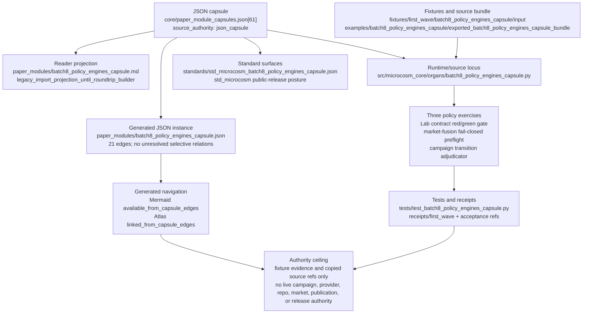

# Batch 8 Policy Engines Capsule

This organ imports three Batch-8 policy engines as exact copied non-secret macro
source bodies plus bounded public exercises: Lab contract audit red/green
gating, market-fusion fail-closed claim preflight, and campaign dispatch
transition adjudication.

The capsule is source-open and bounded. It exercises deterministic policy
mechanics over synthetic public fixtures. It does not run live campaigns, call
providers, mutate repositories, export private artifacts, claim market truth,
authorize publication, or approve release.

## JSON Capsule Binding

Source authority for this reader page is
`core/paper_module_capsules.json::paper_modules[61:paper_module.batch8_policy_engines_capsule]`;
the generated instance is `paper_modules/batch8_policy_engines_capsule.json`
with `source_authority: json_capsule`.

This Markdown is a reader projection over the capsule, not the authority plane.
The generated Mermaid projection is `available_from_capsule_edges`, and the
Atlas card is linked from the same capsule edges; those projections help
navigation but do not expand the authority ceiling.

The proof boundary is deterministic public policy-engine fixture evidence and
copied macro source refs only. A cold reader should not treat this page,
validation receipts, Mermaid availability, or Atlas linkage as live campaign
execution authority, provider dispatch, repository mutation authority, market
validation, publication approval, or release approval.

## JSON Capsule Boundary

The JSON capsule is the source of record for this reader projection. It binds
the page to the `batch8_policy_engines_capsule` organ, the resolving public
policy-engines mechanism subject, the import/projection drift concept, the
policy-engine runtime locus, and the law/dependency edges listed below.

The generated row currently exposes 21 capsule-derived relationship edges.
Mermaid is `available_from_capsule_edges`, Atlas is
`linked_from_capsule_edges`, and there are no unresolved selective relations.
Those projections make the capsule walkable; they do not run campaigns,
dispatch providers, validate markets, authorize repository mutation, approve
publication, or approve release.

## Shape

Read this module as a bounded evidence pipeline: the JSON capsule names the
paper-module authority, runtime locus, standard, and generated projections; the
runtime exercises copied non-secret policy sources against public fixtures; the
tests and receipt commands verify those fixture mechanics and anti-claims.
Everything below the capsule is reader or navigation evidence, not live policy,
source-mutation, market, publication, provider, production, or release
authority.



## Reader Proof Boundary

A cold reader can validate this module by starting from the JSON capsule row,
then checking the generated JSON instance, exported policy-engine source
bundle, three public engine exercises, negative cases, bundle validation
receipt, and focused test. The proof is limited to deterministic policy-gate
mechanics over synthetic public fixture inputs.

The proof stops before live campaign execution, provider dispatch, market truth,
repository mutation, whole-system safety, publication, and release. Generated
Mermaid and Atlas availability are capsule projections, not live policy
authority.

## Public Site Availability Boundary

This Markdown is safe to project on the public site because it exposes policy
engine ids, source refs, digest checks, negative cases, validator commands, and
authority ceilings without exporting private campaign artifacts, provider
payloads, market positions, account/session state, or live repository paths.

Public rendering may explain deterministic red/green gate behavior. It must not
advertise live campaign dispatch, market validation, provider execution, or
release readiness.

## Public-Safe Body Handling

The public body floor is the exported bundle manifest plus exact copied
non-secret macro policy sources. Receipts and cards should carry source refs,
digests, anchors, counts, exercise outcomes, negative cases, and anti-claims
only.

Future body refreshes must keep private campaign material, provider payloads,
market-sensitive private data, copied body text, and account/session state out
of public receipts and site projections.

## Reader Evidence Routing

- Capsule route: read `core/paper_module_capsules.json::paper_modules[61]`
  before treating this Markdown as explanation.
- Generated route: inspect `paper_modules/batch8_policy_engines_capsule.json`
  for the current generated instance of this module.
- Bundle route: inspect `examples/batch8_policy_engines_capsule/exported_batch8_policy_engines_capsule_bundle`
  for the three copied macro policy sources.
- Runtime route: run `tests/test_batch8_policy_engines_capsule.py` and the
  commands in `## Validation Receipt Path` for recomputation evidence.

## Structured Lattice Bindings

The generated JSON row currently contributes 21 relationship edges derived from
the capsule's organ subject, resolved code locus, doctrine refs, and sibling
paper-module dependencies. The Mermaid projection is
`available_from_capsule_edges`; the Atlas projection is
`linked_from_capsule_edges`.

At this HEAD the generated instance reports zero unresolved selective
relations. If future capsule edits introduce residuals, this Markdown page may
name them but must not invent concept ids or promote candidate doctrine.

## Prior Art Grounding

This capsule borrows from policy-as-code, risk-management, and market-claim
boundary practice. Useful anchors include:

- [Open Policy Agent](https://www.openpolicyagent.org/docs/latest), which
  treats policy as a separately evaluated engine over structured input.
- NIST's [AI Risk Management Framework](https://www.nist.gov/itl/ai-risk-management-framework),
  whose govern/map/measure/manage posture is a useful precedent for explicit
  risk gates and red/green decision surfaces.
- The CFTC's [prediction markets](https://www.cftc.gov/LearnandProtect/PredictionMarkets)
  explainer, as a boundary reminder for market-facing claims and event-contract
  language.

Microcosm borrows the deterministic policy-gate and market-claim-preflight
shape, but keeps the organ to fixture inputs and copied public source. It does
not run campaigns, call providers, claim market truth, mutate repositories, or
approve release.

## First Command

```bash
PYTHONPATH=src python3 -m microcosm_core.organs.batch8_policy_engines_capsule run \
  --input fixtures/first_wave/batch8_policy_engines_capsule/input \
  --out receipts/first_wave/batch8_policy_engines_capsule \
  --acceptance-out receipts/acceptance/first_wave/batch8_policy_engines_capsule_fixture_acceptance.json
```

## Validation Receipt Path

Reader-verifiable commands, run from the `microcosm-substrate/` public root:

```bash
PYTHONPATH=src python3 -m microcosm_core.organs.batch8_policy_engines_capsule run \
  --input fixtures/first_wave/batch8_policy_engines_capsule/input \
  --out /tmp/microcosm-batch8-policy-engines-vrp \
  --acceptance-out /tmp/microcosm-batch8-policy-engines-fixture-acceptance.json
PYTHONPATH=src python3 -m microcosm_core.organs.batch8_policy_engines_capsule validate-bundle \
  --input examples/batch8_policy_engines_capsule/exported_batch8_policy_engines_capsule_bundle \
  --out /tmp/microcosm-batch8-policy-engines-bundle-vrp
PYTHONPATH=src ../repo-pytest --disk-pressure-policy=warn \
  microcosm-substrate/tests/test_batch8_policy_engines_capsule.py -q \
  --basetemp /tmp/microcosm-batch8-policy-engines-tests
```

The fixture command writes the bounded policy-engine receipt and acceptance
JSON. The bundle command validates copied macro policy sources, manifest
digests, negative cases, source-body exclusion, and authority-ceiling posture.
The focused test checks deterministic red/green gates, bundle validation,
private-boundary scans, and the no-release claim ceiling.

This receipt path is reader-verifiable evidence only. It does not run live
campaigns, call providers, mutate repositories, validate markets, certify whole
system safety, authorize publication, or approve release.

## Receipt Expectations

A complete local receipt should include the organ run output, bundle validation
output, focused pytest result, and the generated-row proof from
`paper_modules/batch8_policy_engines_capsule.json`. The expected generated-row
proof is `edge_count: 21`, Mermaid `available_from_capsule_edges`, Atlas
`linked_from_capsule_edges`, `source_authority: json_capsule`, and
`unresolved_selective_relation_count: 0`.

## Authority Ceiling

This is deterministic public-substrate evidence over fixture inputs only. It is
not Lab correctness, not live campaign execution authority, not market
validation, not whole-system safety, not repository mutation authority, not
provider dispatch, and not release approval.

## Claim Ceiling

This paper module covers a bounded policy-engines fixture. A diagram view and
atlas card are generated for this module. It can explain deterministic policy
checks over public fixture inputs and body-free source-module receipts.

It cannot claim Lab correctness, live campaign execution authority, market
validation, whole-system safety, repository mutation authority, provider
dispatch, publication approval, release approval, or private-root equivalence.
Those claims need changed JSON capsule authority and regenerated projections.

## Source Modules

The exported bundle copies the relevant macro sources under
`examples/batch8_policy_engines_capsule/exported_batch8_policy_engines_capsule_bundle/source_modules/`.
Receipts carry source refs, digests, anchors, counts, and exercise outcomes,
not copied body text or private state.

## Mechanism Set

The validator requires exactly these three engine rows: Lab contract audit
deterministic red gate, market-fusion readiness fail-closed gate, and campaign
dispatch status transition adjudicator.

The source module manifest requires three exact copied macro source modules.
The fixture requires three stable negative cases, one per engine row. Shared
registry, acceptance, runtime-shell, CLI, atlas, package-data, and generated
docs wiring is intentionally deferred while the existing shared Microcosm core
lease is active.
