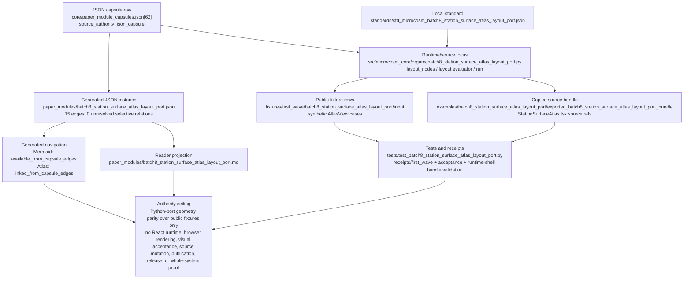

# Batch 8 StationSurfaceAtlas Layout Port

This organ ports the deterministic `StationSurfaceAtlas.tsx::layoutNodes`
hybrid shell packer to Python and exercises it over public synthetic
`AtlasView` rows.

The capsule is bounded to geometry parity. It does not start React, render a
browser, claim navigation graph authority, mutate source, authorize
publication, or approve release.

## Purpose

The atlas surface in the operator UI arranges dozens of navigation cards into a
readable grid. That arrangement is computed by one TypeScript function,
`layoutNodes`, which decides how many columns there are, how wide each column
grows, and where each card lands. The arrangement is not random: it groups
cards by shell (operate, missions, data, inspect, map, library, unassigned),
widens a column into parallel lanes when it holds too many cards, and sorts the
cards inside each group so that the ones a reader most needs to see sit at the
top.

The question this organ answers is narrow and testable: does a Python
reimplementation of that layout function place every node at the same
coordinate the original would? Visual layout code is easy to break silently. A
changed sort key or an off-by-one in the lane maths moves cards around without
raising an error, and the only way most teams notice is by squinting at a
screenshot. This organ removes the screenshot from the loop. It runs the same
geometry in Python over synthetic card rows and checks the exact column,
position, and summary values against a fixed expectation.

The part worth noticing is what is being checked, and what is not. The organ
does not start React, open a browser, or claim that the rendered screen looks
right. It checks only the deterministic geometry: given these cards, the packer
must produce these coordinates. That is a smaller claim than "the UI works", and
the page keeps it small on purpose. A correct layout function is a precondition
for a usable screen, not proof of one.

## JSON Capsule Binding

Source authority for this reader page is
`core/paper_module_capsules.json::paper_modules[62:paper_module.batch8_station_surface_atlas_layout_port]`;
the generated instance is
`paper_modules/batch8_station_surface_atlas_layout_port.json` with
`source_authority: json_capsule`.

This Markdown is a reader projection over the capsule, not the authority plane.
The generated Mermaid projection is `available_from_capsule_edges`, and the
Atlas card is linked from the same capsule edges; those projections help
navigation but do not expand the authority ceiling.

The proof boundary is deterministic Python layout-port validation over
synthetic `AtlasView` fixture rows and copied source refs only. A cold reader
should not treat this page, Mermaid availability, or Atlas linkage as React
runtime proof, browser visual acceptance, live navigation graph authority,
source mutation authority, publication approval, or release approval.

## JSON Capsule Boundary

The JSON capsule is the source of record for this reader projection. It binds
the page to the `batch8_station_surface_atlas_layout_port` organ, the resolving
public StationSurfaceAtlas layout mechanism subject, the import/projection
drift concept, the layout-port runtime locus, and the law/dependency edges
listed below.

The generated row currently exposes 15 capsule-derived relationship edges.
Mermaid is `available_from_capsule_edges`, Atlas is
`linked_from_capsule_edges`, and there are no unresolved selective relations.
Those projections make the capsule walkable; they do not start React, render a
browser, prove visual acceptance, grant live navigation authority, authorize
source mutation, approve publication, or approve release.

## Shape

The shape is a deterministic layout-port evidence chain. The source row
`core/paper_module_capsules.json::paper_modules[62:paper_module.batch8_station_surface_atlas_layout_port]`
is the authority for subjects, doctrine refs, generated projection status, and
the resolved code locus; `paper_modules/batch8_station_surface_atlas_layout_port.json`
is the generated instance; this Markdown remains the reader projection.



The capsule explains the `batch8_station_surface_atlas_layout_port` organ and
the public StationSurfaceAtlas layout mechanism, governs the row through
`concept.import_projection_and_drift_control_bundle`, principles `P-2`, `P-9`,
`P-15`, `P-16`, and axioms `AX-5`, `AX-7`, `AX-8`, `AX-10`, and cites
`src/microcosm_core/organs/batch8_station_surface_atlas_layout_port.py` as the
resolved runtime locus. The local standard keeps the fixture contract at
geometry parity: layout node positions, grouping, fallback behavior, negative
cases, source refs, digests, anchors, and body-free receipts are public-safe;
browser session state, screenshots, private runtime data, and visual release
claims are not.

The fixture path
`fixtures/first_wave/batch8_station_surface_atlas_layout_port/input` and the
exported bundle
`examples/batch8_station_surface_atlas_layout_port/exported_batch8_station_surface_atlas_layout_port_bundle`
provide the synthetic `AtlasView` rows and copied non-secret
`StationSurfaceAtlas.tsx` body floor. The focused pytest and receipt set prove
deterministic Python layout parity, bundle validation, negative cases, and
body-free receipt handling. Generated Mermaid and Atlas links are navigation
evidence only; they do not start React, render a browser, validate a visual
screen, mutate the navigation graph, approve publication, approve release, or
prove whole-system correctness.

## How the layout packer works

`layout_nodes` takes a list of `AtlasView` rows and returns three things: a
position for every node, a list of columns, and a summary of the resulting
geometry. It works in four stages, and the test fixtures pin the output of each.

First it buckets every card into one of seven shell groups in a fixed order
(operate, missions, data, inspect, map, library, unassigned). Any card whose
shell group is unrecognised falls back to `unassigned` rather than creating a
new column, so a future surface that names an unknown group never breaks the
grid. Only populated groups become columns.

Second it decides how many vertical lanes each column needs. A column with
fewer than five cards stays a single lane; five or more splits into two; eleven
or more splits into three. When there are at least five populated groups the
columns are also split across two stacked bands so the grid does not run off the
side of the screen.

Third it spends horizontal slack. Bands are rarely the same width, and a narrow
band leaves blank space beside the widest one. Rather than waste that space, the
packer repeatedly finds the tallest column in the narrow band and gives it an
extra lane, shortening it, until adding another lane would no longer make it
shorter or the band has run out of slack. This is the step the
`slack_lane_spend_required` negative exercise pins: a fifteen-card map group in
a narrow band must end up with five lanes, not the three its raw count alone
would imply.

Fourth it orders the cards inside each column. Most groups sort by capture
posture first, then by centrality, then alphabetically. Capture posture is the
notable choice: a card whose latest capture failed or timed out sorts to the
top of its column, ahead of a healthy high-traffic card, because a failure is
the thing an operator most needs to see. The `map` group is the exception. Its
cards follow a fixed pairing order (codemap, doctrine, ledger, reactions,
timeline, assimilation) so related map surfaces stay adjacent. The Python port
reproduces each of these sort keys exactly, and the `attention_sort_required`
exercise checks that a failed card really does land above a high-centrality
healthy one.

The summary the function returns records node, column, and lane counts plus a
blank-space ratio, so a drift in any stage shows up as a changed number in a
receipt rather than as a card that has quietly moved on screen.

## Reader Proof Boundary

A cold reader can validate this module by starting from the JSON capsule row,
then checking the generated JSON instance, exported `StationSurfaceAtlas.tsx`
bundle, synthetic `AtlasView` layout cases, geometry-parity receipt, bundle
validation receipt, and focused test. The proof is limited to deterministic
layout-port parity over public fixture rows.

The proof stops before React runtime behavior, browser visual acceptance, live
navigation graph authority, source mutation, publication, and release.
Generated Mermaid and Atlas availability are capsule projections, not UI proof.

## Public Site Availability Boundary

This Markdown is safe to project on the public site because it exposes public
layout fixtures, source refs, digest checks, validator commands, and authority
ceilings without exporting browser state, private runtime state, screenshots,
or live navigation graph mutation authority.

Public rendering may explain geometry parity. It must not claim a rendered UI,
browser acceptance, live navigation correctness, or release readiness.

## Public-Safe Body Handling

The public body floor is the copied non-secret `StationSurfaceAtlas.tsx` source
in the exported bundle. Receipts and cards should carry refs, digests, anchors,
layout counts, and parity verdicts only.

Future body refreshes must preserve the bundle manifest boundary and keep
copied body text, browser session state, private runtime data, screenshots, and
credential-equivalent material out of public receipts and site projections.

## Reader Evidence Routing

- Capsule route: read `core/paper_module_capsules.json::paper_modules[62]`
  before treating this Markdown as explanation.
- Generated route: inspect `paper_modules/batch8_station_surface_atlas_layout_port.json`
  for current edges and projection state.
- Bundle route: inspect `examples/batch8_station_surface_atlas_layout_port/exported_batch8_station_surface_atlas_layout_port_bundle`
  for copied layout-source refs and digest evidence.
- Runtime route: run `tests/test_batch8_station_surface_atlas_layout_port.py`
  and the commands in `## Validation Receipt Path`.

## Structured Lattice Bindings

The generated JSON row currently contributes 15 relationship edges derived from
the capsule's organ subject, resolved code locus, doctrine refs, and sibling
paper-module dependencies. The Mermaid projection is
`available_from_capsule_edges`; the Atlas projection is
`linked_from_capsule_edges`.

At this HEAD the generated instance reports zero unresolved selective
relations. If future capsule edits introduce residuals, this Markdown page may
name them but must not invent concept ids or promote candidate doctrine.

## Prior Art Grounding

This organ borrows from graph-layout and deterministic visualization-port
practice. Useful anchors include:

- The [Eclipse Layout Kernel](https://www.eclipse.org/elk/), especially its
  layered-layout tradition for arranging graph nodes and edges under explicit
  layout constraints.
- [d3-force](https://github.com/d3/d3-force), as a widely used JavaScript
  pattern for deterministic-ish graph simulation parameters over node/link
  data.
- [d3-sankey](https://github.com/d3/d3-sankey), as a prior art example of a
  layout generator that turns graph-like input into positioned nodes and
  links.

Microcosm borrows the layout-generator and graph-positioning shape, but keeps
the claim to Python-port geometry parity over synthetic `AtlasView` rows. It
does not claim browser rendering, React runtime acceptance, live navigation
authority, source mutation, or release approval.

## First Command

```bash
PYTHONPATH=src python3 -m microcosm_core.organs.batch8_station_surface_atlas_layout_port run \
  --input fixtures/first_wave/batch8_station_surface_atlas_layout_port/input \
  --out receipts/first_wave/batch8_station_surface_atlas_layout_port \
  --acceptance-out receipts/acceptance/first_wave/batch8_station_surface_atlas_layout_port_fixture_acceptance.json
```

## Validation Receipt Path

Reader-verifiable commands, run from the `microcosm-substrate/` public root:

```bash
PYTHONPATH=src python3 -m microcosm_core.organs.batch8_station_surface_atlas_layout_port run \
  --input fixtures/first_wave/batch8_station_surface_atlas_layout_port/input \
  --out /tmp/microcosm-batch8-station-surface-atlas-layout-vrp \
  --acceptance-out /tmp/microcosm-batch8-station-surface-atlas-layout-fixture-acceptance.json
PYTHONPATH=src python3 -m microcosm_core.organs.batch8_station_surface_atlas_layout_port validate-bundle \
  --input examples/batch8_station_surface_atlas_layout_port/exported_batch8_station_surface_atlas_layout_port_bundle \
  --out /tmp/microcosm-batch8-station-surface-atlas-layout-bundle-vrp
PYTHONPATH=src ../repo-pytest --disk-pressure-policy=warn \
  microcosm-substrate/tests/test_batch8_station_surface_atlas_layout_port.py -q \
  --basetemp /tmp/microcosm-batch8-station-surface-atlas-layout-tests
```

The fixture command writes the bounded geometry-parity receipt and acceptance
JSON. The bundle command validates the copied `StationSurfaceAtlas.tsx` source,
digest anchors, synthetic layout cases, receipt body scan, and source-boundary
metadata. The focused test checks layout parity, bundle validation, negative
cases, and the no-browser authority ceiling.

This receipt path is reader-verifiable evidence only. It does not start React,
render a browser, prove visual acceptance, mutate the navigation graph, mutate
source, authorize publication, or approve release.

## Receipt Expectations

A complete local receipt should include the organ run output, bundle validation
output, focused pytest result, and the generated-row proof from
`paper_modules/batch8_station_surface_atlas_layout_port.json`. The expected
generated-row proof is `edge_count: 15`, Mermaid
`available_from_capsule_edges`, Atlas `linked_from_capsule_edges`,
`source_authority: json_capsule`, and
`unresolved_selective_relation_count: 0`.

## Authority Ceiling

This is deterministic Python-port evidence over fixture inputs only. It is not
React runtime evidence, not browser visual acceptance, not live navigation
graph authority, not source mutation authority, and not release approval.

## Claim Ceiling

This paper module can claim a StationSurfaceAtlas layout port with a generated
diagram view and atlas linkage. It can explain deterministic Python-port layout
evidence over fixtures and body-free receipts.

It cannot claim React runtime evidence, browser visual acceptance, live
navigation-graph authority, source mutation, publication approval, release
approval, or whole-system correctness. Any stronger UI or navigation claim must
land in source authority and generated projections before Markdown narration.

## Source Reference

The exported bundle copies
`system/server/ui/src/components/world/home/StationSurfaceAtlas.tsx` under
`examples/batch8_station_surface_atlas_layout_port/exported_batch8_station_surface_atlas_layout_port_bundle/source_modules/`.
Receipts carry refs, digests, anchors, counts, and parity verdicts, not copied
body text, browser screenshots, or private runtime state.

## Mechanism Set

The validator requires shell-group banding, lane-threshold geometry, slack lane
spending, map-pair ordering, attention-posture sorting, unknown-group fallback,
and layout-receipt summary parity. Shared registry, acceptance, runtime-shell,
CLI, atlas, package-data, and generated docs wiring is intentionally deferred
while shared Microcosm core leases are active.
