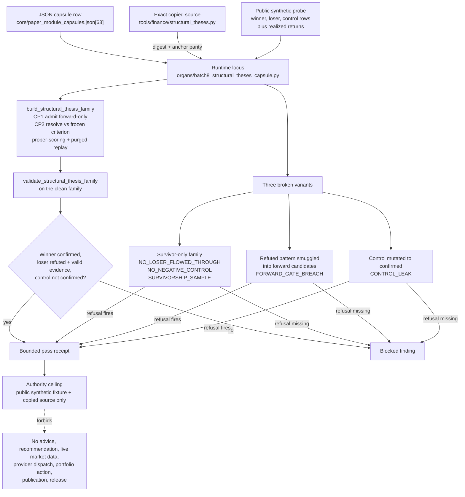

# Batch 8 Structural Theses Capsule

This organ imports `tools/finance/structural_theses.py` as exact copied
non-secret macro source and exercises it over public synthetic
structural-thesis fixtures.

The capsule is bounded to replayable CP1/CP2 thesis-family validation. It does
not authorize financial advice, investment recommendations, live market data,
provider calls, portfolio action, publication, or release.

## Purpose

The copied source, `tools/finance/structural_theses.py`, takes a tempting idea
and disciplines it. The tempting idea is that some market moves look
structurally obvious, so a corpus of "obvious" theses ought to predict the
next one. The trap is survivorship: it is easy to assemble a list of patterns
that worked in hindsight and call the list a method.

The single question the source answers is narrower and harder. Given claims
that looked structurally obvious at the time they were written, which reasoning
families still survive once you resolve every claim forward and keep the ones
that failed? The load-bearing inversion is that "obvious" is treated as a
claim-status frozen at commitment time, never as a label applied to outcomes
afterwards. A thesis whose meaning shifts once the result is known is a
post-hoc mutation, and the leakage guard rejects it.

What is unusual is that losers and negative controls are first-class, required
evidence rather than noise. A refuted thesis must flow through the same
pipeline as a confirmed one and stay legible as valid evidence; a negative
control must be present and must not resolve into a confirmed claim. The output
vocabulary deliberately has no tradable "winner": the strongest a surviving
pattern can earn is `review_candidate`, a flag for human review and nothing
more.

This capsule does not assert any of those findings as market truth. It imports
the source verbatim, runs it over public synthetic rows, and checks that the
discipline holds. It is not financial advice, an investment recommendation, or
live-market validation.

## What it validates

The organ loads the copied finance source, builds one public winner, loser, and
control family from a synthetic probe, and then exercises the source's own
validator over both the clean family and three deliberately broken variants.

The clean path confirms the at-time semantics survive a full run: the winner
resolves `claim_confirmed_forward`, the loser resolves `claim_refuted_forward`
and is marked valid evidence, the control resolves as a control without becoming
a confirmed claim, the surviving pattern lands in family memory as a
`candidate_set`, and the authority boundary keeps
`investment_recommendation_authorized` false. Under the hood the source maps
each thesis onto the existing forecast-claim shape and drives the real CP1
admission, CP2 resolution, proper-scoring replay, and purged walk-forward replay
with deterministic fixture prices rather than building a new evaluator.

The three negative exercises are the substance of the proof, because each one
forces a specific discipline to fire:

- **Survivor-only.** A family built from winners alone, with no failed thesis,
  must be rejected. The source raises `NO_LOSER_FLOWED_THROUGH`,
  `NO_NEGATIVE_CONTROL`, and `SURVIVORSHIP_SAMPLE`; the organ confirms all three
  appear (error code `BATCH8_STRUCTURAL_THESES_SURVIVOR_ONLY_REJECTED`).
- **Forward-gate breach.** A refuted pattern is smuggled into the forward
  review candidates. The source must raise `FORWARD_GATE_BREACH`, because only a
  pattern that survived at-time replay may produce a `review_candidate`
  (`BATCH8_STRUCTURAL_THESES_FORWARD_GATE_BREACH_REJECTED`).
- **Control leak.** A negative control is mutated to claim it confirmed forward.
  The source must raise `CONTROL_LEAK`
  (`BATCH8_STRUCTURAL_THESES_CONTROL_LEAK_REJECTED`).

If any of these refusals fails to fire, the organ records a blocked finding
rather than a pass. Alongside the family check it verifies exact digest parity
and required anchors for the copied source, so the page cannot drift away from
the code it claims to exercise. Receipts carry verdicts, counts, error codes,
and refs only; copied bodies, market data, and provider payloads stay out.

## JSON Capsule Binding

Source authority for this reader page is
`core/paper_module_capsules.json::paper_modules[63:paper_module.batch8_structural_theses_capsule]`;
the generated instance is
`paper_modules/batch8_structural_theses_capsule.json` with
`source_authority: json_capsule`.

This Markdown is a reader projection over the capsule, not the authority plane.
The generated Mermaid projection is `available_from_capsule_edges`, and the
Atlas card is linked from the same capsule edges; those projections help
navigation but do not expand the authority ceiling.

The proof boundary is deterministic fixture validation over public synthetic
thesis rows and copied source refs only. A cold reader should not treat this
page, Mermaid availability, Atlas linkage, or receipt presence as financial
advice, an investment recommendation, live-market validation, provider
dispatch, portfolio authority, publication approval, or release approval.

## JSON Capsule Boundary

The JSON capsule is the source of record for this reader projection. It binds
the page to the `batch8_structural_theses_capsule` organ, the resolving public
structural-theses mechanism subject, the import/projection drift concept, the
structural-theses runtime locus, and the law/dependency edges listed below.

The generated row currently exposes 20 capsule-derived relationship edges.
Mermaid is `available_from_capsule_edges`, Atlas is
`linked_from_capsule_edges`, and there are no unresolved selective relations.
Those projections make the capsule walkable; they do not prove financial
advice, investment recommendations, live-market validation, provider dispatch,
portfolio authority, publication approval, or release approval.

## Shape

This module's shape is capsule-first and projection-bounded. The source row is
`core/paper_module_capsules.json::paper_modules[63:paper_module.batch8_structural_theses_capsule]`;
the generated JSON instance is
`paper_modules/batch8_structural_theses_capsule.json`, and it preserves
`source_authority: json_capsule`. This Markdown is the reader projection over
that JSON row, not a source-authority flip.



The standards lane is split deliberately. The module-specific public runtime
standard,
`standards/std_microcosm_batch8_structural_theses_capsule.json`, governs the
fixture fields, public/private boundary, receipt contract, validator command,
negative-case count, and explicit anti-purpose. The wider
`codex/standards/std_microcosm.json::paper_module_coverage_contract` governs
how paper-module coverage, Atlas cards, generated Mermaid, and context-pack
depth stay navigable without promoting generated projections into source
truth.

The runtime/source lane is likewise bounded. The Microcosm organ
`src/microcosm_core/organs/batch8_structural_theses_capsule.py` loads the
copied structural-theses source, builds the winner/loser/control family,
evaluates survivor-only, forward-gate-breach, and control-leak negative
exercises, and writes body-free receipts. The exported bundle at
`examples/batch8_structural_theses_capsule/exported_batch8_structural_theses_capsule_bundle`
contains `source_module_manifest.json`; that manifest records 12 exact copied
non-secret macro modules for bundle validation, including
`source_modules/tools/finance/structural_theses.py`, while the first-wave
receipt narrows the copied-source proof to the structural-theses module itself.

The proof lane is fixture-level. The public fixture input under
`fixtures/first_wave/batch8_structural_theses_capsule/input` and the focused
regression `tests/test_batch8_structural_theses_capsule.py` validate digest and
anchor parity, thesis-family replay, winner/loser/control semantics, stable
negative cases, body exclusion, authority ceilings, and the runtime-shell
bundle path. Receipt evidence lives under
`receipts/first_wave/batch8_structural_theses_capsule/`,
`receipts/acceptance/first_wave/batch8_structural_theses_capsule_fixture_acceptance.json`,
and
`receipts/runtime_shell/demo_project/organs/batch8_structural_theses_capsule/exported_batch8_structural_theses_capsule_bundle_validation_result.json`.

The generated Mermaid and Atlas statuses are useful only as navigation
receipts: `available_from_capsule_edges` and `linked_from_capsule_edges` mean
the JSON capsule edges are walkable. They do not authorize financial advice,
investment recommendations, live-market validation, provider calls, portfolio
action, publication, release, private-root equivalence, or whole-system
correctness.

## Reader Proof Boundary

A cold reader can validate this module by starting from the JSON capsule row,
then checking the generated JSON instance, copied `structural_theses.py` bundle,
public winner/loser/control fixture rows, negative controls, bundle validation
receipt, and focused test. The proof is limited to deterministic thesis-family
validation over public synthetic rows.

The proof stops before financial advice, investment recommendation, live-market
validation, provider dispatch, portfolio action, publication, and release.
Generated Mermaid and Atlas availability are capsule projections, not market
truth or investment authority.

## Public Site Availability Boundary

This Markdown is safe to project on the public site because it exposes public
synthetic thesis rows, source refs, digest checks, control-case language,
validator commands, and authority ceilings without exporting private market
data, portfolio data, provider payloads, account state, or trading instructions.

Public rendering may explain fixture-level bias controls. It must not imply
advice, recommendations, live market performance, portfolio authority, or
release readiness.

## Public-Safe Body Handling

The public body floor is the copied non-secret finance source in the exported
bundle. Receipts and cards should carry refs, digests, anchors, fixture counts,
winner/loser/control verdicts, and anti-claims only.

Future body refreshes must keep copied body text, private market data, provider
payloads, account/session material, portfolio details, and credential-equivalent
material out of public receipts and site projections.

## Reader Evidence Routing

- Capsule route: read `core/paper_module_capsules.json::paper_modules[63]`
  before treating this Markdown as explanation.
- Generated route: inspect `paper_modules/batch8_structural_theses_capsule.json`
  for current generated state.
- Bundle route: inspect `examples/batch8_structural_theses_capsule/exported_batch8_structural_theses_capsule_bundle`
  for copied source refs and digest evidence.
- Runtime route: run `tests/test_batch8_structural_theses_capsule.py` and the
  commands in `## Validation Receipt Path`.

## Structured Lattice Bindings

The generated JSON row currently contributes 20 relationship edges derived from
the capsule's organ subject, resolved code locus, doctrine refs, and sibling
paper-module dependencies. The Mermaid projection is
`available_from_capsule_edges`; the Atlas projection is
`linked_from_capsule_edges`.

At this HEAD the generated instance reports zero unresolved selective
relations. If future capsule edits introduce residuals, this Markdown page may
name them but must not invent concept ids or promote candidate doctrine.

## Prior Art Grounding

This capsule borrows from empirical-finance validation and bias-control
patterns. Useful anchors include:

- Fama and French's
  [common risk factors](https://mba.tuck.dartmouth.edu/pages/faculty/ken.french/data_library.html)
  work and data-library tradition, as a precedent for decomposing structural
  market claims into named factor families and testable rows.
- MacKinlay's
  [event-study methodology](https://www.bu.edu/econ/files/2011/01/MacKinlay-1996-Event-Studies-in-Economics-and-Finance.pdf),
  as a prior pattern for separating an event window, expected baseline, and
  abnormal-return evidence.
- Brown, Goetzmann, Ibbotson, and Ross on
  [survivorship bias](https://terpconnect.umd.edu/~wermers/ftpsite/FAME/Brown_Goetzmann_Ibbotson_Ross.pdf),
  which motivates explicit loser/control cases rather than winner-only thesis
  replay.

Microcosm borrows the factor-family, event-window, and bias-control shape, but
keeps the organ to public synthetic thesis rows and copied source. It is not
financial advice, an investment recommendation, live-market validation,
portfolio authority, publication approval, or release approval.

## First Command

```bash
PYTHONPATH=src python3 -m microcosm_core.organs.batch8_structural_theses_capsule run \
  --input fixtures/first_wave/batch8_structural_theses_capsule/input \
  --out receipts/first_wave/batch8_structural_theses_capsule \
  --acceptance-out receipts/acceptance/first_wave/batch8_structural_theses_capsule_fixture_acceptance.json
```

## Validation Receipt Path

Reader-verifiable commands, run from the `microcosm-substrate/` public root:

```bash
PYTHONPATH=src python3 -m microcosm_core.organs.batch8_structural_theses_capsule run \
  --input fixtures/first_wave/batch8_structural_theses_capsule/input \
  --out /tmp/microcosm-batch8-structural-theses-vrp \
  --acceptance-out /tmp/microcosm-batch8-structural-theses-fixture-acceptance.json
PYTHONPATH=src python3 -m microcosm_core.organs.batch8_structural_theses_capsule validate-bundle \
  --input examples/batch8_structural_theses_capsule/exported_batch8_structural_theses_capsule_bundle \
  --out /tmp/microcosm-batch8-structural-theses-bundle-vrp
PYTHONPATH=src ../repo-pytest --disk-pressure-policy=warn \
  microcosm-substrate/tests/test_batch8_structural_theses_capsule.py -q \
  --basetemp /tmp/microcosm-batch8-structural-theses-tests
```

The fixture command writes the bounded thesis-family receipt and acceptance
JSON. The bundle command validates copied source refs, digest anchors, public
winner/loser/control cases, negative controls, body-exclusion posture, and
authority-ceiling fields. The focused test checks fixture validation, bundle
validation, survivor-bias refusal, control-leak refusal, and claim boundaries.

This receipt path is reader-verifiable evidence only. It is not financial
advice, not an investment recommendation, not live-market validation, not
provider dispatch, not portfolio authority, not publication approval, and not
release approval.

## Receipt Expectations

A complete local receipt should include the organ run output, bundle validation
output, focused pytest result, and the generated-row proof from
`paper_modules/batch8_structural_theses_capsule.json`. The expected
generated-row proof is `edge_count: 20`, Mermaid
`available_from_capsule_edges`, Atlas `linked_from_capsule_edges`,
`source_authority: json_capsule`, and
`unresolved_selective_relation_count: 0`.

## Authority Ceiling

This is deterministic fixture evidence over public synthetic thesis rows and
exact copied source only. It is not advice, not an investment recommendation,
not live-market validation, not provider dispatch, not portfolio authority, not
publication approval, and not release approval.

## Claim Ceiling

This paper module demonstrates a bounded structural-theses fixture: deterministic
validation over public synthetic thesis rows, exact copied source refs, and
body-free receipts. A diagram view is generated for this module and it appears
in the Atlas navigation surface.

It cannot claim advice, investment recommendation, live-market validation,
provider dispatch, portfolio authority, publication approval, release approval,
private-root equivalence, or whole-system correctness. Higher claims must be
authorized by the JSON capsule and generated projection state first.

## Source Reference

The exported bundle copies `tools/finance/structural_theses.py` under
`examples/batch8_structural_theses_capsule/exported_batch8_structural_theses_capsule_bundle/source_modules/`.
Receipts carry refs, digests, anchors, counts, and runtime verdicts, not copied
body text, provider payloads, market data, or private runtime state.

## Mechanism Set

The validator requires exact source digest parity, structural-thesis source
anchors, a public winner/loser/control family, valid loser evidence, a negative
control that does not become a confirmed claim, and rejection of survivor-only,
forward-gate-breach, and control-leak exercises. Shared registry, acceptance,
runtime-shell, CLI, atlas, package-data, and generated docs wiring is
intentionally deferred while shared Microcosm core leases are active.
