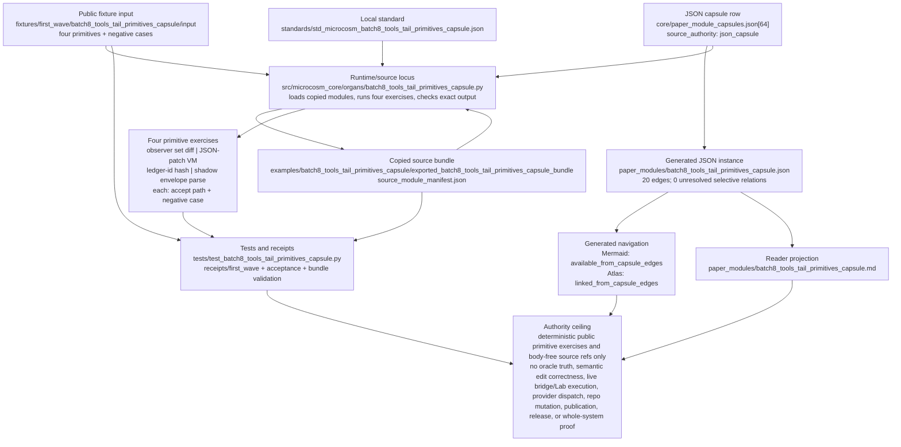

# Batch 8 Tools-Tail Primitives Capsule

This organ imports four Batch-8 tools-tail primitives as exact copied
non-secret macro source bodies plus bounded public exercises: observer set
diffing, JSON patch interpretation, ledger identity hashing, and shadow
envelope parse coverage.

The capsule is intentionally source-open and bounded. It exercises pure
mechanics over synthetic public fixtures. It does not run GodMode, call
providers, execute live bridge work, mutate repositories, export private lab
artifacts, claim oracle truth, authorize publication, or approve release.

## Purpose

When a piece of tooling is copied from the private system into the public
substrate, the obvious question is whether the copy still behaves the way the
original did, or whether it has quietly drifted into a stub that only looks
right. This capsule answers that one question for four small "tools-tail"
primitives: does the copied source body, when run on a fixed public input,
still produce the exact output the original would?

The unusual choice here is that the capsule does not re-describe the
primitives or re-implement them. It loads the copied module straight from the
exported bundle and runs the real functions, then checks the results against
hard-coded expected values. If the copy were a hollow shell, the assertion
would fail rather than pass with a green tick. The evidence is therefore
behavioural, not merely a digest match: the code is executed, not just hashed.

What it deliberately does not do is treat any of that execution as truth about
the world. Diffing two sets of observer rows is set arithmetic, not a claim
that either set is correct. Applying a JSON patch is interpreting an edit
script, not a claim that the edit is the right one. The capsule keeps the gap
between "the mechanism runs as copied" and "the answer is correct" explicit,
which is why the authority ceiling refuses oracle truth, prediction
correctness, and semantic edit correctness even though real code ran.

## JSON Capsule Binding

Source authority for this reader page is
`core/paper_module_capsules.json::paper_modules[64:paper_module.batch8_tools_tail_primitives_capsule]`;
the generated instance is
`paper_modules/batch8_tools_tail_primitives_capsule.json` with
`source_authority: json_capsule`.

This Markdown is a reader projection over the capsule, not the authority plane.
The generated Mermaid projection is `available_from_capsule_edges`, and the
Atlas card is linked from the same capsule edges; those projections help
navigation but do not expand the authority ceiling.

The proof boundary is deterministic public tools-tail fixture validation and
copied macro source refs only. A cold reader should not treat this page,
Mermaid availability, Atlas linkage, or receipt presence as oracle truth,
prediction correctness, semantic edit correctness, Lab execution authority,
live bridge authority, provider dispatch, repository mutation authority,
publication approval, or release approval.

## JSON Capsule Boundary

The JSON capsule is the source of record for this reader projection. It binds
the page to the `batch8_tools_tail_primitives_capsule` organ, the resolving
public tools-tail primitives mechanism subject, the import/projection drift
concept, the tools-tail runtime locus, and the law/dependency edges listed
below.

The generated row currently exposes 20 capsule-derived relationship edges.
Mermaid is `available_from_capsule_edges`, Atlas is
`linked_from_capsule_edges`, and there are no unresolved selective relations.
Those projections make the capsule walkable; they do not prove oracle truth,
prediction correctness, semantic edit correctness, Lab/bridge execution
authority, repository mutation, publication approval, or release approval.

## Shape

The shape is a tools-tail primitive evidence map. The JSON capsule row
`core/paper_module_capsules.json::paper_modules[64:paper_module.batch8_tools_tail_primitives_capsule]`
is the source of record; the generated instance
`paper_modules/batch8_tools_tail_primitives_capsule.json` carries the
capsule-derived relationship graph; this Markdown is a reader projection over
that graph.



The capsule explains the `batch8_tools_tail_primitives_capsule` organ and the
public tools-tail mechanism, binds the import/projection drift concept plus the
principle and axiom edges, and resolves the runtime locus to
`src/microcosm_core/organs/batch8_tools_tail_primitives_capsule.py`. The local
standard keeps the evidence to four primitive mechanics: observer set diffs,
JSON-patch interpretation, ledger identity hashing, and shadow-envelope parse
coverage. Public evidence may include primitive ids, source refs, digests,
anchors, counts, stable negative cases, body-free receipt posture, and
authority ceilings; it must not include private lab artifacts, provider
payloads, bridge payloads, account/session state, or credential-equivalent
material.

The fixture path
`fixtures/first_wave/batch8_tools_tail_primitives_capsule/input` and exported
bundle
`examples/batch8_tools_tail_primitives_capsule/exported_batch8_tools_tail_primitives_capsule_bundle`
hold the public inputs and exact copied non-secret source modules. The focused
test and receipts prove fixture mechanics, bundle validation, negative cases,
source-module digest/anchor posture, and no body text in receipts. Generated
Mermaid and Atlas links only make the capsule edges walkable; they do not
authorize live tool execution, bridge work, provider dispatch, repository
mutation, publication approval, release approval, or whole-system correctness.

## How it works

The evaluator loads four copied modules by manifest reference and runs one
bounded exercise against each, comparing the live output to a fixed expected
value. A primitive passes only when every checked field matches.

- Observer set diff. The copied `diff_evidence` and `diff_predictions`
  functions take two lists of rows keyed by id and partition them. For
  evidence, three lab rows and two oracle rows resolve to one overlap, one
  missed id, and one extra id; a row with no `ledger_id` is dropped rather
  than crashing the diff. For predictions, rows are split into matching,
  divergent, and missing-target sets. The exercise also asserts the dropped
  malformed row never appears in the serialised result, so a parse gap cannot
  leak through as silent data.
- Version committer JSON-patch VM. The copied `_apply_op` interprets a small
  set of edit operations (`set`, `merge`, `append`) over a nested document by
  path. The exercise applies four ops, checks the resulting document exactly,
  and confirms that attempting to traverse into a scalar (`/profile/name` where
  `profile` is a string) raises `VersionCommitterError` instead of corrupting
  the document. The interesting property is the refusal: a malformed path is a
  controlled error, not a partial write.
- Ledger-id identity hash. The copied `generate_ledger_id` produces a stable id
  from a lane and a record. The exercise checks that the lane alias `poly` and
  `POLYMARKET` normalise to the same canonical lane and hash to the same id, so
  the id is identity-stable across spelling; an unknown lane falls back to an
  `X_` prefix; and a record missing the identity field its lane requires raises
  `ValueError` rather than hashing a blank.
- Shadow envelope parser coverage. The copied `run` parses a small envelope DSL
  (miner tuples, a spine line, prediction rows) written into a temporary run
  directory. The exercise feeds it one well-formed line and one malformed tuple
  per node, then checks that parsing did not hard-fail, that the well-formed
  rows parsed, and that the malformed tuple was counted as a `comma_arity`
  coverage gap. The point is that the parser reports its own coverage holes
  rather than swallowing them.

Each exercise also has a matching negative case (`EXPECTED_NEGATIVE_CASES`)
that re-runs the same code on input designed to be rejected and confirms the
rejection. So for every primitive the page shows both the accepting path and
the refusing path. None of these checks open a network, a provider, or the
live bridge; they run copied source bodies in process and keep the bodies out
of the receipts.

## Reader Proof Boundary

A cold reader can validate this module by starting from the JSON capsule row,
then checking the generated JSON instance, exported tools-tail source bundle,
observer-diff, JSON-patch, ledger-id, and shadow-envelope exercises, negative
cases, bundle validation receipt, and focused test. The proof is limited to
deterministic primitive mechanics over public synthetic fixtures.

The proof stops before oracle truth, prediction correctness, semantic edit
correctness, live bridge execution, Lab authority, provider dispatch,
repository mutation, publication, and release. Generated Mermaid and Atlas
availability are capsule projections, not live tool authority.

## Public Site Availability Boundary

This Markdown is safe to project on the public site because it exposes primitive
ids, source refs, digest checks, negative cases, validator commands, and
authority ceilings without exporting private lab artifacts, provider payloads,
bridge state, live repository paths, or private runtime state.

Public rendering may explain deterministic primitive exercise coverage. It must
not claim oracle truth, live bridge authority, semantic edit correctness, or
release readiness.

## Public-Safe Body Handling

The public body floor is the exported bundle manifest plus exact copied
non-secret macro sources. Receipts and cards should carry source refs, digests,
anchors, counts, exercise outcomes, negative cases, and anti-claims only.

Future body refreshes must keep copied body text, private lab artifacts,
provider payloads, bridge payloads, account/session state, and
credential-equivalent material out of public receipts and site projections.

## Reader Evidence Routing

- Capsule route: read `core/paper_module_capsules.json::paper_modules[64]`
  before treating this Markdown as explanation.
- Generated route: inspect `paper_modules/batch8_tools_tail_primitives_capsule.json`
  for the current generated instance.
- Bundle route: inspect `examples/batch8_tools_tail_primitives_capsule/exported_batch8_tools_tail_primitives_capsule_bundle`
  for the copied macro source modules.
- Runtime route: run `tests/test_batch8_tools_tail_primitives_capsule.py` and
  the commands in `## Validation Receipt Path`.

## Structured Lattice Bindings

The generated JSON row currently contributes 20 relationship edges derived from
the capsule's organ subject, resolved code locus, doctrine refs, and sibling
paper-module dependencies. The Mermaid projection is
`available_from_capsule_edges`; the Atlas projection is
`linked_from_capsule_edges`.

At this HEAD the generated instance reports zero unresolved selective
relations. If future capsule edits introduce residuals, this Markdown page may
name them but must not invent concept ids or promote candidate doctrine.

## Prior Art Grounding

This capsule borrows from standardized patch formats, transparency-log
identity patterns, provenance metadata, and parser coverage practice. Useful
anchors include:

- IETF [RFC 6902](https://datatracker.ietf.org/doc/html/rfc6902), which
  defines JSON Patch operations such as add, remove, replace, move, copy, and
  test.
- IETF [RFC 9162](https://www.rfc-editor.org/rfc/rfc9162), where
  Certificate Transparency uses an append-only Merkle tree as an auditable log
  pattern.
- W3C [PROV](https://www.w3.org/TR/prov-overview/), for representing the
  provenance of derived artifacts and their generating activities.

Microcosm borrows the patch-operation, identity-hash, append-only-log, and
provenance shapes, but keeps this capsule at deterministic fixture exercises.
It does not claim oracle truth, semantic edit correctness, live bridge
authority, provider dispatch, repository mutation authority, or release
approval.

## First Command

```bash
PYTHONPATH=src python3 -m microcosm_core.organs.batch8_tools_tail_primitives_capsule run \
  --input fixtures/first_wave/batch8_tools_tail_primitives_capsule/input \
  --out receipts/first_wave/batch8_tools_tail_primitives_capsule \
  --acceptance-out receipts/acceptance/first_wave/batch8_tools_tail_primitives_capsule_fixture_acceptance.json
```

## Validation Receipt Path

Reader-verifiable commands, run from the `microcosm-substrate/` public root:

```bash
PYTHONPATH=src python3 -m microcosm_core.organs.batch8_tools_tail_primitives_capsule run \
  --input fixtures/first_wave/batch8_tools_tail_primitives_capsule/input \
  --out /tmp/microcosm-batch8-tools-tail-primitives-vrp \
  --acceptance-out /tmp/microcosm-batch8-tools-tail-primitives-fixture-acceptance.json
PYTHONPATH=src python3 -m microcosm_core.organs.batch8_tools_tail_primitives_capsule validate-bundle \
  --input examples/batch8_tools_tail_primitives_capsule/exported_batch8_tools_tail_primitives_capsule_bundle \
  --out /tmp/microcosm-batch8-tools-tail-primitives-bundle-vrp
PYTHONPATH=src ../repo-pytest --disk-pressure-policy=warn \
  microcosm-substrate/tests/test_batch8_tools_tail_primitives_capsule.py -q \
  --basetemp /tmp/microcosm-batch8-tools-tail-primitives-tests
```

The fixture command writes the bounded tools-tail primitives receipt and
acceptance JSON. The bundle command validates copied macro sources, manifest
digests, observer-diff, JSON-patch, ledger-id, and shadow-envelope exercises,
body-exclusion posture, and authority-ceiling fields. The focused test checks
fixture mechanics, bundle validation, negative cases, and the no-live-bridge
claim ceiling.

This receipt path is reader-verifiable evidence only. It is not oracle truth,
not prediction correctness, not semantic edit correctness, not live bridge or
Lab execution authority, not provider dispatch, not repository mutation
authority, not publication approval, and not release approval.

## Receipt Expectations

A complete local receipt should include the organ run output, bundle validation
output, focused pytest result, and the generated-row proof from
`paper_modules/batch8_tools_tail_primitives_capsule.json`. The expected
generated-row proof is `edge_count: 20`, Mermaid
`available_from_capsule_edges`, Atlas `linked_from_capsule_edges`,
`source_authority: json_capsule`, and
`unresolved_selective_relation_count: 0`.

## Authority Ceiling

This is deterministic public-substrate evidence over fixture inputs only. It is
not oracle truth, not prediction correctness, not semantic edit correctness,
not provenance by itself, not Lab execution authority, not live Oracle bridge
authority, not repository mutation authority, not provider dispatch, and not
release approval.

## Claim Ceiling

This paper module can claim a tools-tail primitives fixture with a diagram view
generated for navigation. It can explain deterministic public-substrate checks
over fixture inputs and body-free source-module receipts.

It cannot claim oracle truth, prediction correctness, semantic edit correctness,
provenance sufficiency by itself, Lab execution authority, live Oracle bridge
authority, repository mutation authority, provider dispatch, publication
approval, release approval, or whole-system correctness. Stronger claims must
land in capsule authority plus regenerated projections.

## Source Modules

The exported bundle copies the relevant macro sources under
`examples/batch8_tools_tail_primitives_capsule/exported_batch8_tools_tail_primitives_capsule_bundle/source_modules/`.
Receipts carry source refs, digests, anchors, counts, and exercise outcomes,
not copied body text or private state.

## Mechanism Set

The validator requires exactly these four mechanism rows: observer set diff
kernel, version-committer JSON patch VM, ledger-id identity hash engine, and
shadow envelope DSL parser coverage.

The source module manifest requires four exact copied macro source modules. The
fixture requires four stable negative cases, one per mechanism row. Shared
registry, acceptance, runtime-shell, CLI, atlas, and generated docs wiring is
intentionally deferred while the existing shared Microcosm core lease is active.
