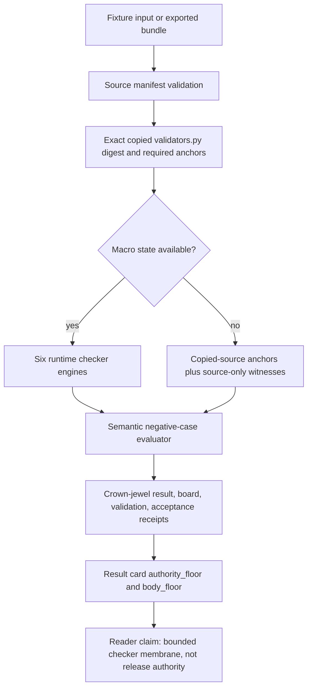

# Batch 8 Validator Checker Capsule

## Role

This module imports the real
`self-indexing-cognitive-substrate/src/idea_microcosm/validators.py` body into
Microcosm and exercises individual checker functions that were not covered by
the earlier status-judge-only import.

## Prior Art Grounding

This capsule borrows from schema validation, fixture-driven testing, and
policy/checker separation. Useful anchors include:

- [JSON Schema](https://json-schema.org/), as a general pattern for declaring
  structural expectations and validating data instances against them.
- [pytest fixtures](https://docs.pytest.org/en/stable/reference/fixtures.html),
  as a common test pattern for isolating public inputs and expected negative
  cases.
- [Open Policy Agent](https://www.openpolicyagent.org/docs/latest), as a prior
  art pattern for separating policy evaluation from the application code that
  invokes it.

Microcosm borrows the validator/checker and fixture-negative-case shape, but
keeps this organ to bounded checker exercises over copied public source. It is
not release authority, hosted-public proof, source mutation authority, or a
complete validator-suite proof.

## Imported substrate

- `self-indexing-cognitive-substrate/src/idea_microcosm/validators.py`

## JSON Capsule Binding

Source authority for this reader page is
`core/paper_module_capsules.json::paper_modules[65:paper_module.batch8_validator_checker_capsule]`;
the generated instance is
`paper_modules/batch8_validator_checker_capsule.json` with
`source_authority: json_capsule`.

This Markdown is a reader projection over the capsule, not the authority plane.
The generated Mermaid projection is `available_from_capsule_edges`, and the
Atlas card is linked from the same capsule edges; those projections help
navigation but do not expand the authority ceiling.

The proof boundary is selected public checker-group fixture validation plus
copied validator-source evidence only. A cold reader should not treat this
page, Mermaid availability, Atlas linkage, or receipt presence as release
authority, hosted-public proof, source mutation authority, provider-call
authority, complete validator-suite proof, publication approval, or release
approval.

## JSON Capsule Boundary

The JSON capsule is the source of record for this reader projection. It binds
the page to the `batch8_validator_checker_capsule` organ, the resolving public
validator-checker mechanism subject, the agent reliability and safety validator
concept, the validator-checker runtime locus, and the law/dependency edges
listed below.

The generated row currently exposes 22 capsule-derived relationship edges.
Mermaid is `available_from_capsule_edges`, Atlas is
`linked_from_capsule_edges`, and there are no unresolved selective relations.
Those projections make the capsule walkable; they do not prove the complete
validator suite, provide hosted-public proof, authorize source mutation, or
approve release.

## Reader Proof Boundary

A cold reader can validate this module by starting from the JSON capsule row,
then checking the generated JSON instance, copied validator-source bundle,
selected checker-group fixture rows, no-write validation entrypoint, bundle
validation receipt, and focused test. The proof is limited to bounded checker
exercises over copied public source.

The proof stops before complete validator-suite proof, hosted-public proof,
source mutation authority, provider calls, publication, and release. Generated
Mermaid and Atlas availability are capsule projections, not release authority.

## Technical Mechanism

The runtime does not ask the reader to trust the phrase "validator checker." It
builds a small checker membrane around a single imported source body and then
records how far that membrane reaches.

The source-anchor phase reads
`examples/batch8_validator_checker_capsule/exported_batch8_validator_checker_capsule_bundle/source_module_manifest.json`.
That manifest declares one exact copied module under the public bundle-relative
locus
`source_modules/self-indexing-cognitive-substrate/src/idea_microcosm/validators.py`,
with a 12,747-line body and digest
`4b2d44810cb9db2c5f62fd39da55deb7f20f6bd44ed1a8b0ae4324d38012a1d4`.
Here the root segment is a manifest-included public synthetic Microcosm root.
The private macro-root path is lineage-only and remains excluded from public
copy; the checker validates the copied bundle body, not live private source.
`_validator_source_anchor_matrix` checks that the copied body still contains
the named validator anchors: `private_boundary_hits`,
`policy_wellformedness_failures`, `judge_status_request`,
`_status_collapse_suite_failures`, `_source_shuttle_specimen_failures`, and
`validate(root: Path)`.

The checker-exercise phase then runs six bounded engines when macro state is
available: source anchoring, status-policy judging, private-boundary scanning,
specimen checker groups, release-gate checker groups, and the no-write
`validate(root, write_receipt=False)` witness. In exported-bundle mode, where a
public runtime should not import private macro state, the same organ falls back
to copied-source anchor evidence and marks the remaining engines as
`public_runtime_source_only`. That fallback is a claim ceiling, not a hidden
pass-through to private state.

The negative-case phase is semantic rather than fixture-string-only. The organ
declares six failure modes: missing validator source, policy poisoning, blind
private-boundary scanning, missing specimen checkers, missing release gates, and
bypassing the validate entrypoint. `evaluate_negative_case` observes those
cases from the engine outputs, so the tests can prove the negative cases move
with runtime evidence instead of passing because a fixture file contains the
right error code.

The receipt phase uses the shared crown-jewel runner to write result, board,
validation, and acceptance artifacts, then `result_card` deliberately compresses
them into an authority floor and body floor. Those card fields keep
`release_authorized`, `publication_authorized`, `provider_dispatch`,
`model_dispatch`, `source_mutation_authorized`,
`full_validator_suite_freshness_claim`, `public_clone_or_hosting_authority`,
and `test_completeness_proof` false while also preserving `body_in_receipt:
false`.

## Shape



## Doctrine Relation

The generated JSON row binds this page to
`mechanism.batch8_validator_checker_capsule.validates_public_validator_checker_capsule`
and `concept.agent_reliability_and_safety_validator_bundle`; that relation is
capsule-declared rather than inferred from this prose. The capsule also names
the axiom refs `AX-1`, `AX-4`, `AX-5`, `AX-7`, `AX-8`, `AX-11`, and `AX-12`
and the principle refs `P-1`, `P-2`, `P-5`, `P-6`, `P-8`, `P-9`, `P-13`, and
`P-15`. In this module those refs matter because the organ separates evidence
from authority, keeps JSON as the navigable contract, prevents body leakage,
and refuses to promote a selected checker run into a release or proof claim.

The dependency edges also explain the reader route. `microcosm_axiom_substrate`
owns the axiom vocabulary this module abides by;
`engine_room_generated_projection_drift_gate` owns the generated-projection
freshness posture this page must not bypass; and `public_reveal_walkthrough`
owns the public-safe reading lane for receipts, source refs, and anti-claims.

## Evidence Model and Limitations

The strongest positive evidence is narrow and useful: the focused regression
checks that all expected engines are present, the exact copied source body
matches the macro source digest, exported-bundle validation does not import
macro validators, source-anchor corruption blocks validation, result cards omit
private bodies, and semantic negative cases fail when runtime evidence is
weakened.

The limitations are just as important. Exported-bundle mode validates copied
source anchors and public-runtime witness fields; it does not re-run the full
macro validator suite. The fixture proves selected checker groups and selected
negative cases, not all future validator behavior. The copied source body being
large does not itself increase the claim; only the named anchors, engines,
digests, negative cases, and receipt fields are evidence. A green run therefore
supports a bounded checker-membrane claim and nothing broader.

## Public Site Availability Boundary

This Markdown is safe to project on the public site because it exposes checker
groups, copied-source refs, digest checks, validator commands, negative cases,
and authority ceilings without exporting private body text, provider payloads,
account/session state, or live source mutation authority.

Public rendering may explain which checker groups are exercised. It must not
claim a complete validator suite, hosted-public proof, or release readiness.

## Public-Safe Body Handling

The public body floor is the exported bundle manifest plus the copied
non-secret validator source. Receipts and cards should carry refs, digests,
selected checker-group counts, negative cases, body-exclusion scans, and
authority ceilings only.

Future body refreshes must keep copied body text, private boundary hits,
provider payloads, account/session state, hosted-public secrets, and
credential-equivalent material out of public receipts and site projections.

## Reader Evidence Routing

- Capsule route: read `core/paper_module_capsules.json::paper_modules[65]`
  before treating this Markdown as explanation.
- Generated route: inspect `paper_modules/batch8_validator_checker_capsule.json`
  for current relationship state and projection details.
- Bundle route: inspect `examples/batch8_validator_checker_capsule/exported_batch8_validator_checker_capsule_bundle`
  for copied validator source refs and digest evidence.
- Runtime route: run `tests/test_batch8_validator_checker_capsule.py` and the
  commands in `## Validation Receipt Path`.

## Structured Lattice Bindings

The generated JSON row currently contributes 22 relationship edges derived from
the capsule's organ subject, resolved code locus, doctrine refs, and sibling
paper-module dependencies. The Mermaid projection is
`available_from_capsule_edges`; the Atlas projection is
`linked_from_capsule_edges`.

At this HEAD the generated instance reports zero unresolved selective
relations. If future capsule edits introduce residuals, this Markdown page may
name them but must not invent concept ids or promote candidate doctrine.

## Exercised checker groups

- Policy well-formedness and status transition judging.
- Private boundary scanning without putting private body text into receipts.
- Status collapse, control-plane, correction, self-comprehension, task-ledger, and atlas navigation specimen checkers.
- Release standards, source capsule, source shuttle, concurrency, native guard, and release-root compiler gate checkers.
- The no-write `validate(root, write_receipt=False)` entrypoint.

## Authority Ceiling

The capsule is not release authority, not hosted-public proof, not source mutation authority, and not a complete validator-suite proof.

## Claim Ceiling

This paper module can claim a bounded validator/checker fixture with a diagram
view and Atlas navigation generated for it. It can explain the declared checker
groups, no-write validation entrypoint, and body-free receipt boundary.

It cannot claim release authority, hosted-public proof, source mutation
authority, complete validator-suite proof, publication approval, provider
authority, or whole-system correctness. Any broader checker claim must be
grounded in the JSON capsule and its generated projection.

## Validation Receipt Path

Reader-verifiable commands, run from the `microcosm-substrate/` public root:

```bash
PYTHONPATH=src python3 -m microcosm_core.organs.batch8_validator_checker_capsule run \
  --input fixtures/first_wave/batch8_validator_checker_capsule/input \
  --out /tmp/microcosm-batch8-validator-checker-vrp \
  --acceptance-out /tmp/microcosm-batch8-validator-checker-fixture-acceptance.json
PYTHONPATH=src python3 -m microcosm_core.organs.batch8_validator_checker_capsule validate-bundle \
  --input examples/batch8_validator_checker_capsule/exported_batch8_validator_checker_capsule_bundle \
  --out /tmp/microcosm-batch8-validator-checker-bundle-vrp
PYTHONPATH=src ../repo-pytest --disk-pressure-policy=warn \
  microcosm-substrate/tests/test_batch8_validator_checker_capsule.py -q \
  --basetemp /tmp/microcosm-batch8-validator-checker-tests
```

The fixture command writes the bounded validator-checker receipt and acceptance
JSON. The bundle command validates copied checker source, manifest digests,
selected checker-group exercises, body-exclusion scans, and authority-ceiling
fields. The focused test checks fixture validation, bundle validation,
private-boundary scanning, and the no-complete-suite-proof claim ceiling.

This receipt path is reader-verifiable evidence only. It does not prove the
complete validator suite, authorize source mutation, provide hosted-public
proof, dispatch providers, authorize publication, or approve release.

## Receipt Expectations

A complete local receipt should include the organ run output, bundle validation
output, focused pytest result, and the generated-row proof from
`paper_modules/batch8_validator_checker_capsule.json`. The expected
generated-row proof is `edge_count: 22`, Mermaid
`available_from_capsule_edges`, Atlas `linked_from_capsule_edges`,
`source_authority: json_capsule`, and
`unresolved_selective_relation_count: 0`.
