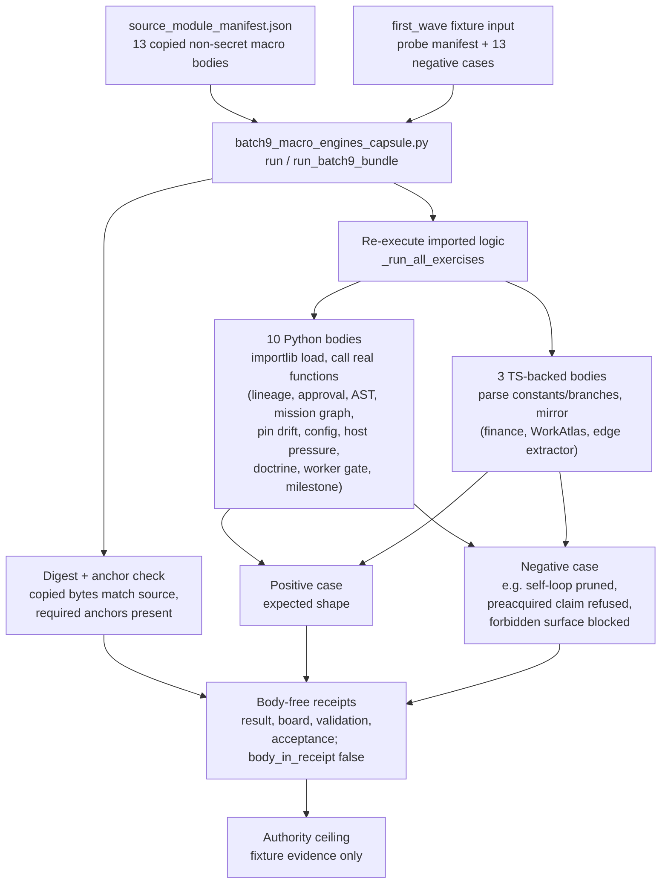

# Batch 9 Macro Engines Capsule

## Purpose

Copying a file into a public bundle proves only that the bytes match. It does
not prove that the imported logic still behaves the way it did in the larger
system it came from. This organ exists to close that gap for thirteen
backend, governance, and frontend data-shaping modules. The single question it
answers is: do these copied source bodies still compute what they claim to
compute, when run against bounded fixtures, here in the public repository?

The unusual part is how it checks. Rather than asserting against pre-baked
result files, the organ loads each copied module and calls its real functions.
It imports `system/lib/approval_registry.py` and runs `decide_approval` against
a temporary approvals tree to confirm a pre-acquired claim is refused. It
imports `system/lib/python_documentation_tree.py` and runs `build_file_entry`
over written-out Python to read symbols back. It runs the copied mission-graph
compiler, the dependency-pin parser, the config-authority registry validator,
the host-pressure admission builder, the worker budget guard, and the milestone
metric computer, each on its own fixture. The three TypeScript bodies for
finance clustering, edge extraction, and WorkAtlas aggregation are parsed for
their load-bearing constants and branches, then mirrored deterministically. Each exercise carries both a
positive shape and a paired negative case, so the proof moves with source
behaviour, not with a static receipt.

The reader should treat the result as fixture-bound evidence and nothing more.
A passing capsule shows that representative mechanics still match the imported
bodies under positive and negative cases. It does not assert live lineage
truth, approval authority, real market or news truth, host-state truth, Work
Ledger truth, provider dispatch, source mutation, publication, or release
approval.

## Abstract

Batch 9 Macro Engines Capsule is a public Microcosm paper module for a
source-open, body-import-backed organ. The organ copies thirteen non-secret
macro source bodies into
`examples/batch9_macro_engines_capsule/exported_batch9_macro_engines_capsule_bundle/source_modules/`,
checks their digests and required anchors, then runs deterministic public
exercises over fixture data. The result is a reproducible evidence capsule for
backend, governance, frontend data-shaping, worker-gate, and quality-accounting
mechanics without granting live system authority.

The useful claim is narrow: the copied bodies and public fixtures can show that
representative mechanics still behave like the imported source bodies under
bounded positive and negative cases. They do not prove live lineage truth,
approval authority, market or news truth, host-state truth, Work Ledger truth,
provider dispatch, source mutation, publication, release approval, private-root
equivalence, or whole-system correctness.

## Telos

This module exists to make the Batch-9 import legible as technical evidence
rather than as generic public copy. A cold reader should be able to answer four
questions:

- Which source bodies were copied, and how are they checked?
- Which mechanisms are exercised, and which ones are source-body-sensitive?
- Which receipts prove only fixture truth, and which claims remain forbidden?
- How does this organ relate to the Microcosm concept/mechanism/principle
  lattice?

## Mechanism Map



The runtime source is
`src/microcosm_core/organs/batch9_macro_engines_capsule.py`. Its load-bearing
symbols are `EXPECTED_MECHANISMS`, `EXPECTED_MODULE_IDS`,
`EXPECTED_NEGATIVE_CASES`, `SOURCE_REQUIRED_ANCHORS`, `AUTHORITY_CEILING`,
`run`, `run_batch9_bundle`, and `result_card`.

## Batch-9 Pipeline

The Batch-9 pipeline has four stages.

1. **Source import.** `source_module_manifest.json` declares thirteen copied
   non-secret macro bodies, each with `source_ref`, copied target path,
   digest equality fields, line and byte counts, material class, and required
   anchors. The manifest states `source_import_class:
   copied_non_secret_macro_body`, `body_copied_material_count: 13`, and
   `body_in_receipt: false`.

2. **Fixture execution.** `run` consumes
   `fixtures/first_wave/batch9_macro_engines_capsule/input`, including
   `batch9_macro_engines_capsule_probe_manifest.json` plus thirteen
   negative-case files. It writes the result, board, validation receipt, and
   optional acceptance JSON.

3. **Exported-bundle validation.** `run_batch9_bundle` validates
   `examples/batch9_macro_engines_capsule/exported_batch9_macro_engines_capsule_bundle`.
   The bundle manifest names `exported_batch9_macro_engines_capsule_bundle` as
   the input mode, points at `source_module_manifest.json`, and declares
   thirteen negative cases.

4. **Receipt and ceiling.** The public receipts may expose refs, digests,
   anchors, counts, verdicts, negative-case outcomes, and omission evidence.
   They must not inline copied macro bodies or private/live payloads.

## Mechanism Set

| Mechanism id | Imported source body | What the public exercise checks |
|---|---|---|
| `lineage_temporal_provenance_chain_resolver` | `system/server/lineage.py` | Parent/truth lineage chain behavior and self-loop pruning. |
| `approval_sign_off_claim_adjudicator` | `system/lib/approval_registry.py` | Approval decision shape and claim-conflict enforcement. |
| `python_ast_symbol_index_doc_tree` | `system/lib/python_documentation_tree.py` | Python AST symbol extraction, including async/function/class coverage. |
| `finance_news_dedup_cluster_ranker` | `system/server/ui/src/lib/financePresentation.ts` | Headline fingerprinting, stopword behavior, and duplicate clustering. |
| `mission_graph_topological_compiler` | `system/server/graph.py` | DAG compilation, group closure, upstream dependency walk, and missing-target handling. |
| `dependency_pin_drift_auditor` | `tools/dev/check_pin_drift.py` | Requirement parsing and drift/missing/unparseable classification. |
| `config_authority_drift_audit` | `system/lib/config_authority_registry.py` | Config authority registry validation and mutation-allowed rejection. |
| `heterogeneous_graph_edge_extractor` | `system/server/ui/src/pages/RootNavigator.tsx` | Generic edge-field map extraction and relation normalization. |
| `work_atlas_cell_histogram_aggregator` | `system/server/ui/src/components/intelligence/WorkAtlas.tsx` | Cell aggregation and the unrouted-only route-reason histogram gate. |
| `host_pressure_admission_decision_gate` | `system/lib/admission_consumer.py` | Admission normalization and summary-first blocking behavior. |
| `doctrine_file_enrichment_multihop_join` | `system/server/doctrine_enrichment.py` | File-to-doctrine enrichment join and empty-envelope detection. |
| `worker_job_budget_forbidden_surface_gate` | `system/lib/type_a_worker_harness.py` | Provider budget and forbidden-surface pre-dispatch gates. |
| `milestone_relative_promotion_quality_accounting` | `system/lib/population_lane_metrics.py` | Milestone-relative promotion metrics and blocker-to-next-action classification. |

Several tests deliberately mutate copied source bodies in a temporary public
bundle and refresh the manifest digest. Finance, lineage, approval, AST,
mission graph, dependency, config, WorkAtlas, heterogeneous edge, doctrine,
worker-gate, host-pressure, and milestone tests prove the exercise result moves
with source-body behavior rather than with static receipt fixtures alone.
Two tamper modes are load-bearing: an unapproved copied-body edit without a
manifest digest refresh fails `CROWN_JEWEL_SOURCE_DIGEST_MISMATCH`, while a body
edit with a refreshed digest is only accepted when the required witnesses and
semantic exercise still pass. Removing a required witness while refreshing the
digest still fails `CROWN_JEWEL_SOURCE_ANCHOR_MISSING`. The fixture path also
resolves through the copied source-module manifest, so a fixture-only or static
receipt replacement is outside the accepted proof shape.

## Copied-Body and Import Authority

The source-module manifest is the body-import authority for this paper module.
It proves that the public bundle contains copied non-secret bodies and that the
runtime can compare copied target digests with expected source digests and
required anchors. It does not make the Markdown source authority.

The authority chain is:

- `core/paper_module_capsules.json::paper_modules[73:paper_module.batch9_macro_engines_capsule]`
  is the paper-module capsule source row.
- `paper_modules/batch9_macro_engines_capsule.json` is the governed generated
  instance derived from that capsule.
- `organs/batch9_macro_engines_capsule.json` and
  `mechanisms/mechanism.batch9_macro_engines_capsule.validates_public_macro_engines_capsule.json`
  bind the accepted organ and mechanism to the runtime, receipts, and claim
  ceiling.
- `standards/std_microcosm_batch9_macro_engines_capsule.json` defines the
  public standard: exactly thirteen mechanisms, exactly thirteen copied macro
  source modules, body-free receipts, and forbidden live-authority claims.

## Current Partial-Realness Limitations

Batch 9 is real substrate progress because it copies source bodies and verifies
source-sensitive behavior in public fixtures. It is still partial-realness, not
live authority.

- The lineage exercise is a public provenance specimen, not live lineage truth.
- The approval exercise checks adjudication mechanics, not human approval
  authority.
- The finance exercise checks headline clustering over synthetic rows, not
  real market truth, investment advice, or news-truth authority.
- The host-pressure exercise checks admission-consumer behavior over quoted
  fixtures, not host-state truth.
- The WorkAtlas, worker-gate, and milestone exercises validate bounded
  mechanics, not live Work Ledger authority or provider dispatch readiness.
- The generated Markdown/JSON/site projections remain navigation and reader
  surfaces; source authority stays in JSON contracts, source manifests, tests,
  and receipts.

## Failure Modes

The standard and tests protect against these failure modes:

- Mechanism count drifts away from thirteen.
- Source-module count drifts away from thirteen without manifest and test
  updates.
- The source manifest stops declaring `copied_non_secret_macro_body`.
- A copied source body changes without a matching manifest digest update.
- A copied source body loses required anchors, even if the manifest digest is
  refreshed.
- Runtime exercises stop checking named engine semantics and become receipt-only
  assertions.
- Negative-case files declare error codes that the semantic evaluator does not
  actually observe.
- Receipts include copied body text, raw operator transcripts, provider/browser
  state, credentials, live market data, private runtime state, or source bodies.
- Public prose expands fixture evidence into release, publication, provider,
  source-mutation, live-system, or private-root-equivalence authority.

## Evidence Contract

Run these commands from `microcosm-substrate/`:

```bash
PYTHONPATH=src ../repo-python -m microcosm_core.organs.batch9_macro_engines_capsule run \
  --input fixtures/first_wave/batch9_macro_engines_capsule/input \
  --out /tmp/microcosm-batch9-macro-engines-fixture-vrp \
  --acceptance-out /tmp/microcosm-batch9-macro-engines-fixture-acceptance.json \
  --card

PYTHONPATH=src ../repo-python -m microcosm_core.organs.batch9_macro_engines_capsule validate-bundle \
  --input examples/batch9_macro_engines_capsule/exported_batch9_macro_engines_capsule_bundle \
  --out /tmp/microcosm-batch9-macro-engines-bundle-vrp \
  --acceptance-out /tmp/microcosm-batch9-macro-engines-bundle-acceptance.json \
  --card

PYTHONPATH=src ../repo-python -m pytest -p no:cacheprovider \
  --basetemp=/tmp/microcosm-batch9-macro-engines-tests \
  -q tests/test_batch9_macro_engines_capsule.py

PYTHONPATH=src ../repo-python scripts/build_doctrine_projection.py --check-paper-module-corpus
PYTHONPATH=src ../repo-python scripts/build_doctrine_projection.py --check
```

The fixture command proves the public fixture path. The bundle command proves
the exported bundle path. The focused test suite covers exact-copy source
imports, source-sensitive behavior shifts, copied-body digest mismatch blocking,
source-import-class perturbation, required-witness removal with a refreshed
digest, semantic negative cases, bundle validation, and body-free command cards.
The doctrine projection checks prove only that the capsule-backed generated
instance remains fresh for the current corpus. Rank saturation, rerank, and
projection inheritance remain downstream routing work; this paper module does
not apply or claim those projection mutations.

## JSON Capsule Binding

- Source row:
  `core/paper_module_capsules.json::paper_modules[73:paper_module.batch9_macro_engines_capsule]`
- `source_authority: json_capsule`
- This Markdown is a reader projection. The generated Mermaid projection and
  generated Atlas projection are navigation surfaces derived from the capsule
  edges; they are not source authority.
- The proof boundary is the public source-body import fixture, the exported
  bundle, the thirteen deterministic exercises, semantic negative cases,
  exact-copy digest checks, body-free validation receipts, and the authority
  ceiling in the capsule and standard.
- The authority ceiling excludes live lineage truth, human approval authority,
  market/news truth, host-state truth, Work Ledger truth, provider dispatch,
  source mutation, publication, release approval, private-root equivalence, and
  whole-system correctness.

## Structured Lattice Bindings

- Subject: `organ:batch9_macro_engines_capsule`
- Mechanism:
  `mechanism.batch9_macro_engines_capsule.validates_public_macro_engines_capsule`
- Concept: `concept.import_projection_and_drift_control_bundle`
- Code locus: `src/microcosm_core/organs/batch9_macro_engines_capsule.py`
- Governing principles: `P-2`, `P-5`, `P-9`, `P-15`
- Axiom boundaries: `AX-4`, `AX-8`, `AX-10`, `AX-11`
- Dependencies: `paper_module.macro_projection_import_protocol`,
  `paper_module.batch7_macro_engines_capsule`,
  `paper_module.work_landing_control_spine`

The generated paper-module instance contains no unpopulated selective
relations for this row. Future edge changes belong in
`core/paper_module_capsules.json` followed by doctrine projection regeneration,
not in Markdown inference.

## Reader Evidence Routing

Use this order when auditing the module:

1. Read `standards/std_microcosm_batch9_macro_engines_capsule.json` for the
   governing standard and anti-claims.
2. Read `src/microcosm_core/organs/batch9_macro_engines_capsule.py` for
   expected mechanisms, expected modules, required source anchors, negative-case
   semantics, and authority ceiling.
3. Read `examples/batch9_macro_engines_capsule/exported_batch9_macro_engines_capsule_bundle/source_module_manifest.json`
   for copied-body authority.
4. Run the fixture and bundle validators, then the focused tests.
5. Treat receipts as body-free evidence summaries, not as copied body storage
   or live-system proof.

## Public-Safe Body Handling

Public-safe surfaces may expose mechanism ids, source refs, copied target refs,
digests, anchor names, counts, verdicts, negative-case ids, generated-row
status, and acceptance receipt paths. They must not expose copied macro body
text in receipts, private macro-root paths, provider payload bodies, raw
operator voice, account/session state, browser/HUD/cockpit state, credentials,
live market data, raw Work Ledger bodies, or private runtime state.

Exact-copy body drift belongs to the source-open refresh lane. Markdown should
describe the boundary and route to the manifest, not paste or paraphrase copied
source bodies.

## Claim Ceiling

This module may claim fixture-bound evidence that the organ ran over public synthetic inputs and produced the receipts and projections described above, reproduced by the validation receipts named on this page.

It may not claim more than its capsule authority ceiling allows: Fixture-bound public source-body import and deterministic exercise evidence only; no live lineage truth, human approval authority, real market/news truth, host-state truth, Work Ledger truth, provider dispatch, source mutation, publication, release approval, or private-root equivalence.

## Prior Art Grounding

This capsule imports copied non-secret macro engine bodies and exercises them over fixtures. It follows the characterization, or golden-master, testing tradition ([Feathers, Working Effectively with Legacy Code](https://en.wikipedia.org/wiki/Characterization_test)), which pins existing behaviour with deterministic fixtures before trusting it. Microcosm borrows the pin-then-exercise shape; the result is fixture-bound import evidence, not lineage truth, human-approval authority, or market truth.

## Validation Receipt Path

Reader-verifiable commands, run from the `microcosm-substrate/` public root:

```bash
PYTHONPATH=src python3 -m pytest tests/test_batch9_macro_engines_capsule.py -q
PYTHONPATH=src python3 scripts/build_doctrine_projection.py --check-paper-module-corpus
```

The focused test exercises this organ's fixture and bundle expectations; the corpus check confirms the capsule, generated Mermaid projection, Atlas card, and this Markdown projection stay mutually consistent. These are reader-verifiable evidence only and do not authorize release, provider dispatch, source mutation, or whole-system correctness.
