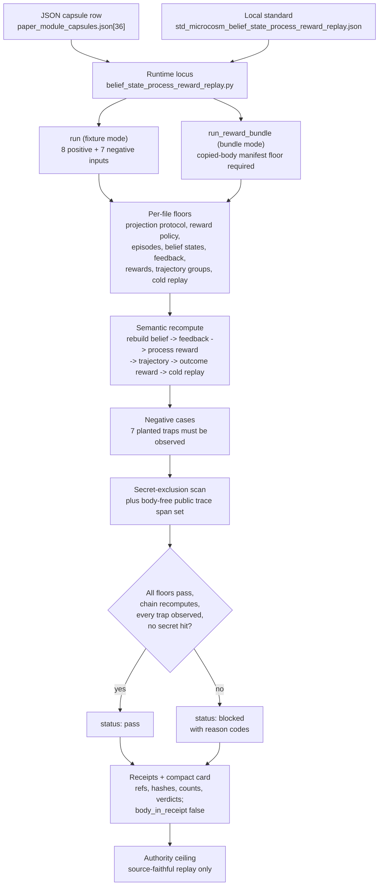

# Belief-State Process Reward Replay

This module is the public Microcosm projection of a belief-state process reward
claim contract. It is now backed by the public agent-execution trace refactor
lane plus copied non-secret macro source bodies, not by fixture echo as product
evidence, and it is not a
hidden-reasoning export, live RL run, neural-judge-only label set, hidden-gold
benchmark, provider call, source mutation, benchmark-score claim, or release
claim.

The public bundle models three partially observable tasks: terminal
investigation, mock purchase, and formal-planning toy. A process-reward claim is
admitted only when public observation digests, typed belief-state summaries,
predicted next evidence, verifier or observed feedback refs, belief-discrepancy
scores, dense process rewards, outcome rewards, reward-hacking trap results,
trajectory groups, cold replay receipts, negative cases, authority ceilings, and
a source-faithful public trace span set line up.

## Purpose

Process-reward language is easy to assert and hard to verify. A row can claim
that a step earned a reward "for good reasoning" while the underlying evidence is
a hidden gold label, a neural-judge guess, or formatting that gamed the scorer.
This organ exists to answer one narrow question: does a public process-reward
claim actually reconstruct from lower-level public evidence, or is it just a
label asserting its own correctness?

The interesting part is the recomputation. The validator does not trust any
single fixture file. Beyond checking each file's own floor, `validate_semantic_recompute`
walks every belief state and tries to rebuild the whole chain around it: the
episode it belongs to, the verifier feedback it cites, the process reward that
scored it, the trajectory group that contains it, the outcome reward attached to
that trajectory, and the cold-replay receipt that should reproduce it. If any of
those refs is missing or points somewhere inconsistent, the claim is blocked
with a specific reason code rather than passed. A reward cannot point at a belief
that points at a different episode, or cite feedback that belongs to another
trajectory, and still count.

That cross-referential check is what separates this from a shape linter. The
failure mode it guards against is a process-reward claim that looks correct field
by field but does not survive being recomputed end to end. Two further design
choices keep the result honest: outcome rewards are carried beside process
rewards so a final answer cannot be re-labelled as step-level evidence, and every
belief summary, feedback ref, and reward event stays body-free, so the validator
proves the accounting structure without ever reading hidden reasoning.

## JSON Capsule Binding

- Source authority:
  `core/paper_module_capsules.json::paper_modules[36:paper_module.belief_state_process_reward_replay]`
  with `source_authority: json_capsule`.
- Generated instance:
  `paper_modules/belief_state_process_reward_replay.json`.
- This Markdown is a reader projection. The generated Mermaid projection is
  `available_from_capsule_edges`; the generated Atlas projection is
  `linked_from_capsule_edges`. Capsule edges govern the machine-readable
  wiring.
- The authority ceiling is the source-faithful belief-state process-reward
  replay and copied non-secret macro-body boundary.
- The proof boundary is restricted to public belief summaries,
  verifier-backed feedback refs, process/outcome reward separation,
  reward-hacking traps, cold replay, negative cases, trace-span refs, and
  validation receipts. It does not establish hidden reasoning export, live RL,
  neural-judge sufficiency, benchmark scores, provider behavior, source
  mutation, publication, or release authority.

## Shape

The authoritative shape is the JSON capsule row
`core/paper_module_capsules.json::paper_modules[36:paper_module.belief_state_process_reward_replay]`
and its generated JSON instance
`paper_modules/belief_state_process_reward_replay.json`; this Markdown remains
a reader projection until the round-trip builder owns it. The local governing
standard is
`standards/std_microcosm_belief_state_process_reward_replay.json`, whose
authority boundary is synthetic belief-state process-reward replay only, not
live training, benchmark, provider, source-mutation, publication, or release
authority.



The generated instance reports eight relationship edges and zero unpopulated
selective relations: it explains the `belief_state_process_reward_replay`
organ and the validating mechanism, is governed by `P-1`, `P-2`, and
`concept.agent_reliability_and_safety_validator_bundle`, abides by `AX-1`,
depends on `paper_module.agent_route_observability_runtime`, and cites
`src/microcosm_core/organs/belief_state_process_reward_replay.py` as the
resolved code locus. The organ atlas adds the human/agent gloss and receipt
set; it classifies the evidence as `algorithmic_projection` and restates that
the validator operates on recorded synthetic fixtures rather than live agent
behavior.

The fixture manifest
`fixtures/first_wave/belief_state_process_reward_replay/fixture_manifest.json`
names eight positive input files and seven planted negative cases:
hidden-chain-of-thought export, neural-judge-only labels, hidden gold labels,
reward-by-formatting, verifier bypass, benchmark-performance claims, and
final-answer-only scoring. The exported bundle manifest carries the source-open
body floor: seven copied non-secret macro modules under `source_modules/`,
checked by digest and anchor refs, with `body_text_exported_in_receipts:
false`. The focused test file
`tests/test_belief_state_process_reward_replay.py` covers the fixture
validator, exported bundle validator, public-root copy, negative cases, exact
macro body imports, and route/receipt shape.

The honest ceiling is therefore narrow: this module can support public,
body-free belief-state process-reward replay over synthetic tasks with
verifier-backed process feedback, separated outcome rewards, cold replay, and
negative-case coverage. It cannot support hidden reasoning export, live RL,
reward-model quality, hidden-gold benchmark standing, provider behavior, source
mutation, publication approval, release approval, or whole-system correctness.

## Governing Lattice Relation

The governing lattice relation is that belief-state process-reward language is
admissible only after the runtime recomputes the claim from lower-level public
evidence. The generated JSON instance resolves eight edges and leaves no
selective relation open: the capsule explains the
`belief_state_process_reward_replay` organ and
`mechanism.belief_state_process_reward_replay.validates_public_belief_state_process_reward_replay`,
is governed by `concept.agent_reliability_and_safety_validator_bundle`,
`P-1`, and `P-2`, abides by `AX-1`, depends on
`paper_module.agent_route_observability_runtime`, and cites
`src/microcosm_core/organs/belief_state_process_reward_replay.py` as the code
locus.

That relation matters because the module is not trying to make reward quality
plausible from a label. `P-1` requires recomputation rather than echoing fixture
verdicts, so `_build_result` rechecks projection protocol, reward policy,
episodes, belief rows, feedback rows, reward rows, trajectory groups, cold
replay, expected negative cases, secret-exclusion scans, public trace shape, and
copied source-module manifests. `P-2` and `AX-1` then lower the paper claim to
what those checks derive: a local replay certificate over declared public
inputs. The focused proof consumer is
`tests/test_belief_state_process_reward_replay.py`, which exercises both
fixture and exported-bundle modes, mutates real positive feedback linkage,
rejects digest and manifest boundary violations, verifies exact macro-body
imports, checks freshness over live source authority, and confirms the command
card omits full payload keys.

## Structured Lattice Bindings

- Capsule row: `core/paper_module_capsules.json::paper_modules[36:paper_module.belief_state_process_reward_replay]`.
- Subject edges: explains organ `belief_state_process_reward_replay` and
  mechanism
  `mechanism.belief_state_process_reward_replay.validates_public_belief_state_process_reward_replay`.
- Doctrine edges: governed by principles `P-1` and `P-2`, governed by concept
  `concept.agent_reliability_and_safety_validator_bundle`, abides by axiom
  `AX-1`, and depends on `paper_module.agent_route_observability_runtime`.
- Runtime code locus:
  `src/microcosm_core/organs/belief_state_process_reward_replay.py` with
  `run`, `run_reward_bundle`, `_build_result`, `_write_receipts`, and
  `result_card`.
- Generated row proof: eight resolved relationship edges, no unresolved
  selective relations, Mermaid `available_from_capsule_edges`, and Atlas
  `linked_from_capsule_edges`.

## Reader Evidence Routing

Read this page from the structured bindings outward. The bindings name the organ,
mechanism, concept, dependency module, runtime code locus, principle and axiom
refs. The fixture receipts, bundle receipts, and focused test then
show the body-free replay behavior. This page explains that chain for
readers.

## Reader Proof Boundary

The proof boundary is public process-reward replay over synthetic tasks with
public belief summaries, verifier-backed feedback refs, separated process and
outcome rewards, reward-hacking traps, cold replay receipts, copied non-secret
macro bodies, and negative cases. It does not prove hidden reasoning export,
live RL training, neural-judge sufficiency, hidden-gold benchmark quality,
provider behavior, source mutation, publication, release, or whole-system
correctness.

## Technical Mechanism

The runtime validator is a two-mode replay checker. In fixture mode, `run`
loads eight positive fixture files plus the seven planted negative inputs named
by `EXPECTED_NEGATIVE_CASES`; `_build_result` then validates the projection
protocol, reward policy, task episodes, belief states, verifier feedback,
reward events, trajectory groups, cold replay, negative cases, secret-exclusion
scan, and public trace projection before `_write_receipts` writes the result,
board, validation, and acceptance receipts. A pass requires all required
positive floors to pass, every expected negative case to be observed, zero
secret-scan blocking hits, public trace status `pass`, and no positive finding
outside the expected falsification cases.

In exported-bundle mode, `run_reward_bundle` validates the public bundle without
negative inputs and makes the copied-body floor mandatory. The
`source_module_manifest.json` path must declare seven copied non-secret macro
body modules, `body_in_receipt: false`, `body_text_in_receipt: false`, public
material classes, exact source/target digests, existing copied targets, and all
declared anchors. Digest mismatch, missing manifest, wrong body class,
receipt-body leakage, count mismatch, missing target, and missing anchor cases
block the bundle instead of degrading silently.

Between the per-file floors and the receipts sits `validate_semantic_recompute`,
which is where most of the real work happens. It indexes episodes, belief states,
feedback, reward events, trajectory groups, and cold replays by id, then walks
each belief state and rebuilds its chain. It checks that the cited feedback
belongs to the same episode, that the process reward references the same belief,
episode, trajectory, feedback ref, and belief-discrepancy value, that the
trajectory actually lists that episode and that reward, that the trajectory's
outcome reward is a real outcome event for the same episode, and that the cold
replay both exists and passes. Any inconsistency appends a precise reason code
such as `feedback_episode_mismatch`, `belief_discrepancy_mismatch`, or
`trajectory_process_reward_missing`, and a single blocked row is enough to block
the whole result. This is the check that a label-only fixture cannot fake: the
references have to recompute into one coherent chain, not merely be present.

The validator links process-reward claims to public belief summaries rather than
private reasoning. `build_public_belief_state_process_reward_trace` emits six
body-free trace spans from the exported bundle, and the card path reports only
compact counts, status, freshness digest, source-body floor metadata, and
receipt refs. `CARD_OMITTED_FULL_PAYLOAD_KEYS` keeps findings, scans, trace
bodies, row payloads, source imports, authority ceiling, and anti-claim text out
of the command card so public surfaces carry proof handles rather than copied
private or macro bodies.

## Named Proof Consumers

- `microcosm_core.organs.belief_state_process_reward_replay.run` is the
  first-wave fixture consumer. It writes result, board, validation, and
  acceptance receipts for the synthetic episodes and negative-case floor.
- `microcosm_core.organs.belief_state_process_reward_replay.run_reward_bundle`
  is the exported bundle consumer. It validates copied non-secret macro bodies,
  public trace spans, digest/anchor contracts, and body-free receipt behavior.
- `microcosm_core.organs.belief_state_process_reward_replay.result_card` is the
  compact public card consumer. It reports counts and validation state while
  omitting the heavy/private payload classes named by
  `CARD_OMITTED_FULL_PAYLOAD_KEYS`.
- `tests/test_belief_state_process_reward_replay.py` is the focused regression
  consumer. It asserts the three episode groups, six belief states, six process
  rewards, three outcome rewards, three cold replays, seven expected negative
  cases, exact macro-body imports, digest mismatch blockers, manifest-boundary
  blockers, public-relative redacted receipts, fresh-card reuse, and body-free
  public trace projection.
- `microcosm_core.macro_tools.agent_execution_trace.build_public_belief_state_process_reward_trace`
  is the trace-projection consumer. It converts the exported bundle into six
  public spans with belief-state, feedback, process-reward, outcome-reward, and
  cold-replay coverage while preserving `body_in_receipt: false`.

## Public Site Availability Boundary

A public site or Atlas card may cite this module as a source-faithful replay
validator only when it preserves the receipt refs, anti-claims, and authority
ceiling. Public copy must not turn the replay into a benchmark-score,
model-quality, live-provider, or release-readiness claim.

## Public-Safe Body Handling

Receipts and public cards may expose refs, hashes, counts, trace-span ids,
belief summaries, reward events, verdicts, and negative-case outcomes. They must
not inline hidden reasoning, private source bodies, provider payloads, live RL
state, private labels, account/session material, or credential-equivalent
access data.

## Public Mechanics

- Belief-state JSON is a public summary, not hidden chain-of-thought.
- Process rewards must cite deterministic verifier or observed environment
  feedback refs; neural-judge-only labels are rejected.
- Outcome rewards are carried beside process rewards so final answers cannot
  masquerade as process evidence.
- Reward-hacking traps and cold replay receipts must pass for each trajectory
  group.
- `microcosm_core.macro_tools.agent_execution_trace::
  build_public_belief_state_process_reward_trace` turns the public bundle into
  ordered trace spans that preserve belief, verifier, process-reward,
  outcome-reward, and cold-replay refs while keeping bodies out of receipts.
- `examples/belief_state_process_reward_replay/
  exported_belief_state_process_reward_bundle/source_module_manifest.json`
  verifies exact copied macro bodies for the extracted-pattern ledger,
  high-novelty reconstruction receipt, canonical organ model, agent-execution
  trace runtime, trace standard, and route-readiness checker. Those bodies live
  in `source_modules/`; receipts carry refs, hashes, counts, and verdicts only.
- Hidden reasoning export, hidden gold labels, reward-by-formatting, verifier
  bypass, benchmark-performance claims, and final-answer-only scoring are
  expected falsification fixtures.

## Prior Art Grounding

This organ is grounded in three older ideas: belief-state tracking under partial
observability, process supervision, and reward-hacking controls. The belief
lineage comes from POMDP work such as Kaelbling, Littman, and Cassandra's
[Planning and Acting in Partially Observable Stochastic Domains](https://people.smp.uq.edu.au/YoniNazarathy/Control4406_2014/resources/KaelblingLittmanCassandra1998.pdf).
The process-reward lineage follows OpenAI's
[Let's Verify Step by Step](https://arxiv.org/abs/2305.20050), where step-level
feedback is separated from outcome-only supervision. The reward-hacking lineage
comes from [Concrete Problems in AI Safety](https://openai.com/index/concrete-ai-safety-problems/)
and related work on specification gaming.

Microcosm does not train a reward model or expose hidden reasoning. It borrows
the accounting form: public belief summaries, verifier-backed process feedback,
outcome rewards kept separate from process rewards, reward-hacking traps, and
cold replay receipts before process-reward language is admitted.

## Limitations

The replay is intentionally small and synthetic. It covers three partially
observable task families, six accepted belief summaries, six process rewards,
three outcome rewards, three trajectory groups, three cold replays, seven
negative cases in fixture mode, and seven copied non-secret macro modules in
exported-bundle mode. Those counts are proof boundaries, not scale claims. They
show that the public validator can separate belief summaries, verifier-backed
process feedback, outcome rewards, reward-hacking traps, and cold replay under
declared fixtures.

The mechanism does not estimate reward-model calibration, generalize to unseen
tasks, compare agent policies, certify live training behavior, or score a
benchmark. `build_public_belief_state_process_reward_trace` emits body-free
trace spans, so it can prove trace structure and privacy boundaries, not hidden
reasoning fidelity. The copied-source manifest proves exact declared public
macro bodies and anchors for this bundle; it does not authorize private macro
root export, provider dispatch, source mutation, publication, or release.

## Validation Receipt Path

Run the first-wave fixture validator from the repo root and write its receipt
outside the repo working tree:

```bash
cd microcosm-substrate && PYTHONPATH=src ../repo-python -m microcosm_core.organs.belief_state_process_reward_replay run --input fixtures/first_wave/belief_state_process_reward_replay/input --out /tmp/belief_state_process_reward_receipt --acceptance-out /tmp/belief_state_process_reward_acceptance.json --card > /tmp/belief_state_process_reward_card.json
```

Then run the exported bundle validator:

```bash
cd microcosm-substrate && PYTHONPATH=src ../repo-python -m microcosm_core.organs.belief_state_process_reward_replay run-reward-bundle --input examples/belief_state_process_reward_replay/exported_belief_state_process_reward_bundle --out /tmp/belief_state_process_reward_bundle_receipt --card > /tmp/belief_state_process_reward_bundle_card.json
```

## Receipt Expectations

Receipts should preserve:

- public belief summaries and task episodes
- verifier feedback refs
- process-reward and outcome-reward events
- reward-hacking traps and trajectory groups
- cold-replay status
- trace-span refs
- source-module manifest checks
- authority-ceiling booleans

They should not include hidden reasoning bodies, hidden gold labels, provider
payloads, live RL run ids, private source bodies, benchmark-score claims, or
release claims. The useful signal is that public process feedback remains
separable from final-answer outcome reward and survives cold replay with
negative cases observed.

The focused regression test and corpus projection checks are:

```bash
cd microcosm-substrate && ../repo-pytest microcosm-substrate/tests/test_belief_state_process_reward_replay.py
./repo-python microcosm-substrate/scripts/build_doctrine_projection.py --check-paper-module-corpus
```

The receipt path proves body-free public belief-state process-reward replay
over synthetic tasks, not hidden reasoning export, live RL, or reward-model
quality.

## Authority Ceiling

Source-faithful refactored fixtures and copied non-secret macro bodies only;
not fixture-echo product evidence, hidden reasoning export, live RL training,
neural-judge sufficiency, hidden-gold benchmarking, provider behavior,
benchmark scores, source mutation, publication approval, release approval, or
whole-system correctness.

## Claim Ceiling

This paper module can claim a body-free belief-state process-reward replay over
synthetic tasks, with public belief summaries, verifier-backed process feedback,
separated outcome rewards, reward-hacking traps, and cold replay receipts.

It cannot claim hidden reasoning export, live RL training, reward-model quality,
hidden-gold benchmark standing, provider behavior, source mutation, publication
approval, release approval, or whole-system correctness. Any higher claim must
land first in `core/paper_module_capsules.json` and the generated paper-module
projection.

## Anti-Claim

This module does not export hidden reasoning, run RL or train a model, use
hidden gold labels, rely on neural-judge-only labels, claim benchmark
performance, call providers, mutate source, publish results, or authorize
release.
