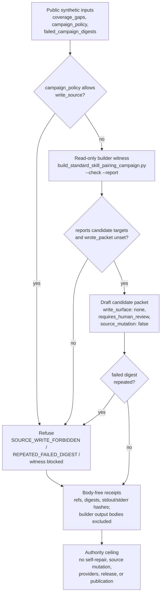

# Bounded autonomy campaign packet

`bounded_autonomy_campaign_packet` is a Crown Jewel import organ with real runnable substrate and a strict public authority ceiling. It consumes synthetic public fixtures, copied non-secret macro source bodies, and source manifests that verify sha256 digests, line counts, required anchors, secret-exclusion status, and receipt body omission.

What it proves: self-proposal campaign packet only; no self-repair or unsupervised source mutation.

## Purpose

An agent can usefully notice its own coverage gaps and draft a plan to close
them. The danger is that "draft a plan" quietly becomes "do the work": a
proposal grows a write surface, and a system that was meant to suggest starts
mutating its own source unsupervised. This organ exists to keep those two steps
apart. It answers one question: can an agent emit a draft campaign proposal from
real coverage gaps without that proposal carrying any authority to act on them?

The design choice that makes this interesting is where the candidate count comes
from. The organ does not invent a plausible-looking list of work. It runs a real
macro campaign builder in read-only mode
(`build_standard_skill_pairing_campaign.py --check --report`) and accepts its
witness only when the builder reports candidate targets and leaves
`wrote_packet` unset. The proposal is therefore derived from a surface that could
do real work, observed in a mode where it did not. Each drafted
candidate is then stamped `write_surface: none`, `source_mutation_authorized:
false`, and `requires_human_review: true`, so the act of proposing can never be
mistaken for the act of authorising.

Two refusals guard the boundary. A campaign policy that lists `write_source`
among its allowed actions is rejected outright, before any candidate is drafted.
And a campaign digest that already appears in the failed-campaign ledger more
than once is refused, so a plan that has already failed cannot be quietly
re-proposed under a fresh wrapper. Both refusals are checked by mutating the
fixture and confirming the expected error code fires, not by trusting a declared
label.

## Shape



This diagram is a reader aid. The machine graph remains the generated
`paper_module.bounded_autonomy_campaign_packet.mermaid` projection derived from
the JSON capsule row.

## JSON Capsule Binding

- source_ref:
  `core/paper_module_capsules.json::paper_modules[45:paper_module.bounded_autonomy_campaign_packet]`
- source_authority: json_capsule
- Projection role: This Markdown is a reader projection of the JSON capsule
  row, not the source authority. The generated Mermaid projection is
  `paper_module.bounded_autonomy_campaign_packet.mermaid` with status
  `available_from_capsule_edges`, and the generated Atlas projection is
  `organ_atlas.bounded_autonomy_campaign_packet` with status
  `linked_from_capsule_edges`.
- proof boundary: the capsule binds the organ subject, resolved runtime source
  locus, governed concept edge, declared law refs, three dependency edges, and
  20 generated relationship edges.
- authority ceiling: this page can explain the bounded self-proposal packet,
  failed-campaign refusal, negative cases, source-open imports, and validation receipts,
  but it cannot authorize self-repair, unsupervised source mutation,
  provider dispatch, release, publication, or a broader proof boundary.

## Structured Lattice Bindings

The capsule row yields 20 generated relationship edges: two `explains` edges,
one `code_locus` edge, one governed concept edge, seven principle edges, six
axiom edges, and three `depends_on` paper-module edges. The Mermaid projection is
`available_from_capsule_edges`, the Atlas projection is
`linked_from_capsule_edges`, `source_authority` remains `json_capsule`, and
the generated row has zero unresolved selective relations.

## Technical Mechanism

The runtime is intentionally narrower than "autonomous repair." `SPEC` declares
the four required public inputs, the source-module manifest, the expected
negative cases, and an `AUTHORITY_CEILING` in which self-repair, unsupervised
source mutation, source-write packets, provider calls, and release are all
false. `run()` and `run_bounded_autonomy_bundle()` then route both the fixture
and exported bundle through `run_crown_jewel_organ`, so the same evaluator,
source-manifest checks, body-free receipt policy, and semantic negative-case
evaluator guard both command surfaces.

The positive lane is witnessed by `_campaign_builder_witness()`, not by a
fictional campaign row. It invokes
`tools/meta/factory/build_standard_skill_pairing_campaign.py --check --report
--max-targets <n>` from the macro root, then accepts the witness only when the
builder returns `standard_skill_pairing_campaign_summary`, reports at least one
candidate target, emits a `source_digest`, and leaves `wrote_packet` unset. This
makes the campaign packet a read-only proposal derived from a real builder
surface; the receipt stores return code, digest fields, and stdout/stderr
hashes, but keeps builder output bodies out of the receipt.

`_candidate_packet_subprocess()` converts the witnessed target count into draft
candidate rows. Each candidate is tied to one fixture coverage gap when
available, carries the builder ref and builder source digest, sets
`write_surface: none`, requires human review, and records
`source_mutation_authorized: false`. `evaluate()` then applies the policy
checks: `write_source` in `campaign_policy.allowed_actions` is a hard refusal;
blocked builder witness or empty candidate packet is a hard refusal; any
candidate that authorizes source mutation or writes to the `source` surface is
also refused.

The negative cases are semantic mutations of the input, not trusted labels.
`evaluate_negative_case()` copies the required inputs into a temporary directory
and mutates the relevant file: `source_write_campaign_packet` appends
`write_source` to `campaign_policy.allowed_actions`, while
`repeated_failed_campaign_digest` rewrites the failed-digest ledger to contain a
duplicate digest. The organ passes its own evidence floor only when these
mutations produce `BOUNDED_AUTONOMY_SOURCE_WRITE_FORBIDDEN` and
`BOUNDED_AUTONOMY_REPEATED_FAILED_DIGEST`; stale declared error-code labels
cannot satisfy the proof consumer.

## Reader Evidence Routing

The primary evidence for this module is the fixture receipt and the exported-bundle receipt, which demonstrate the bounded campaign packet behavior under synthetic public inputs. Source-module manifests and digest checks are evidence for copied non-secret body provenance. This page is an explanation of those sources; the underlying JSON and test outputs are the authority.

## Reader Proof Boundary

The proof boundary is a draft self-proposal packet over public synthetic
coverage gaps, repeated-failure refusal, source-write refusal, copied
non-secret macro bodies, source manifests, negative cases, and validation
receipts. It does not authorize self-repair, unsupervised source mutation,
provider dispatch, release, publication, or any broader autonomy claim.

## Public Site Availability Boundary

Public cards may present this organ as a governed self-proposal validator only
when they keep the campaign-packet ceiling beside the positive claim. Site copy
must not imply autonomous repair, source-write permission, provider execution,
release readiness, or production autonomy.

## Public-Safe Body Handling

The public floor is refs, digests, line counts, required-anchor results,
secret-exclusion verdicts, negative-case outcomes, and receipt paths. Receipts
and cards must keep copied macro bodies out of receipt text and must exclude
private source, provider payloads, account/session material, browser/HUD state,
and credential-equivalent access data.

## Authority Ceiling

This organ emits a draft self-proposal from public synthetic coverage gaps and
refuses source-write or repeated-failure packets. It does not self-repair,
mutate source unsupervised, call providers, authorize release or publication,
or widen the proof boundary beyond the copied non-secret macro bodies,
synthetic fixtures, source manifests, negative cases, and validation receipts.

## Claim Ceiling

This paper module demonstrates a bounded-autonomy fixture that builds a draft campaign packet and refuses unsafe packets under public synthetic inputs. A diagram view and atlas card are generated for this module.

It cannot claim autonomous repair, unsupervised source mutation, provider calls,
release approval, publication approval, production campaign safety, private-root
equivalence, or whole-system correctness. If those claims change, the authoritative record is the underlying JSON capsule and regenerated projections, not this page.

## Prior Art Grounding

This organ borrows from AI risk-management, policy gating, and controlled
workflow-automation patterns. Useful anchors include:

- NIST's [AI Risk Management Framework](https://www.nist.gov/itl/ai-risk-management-framework),
  which frames AI work in terms of governance, mapping, measuring, and managing
  risk rather than assuming autonomy is inherently authorized.
- [Open Policy Agent](https://www.openpolicyagent.org/docs/latest), as a
  policy-engine pattern for deciding whether a proposed action may proceed.
- GitHub Actions
  [workflow syntax](https://docs.github.com/en/actions/reference/workflows-and-actions/workflow-syntax),
  as a widely used automation surface where jobs, permissions, and concurrency
  behavior are declared before execution.

Microcosm borrows the governed-campaign and preflight-gate shape, but keeps the
organ to draft self-proposal packets over synthetic public coverage gaps. It
does not self-repair, mutate source unsupervised, call providers, or authorize
release.

How to run it:

```bash
microcosm bounded-autonomy-campaign-packet run --input fixtures/first_wave/bounded_autonomy_campaign_packet/input --out receipts/first_wave/bounded_autonomy_campaign_packet
```

Runtime bundle route:

```bash
python -m microcosm_core.organs.bounded_autonomy_campaign_packet run-bounded-autonomy-bundle --input examples/bounded_autonomy_campaign_packet/exported_bounded_autonomy_campaign_packet_bundle --out receipts/runtime_shell/demo_project/organs/bounded_autonomy_campaign_packet
```

## Receipt Expectations

A complete local receipt includes the fixture run, exported bundle run, focused
pytest, paper-module corpus check, projection check when the shared builder lane
is clean, and generated row proof from
`paper_modules/bounded_autonomy_campaign_packet.json`. The receipt should
preserve source manifest refs, digest checks, failed-campaign and source-write
negative cases, anti-claims, and self-repair/provider/release exclusions.

## Validation Receipt Path

From `microcosm-substrate`, validate this reader projection without writing
tracked receipt outputs:

```bash
PYTHONPATH=src ../repo-python -m microcosm_core.organs.bounded_autonomy_campaign_packet run --input fixtures/first_wave/bounded_autonomy_campaign_packet/input --out /tmp/microcosm-bounded-autonomy-campaign-packet/fixture --acceptance-out /tmp/microcosm-bounded-autonomy-campaign-packet/acceptance.json --card
PYTHONPATH=src ../repo-python -m microcosm_core.organs.bounded_autonomy_campaign_packet run-bounded-autonomy-bundle --input examples/bounded_autonomy_campaign_packet/exported_bounded_autonomy_campaign_packet_bundle --out /tmp/microcosm-bounded-autonomy-campaign-packet/bundle --card
PYTHONPATH=src ../repo-python -m pytest -p no:cacheprovider tests/test_bounded_autonomy_campaign_packet.py -q
PYTHONPATH=src ../repo-python scripts/build_doctrine_projection.py --check-paper-module-corpus
PYTHONPATH=src ../repo-python scripts/build_doctrine_projection.py --check
```

If the fixture or bundle reports source-module digest drift, route that through
`microcosm_exact_copy_refresh`; this page is not source authority for
copied macro bodies. If the full projection check fails because another active
session holds shared lattice outputs, treat that as unrelated contention and
use the corpus check as the local gate for this module.

Negative cases covered by the fixture manifest: repeated_failed_campaign_digest, source_write_campaign_packet.

Source provenance is anchored by `examples/bounded_autonomy_campaign_packet/exported_bounded_autonomy_campaign_packet_bundle/source_module_manifest.json` and receipts carry refs, digests, counts, verdicts, and anti-claims only.
