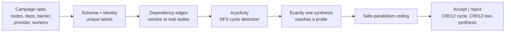

# Bridge Campaign DAG Validation

`bridge_campaign_dag_validation` checks the shape of a bridge campaign — a small
plan that fans several parallel reads into a single synthesis — and rejects plans
that are malformed, before anything runs.

## Purpose

A multi-agent campaign that is structurally broken (a dependency loop, two
synthesis nodes, a step that depends on a name that does not exist) wastes a whole
run to discover it. This organ catches those at validation time against a
public-safe subset of the macro campaign rules.

It surfaces the public `bridge_campaign_dag` capsule. Over bounded fixtures it
checks the schema and identity fields, that node labels are unique, that every
dependency edge points at a real node, that the graph is acyclic (DFS cycle
detection), that exactly one synthesis node exists and transitively reaches a
probe, that the barrier names that synthesis, and that the requested worker count
stays within the provider's safe-parallelism ceiling. It validates structure
only; it does not dispatch agents or run the campaign.

## Shape



## JSON Capsule Binding

- source_ref:
  `core/paper_module_capsules.json::paper_modules[95:paper_module.bridge_campaign_dag_validation]`
- source_authority: json_capsule
- Projection role: This Markdown is a reader projection of the JSON capsule row,
  not the source authority. The generated Mermaid projection is
  `paper_module.bridge_campaign_dag_validation.mermaid` with status
  `available_from_capsule_edges`, and the generated Atlas projection is
  `organ_atlas.bridge_campaign_dag_validation` with status
  `linked_from_capsule_edges`.
- proof boundary: the capsule binds the accepted organ, the resolved mechanism
  row, the runtime locus, the surfaced engine-room capsule, and the governing
  concept, principle, and axiom edges; the generated JSON projection carries the
  exact resolved relationship edges.
- authority ceiling: this page can explain the bounded campaign-validation
  fixtures and the validation receipts, but it cannot dispatch agents, execute
  campaigns, prove provider correctness, or become release authority.

## Structured Lattice Bindings

The structured capsule row is
`core/paper_module_capsules.json#paper_module.bridge_campaign_dag_validation`. It
binds this Markdown projection to the organ, the resolved mechanism row
`mechanism.bridge_campaign_dag_validation.verifies_bridge_campaign_dag`, the
runtime locus
`src/microcosm_core/organs/bridge_campaign_dag_validation.py`, and the surfaced
capsule `src/microcosm_core/engine_room/bridge_campaign_dag.py`. It abides by
axiom `AX-2` (a small checker decides claims over certificates) and principle
`P-3` (prefer a small, rerunnable verifier over narrative confidence).

Generated atlas docs remain builder-owned projections: refresh them with
`PYTHONPATH=src python3 scripts/build_organ_atlas.py --write` instead of editing
`ORGANS.md`, `ARCHITECTURE.md`, `AGENT_ROUTES.md`, or
`atlas/agent_task_routes.json` by hand.

## Reader Evidence Routing

The honest unit is "which rule fired," not "campaign valid." Read the rejected
campaigns and the rule ids before trusting the validator:

- A safety/evals engineer should confirm the structural checks are recomputed
  from the graph — cycle detection, single-synthesis-reaches-a-probe — rather than
  trusting a declared "ok" field. The useful question is whether a malformed
  campaign can pass.
- A hiring reviewer should read the two negative cases and their rule ids. The
  useful question is whether `cycle_rejected` fires `CR012` and
  `two_synthesis_rejected` fires `CR013`, so a rejection names the rule it broke.
- A peer developer should run the fixtures. The useful question is whether the
  organ validates a plan without dispatching a single agent or executing the
  campaign.

## Validation

```bash
PYTHONPATH=src python3 -m microcosm_core.organs.bridge_campaign_dag_validation run --input fixtures/first_wave/bridge_campaign_dag_validation/input --out receipts/first_wave/bridge_campaign_dag_validation --acceptance-out receipts/acceptance/first_wave/bridge_campaign_dag_validation_fixture_acceptance.json
```

The positive cases (`linear_chain_ok`, `fan_in_ok`) validate a clean linear chain
and a three-way fan-in. The negative cases are rejected by recomputation:
`cycle_rejected` fires rule `CR012` (acyclicity) and `two_synthesis_rejected`
fires rule `CR013` (exactly one synthesis). The registry, ledger, and runtime
spine checks in `make test` exercise the organ's acceptance receipt.

## Authority Ceiling

A green run shows that well-formed campaigns validated and malformed ones were
rejected with the rule they broke. It does not dispatch agents, execute
campaigns, prove provider correctness or safety, and does not authorize release,
publication, provider calls, or source mutation.
