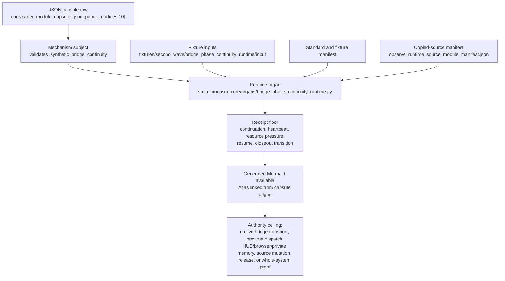

# Bridge Phase Continuity Runtime

## Route Card

`bridge_phase_continuity_runtime` is the public, executable synthetic transport continuity membrane for detached bridge work. It lets a cold agent validate the disk-first observe/apply handoff without opening live bridge transport, provider payloads, operator HUD/browser state, prompt-shelf bodies, private memory, or active phase runtime state.

## Purpose

This paper module exists to make detached bridge continuity testable as a
public fixture instead of a trust story about hidden agents or provider
sessions. The organ asks one bounded question: can a disk-first observe/apply
handoff be represented by public synthetic transport inputs, validated through
continuation, heartbeat, resource-pressure, resume, worker-skip, and closeout
receipts, and kept below live bridge/provider/UI/source-mutation authority?

The important mechanism is not "run a bridge." It is a continuity membrane:
every claim must pass through explicit packet fields, negative-case checks,
body-free receipt writes, and an authority ceiling that says heartbeat is
liveness evidence, resume is resume evidence, and neither is proof that work
landed.

First command:

```bash
microcosm bridge-phase-continuity-runtime run --input fixtures/second_wave/bridge_phase_continuity_runtime/input --out /tmp/microcosm-bridge-continuity
```

## Prior Art Grounding

This runtime borrows from durable execution, workflow orchestration, leases,
and provenance practice. Useful anchors include:

- [Temporal](https://docs.temporal.io/), whose durable-execution model keeps
  workflow state resumable across process failure and retries.
- Apache Airflow
  [DAGs](https://airflow.apache.org/docs/apache-airflow/stable/core-concepts/dags.html),
  which separate task ordering and retry/timeout policy from task internals.
- Kubernetes
  [Lease-based leader election](https://kubernetes.io/docs/concepts/cluster-administration/coordinated-leader-election/),
  as a prior pattern for liveness evidence, lease renewal, and failover without
  confusing a heartbeat with work completion.
- W3C [PROV](https://www.w3.org/TR/prov-overview/), for provenance records
  that let readers evaluate how an output was produced.

Microcosm borrows the resumable-workflow, DAG, lease, and provenance shapes,
but keeps the organ to public synthetic observe/apply fixture acceptance. It
does not run live bridge transport, call providers, prove UI uptime, land work,
mutate source, or authorize release.

Primary authority surfaces:

- Runtime: `src/microcosm_core/organs/bridge_phase_continuity_runtime.py`
- Standard: `standards/std_microcosm_bridge_phase_continuity_runtime.json`
- Fixture manifest: `core/fixture_manifests/bridge_phase_continuity_runtime.fixture_manifest.json`
- Source-module manifest: `examples/macro_projection_import_protocol/exported_projection_import_bundle/observe_runtime_source_module_manifest.json`
- Receipt set: `receipts/second_wave/bridge_phase_continuity_runtime/*.json`

## Shape



The shape is the public continuity membrane: capsule authority names the organ
and mechanism, fixtures exercise synthetic observe/apply continuity, copied
source manifests keep body provenance out of receipts, and the five receipt
roles delimit what a reader can trust. Generated Mermaid and Atlas projections
can point to this chain, but they do not turn heartbeat, resume, or closeout
receipts into live bridge-health, provider, UI, source-mutation, release, or
whole-system authority.

## Mechanism Pipeline

The runtime source locus is
`src/microcosm_core/organs/bridge_phase_continuity_runtime.py`. Its public
entry point `run` reads the fixture manifest, resolves public-relative fixture
paths, and validates six synthetic transport inputs:
`detached_job.json`, `continuation_packet.json`, `heartbeat_rows.jsonl`,
`resource_pressure.json`, `worker_skip_receipt.json`, and
`private_state_forbidden_terms.json`. JSONL heartbeat rows are streamed by
`_read_required_jsonl` so malformed rows are findings, not a reason to ingest a
whole live heartbeat body.

The central validator is `_validate_synthetic_transport_contract`. It separates
five receipt roles: continuation packet, heartbeat, resource pressure, resume
receipt, and closeout transition. The implementation then writes the canonical
receipt set only through the receipt-write gate. When the requested output is a
tracked receipt path and `MICROCOSM_TRACKED_RECEIPT_WRITES=1` is absent, the
organ reports `tracked_receipt_writes_blocked` instead of silently refreshing
tracked evidence.

The negative-case floor is source-declared in `EXPECTED_NEGATIVE_CASES` and
validated from fixture contents. Missing continuation packets, missing required
fields, duplicate resume attempts, heartbeat rows that claim resume authority,
stale heartbeat overclaims, resource-pressure dispatch blocks, private HUD body
leakage, resume-pass work-landing overclaims, and observe/apply validation
rollback all become explicit error codes. A pass therefore means the fixture
both accepted the positive path and observed the refusal floor.

## Structured Lattice Bindings

The structured capsule row is
`core/paper_module_capsules.json#paper_module.bridge_phase_continuity_runtime`.
It binds this Markdown projection to the organ, the resolved mechanism row
`mechanism.bridge_phase_continuity_runtime.validates_synthetic_bridge_continuity`,
and the runtime source locus
`src/microcosm_core/organs/bridge_phase_continuity_runtime.py`.

The source atlas row carries the matching `paper_module_ref`, `mechanism_refs`,
and `code_loci` entries. Generated atlas docs still remain builder-owned
projections; refresh them with
`PYTHONPATH=src python3 scripts/build_organ_atlas.py --write` instead of editing
`ORGANS.md`, `ARCHITECTURE.md`, `AGENT_ROUTES.md`, or
`atlas/agent_task_routes.json` by hand.

## JSON Capsule Binding

- Source row: `core/paper_module_capsules.json::paper_modules[10:paper_module.bridge_phase_continuity_runtime]`
- `source_authority: json_capsule`
- This Markdown is a reader projection. The generated Mermaid projection is
  `available_from_capsule_edges`, and the generated Atlas projection is
  `linked_from_capsule_edges`; both are builder-owned navigation projections
  derived from capsule edges.
- The proof boundary is the synthetic observe/apply fixture, continuation
  packet, heartbeat and resource-pressure rows, worker-skip receipt,
  source-module manifest, negative cases, and validation receipts.
- The authority ceiling excludes live bridge transport, provider dispatch,
  operator HUD/browser state, prompt-shelf or private-memory bodies, live phase
  runtime state, source mutation, release, and whole-system correctness.

## Claim Ceiling

This module may claim public fixture evidence that synthetic observe/apply
continuation packets, heartbeat rows, resource-pressure decisions,
resume-once behavior, worker-skip receipts, closeout-transition receipts,
source-module manifests, negative cases, validation receipts, and generated
projections support the declared bridge-continuity fixture contract.

This module may not claim live bridge transport health, provider dispatch,
operator HUD/browser access, prompt-shelf or private-memory disclosure, live
phase runtime truth, source mutation authority, hosted-public readiness,
release approval, publication approval, implementation correctness beyond the
listed witnesses, or whole-system correctness.

## Reader Evidence Routing

Reader evidence routes from this module to the runtime source locus, fixture
manifest, source-module manifest, public receipts, and focused regression.
A diagram view and an atlas card are generated for this module. This page
explains what a reader can infer from them.

| Evidence class | What it supports | Proof consumer |
|---|---|---|
| Positive synthetic fixture | The runner consumes the observe/apply fixture, writes five body-free receipt roles, keeps private-state scan clean, and preserves the authority ceiling. | `tests/test_bridge_phase_continuity_runtime.py::test_bridge_phase_continuity_runner_consumes_observe_apply_fixture` |
| JSONL input handling | Heartbeat rows are streamed, invalid JSONL rows become findings, and non-object rows are rejected without reading live transport state. | `test_bridge_phase_continuity_jsonl_reader_streams` |
| Tracked receipt gate | Durable tracked receipt paths are not refreshed unless the explicit tracked-write environment variable is present. | `test_bridge_phase_continuity_runner_reports_tracked_receipt_write_gate` |
| Public synthetic label | Fixture inputs use `synthetic_transport` and do not carry stale legacy transport or expected-error-code labels. | `test_bridge_phase_continuity_fixture_inputs_use_public_synthetic_transport_label` |
| Negative floor | The seven expected negative case classes are observed as concrete error codes rather than prose warnings. | Focused bridge-continuity negative-case tests in `tests/test_bridge_phase_continuity_runtime.py` |
| CLI card boundary | Compact command cards can summarize status without leaking forbidden private/live body classes. | Bridge-continuity CLI/card tests in `tests/test_bridge_phase_continuity_runtime.py` |

## Reader Proof Boundary

The proof boundary is the public synthetic observe/apply continuity fixture:
continuation packets, heartbeat rows, resource-pressure decisions, resume-once
behavior, worker-skip receipts, closeout-transition receipts, copied non-secret
body manifests, negative cases, and validation receipts. It does not prove live
bridge transport, provider/UI uptime, work landing, source mutation, release,
or whole-system correctness.

This boundary matters because bridge systems are easy to overclaim. A fresh
heartbeat can say "a worker is alive"; it cannot authorize resume. A successful
resume can say "the continuation packet was consumed once"; it cannot say the
apply phase landed. A closeout transition can say the synthetic fixture reached
the declared receipt state; it cannot publish, mutate source, or certify a live
provider-backed bridge.

## Public Site Availability Boundary

A public site may use this module to explain disk-first bridge continuity only
when it states that heartbeat and resume receipts are fixture evidence, not live
bridge health. Public copy must not imply live provider access, operator HUD or
browser access, prompt-shelf/private-memory disclosure, publication readiness,
or release authority.

## Public-Safe Body Handling

The source-open floor is receipt refs, manifest refs, digests, counts, status
fields, and error codes. Receipt and site surfaces must not inline copied body
text, live bridge packets, provider payloads, operator HUD/browser state,
prompt-shelf bodies, private memory, active phase runtime state, account/session
data, or secrets.

## What It Proves

The organ proves a bounded public fixture contract:

- A yielded synthetic job can be resumed only through an explicit continuation packet.
- Missing packets, missing packet fields, and already consumed packets are rejected.
- Heartbeat rows stay liveness evidence only; fresh or stale heartbeat rows do not become resume authority or provider/UI uptime evidence.
- Resource pressure can block dispatch and must be recorded as a blocked decision.
- Resume success is resume-only; it does not prove work landed without the closeout transition receipt.
- Worker-skip receipts dedupe a no-op without silently closing the claim.
- The fixture and receipts stay body-free for private/live-state classes.

The reusable mechanism is not "subagents are good." It is the concrete continuity membrane that future agents can run before relying on observe/apply bridge resumption claims.

## Source-Backed Substrate

The runtime consumes seven public fixture inputs:

- `observe_apply_session_fixture.json`
- `detached_job.json`
- `continuation_packet.json`
- `heartbeat_rows.jsonl`
- `resource_pressure.json`
- `worker_skip_receipt.json`
- `private_state_forbidden_terms.json`

The fixture manifest declares five copied non-secret macro body imports: `codex_paths_body_import`, `markdown_routing_body_import`, `observe_memory_body_import`, `observe_surfaces_body_import`, and `observe_runtime_body_import`. The organ validates the copied target digests from `observe_runtime_source_module_manifest.json`; receipt output keeps those bodies out of receipts and records digest verdicts instead.

## Receipt Floor

A passing run writes five canonical receipt roles:

- `continuation_packet.json`
- `heartbeat.json`
- `resource_pressure.json`
- `resume_receipt.json`
- `closeout_transition.json`

Each receipt carries `organ_id`, `fixture_id`, `validator_id`, `checker_id`, `status`, `continuation_packet_status`, `heartbeat_status`, `resource_pressure_decision`, `resume_once_status`, `duplicate_resume_rejection`, `worker_skip_receipt_status`, `private_state_scan`, `authority_ceiling`, `anti_claim`, and the full receipt path set.

The runtime also enforces tracked receipt-write gating. A direct run to tracked receipt paths without `MICROCOSM_TRACKED_RECEIPT_WRITES=1` reports `tracked_receipt_writes_blocked` rather than mutating tracked evidence silently.

## Negative Cases

The expected negative-case floor is source-declared in the runtime and manifest:

- `missing_packet_duplicate_resume_and_resource_block`
- `continuation_packet_missing_required_fields`
- `heartbeat_claims_resume_authority`
- `bridge_packet_private_hud_body`
- `stale_heartbeat_overclaims_liveness`
- `resume_success_overclaims_work_landed`
- `apply_validation_failure_rolls_back_observe_promotion`

The current receipt error-code set includes `MISSING_CONTINUATION_PACKET`, `MISSING_CONTINUATION_PACKET_FIELDS`, `CONTINUATION_PACKET_ALREADY_CONSUMED`, `HEARTBEAT_NOT_RESUME_AUTHORITY`, `STALE_HEARTBEAT_LIVENESS_CLAIM`, `RESOURCE_PRESSURE_DISPATCH_BLOCKED`, `BRIDGE_PACKET_PRIVATE_HUD_BODY`, `RESUME_PASS_OVERCLAIMS_WORK_LANDED`, and `OBSERVE_APPLY_VALIDATION_FAILED`.

## Authority Ceiling

The organ authorizes only public synthetic observe/apply fixture acceptance. It does not run live bridge transport, call providers, read operator HUD/browser state, read live phase runtime state, read prompt-shelf or private-memory bodies, prove provider or UI uptime, land work, mutate source, authorize release, or certify whole-system correctness.

Read the five receipts as fixture evidence, not as a bridge-health statement. A pass means the declared public continuity contract held for the synthetic fixture and copied non-secret body floor.

## Validation Anchors

Focused tests:

```bash
./repo-pytest --host-pressure-policy=warn microcosm-substrate/tests/test_bridge_phase_continuity_runtime.py
```

Source-form runtime:

```bash
cd microcosm-substrate && PYTHONPATH=src python3 -m microcosm_core.organs.bridge_phase_continuity_runtime run --input fixtures/second_wave/bridge_phase_continuity_runtime/input --out /tmp/microcosm-bridge-continuity
```

Compact card:

```bash
cd microcosm-substrate && PYTHONPATH=src python3 -m microcosm_core.organs.bridge_phase_continuity_runtime run --input fixtures/second_wave/bridge_phase_continuity_runtime/input --out /tmp/microcosm-bridge-continuity --card
```

## Validation Receipt Path

Validate the reader projection from the repo root without mutating durable
receipt or generated projection surfaces:

```bash
./repo-pytest --host-pressure-policy=warn microcosm-substrate/tests/test_bridge_phase_continuity_runtime.py -q --basetemp=/tmp/microcosm_bridge_phase_continuity_runtime_pytest
./repo-python microcosm-substrate/scripts/build_doctrine_projection.py --check-paper-module-corpus
```

## Re-Entry Conditions

Re-enter this module when:

- The bridge fixture input set changes.
- `observe_runtime_source_module_manifest.json` gains or loses copied body material.
- Any continuation packet, heartbeat, resource pressure, worker skip, or closeout-transition receipt shape changes.
- A live bridge or provider-facing feature wants to cite this organ as evidence.
- The atlas, mechanism, or capsule row changes and `core/doctrine_lattice_coverage.json` must be regenerated.
