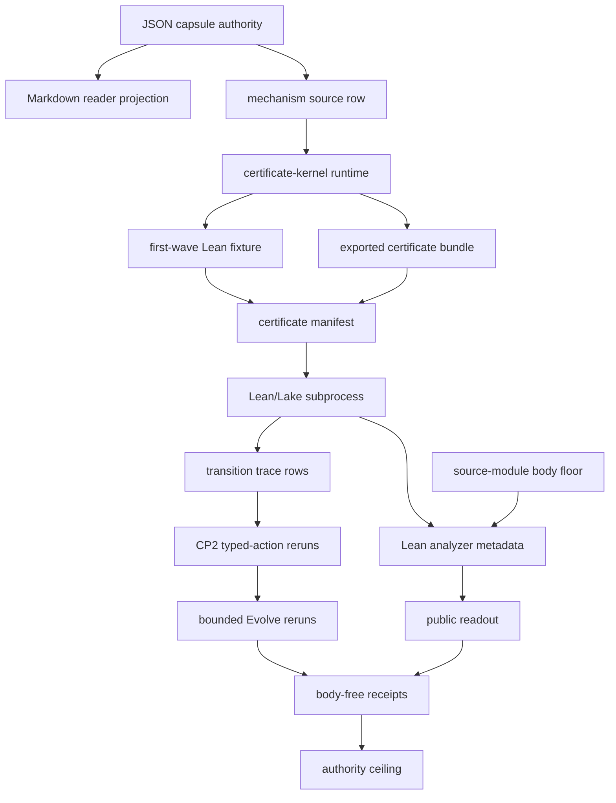

# Certificate Kernel Execution Lab

## Abstract

`certificate_kernel_execution_lab` is a source-available public runtime refactor
of the macro certificate-kernel pattern. It runs a small Lean/Lake certificate kernel,
generated certificate rows, analyzer metadata, CP2 typed-action reruns, and
bounded Evolve policy reruns without importing private proof bodies. The
exported bundle also carries copied non-secret macro body modules from the real
Erdos #257 certificate-kernel substrate: Lean kernel files, generated
certificates, the strike runner, toolchain files, and Lean profile receipts. The
v2 fixture carries both a simple `NatSumCertificate` row family and a miniature
`BoundedOrderCertificate` family so the public lab is no longer only a
single-shape arithmetic receipt.

## Purpose

This organ exists to stop a proof-adjacent claim from resting on prose. The
single question it answers is narrow: did a small Lean kernel actually compile
and accept the declared certificate rows, here and now, with the command, the
return code, and the source hashes on record? Everything else in the page is
accounting that keeps the answer honest.

The reduction it relies on is the interesting part. A large class of
proof-adjacent facts can be expressed as a finite certificate plus a decidable
Boolean checker shaped like `validate : Cert -> Bool`. The agent is never asked
to write a human proof. It is asked to supply the right certificate rows, and
Lean decides. The fixture carries two checker families, `NatSumCertificate` over
arithmetic and `BoundedOrderCertificate` over a bounded modular order, so the
acceptance is not a single hard-coded shape. A row counts as accepted only when
the runner shells out to `lake env lean` over a temporary copy of the public
project and receives exit code 0.

What is unusual is the weight placed on rejection. Deliberately wrong rows, a
missing certificate, a bad arithmetic certificate, a bad bounded-order
certificate, must fail through the same real Lean route, in the residual class
the fixture predicted. A bundle that can show only green acceptance is treated
as a replay artifact, not as certificate-kernel evidence. The runner also keeps
the proof channel separate from the language model channel: a transition that
can see oracle sidecars or provider hypothesis text is rejected before
execution, so a model's confidence can never be quietly counted as a proof. The
receipt records command identity, counts, and verdicts, and never the proof
bodies themselves.

## Shape



The module shape is a bounded public certificate-kernel execution witness, not
general theorem authority. This page points at the mechanism and runtime organ;
the runtime validates Lean/Lake command identity,
source hashes, generated certificate rows, analyzer metadata, transition
traces, CP2 typed-action reruns, bounded Evolve reruns, source-module manifest
digests, negative cases, public readout, body-free receipts, and an authority
ceiling.

## Mechanism

The mechanism is a finite-certificate execution reducer. The public entrypoints
`run` and `run_certificate_bundle` both call `_build_result`, which loads the
certificate lab packet, certificate manifest, Lean project, optional negative
fixtures, and optional exported-bundle source manifest before any claim is
recorded. The fixture path may run Lean/Lake in a temporary public workspace;
the exported-bundle path validates the standalone runtime contract and copied
body floor without rerunning private macro machinery.

The reducer first establishes source and receipt boundaries. `_input_paths`
enumerates the public Lean files and JSON inputs, then `scan_paths` checks them
against `core/private_state_forbidden_classes.json`. `_source_module_manifest_result`
verifies the exported bundle's nine copied non-secret macro bodies by material
class, target presence, required anchors, and SHA-256 equality; `_source_open_body_import_summary`
turns that manifest into the body floor that receipts can cite without carrying
proof bodies.

Execution evidence is split into three layers. `_build_lake_project` runs
`lake build MicrocosmCertificateLab` for the fixture path, while `_analyze_lean_project`
records public Lean imports, declarations, line counts, and hashes with
`body_in_receipt: false`. `_execute_transitions` then batches certificate
transition rows through Lean: accepted rows must return zero, missing or bad
certificate rows must fail in the expected residual class, and CP2/Evolve rows
must rerun within allowed action and artifact classes instead of mutating
arbitrary source.

The negative cases are part of the proof consumer, not examples around it.
`EXPECTED_NEGATIVE_CASES` requires rejection of provider/oracle-visible
transition rows, CP2 proof-body leakage, Evolve source mutation, and private
source refs in the manifest. The focused regression test
`tests/test_certificate_kernel_execution_lab.py` exercises those refusals,
digest mismatch handling, cached command-card economy, public readout
generation, and the counters that keep oracle/provider/proof-body/source
mutation authority at zero.

`AUTHORITY_CEILING` and `RECEIPT_TRANSPARENCY_CONTRACT` bind the mechanism back
to the lattice relation. The module can claim bounded public fixture and bundle
evidence over Lean/Lake command identity, certificate rows, analyzer metadata,
transition outcomes, CP2/Evolve reruns, source manifest digests, and body-free
receipts. It cannot claim general theorem authority, provider proof authority,
benchmark solve rate, private-body equivalence, source mutation, release, or
whole-system correctness.

## Public Surfaces

- Organ runner: `python -m microcosm_core.organs.certificate_kernel_execution_lab run --input fixtures/first_wave/certificate_kernel_execution_lab/input --out receipts/first_wave/certificate_kernel_execution_lab`
- Exported bundle runner: `python -m microcosm_core.organs.certificate_kernel_execution_lab run-certificate-bundle --input examples/certificate_kernel_execution_lab/exported_certificate_kernel_execution_lab_bundle --out receipts/runtime_shell/demo_project/organs/certificate_kernel_execution_lab`
- CLI: `microcosm certificate-kernel-execution-lab run --input fixtures/first_wave/certificate_kernel_execution_lab/input --out receipts/first_wave/certificate_kernel_execution_lab`
- Standard: `standards/std_microcosm_certificate_kernel_execution_lab.json`
- Fixture manifest: `core/fixture_manifests/certificate_kernel_execution_lab.fixture_manifest.json`
- Source-module manifest: `examples/certificate_kernel_execution_lab/exported_certificate_kernel_execution_lab_bundle/source_module_manifest.json`

## Authority Boundary

The lab proves only that the declared public Lean fixture compiled and that the
declared transition rows were accepted, rejected, or left residual under the
local verifier. The copied macro body modules are public source-open body
material, but receipts cite them only by manifest row, hash, class, count, and
required anchor. It does not expose proof text through receipts, count
oracle/provider output as proof authority, mutate source, claim benchmark
solve-rate, or authorize release.

## Prior Art Grounding

This organ is grounded in proof-carrying and proof-assistant traditions. Necula's
[Proof-Carrying Code](https://www.usenix.org/legacy/publications/library/proceedings/osdi96/full_papers/necula/html/node2.html)
anchors the idea that an untrusted producer can supply a certificate checked by
a small trusted verifier. The
[Lean theorem prover](https://www.microsoft.com/en-us/research/publication/the-lean-theorem-prover-system-description/)
continues the small-kernel proof-assistant lineage, and
[LeanDojo](https://arxiv.org/abs/2306.15626) shows why reproducible Lean
environments, premise access, and programmatic proof-state interaction matter
for theorem-proving agents.

Microcosm borrows the certificate-kernel discipline: certificate rows, Lean/Lake
command identity, return codes, source hashes, transition traces, negative rows,
and body-free receipts must be visible before proof-adjacent language is
allowed. It does not claim general theorem proof authority.

## Research Bet

This organ is the certificate-kernel bet in runnable form: a large class of
proof-adjacent facts can be reduced to a finite certificate plus a decidable
Boolean checker. The public lab keeps the agent task narrow. It does not ask the
agent to synthesize a human proof; it asks for the right certificate rows, then
lets Lean/Lake decide whether the checker accepts them.

The toy path uses a Lean certificate kernel shaped like `validate : Cert ->
Bool` and accepts only when Lean can compile and run the declared check. The
macro-body import path carries the real Erdos #257 source floor: Lean kernel
files, generated certificate shards, toolchain files, and profile receipts from
the Mathlib formalization family. The receipt may say "accepted" only when the
public runner shells out to Lean/Lake and receives exit code 0 for the declared
bundle.

The negative floor is part of the proof, not decoration. Deliberately wrong
certificate rows must be rejected by the real Lean route, including arithmetic
and bounded-order failures. A bundle that cannot show genuine rejection cases is
only a replay artifact, not certificate-kernel evidence.

## Receipt Shape

Receipts are public evidence. The lab exposes structured theorem/declaration
names, Lean/Lake command identity, return codes, hashes, declaration counts,
accepted/residual counts, negative-case ids, CP2 action classes, Evolve policy
artifact ids, source-module manifest status, copied body-material counts,
authority counters, authority ceiling, and anti-claim. It omits
only proof, provider, oracle-answer, private-source, and stdout/stderr payload
bodies, and records that omission through `secret_exclusion_scan` and
`body_in_receipt: false` rather than treating absence as product evidence.

- Lean/Lake build receipt for `MicrocosmCertificateLab`.
- Analyzer metadata for public Lean files: imports, declarations, hashes, and
  line counts with proof bodies omitted from JSON receipts.
- Transition rows for valid certificates, missing certificate rows, bad
  generated certificate rows, and bounded order-certificate rows.
- CP2 typed-action translations over missing-certificate residuals, with Lean
  reruns proving downstream effect.
- Bounded Evolve mutations over certificate row selection policy, accepted only
  after reruns and no leakage regression.
- Source-open body import rows for the real macro certificate-kernel body floor:
  exact copied targets under `source_modules/ai_workflow`, source/target hashes,
  material classes, and provenance anchors, with receipt body text forbidden.

## Source-Backed Doctrine Binding

- Organ: `src/microcosm_core/organs/certificate_kernel_execution_lab.py`
- Capsule: `core/paper_module_capsules.json#paper_module.certificate_kernel_execution_lab`
- Mechanism: `core/mechanism_sources.json#mechanism.certificate_kernel_execution_lab.validates_public_certificate_kernel_execution`
- Standard: `standards/std_microcosm_certificate_kernel_execution_lab.json`
- Evidence class: `core/organ_evidence_classes.json::certificate_kernel_execution_lab` records `external_subprocess_witness` at rank 4.
- Source-module manifest: `examples/certificate_kernel_execution_lab/exported_certificate_kernel_execution_lab_bundle/source_module_manifest.json` declares nine copied non-secret Lean/tool/profile body modules.
- Runtime receipt: `receipts/runtime_shell/demo_project/organs/certificate_kernel_execution_lab/exported_certificate_kernel_execution_lab_bundle_validation_result.json`
- Acceptance receipts: `receipts/first_wave/certificate_kernel_execution_lab/*` and `receipts/acceptance/first_wave/certificate_kernel_execution_lab_fixture_acceptance.json`

## Reader Evidence Routing

- Capsule route:
  `core/paper_module_capsules.json::paper_modules[7:paper_module.certificate_kernel_execution_lab]`
  is the JSON authority row. A diagram view is generated for this module;
  the Atlas card for this module is staged and will appear once the
  organ-atlas lane completes its binding pass.
- Mechanism route:
  `core/mechanism_sources.json::mechanism.certificate_kernel_execution_lab.validates_public_certificate_kernel_execution`
  binds the validator command, exported-bundle validator command, focused
  regression, guardrails, input refs, receipt refs, and runtime code locus.
- Runtime route:
  `src/microcosm_core/organs/certificate_kernel_execution_lab.py` owns `run`,
  `run_certificate_bundle`, `_source_module_manifest_result`,
  `_source_open_body_import_summary`, `_build_result`, `_receipt_freshness`,
  `build_public_readout`, `EXPECTED_NEGATIVE_CASES`, `AUTHORITY_CEILING`,
  `SOURCE_MODULE_MANIFEST_NAME`, `BUNDLE_RESULT_NAME`, and
  `CARD_SCHEMA_VERSION`.
- Exported-bundle route:
  `examples/certificate_kernel_execution_lab/exported_certificate_kernel_execution_lab_bundle`
  is the public runtime bundle. Open `source_module_manifest.json` before using
  copied-body counts, then inspect the runtime validation receipt and public
  readout.
- Focused-test route: `tests/test_certificate_kernel_execution_lab.py` verifies
  Lean/Lake execution, analyzer output, transition batching, CP2/Evolve counters,
  public structured bundle shape, digest mismatch rejection, exact copied source
  modules, cached command-card economy, transparent body-free receipts, and the
  cold-reader public readout.

## Structured Lattice Bindings

- `source_authority`: `json_capsule`
- `paper_module_id`: `paper_module.certificate_kernel_execution_lab`
- `reader_projection`:
  `microcosm-substrate/paper_modules/certificate_kernel_execution_lab.md`
- `organ_id`: `certificate_kernel_execution_lab`
- `mechanism_id`:
  `mechanism.certificate_kernel_execution_lab.validates_public_certificate_kernel_execution`
- `depends_on`:
  `paper_module.verifier_lab_execution_spine`, sourced from
  `standards/std_microcosm_certificate_kernel_execution_lab.json::relationships.source_pattern_id_sample`.
- `runtime_locus`: `src/microcosm_core/organs/certificate_kernel_execution_lab.py`
- `standard_locus`: `standards/std_microcosm_certificate_kernel_execution_lab.json`
- `fixture_input_locus`: `fixtures/first_wave/certificate_kernel_execution_lab/input`
- `exported_bundle_locus`:
  `examples/certificate_kernel_execution_lab/exported_certificate_kernel_execution_lab_bundle`
- `receipt_loci`:
  `receipts/first_wave/certificate_kernel_execution_lab/certificate_kernel_execution_lab_result.json`,
  `receipts/first_wave/certificate_kernel_execution_lab/certificate_kernel_execution_lab_board.json`,
  `receipts/first_wave/certificate_kernel_execution_lab/certificate_kernel_execution_lab_validation_receipt.json`,
  `receipts/first_wave/certificate_kernel_execution_lab/certificate_kernel_execution_lab_public_readout.json`,
  `receipts/acceptance/first_wave/certificate_kernel_execution_lab_fixture_acceptance.json`,
  and
  `receipts/runtime_shell/demo_project/organs/certificate_kernel_execution_lab/exported_certificate_kernel_execution_lab_bundle_validation_result.json`
- `source_open_body_floor`: nine copied non-secret Lean/tool/profile body
  modules, body-excluded from receipts and digest-checked by
  `source_module_manifest.json`.
- `runtime_evidence_floor`: 10 transition rows, 7 accepted transitions, 3
  residual transitions, 2 CP2 translations, 2 CP2 downstream effects, 2 Evolve
  candidates, 2 accepted Evolve reruns, 5 analyzed Lean files, at least 20
  analyzed declarations, and 0 provider/oracle/proof-body/source-mutation
  authority counters.
- `negative_case_floor`: provider-oracle-visible transition rows,
  CP2 proof-body leakage, forbidden Evolve source mutation, and private source
  refs in the certificate manifest.
- `projection_status`: generated Mermaid is available from capsule edges; the
  generated Atlas card is blocked until the organ-atlas owner lane binds the
  atlas row, so this Markdown must not claim atlas completion.
- `relationship_edge_count`: the generated JSON sidecar should carry seven
  relationship edges, including the resolved verifier-lab execution-spine
  dependency, and no unresolved `paper_module.depends_on.paper_module`
  selective residual for this module.

## Governing Lattice Relation

The capsule places this module under
`concept.formal_math_and_proof_witness_bundle`: proof-adjacent public claims
must be reduced to explicit witness artifacts before a reader is allowed to
treat them as evidence. In this module, the witness artifacts are the public
Lean/Lake subprocess result, generated certificate rows, analyzer metadata,
transition traces, CP2/Evolve rerun evidence, copied source-module manifest,
and body-free receipts. Markdown explains that lattice; it does not replace the
JSON capsule or the validator receipts.

`P-3` is the governing principle edge for the module's claim discipline. The
runtime does not ask whether a proof story is persuasive; it requires a finite
certificate family, a named verifier route, visible command identity, explicit
return codes, public-relative refs, and receipt transparency. That is why the
mechanism row binds `run`, `run_certificate_bundle`,
`_source_module_manifest_result`, `_source_open_body_import_summary`,
`_build_result`, `_receipt_freshness`, and `build_public_readout` as the code
locus instead of treating the paper module as independent proof evidence.

`AX-2` is the hard boundary: public proof language must remain inside the
declared certificate-kernel execution evidence. The standard's authority
ceiling keeps `formal_proof_authority` limited to bounded public fixture rows
and keeps provider calls, oracle success, source mutation, private-root
equivalence, release authority, runtime correctness, and whole-system
correctness false.

The dependency on `paper_module.verifier_lab_execution_spine` tells a reader
how to interpret the lab. The certificate kernel is one proof-adjacent
execution cell inside the verifier-lab spine: it can show accepted/residual
transition rows and rerun effects, but it cannot promote those rows into
release, publication, benchmark, or theorem-authority claims without the
sibling verifier and release lanes.

## Validation Receipt Path

Run the first-wave fixture into disposable receipts from the Microcosm root:

```bash
cd microcosm-substrate
PYTHONPATH=src ../repo-python -m microcosm_core.organs.certificate_kernel_execution_lab run --input fixtures/first_wave/certificate_kernel_execution_lab/input --out /tmp/microcosm_certificate_kernel_execution_lab_first_wave --acceptance-out /tmp/microcosm_certificate_kernel_execution_lab_acceptance.json
```

Run the exported bundle through the same organ:

```bash
cd microcosm-substrate
PYTHONPATH=src ../repo-python -m microcosm_core.organs.certificate_kernel_execution_lab run-certificate-bundle --input examples/certificate_kernel_execution_lab/exported_certificate_kernel_execution_lab_bundle --out /tmp/microcosm_certificate_kernel_execution_lab_bundle
```

Then validate the reader projection and generated row:

```bash
cd microcosm-substrate
../repo-pytest microcosm-substrate/tests/test_certificate_kernel_execution_lab.py -q
cd ..
./repo-python microcosm-substrate/scripts/build_doctrine_projection.py --check-paper-module-corpus
```

## Receipt Expectations

A valid first-wave receipt exposes the authority counters above, observed
negative cases equal to `EXPECTED_NEGATIVE_CASES`, no missing negative cases,
`receipt_body_is_public_evidence: true`, `body_in_receipt: false`, Lean analyzer
declaration metadata, certificate-family summaries for Nat-sum and bounded-order
rows, and an authority ceiling that keeps provider calls, source mutation,
proof-body export, benchmark solve-rate, release authority, and whole-system
proof authority out of scope.

A valid exported-bundle receipt may show `expected_negative_cases: []` because
the exported bundle is the public runtime example, while the first-wave fixture
remains the negative-case authority. It should still show
`input_mode: exported_certificate_kernel_execution_lab_bundle`, bundle id
`public_certificate_kernel_execution_lab_runtime_example`, 7 accepted
transitions, 2 CP2 downstream effects, 2 accepted Evolve reruns, real runtime
receipt status, source-module manifest status `pass`, 9 verified source
modules, 9 copied body materials, body material status
`copied_non_secret_certificate_kernel_macro_body_landed`, secret-exclusion
blocking hit count `0`, and public runtime refs under the exported bundle.

A valid command card may reuse a cached receipt when freshness inputs remain
current. It exposes authority counters, runtime summary, body-floor counts, and
output-economy flags while omitting transition traces, claim-separation rows,
source-open body imports, proof bodies, provider text, private paths, and copied
source-module bodies.

## Cold-Agent Use

Open the source-module manifest first, then the runtime receipt, then the organ
source. The useful claim is not that Microcosm proved the Erdos #257 theorem,
solved a benchmark, imported private proof bodies, or gained provider/oracle
authority. The useful claim is that Microcosm can force a proof-adjacent story
to expose Lean/Lake command identity, return codes, source hashes, declaration
counts, certificate rows, transition traces, typed CP2 actions, bounded Evolve
reruns, source-module body refs, negative-case receipts, and authority counters
before certificate-kernel language is allowed.

Re-entry condition: after the sibling `organ_atlas.json` lane releases, bind
this paper-module capsule, mechanism ref, and code locus into the atlas row and
rerun `python -m microcosm_core.doctrine_lattice --check`.

## Anti-Claim

This is a source-available certificate-kernel laboratory with copied non-secret
macro body material, not a private macro dump and not general proof authority
beyond the declared fixture rows and source-module body refs.

## JSON Capsule Binding

- Capsule row: `paper_module.certificate_kernel_execution_lab` in `core/paper_module_capsules.json::paper_modules[7:paper_module.certificate_kernel_execution_lab]`.
- source_authority: json_capsule
- This Markdown is a reader projection; the JSON capsule is source authority for subjects, code loci, doctrine refs, and generated projection state.
- The generated Mermaid projection is `available_from_capsule_edges`; the generated Atlas projection is `blocked_until_organ_atlas_owner_lane_binds_edges`.
- The proof boundary is the local Lean/Lake subprocess witness, fixture receipts, exported bundle receipts, and copied non-secret source-module manifest named above, not theorem correctness, benchmark standing, provider/oracle authority, release, or whole-system proof authority.
- authority ceiling: Public Lean/Lake subprocess witness, copied non-secret macro proof/tool/profile bodies, first-wave fixture receipts, and exported bundle receipts only; no general theorem correctness, private proof body export, provider call, oracle authority, source mutation, benchmark solve-rate, release approval, publication approval, or whole-system proof claim.

## Claim Ceiling

This paper module can claim a certificate-kernel laboratory backed by a
structured doctrine row, with a diagram view generated from that row. The Atlas
card for this module is staged pending the organ-atlas lane's binding pass; that
is honest coordination state, not a content gap.

It cannot claim theorem correctness, benchmark solve rate, private proof body
export, provider or oracle authority, source mutation, publication approval,
release approval, or whole-system proof authority. The Atlas card must be
completed by the owning organ-atlas/capsule route and builder regeneration, not
by hand-editing Markdown.

## Limitations

This module is a bounded public execution witness, not a theorem-proving
authority. Its evidence depends on the shipped public Lean/Lake fixture,
generated certificate rows, analyzer metadata, CP2 typed-action reruns, bounded
Evolve reruns, and copied non-secret source-module manifest. A green run proves
that this certificate-kernel bundle follows those constraints; it does not
prove the Erdos #257 theorem, Mathlib coverage, benchmark solve rate, or
correctness of private macro proof bodies.

The source-open body floor is intentionally narrow. The exported bundle carries
nine copied non-secret Lean/tool/profile bodies under `source_modules/`, and
the receipts may cite only refs, hashes, material classes, counts, required
anchors, and verdicts. Proof bodies, raw tactic scripts, provider payloads,
oracle answers, private source paths, stdout/stderr bodies, credentials, and
private macro-root material remain outside the public receipt surface.

The focused regression covers the declared fixture and exported bundle shape.
It checks Lean/Lake execution boundaries, analyzer output, transition batching,
CP2/Evolve counters, digest mismatch rejection, exact copied source modules,
cached command-card economy, transparent body-free receipts, and public readout
shape. It does not authorize future certificate families, generated Atlas/site
publication, source mutation, or public release without the owning builder and
release lanes.

## Reader Proof Boundary

The proof boundary is the JSON capsule plus the generated JSON instance, not
this Markdown narration. Current generated-row proof is `edge_count: 7`,
`unresolved_selective_relation_count: 0`, Mermaid
`available_from_capsule_edges`, Atlas
`blocked_until_organ_atlas_owner_lane_binds_edges`, and `source_authority:
json_capsule`.

A cold reader may use those values to verify that the paper module is bound to
real subjects, code loci, and doctrine edges, with no unresolved selective
relations in the generated row at this HEAD. They may not infer theorem
correctness, benchmark solve rate, private proof body export, provider/oracle
authority, source mutation permission, release approval, publication approval,
or whole-system proof authority.

## Public Site Availability Boundary

This Markdown page does not prove that the public Microcosm site, content
manifest, docs bundle, Atlas page, or hosted artifact has been regenerated. The
site and Atlas surfaces are projection-owner outputs. If a public page,
generated card, or site manifest disagrees with this source page, the correction
route is the owning site/projection builder, not a hand edit to generated
assets.

## Public-Safe Body Handling

Reader-visible evidence may carry Lean/Lake command identity, return codes,
source hashes, declaration counts, certificate-row ids, transition counters,
source-module refs, target refs, sha256 digests, body-material classes,
negative-case labels, public readout refs, and receipt paths. It must not carry
private proof bodies, provider payload bodies, oracle answers, private source
bodies, account/session state, browser/HUD state, recipient-send state, raw
operator voice, private macro-root bodies, or copied source bodies inside
receipts.
