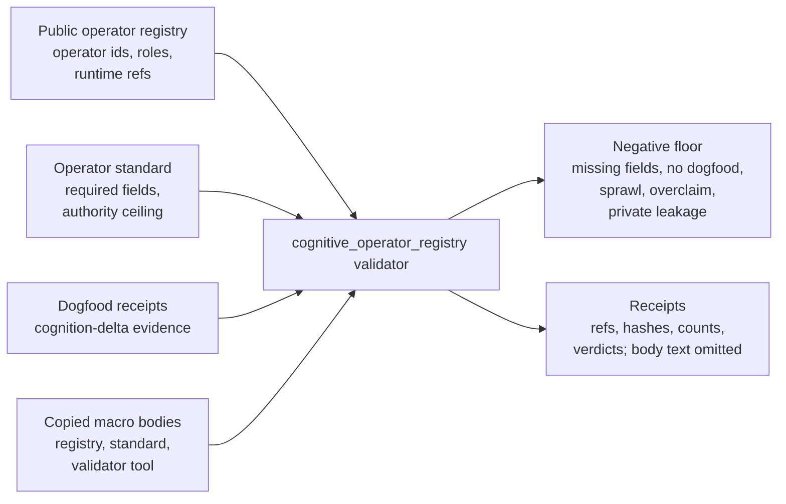

# Cognitive Operator Registry

`cognitive_operator_registry` is the public contract diagnostic for the macro
system's typed cognitive-operator substrate. It checks that each public operator
row carries the required operator-shape fields, that every `active` operator is
backed by a dogfood receipt proving it changed a live decision, and that the
registry policy declares explicit authority ceilings before a cold reader trusts
the operators as real reusable cognition rather than inspirational prose.

## Purpose

A team that writes down its reusable thinking moves as a registry tends to
accumulate entries faster than it can prove any of them help. The single
question this organ answers is: which of these listed operators has actually
changed a live decision, and which is just a tidy description of one? An entry
may only call itself `active` if it points to a dogfood receipt, and that
receipt must carry `cognition_delta_evidence` recording a concrete decision that
came out differently because the operator was applied.

The unusual part is that the check refuses to take a row at its word. Where a
receipt cites evidence surfaces, command paths, or task-ledger handles, the
validator resolves each one against the public substrate (see
`_dogfood_receipt_ref_resolves` and `_record_dogfood_evidence_resolution_findings`
in the source). A row whose prose says it was dogfooded but whose evidence does
not resolve is recorded as a failure, not a pass. A second check, the anti-sprawl
case, flags two operators that share a slug or a near-identical claim unless an
accretion decision was recorded, so the registry cannot quietly grow two near
copies of the same idea.

The evidence contract is source-open by default. The validator emits refs,
hashes, counts, and verdicts; `secret_exclusion_scan` proves that secrets,
account or session material, provider payload bodies, raw operator voice, and
credential-equivalent access material are excluded. Operator bodies are never
inlined into the JSON receipt, so the positive evidence carries
`body_in_receipt: false`, `real_runtime_receipt: true`, and
`synthetic_receipt_standin_allowed: false`.

## Prior Art Grounding

This organ borrows from cognitive work analysis, provenance, schema validation,
and policy-gated registries. Useful anchors include:

- Cognitive Work Analysis, summarized in this
  [information-systems design overview](https://files.eric.ed.gov/fulltext/EJ1082064.pdf),
  as prior art for analyzing cognitive work in complex sociotechnical systems.
- W3C [PROV](https://www.w3.org/TR/prov-overview/), for connecting operator
  claims to activities, agents, and evidence used to evaluate trustworthiness.
- [JSON Schema](https://json-schema.org/), for the required-shape validation
  pattern behind public operator rows.
- [Open Policy Agent](https://www.openpolicyagent.org/docs/latest), as a
  precedent for policy evaluation that remains distinct from the registry data
  being evaluated.

Microcosm borrows the cognitive-work, provenance, shape-checking, and policy
registry patterns, but keeps this organ to a public contract diagnostic. It
does not mutate operators, prove operator correctness, expose private operator
bodies or raw operator voice, authorize providers, or authorize release.

It consumes public `operator_registry.json`, `operator_standard.json`, and
`dogfood_index.json` inputs that project real macro operator rows and dogfood
receipts. Its receipt contract is source-open by default: `secret_exclusion_scan`
proves that secrets, account/session material, provider payload bodies, raw
operator voice, and credential-equivalent live-access material are excluded,
while `public_runtime_refs` point at the real standard, organ, acceptance,
fixture, bundle, and paper-module substrate. Bodies are not inlined into JSON
receipts, so the positive evidence uses `body_in_receipt: false`,
`real_runtime_receipt: true`, and `synthetic_receipt_standin_allowed: false`.

The organ rejects seven boundary failures:

- operator rows missing required operator-shape fields
- active operators with no backing dogfood receipt
- dogfood receipts missing `cognition_delta_evidence`
- near-duplicate operators (identical slug or near-identical claim) with no
  recorded accretion decision (the anti-sprawl governor case)
- release, provider, source-mutation, registry-mutation, or operator-correctness
  overclaims
- operator rows that claim operator-voice or raw-seed authority
- private operator source bodies or provider payload bodies in public inputs

The exported bundle also imports three verbatim macro bodies behind an import
membrane: the cognitive-operator registry (`codex/doctrine/cognitive_operators.json`),
the cognitive-operator standard (`codex/standards/std_cognitive_operator.json`),
and the registry projection/validation tool
(`system/lib/cognitive_operator_registry.py`). Each is copied byte-for-byte with a
sha256 digest and required anchors; receipts carry refs, hashes, counts, and
verdicts only.

## Shape



## Structured Lattice Bindings

The structured capsule row is
`core/paper_module_capsules.json#paper_module.cognitive_operator_registry`. It
binds this Markdown projection to the organ, the resolved mechanism row
`mechanism.cognitive_operator_registry.validates_public_operator_contract`, and
the runtime source locus `src/microcosm_core/organs/cognitive_operator_registry.py`.

## JSON Capsule Binding

- Source row: `core/paper_module_capsules.json::paper_modules[11:paper_module.cognitive_operator_registry]`
- `source_authority: json_capsule`
- This Markdown is a reader projection. The generated Mermaid projection is
  `available_from_capsule_edges`, and the generated Atlas projection is
  `linked_from_capsule_edges`; both are navigation projections derived from the
  capsule row rather than source authority.
- The proof boundary is the public operator registry, operator standard,
  dogfood fixture, active-operator receipts, source manifests, required
  operator-shape fields, secret exclusion checks, and validation receipts.
- The authority ceiling excludes operator mutation, private operator bodies,
  raw voice export, provider authority, release authority, and claims that the
  listed operators are correct beyond their public receipts.

## Reader Evidence Routing

Read this module as a public contract diagnostic, not as a glossary of operators
or a live execution surface. This page explains the shape a reader should verify;
the structured data lives in the JSON files below.

Start with `paper_modules/cognitive_operator_registry.json` for the full module
record, then use `standards/std_microcosm_cognitive_operator_registry.json` to
check required fields, forbidden authority, public/private boundary rules, and
receipt expectations. Open
`core/fixture_manifests/cognitive_operator_registry.fixture_manifest.json`
before inspecting fixtures or copied source modules, because the manifest names
the source-open body floor and the body-omission contract.

Read dogfood receipts as evidence that an active operator changed a live
decision; do not read them as proof that the operator is generally correct. Read
negative cases as part of the positive claim: missing roles, missing dogfood,
missing cognition-delta evidence, duplicate/sprawl pressure, operator-voice
claims, authority overclaims, and private-source leakage must remain rejected.

## Reader Proof Boundary

The proof boundary for this module is the public operator registry fixture,
the copied registry/standard/validator source manifest, the dogfood index,
focused tests, and body-free validation receipts.

The positive claim is that the public operator registry contract can reject
missing shape, missing dogfood evidence, duplicate/sprawl pressure,
operator-voice authority, overclaim, and private-source leakage. It does not
prove operator correctness, mutate the operator registry, export private
operator bodies, authorize providers, or authorize release.

## Public Site Availability Boundary

A public page may show the registry shape contract, required dogfood evidence,
negative cases, source-manifest refs, receipt refs, and authority ceiling. It
must not present the operator list as generally correct, autonomously
executable, provider-authorized, or release-approved. Any site card should
route from operator count to dogfood receipt and negative-case receipt before
making a reusable-cognition claim.

## Public-Safe Body Handling

Public receipts may name refs, hashes, counts, anchors, verdicts, and
secret-exclusion status. They must not inline private operator source bodies,
raw operator voice, provider payload bodies, account/session material,
credential-equivalent access material, or hidden macro registry text. The
exported bundle is the source-open body floor; receipts remain body-free proof
summaries.

## Governing Lattice Relation

The capsule binds this reader projection to the `cognitive_operator_registry`
organ and to
`mechanism.cognitive_operator_registry.validates_public_operator_contract`.
That mechanism states the proof obligation in operational terms: operator rows
must carry required shape fields, active operators must have dogfood receipts,
dogfood receipts must include cognition-delta evidence, duplicate or
near-duplicate operators must carry an accretion decision, and the exported
bundle must prove copied registry, standard, and validator bodies by source
module digest before any receipt is trusted.

The generated JSON instance links this module to
`concept.architecture_and_navigation_route_contract_bundle`, principles `P-1`,
`P-2`, `P-3`, `P-5`, `P-6`, `P-12`, and `P-15`, and axioms `AX-1`, `AX-4`,
`AX-5`, `AX-7`, `AX-8`, and `AX-11`. Those edges frame the module as an
architecture-and-navigation contract validator. They do not make the Markdown
or generated Atlas card source authority for operator definitions, live
operator execution, or provider action.

## Technical Mechanism

The runtime mechanism lives in
`src/microcosm_core/organs/cognitive_operator_registry.py`. `run()` loads the
first-wave public fixture inputs: `operator_registry.json`,
`operator_standard.json`, and `dogfood_index.json`. `_positive_findings()`
checks that operator rows have required ids, slugs, roles, claims, runtime
refs, evidence refs, and authority ceilings, then requires each active operator
to resolve to a dogfood receipt with cognition-delta evidence. The dogfood
evidence resolver follows public fixture refs and copied bundle handles rather
than accepting a row because its prose says it was dogfooded.

Negative pressure is source-declared in `EXPECTED_NEGATIVE_CASES`.
`_negative_findings()` exercises missing required fields, active operators
without dogfood receipts, dogfood rows without cognition-delta evidence,
operator sprawl without accretion decisions, operator-voice authority claims,
provider/source/release/correctness overclaims, and private source or provider
payload leakage. A pass is therefore not only "the positive rows parsed"; it
also means the expected refusal classes were observed and recorded.

`run_registry_bundle()` is the body-floor consumer. It executes the same
registry contract against
`examples/cognitive_operator_registry/exported_cognitive_operator_registry_bundle`
and makes `_source_module_manifest_result()` mandatory. The manifest must prove
exact copied non-secret macro bodies for `codex/doctrine/cognitive_operators.json`,
`codex/standards/std_cognitive_operator.json`, and
`system/lib/cognitive_operator_registry.py`; `_source_open_body_import_summary()`
then records body ids, classes, line counts, hashes, and `body_in_receipt:
false`. `AUTHORITY_CEILING` keeps those receipts below registry mutation,
operator correctness, provider authority, source mutation, release, and
whole-system correctness.

## Named Proof Consumers

- `microcosm_core.organs.cognitive_operator_registry.run` is the first-wave
  fixture consumer. It reads the public registry, standard, and dogfood index,
  writes the result, board, validation, and acceptance receipts, and checks the
  expected negative floor.
- `microcosm_core.organs.cognitive_operator_registry.run_registry_bundle` is
  the exported-bundle consumer. It proves the copied macro registry, standard,
  and validator bodies through source-module manifest equality while keeping
  copied body text out of receipts.
- `tests/test_cognitive_operator_registry.py::test_cognitive_operator_registry_observes_negative_cases`
  is the public-contract regression. It asserts that all expected negative
  cases are observed and that all fixture operators have dogfood receipts.
- `tests/test_cognitive_operator_registry.py::test_cognitive_operator_registry_bundle_validates_runtime_shape`
  is the bundle-shape regression. It checks operator counts, source-module
  manifest status, body-material ids, and the body-free receipt boundary.
- `tests/test_cognitive_operator_registry.py::test_cognitive_operator_registry_source_modules_are_exact_macro_body_imports`
  is the exact-copy proof consumer. It byte-compares every manifest source ref
  with the copied target and verifies the recorded sha256 digests.

## Receipt Expectations

The first-wave fixture should write `cognitive_operator_registry_result.json`,
`cognitive_operator_registry_board.json`, and
`cognitive_operator_registry_validation_receipt.json` under
`receipts/first_wave/cognitive_operator_registry/`, plus
`receipts/acceptance/first_wave/cognitive_operator_registry_fixture_acceptance.json`.

The exported bundle validator should prove the copied non-secret macro registry,
standard, and validator bodies by manifest refs, hashes, counts, anchors, and
verdicts while keeping copied body text out of receipts. Passing receipts can
show that the public registry contract is replayable from public inputs; they
cannot authorize live operator execution, registry mutation, source mutation,
provider calls, release, publication, private-data equivalence, or
whole-system correctness.

The first source-backed proof commands are:

- `PYTHONPATH=src python3 -m microcosm_core.organs.cognitive_operator_registry run --input fixtures/first_wave/cognitive_operator_registry/input --out receipts/first_wave/cognitive_operator_registry --acceptance-out receipts/acceptance/first_wave/cognitive_operator_registry_fixture_acceptance.json`
- `PYTHONPATH=src python3 -m microcosm_core.organs.cognitive_operator_registry run-registry-bundle --input examples/cognitive_operator_registry/exported_cognitive_operator_registry_bundle --out receipts/runtime_shell/demo_project/organs/cognitive_operator_registry`

## Validation Receipt Path

Run the first-wave fixture into disposable receipts from the Microcosm root:

```bash
cd microcosm-substrate
PYTHONPATH=src ../repo-python -m microcosm_core.organs.cognitive_operator_registry run --input fixtures/first_wave/cognitive_operator_registry/input --out /tmp/microcosm_cognitive_operator_registry_first_wave --acceptance-out /tmp/microcosm_cognitive_operator_registry_acceptance.json
```

Run the exported bundle through the same organ:

```bash
cd microcosm-substrate
PYTHONPATH=src ../repo-python -m microcosm_core.organs.cognitive_operator_registry run-registry-bundle --input examples/cognitive_operator_registry/exported_cognitive_operator_registry_bundle --out /tmp/microcosm_cognitive_operator_registry_bundle
```

Then validate the reader projection and generated row:

```bash
cd microcosm-substrate
../repo-pytest microcosm-substrate/tests/test_cognitive_operator_registry.py -q
cd ..
./repo-python microcosm-substrate/scripts/build_doctrine_projection.py --check-paper-module-corpus
```

The source atlas row now carries the matching `paper_module_ref`,
`mechanism_refs`, and `code_loci` entries. Generated atlas docs still remain
builder-owned projections; refresh them with
`PYTHONPATH=src python3 scripts/build_organ_atlas.py --write` instead of editing
`ORGANS.md`, `ARCHITECTURE.md`, `AGENT_ROUTES.md`, or
`atlas/agent_task_routes.json` by hand.

## Claim Ceiling

This paper module can claim a public cognitive-operator registry contract
fixture with source-backed operator-shape checks, active-operator dogfood
receipt checks, cognition-delta evidence resolution, anti-sprawl accretion
checks, expected negative cases, exact copied macro body manifest equality,
body-free receipts, and a generated diagram view derived from the module's
structured bindings.

It cannot become source authority for the cognitive-operator registry, mutate
operators, prove operator correctness, expose private operator bodies or raw
operator voice, authorize providers, mutate source, authorize release or
publication, or certify whole-system correctness.

If focused validation reports an exact-copy source-module body mismatch, route
that repair through `microcosm_exact_copy_refresh`; do not treat this Markdown
projection as source authority for copied macro bodies.
