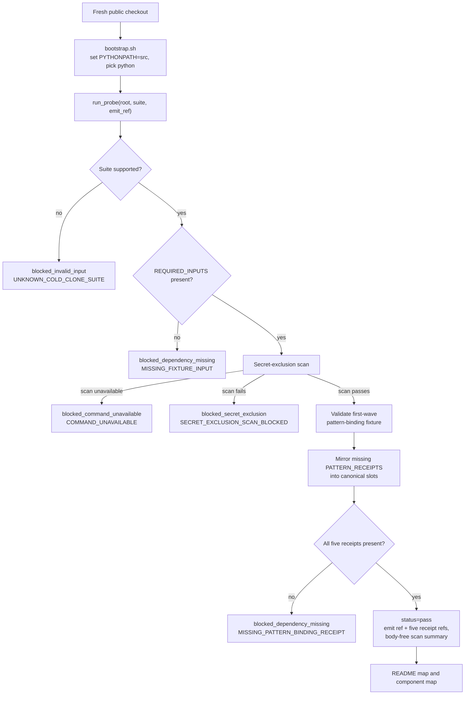

# Cold Clone Probe

`cold_clone_probe` is the source-root probe for a fresh public checkout. It
answers one first-contact question: can this clone run the bounded bootstrap
contract and write local ignored evidence before the reader installs the console
command or opens the long organ inventory?

## Purpose

The probe exists to keep the public entry path concrete. A cold reader should be
able to start at the repository root, run one script, and see three facts:

- the package imports from `src/` in the checkout;
- the first-wave pattern-binding fixture can validate and mirror its public
  receipt set;
- the secret-exclusion scan stays in the receipt boundary without exposing
  private bodies.

That is a bootstrap proof, not a release proof. It is intentionally before
`make install`, `make smoke`, `make ci`, or a standalone export review.

## Reader Proof Boundary

Read this page as the authored Markdown projection for a JSON-capsule-backed
Microcosm paper-module row. The source authority is now
`core/paper_module_capsules.json::paper_modules[93:paper_module.cold_clone_probe]`,
which explains the resolved mechanism subject
`mechanism.cold_clone_probe.validates_public_source_root_bootstrap`. The useful
proof remains narrow: the page names the current source locus, the public
standard, the focused tests, and the receipt boundary without claiming release,
hosting, provider execution, source mutation, or whole-system correctness.

## JSON Capsule Binding

`core/paper_module_capsules.json` contains
`paper_module.cold_clone_probe`, a JSON capsule row that binds this Markdown
projection to the resolved mechanism subject
`mechanism.cold_clone_probe.validates_public_source_root_bootstrap`. The capsule
names `src/microcosm_core/cold_clone_probe.py` as the resolved code locus and
keeps `bootstrap.sh`, the public standard, and focused tests as input/evidence
surfaces.

This Markdown is a reader projection over
`core/paper_module_capsules.json::paper_modules[93:paper_module.cold_clone_probe]`
with `source_authority: json_capsule`. The generated Mermaid projection and
generated Atlas projection are builder-owned views of that source edge. The
authority ceiling and proof boundary stay limited to source-root bootstrap
mechanics and body-free validation receipts.

Treat this as source-root bootstrap authority only. The capsule makes Mermaid,
Atlas, coverage, and site projections eligible to read a real subject edge, but
those projections remain generated views. They do not become source authority,
release permission, provider authority, hosted-product readiness, private-root
equivalence, or whole-system correctness evidence.

## JSON Capsule Boundary

This paper module is capsule-backed, but the authority boundary stays in three
parts:

- Current authority: `core/paper_module_capsules.json` is the JSON capsule
  authority; this Markdown is the authored reader projection named by
  `legacy_markdown_projection`.
- Current proof: `standards/std_microcosm_cold_clone_probe.json`,
  `src/microcosm_core/cold_clone_probe.py`, `bootstrap.sh`, and the focused
  tests make the source-root bootstrap probe inspectable.
- Projection refresh: generated JSON, Mermaid, Atlas, coverage, search, object
  maps, and public-site cards must be refreshed through their builders rather
  than hand-authored from this Markdown.

The capsule does not source hosted deployment, publication, provider calls,
release claims, source mutation authority, private-root equivalence, or
whole-system correctness.

## Prior Art Grounding

- [reproducible-builds.org](https://reproducible-builds.org/docs/), which
  frames reproducibility around recreating outputs from declared sources,
  instructions, and environment constraints.
- The [Twelve-Factor App](https://12factor.net/dependencies), especially the
  dependency-declaration principle that avoids hidden reliance on ambient
  system packages.
- [GitHub Actions](https://github.com/features/actions), as a common public
  workflow surface for clean-checkout build and smoke-test automation.

Microcosm borrows the clean-checkout, declared-dependency, and CI-smoke shape,
but keeps this module to source-root bootstrap mechanics. It does not certify
release operations, hosted deployment, publication, provider calls, secret
export, Lean/Lake execution, or whole-system correctness.

## Structured Lattice Bindings

- generated JSON row: `paper_modules/cold_clone_probe.json`.
- current source authority:
  `paper_module_payload.source_authority: json_capsule`.
- generated subject/code state:
  `paper_module_payload.source_row.subjects[]` resolves
  `mechanism.cold_clone_probe.validates_public_source_root_bootstrap`, and
  `paper_module_payload.source_row.code_loci[]` names
  `src/microcosm_core/cold_clone_probe.py`.
- generated relationship state:
  19 generated relationship edges and zero unpopulated selective relations are
  sourced from the capsule row.
- generated projection state:
  Mermaid and Atlas read the capsule subject edge after the doctrine-projection
  builder refreshes the generated corpus; Markdown remains
  `legacy_import_projection_until_roundtrip_builder`.
- Standard: `standards/std_microcosm_cold_clone_probe.json`.
- Runtime source: `src/microcosm_core/cold_clone_probe.py`.
- Root command wrapper: `bootstrap.sh`.
- Public docs refs: `README.md#try-it-on-your-repo`,
  `AGENTS.md#fast-entry-for-cold-agents`, and
  `skills/cold_start_navigation.md`.
- Focused tests: `tests/test_cold_clone_probe.py`,
  `tests/test_bootstrap_script.py`, and
  `tests/test_public_entry_docs.py`.

The runtime contract is small and inspectable. `run_probe()` validates the
requested suite, confirms `REQUIRED_INPUTS`, runs
`validate_secret_exclusion_scan()`, runs the pattern-binding validator against
the first-wave fixture, mirrors the declared `PATTERN_RECEIPTS` if needed, and
writes the final receipt at `DEFAULT_EMIT_REF` unless the caller intentionally
overrides it.

The root script preserves the public entry boundary: it sets `PYTHONPATH=src`,
selects a local Python executable, supports `--dry-run`, and calls
`microcosm_core.cold_clone_probe`. It is the source-root probe, not a package
install command.

## Shape



The diagram is an audience aid only. Generated lattice Mermaid remains a builder
projection over the capsule edge, not a hand-authored source claim.

## Technical Mechanism

The mechanism has two layers: a shell membrane at `bootstrap.sh` and a Python
receipt predicate at `src/microcosm_core/cold_clone_probe.py`.

`bootstrap.sh` fixes the reader's starting position before any Python logic
runs. It changes into the repository root, validates the requested suite, adds
`src` to `PYTHONPATH`, chooses `MICROCOSM_PYTHON`, `PYTHON`, `python3`, or
`python`, and then calls `microcosm_core.cold_clone_probe` with `--suite` and
`--emit`. Its `--dry-run` branch prints the same command and the ignored receipt
target without writing evidence, so a reader can inspect the bootstrap boundary
before running it.

`run_probe()` is the actual proof predicate. It creates a body-free base
receipt, rejects unknown suites before touching fixture or scanner state,
checks all `REQUIRED_INPUTS`, runs `validate_secret_exclusion_scan()` before
pattern-binding replay, then validates the first-wave pattern-binding fixture
into `.microcosm/cold_clone_probe/pattern_binding_contract`. The mirroring step
is intentionally narrow: `_mirror_missing_pattern_receipts()` only copies the
declared `PATTERN_RECEIPTS`, treats unreadable destinations and sources as
missing evidence through `_path_exists()` and `_path_is_file()`, and strict-reads
the validation receipt before adding the expected public receipt refs.

The success state is correspondingly small. A passing receipt records the emit
ref first, followed by the five pattern-binding receipt refs, and includes
secret-exclusion status without copying private bodies. Non-pass states are
typed as `blocked_invalid_input`, `blocked_dependency_missing`,
`blocked_secret_exclusion`, or `blocked_command_unavailable`, which lets a
reader distinguish malformed input, missing fixture evidence, private-boundary
failure, and unavailable runtime dependencies.

This is the concrete implementation of
`mechanism.cold_clone_probe.validates_public_source_root_bootstrap` and the
capsule's `concept.entry_and_reveal_route_readiness_bundle` edge. The capsule's
axiom and principle refs govern the boundary posture: JSON remains contract,
Markdown/Mermaid/Atlas remain projections, source-open evidence must stay
public-safe, and a local receipt proves only the bounded first action from a
fresh checkout.

## Public Site Availability Boundary

This module is public-safe to expose as a reader route because it describes a
cold-checkout bootstrap probe, public commands, standards, tests, receipt
paths, and anti-claims without exporting private checkout state. Website
availability should come from the existing Microcosm site builder reading this
source page and generated Microcosm data; generated site HTML, object maps,
search indexes, and content graphs are projections, not source authority.

## Public-Safe Body Handling

This page may name `bootstrap.sh`, `src/` import loci, README anchors, standard
refs, test files, ignored receipt paths, fixture ids, and secret-exclusion scan
posture. It must not embed local `.microcosm/` receipt bodies, absolute private
paths, host environment dumps, credentials, provider payloads, account/session
state, raw operator voice, secret-scan findings with sensitive values, or
private checkout material.

The default probe receipt stays ignored local state. Reader cards, generated
site projections, and this Markdown should represent probe evidence by public
relative refs, statuses, booleans, anti-claims, and summaries rather than by
copying private local evidence bodies.

## Subject Admission Audit

A resolving paper-module subject now exists:

- `core/paper_module_capsules.json` contains `paper_module.cold_clone_probe`.
- `core/mechanism_sources.json::mechanisms` contains
  `mechanism.cold_clone_probe.validates_public_source_root_bootstrap`.
- `core/organ_registry.json::implemented_organs` still does not contain an
  accepted `cold_clone_probe` organ, and this page does not invent one.
- `standards/std_microcosm_cold_clone_probe.json::relationships.used_by_organs`
  may name consumers of the standard, but those consumers are not needed as the
  paper-module subject because the mechanism row resolves the capsule edge.

That is why this page can route generated projections to the capsule subject
while keeping the proof boundary to public source-root bootstrap mechanics.

## Capsule Refresh Packet

- current source authority: generated JSON should report
  `paper_module_payload.source_authority: json_capsule` after builder refresh.
- generated row source ref:
  `core/paper_module_capsules.json::paper_modules[93:paper_module.cold_clone_probe]`.
- current generated projection status: Mermaid/Atlas are capsule-edge
  projections, not hand-authored claims.
- resolved code locus: `src/microcosm_core/cold_clone_probe.py`.
- resolving test loci: `tests/test_cold_clone_probe.py`,
  `tests/test_bootstrap_script.py`, and
  `tests/test_public_entry_docs.py`.
- resolving authority edge:
  `mechanism.cold_clone_probe.validates_public_source_root_bootstrap`.
- refresh condition: rerun
  `scripts/build_doctrine_projection.py --write-paper-module-corpus` after
  capsule or mechanism changes, then verify Mermaid and Atlas remain generated
  projections with no release or private-root authority.
- authority ceiling: this Markdown and its generated projections describe
  reader evidence only; they do not source hosted deployment, publication,
  provider calls, release claims, source mutation, private-root equivalence, or
  whole-system correctness.

## Public Contract

Run `./bootstrap.sh` from the public root. The probe validates source-form
package importability and first-wave bootstrap mechanics while preserving the
public/private boundary. Use `./bootstrap.sh --dry-run` to inspect the exact
command without writing the ignored receipt.

The successful script output points back to `README.md#public-repo-map` and
`README.md#component-map`. That is deliberate: the probe proves the first local
source-root action, then hands the reader to the public map instead of asking
them to trust a hidden setup step.

## Receipt Expectations

The probe emits ignored `.microcosm/cold_clone_probe.json` evidence with
`status=pass`, public relative receipt paths, anti-claims, and no private body
excerpts. Pass `--emit <path>` only when refreshing an intentional local
receipt target; the default reader path should stay ignored local state.

The receipt is expected to show:

- `suite: first-wave`;
- `receipt_paths[0]: .microcosm/cold_clone_probe.json`;
- a passing `secret_exclusion_scan` with no receipt body exposure;
- the observed first-wave pattern-binding receipt refs;
- no absolute private path, provider payload body, account/session material, or
  credential-bearing payload.

## Reader Evidence Routing

Use the probe evidence by reader question, not by copying private local
receipts into public projections:

- A safety/evals reader starts with the secret-exclusion and anti-claim fields.
  The useful question is whether the source-open claim excludes private bodies
  and credential-equivalent live-access data.
- A peer developer starts with `bootstrap.sh --dry-run`, then reads
  `run_probe()` and the focused tests. The useful question is whether the
  fixture, receipt mirroring, and default ignored receipt behavior are
  reproducible from source.
- A hiring or review reader starts with the README map after the probe passes.
  The useful question is whether the first local action is bounded before any
  larger claim about release, hosting, package distribution, or whole-system
  behavior.

## Named Proof Consumers

- `tests/test_cold_clone_probe.py` consumes the Python predicate directly. It
  verifies suite gating, default ignored receipt selection, custom emit refs,
  fixture-missing behavior, secret-scan blocking before pattern replay,
  pattern-binding receipt mirroring, unreadable path handling, duplicate-key
  rejection in mirrored validation receipts, and body-free secret scan aliases.
- `tests/test_bootstrap_script.py` consumes the root wrapper. It verifies
  no-side-effect help and version branches, argument and suite errors, dry-run
  command disclosure without writes, Python executable selection, custom emit
  writes, and the default `.microcosm/cold_clone_probe.json` path.
- `tests/test_public_entry_docs.py` consumes the reader-facing documentation
  contract. It checks that README, AGENTS, SECURITY, CONTRIBUTING, QUICKSTART,
  and entry surfaces name the bootstrap path, ignored local receipt boundary,
  public map handoff, and release/host/private-state anti-claims without
  reverting to stale tracked `receipts/cold_clone_probe.json` defaults.

Together these consumers prove the mechanism's accounting order and public
reader language. They do not prove package distribution, CI completeness,
hosted behavior, release authorization, provider execution, private-root
equivalence, or acceptance of a `cold_clone_probe` organ.

## Validation Receipt Path

Reader-verifiable commands, run from the `microcosm-substrate/` public root:

```bash
./bootstrap.sh --dry-run
./bootstrap.sh
PYTHONPATH=src ../repo-pytest \
  microcosm-substrate/tests/test_cold_clone_probe.py \
  microcosm-substrate/tests/test_bootstrap_script.py \
  microcosm-substrate/tests/test_public_entry_docs.py \
  -q --basetemp /tmp/microcosm-cold-clone-probe
```

The dry run prints the exact source-root command and the ignored receipt target
without writing evidence. The normal run writes `.microcosm/cold_clone_probe.json`;
the focused pytest line verifies the probe, root script, and public-entry docs
against the current checkout.

The focused tests cover default ignored receipt behavior, custom local receipt
overrides, unknown-suite blocking, unreadable input handling, generated receipt
mirroring, public-entry doc invariants, and the rule that stale tracked
`receipts/cold_clone_probe.json` paths do not become the default first-contact
proof.

This receipt path is reader-verifiable evidence only. It does not flip
Mermaid/Atlas status, create capsule authority, install the package, certify
release operations, export secrets, call providers, or aggregate
doctrine-lattice coverage.

## Claim Ceiling

This module proves only a bounded source-root bootstrap probe for a fresh
public checkout: package importability from `src/`, secret-exclusion scan
posture, first-wave pattern-binding fixture validation, and ignored local
receipt emission. The source authority is the existing JSON capsule, and the
generated Mermaid and Atlas projections are available or linked from capsule
edges. This Markdown does not create or refresh those projections and does not
promote them beyond generated-view status. It also does not create hosted
deployment evidence, publication readiness, provider authority,
package-distribution proof, release approval, private-root equivalence, or
whole-system correctness.

## Anti-Claim

This module documents clone/bootstrap mechanics only. It does not certify
release operations, hosted deployment, publication, recipient work,
provider calls, secret export, Lean/Lake execution, package distribution,
production readiness, private-root equivalence, or whole-system correctness.
