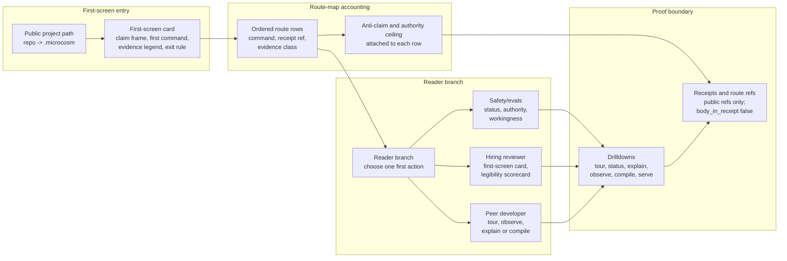

# Cold-Reader Route Map

`cold_reader_route_map` makes Microcosm's first ten minutes executable. It
validates a public route map whose rows bind the first-run sequence to runnable
commands, docs refs, receipt refs, and authority ceilings.

## Purpose

A cold technical reader should not have to infer the product path from a long
README or raw receipt tree. The route map answers one question: what should I
run first, and what evidence proves that path is wired?

The unusual part is how the validator checks that proof. It does not merely
confirm that each route row carries the right fields. It replays every route
against real source: each row's command, its docs refs, its receipt refs, and
the human-readable signals it claims to show are matched against the actual
text of copied source modules and public docs. A command whose material tokens
do not appear anywhere in that source corpus is blocked, as is a docs ref that
does not resolve to a real heading and a receipt ref that does not open a
pass-status receipt. So a route cannot promise a command the system does not
actually run, which is the failure mode a hand-written quick-start guide drifts
into the moment the commands change underneath it.

The evidence contract is source-open by default: public route cards, route
receipt bindings, route policy, exported bundle refs, and generated receipts
carry the substrate, while `secret_exclusion_scan` excludes only private source
bodies, provider payloads, account/session material, secrets, and
credential-equivalent live-access data. Receipt bodies are not inlined; they
are represented by `body_in_receipt: false` plus public runtime refs.

## Shape



## JSON Capsule Binding

- source_ref:
  `core/paper_module_capsules.json::paper_modules[13:paper_module.cold_reader_route_map]`
- source_authority: json_capsule
- Projection role: This Markdown is a reader projection of the JSON capsule
  row, not the source authority. The generated Mermaid projection is
  `paper_module.cold_reader_route_map.mermaid` with status
  `available_from_capsule_edges`, and the generated Atlas projection is
  `organ_atlas.cold_reader_route_map` with status
  `linked_from_capsule_edges`.
- proof boundary: the capsule binds the accepted organ, resolved mechanism row,
  runtime source locus, governed concept edge, nine principle edges, six axiom
  edges, three dependency edges, and 22 generated relationship edges.
- authority ceiling: this page can explain the first-run route-map fixture,
  exported-bundle receipts, copied non-secret macro cold-entry evidence, and
  validation receipts, but it cannot become route-registry authority, call
  providers, mutate source, authorize release, or widen the proof boundary.

## Source-Open Body Floor

The source-open body floor is the public route-map fixture, route card set,
route policy, exported cold-reader route-map bundle, source-module manifests,
and generated receipts. It carries public refs, digests, route ids, receipt
refs, evidence classes, anti-claims, authority ceilings, and
`body_in_receipt: false` markers instead of inlining private source or live
state.

The floor excludes private source bodies, provider payloads, account/session
material, browser or HUD state, credential-equivalent live-access data,
recipient state, and route-registry mutation authority. A reader can inspect
the route map and exported bundle to reproduce the first-run sequence, but the
bundle remains evidence for public replay shape rather than release or
production authority.

## Claim Ceiling

This module covers public cold-reader route-map validation: command refs,
receipt refs, ordinal route sequencing, evidence classes, anti-claims,
authority ceilings, exported-bundle provenance, copied non-secret cold-entry
evidence, and negative cases for missing refs, sequence gaps, overclaims, and
private body fields.

The ceiling stops before route-registry source authority, live session
inspection, provider execution, source mutation, hosted readiness, release,
publication, private-data equivalence, or whole-system correctness. The route
map can tell a cold reader what to run first and which receipt bounds that run;
it cannot promote the docs sequence into proof beyond those public fixtures and
receipts.

## Reader Evidence Routing

Start with `core/paper_module_capsules.json::paper_modules[13:paper_module.cold_reader_route_map]`, then read the generated JSON projection for the resolved relationships. A diagram view is generated for this module and an atlas card entry is available. The route-map fixture, exported bundle, source-module manifests, and temporary receipts are evidence for replay shape. This Markdown gives cold readers the interpretation order, not source authority.

## Reader Proof Boundary

The proof boundary is the first-run route-map fixture, ordered command rows,
receipt refs, evidence classes, anti-claims, authority ceilings, exported
bundle provenance, copied non-secret cold-entry evidence, and negative cases.
It does not prove route-registry source authority, provider execution, source
mutation, publication, release, private-data equivalence, financial advice, or
whole-system correctness.

## Public Site Availability Boundary

Public entry screens may use this module to sequence the first ten minutes only
when command refs, receipt refs, evidence class, anti-claim, and authority
ceiling stay visible. A site card must not convert route order into release
authority, production readiness, provider behavior, or whole-system proof.

This page is public-safe source input for the existing Microcosm site builder
when it is read with `paper_modules/cold_reader_route_map.json`,
`core/paper_module_capsules.json::paper_modules[13:paper_module.cold_reader_route_map]`,
and the mechanism/source refs named by the capsule. Generated site feeds,
object maps, search indexes, `llms.txt`, and paper-module pages are projections
over those source surfaces; they are not source authority and must be refreshed
through `tools/meta/dissemination/build_microcosm_public_site.py`, not edited by
hand.

The public-site handoff receipt is
`receipts/public_site/cold_reader_route_map_site_handoff_20260604T1956Z.json`.
It records the builder re-entry command, public-safety exclusions, and
routeability checks for content graph, object map, search, and the paper-module
page while preserving the non-release, non-hosted, non-provider, and
non-source-mutation boundary.

## Public-Safe Body Handling

The public floor is route ids, commands, docs refs, receipt refs, evidence
classes, anti-claims, authority ceilings, manifest refs, digests, and
`body_in_receipt: false` markers. Public projections must exclude private
source bodies, provider payloads, account/session material, browser/HUD state,
recipient state, secrets, and credential-equivalent live-access data.

## Prior Art Grounding

This organ is grounded in documentation systems that treat reader state and task
shape as first-class. [Diataxis](https://diataxis.fr/) separates tutorials,
how-to guides, reference, and explanation so readers are not forced through one
undifferentiated documentation pile. Knuth's
[literate programming](https://cs.stanford.edu/~knuth/lp.html) is an older
anchor for the idea that executable systems should be written for human
comprehension as well as machine execution.

Microcosm borrows the reader-route pattern: first command, receipt ref,
evidence class, anti-claim, authority ceiling, and next drilldown are ordered
for a cold reader. It does not make the route map source authority or substitute
documentation sequence for validator evidence.

## Structured Lattice Bindings

The structured capsule row is
`core/paper_module_capsules.json#paper_module.cold_reader_route_map`. It binds
this Markdown projection to the organ, the resolved mechanism row
`mechanism.cold_reader_route_map.validates_public_first_run_route_map`, and the
runtime source locus `src/microcosm_core/organs/cold_reader_route_map.py`.

The source atlas row carries the matching `paper_module_ref`, `mechanism_refs`,
and `code_loci` entries. Generated atlas docs remain builder-owned projections:
refresh them with `PYTHONPATH=src python3 scripts/build_organ_atlas.py --write`
instead of editing `ORGANS.md`, `ARCHITECTURE.md`, `AGENT_ROUTES.md`, or
`atlas/agent_task_routes.json` by hand.

The accepted path is:

1. `microcosm hello <project>`
2. `microcosm tour --card <project>`
3. `microcosm status --card <project>`
4. `microcosm authority --card`
5. `microcosm workingness --card`
6. `microcosm legibility-scorecard`
7. Read `selected_route_id` from the compact tour or status card.
8. `microcosm explain <project> <selected_route_id>`
9. `microcosm observe --card <project>`
10. `microcosm cold-reader-route-map run-route-map-bundle`

Full drilldowns stay available after the compact path is visible:

- `microcosm tour <project>` for the full first-screen route tree.
- `microcosm compile <project>` for project-state materialization details.
- `microcosm proof-lab --out /tmp/microcosm-proof-lab` for proof-lab
  component receipts.
- `microcosm serve <project> --host 127.0.0.1 --port 8765` for the local
  observatory.
- `microcosm spine`, `microcosm intake`, and `microcosm reveal` for deeper
  runtime-spine, intake, and reveal surfaces.

## Reader-Specific Evidence Routing

The route map should make the evidence-count frame visible before the reader
chooses a drilldown. Honest counters are not progress badges:

- A safety/evals engineer follows `microcosm status --card`,
  `microcosm authority --card`, and `microcosm workingness --card` first. The
  useful question is whether each claim names its evidence class, validator,
  failure mode, and authority ceiling.
- A hiring reviewer follows the first-screen card and legibility scorecard
  first. The useful question is whether small verified counts are framed as
  honest proof boundaries instead of hidden or inflated.
- A peer developer follows `microcosm tour --card`, `microcosm observe --card`,
  and then full `microcosm observe`, `microcosm compile`, or `microcosm explain`
  as drilldowns. The useful question is whether a fresh clone can reproduce the
  route/work/event/evidence chain locally without opening full event rows first.

The route map must therefore preserve both the command order and the evidence
interpretation order: command, receipt ref, evidence class, anti-claim,
authority ceiling, then deeper route. Reader-specific branches may hide other
branches, but they may not hide the accounting frame that prevents "1 verified
import" from being read as either failure or marketing.

## One-Screen Handoff Contract

The route map consumes the first-screen card as the handoff, not as another
route row. A cold reader should see this sequence:

1. First-screen card: claim frame, `microcosm hello <project>`, shared proof,
   evidence legend, structural join, reader rail, and exit rule.
2. Route map: the accepted command order, with receipt refs and authority
   ceilings attached to each command.
3. Reader branch: one audience-specific first action, one proof surface, one
   success criterion, and one next drilldown.

The handoff fails when the first screen turns into a complete route inventory,
or when the route map assumes the reader already understands evidence classes.
The first screen should compress; the route map should sequence; the reveal
should demonstrate the path against public receipts.

## Comparison-Backed Route Rows

Each route row should make the unusual discipline visible by naming the normal
failure mode it is avoiding. The route map is not just a command list; it is a
sequence of claim-boundary checks:

| Route row field | Failure avoided | Required reader cue |
|---|---|---|
| `command_ref` | Prose-only claims about what runs. | Show the exact local command before the claim it supports. |
| `receipt_ref` | Trusting generated summaries as source authority. | Point to the receipt or validator that bounds the row. |
| `evidence_class` | Treating all evidence as equal proof. | Label body import, subprocess witness, projection, validator, or fixture evidence. |
| `anti_claim` | Letting a successful demo imply release, production, provider, or proof authority. | State the forbidden read beside the positive claim. |
| `failure_mode_ref` | Governance looking like abstract ceremony. | Name the concrete overclaim or missing-standard case this row catches. |

Rows that omit the comparison cue are still technically navigable, but they
make the rigor invisible to a cold reader. The validator should prefer a
shorter row with command, receipt, class, anti-claim, and failure mode over a
longer row that lists more organs without explaining what each boundary
prevents.

## Observable Drilldown Order

Browser-first readers follow the same route map as terminal-first readers. The
route order is compressed, not replaced:

1. First-screen card or compact browser board.
2. `microcosm tour --card <project>` as the shared behavior proof.
3. Selected route plus work/event/evidence refs.
4. Compact observatory view for the same route.
5. Full route map, receipts, standards, and raw JSON drilldowns.

The compact observatory row must carry the same command ref, receipt ref,
evidence class, anti-claim, and authority ceiling as the terminal route row.
If the browser board cannot show those fields, it is a preview only and cannot
serve as the cold-reader route handoff.

`readme_onboarding_route` is the selected route only for projects with a README;
folders without one still get a route/work/event/evidence path through the
selected route emitted by `tour` and `compile`.

Each route card must include a command and public docs refs. Each route id must
also resolve to at least one receipt ref. The sequence must be ordinal sorted
so the public entry does not drift into a bag of impressive but unordered
organs.

## Receipt Expectations

The first-wave fixture should emit result, board, validation, and acceptance
receipts for the route map. The board should preserve ordinal route order,
receipt refs, evidence classes, anti-claims, authority ceilings, and negative
case outcomes without inlining private source bodies or live account/session
material.

The exported bundle validator should write temporary or runtime-shell receipts
that prove bundle shape and public source-module provenance only. Those bundle
receipts can show that the cold-reader route map is replayable from public
inputs, but they cannot authorize publication, route-registry mutation,
provider execution, release, or whole-system correctness.

## Validation

```bash
PYTHONPATH=src python3 -m microcosm_core.organs.cold_reader_route_map run --input fixtures/first_wave/cold_reader_route_map/input --out receipts/first_wave/cold_reader_route_map --acceptance-out receipts/acceptance/first_wave/cold_reader_route_map_fixture_acceptance.json
PYTHONPATH=src python3 -m microcosm_core.cli cold-reader-route-map run-route-map-bundle --input examples/cold_reader_route_map/exported_cold_reader_route_map_bundle --out receipts/runtime_shell/demo_project/organs/cold_reader_route_map
```

The fixture observes negative cases for missing command refs, missing receipt
refs, route sequence gaps, release/provider overclaims, and private source body
fields. The exported bundle omits negative cases and validates the real runtime
shape used by `microcosm run`, with synthetic receipt stand-ins explicitly
disallowed as product evidence.
If focused validation reports an exact-copy source-module body mismatch, route
that repair through `microcosm_exact_copy_refresh`; do not treat this Markdown
projection as the authority for copied source bodies.

## Validation Receipts

From `microcosm-substrate/`, reproduce this page's proof boundary with
temporary receipts:

```bash
PYTHONPATH=src ../repo-python -m microcosm_core.organs.cold_reader_route_map run --input fixtures/first_wave/cold_reader_route_map/input --out /tmp/microcosm-cold-reader-route-map --acceptance-out /tmp/microcosm-cold-reader-route-map-acceptance.json
PYTHONPATH=src ../repo-python -m microcosm_core.organs.cold_reader_route_map run-route-map-bundle --input examples/cold_reader_route_map/exported_cold_reader_route_map_bundle --out /tmp/microcosm-cold-reader-route-map-bundle
../repo-pytest microcosm-substrate/tests/test_cold_reader_route_map.py
PYTHONPATH=src ../repo-python scripts/build_doctrine_projection.py --check-paper-module-corpus
```

The focused pytest file is the proof consumer for this Markdown section. It
asserts the fixture status, ten-route command and receipt-ref counts,
front-door route order, expected negative cases, route-source replay support,
exported bundle shape, copied source-module digest and anchor matches,
source-open fixture-manifest counts, no source bodies in public receipts,
streamed line-count and digest handling, and fresh exported-bundle card reuse.
The corpus check verifies that this page remains in the 98-module paper-module
set and that the JSON capsule, generated Mermaid, Atlas card, and Markdown
projection stay mutually consistent.

These receipts validate the route-map fixture, exported bundle receipts, copied
non-secret cold-entry evidence, and paper-module corpus membership only; they
do not grant route-registry authority, provider execution, source mutation,
release approval, private-data equivalence, financial advice, publication
authority, hosted readiness, or whole-system correctness.

## Authority Ceiling

This organ is projection-only metadata. It is not route-registry authority, it
does not mutate source projects, it does not call providers, and it does not
authorize release, publication, trading or financial advice, private-data
equivalence, or whole-system correctness claims.
