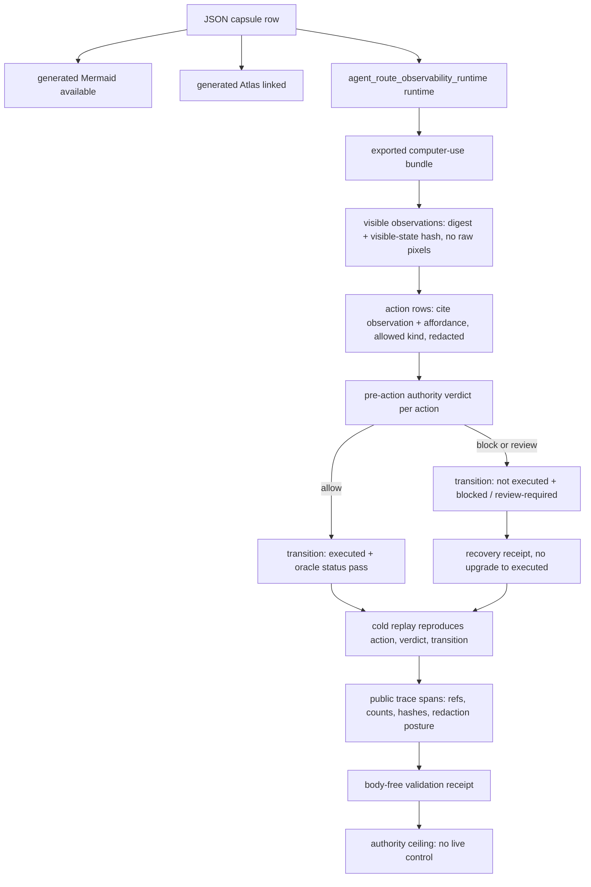

# Computer-Use Action Trace Replay

`computer_use_action_trace_replay` is a validator-backed claim contract under
`agent_route_observability_runtime`. It asks a narrow eval-harness question:
does a claimed computer-use episode bind visible observations, affordances,
actions, pre-action authority verdicts, state-transition receipts, recovery
receipts, cold replay, falsification fixtures, private-state scan posture, and
an explicit authority ceiling?

Run:

```bash
PYTHONPATH=src ../repo-python -m microcosm_core.cli agent-route-observability-runtime \
  --input examples/agent_route_observability_runtime/exported_computer_use_action_trace_bundle \
  --out receipts/runtime_shell/demo_project/organs/agent_route_observability_runtime \
  validate-computer-use-bundle
```

The fixture rejects live account action, credential entry, external network
mutation, purchase/send without approval, destructive action without review,
hidden screen-state claims, actions without observation and affordance refs, and
benchmark-score claims.

## Purpose

A computer-use agent produces a stream of screenshots, clicks, keystrokes, and
"it worked" assertions. The hard question for anyone reviewing such a trace is
not whether the agent moved the mouse, but whether the record actually supports
the claim that something happened safely. A trace can look complete while hiding
the two failures that matter most: an action that was blocked or sent for review
but is later narrated as a success, and a success that is asserted without any
state evidence to back it. This module exists to make that question decidable on
a synthetic episode, offline, before any of the language reaches a reader.

The single question it answers is: does each recorded action line up, row by row,
with a prior visible observation, a pre-action authority verdict, and a
state-transition receipt whose outcome agrees with that verdict? The mechanism is
a typed join, not a screenshot replay. An action must cite the observation it
reacted to and an affordance that was visible in it; a verdict must be stamped
before the action and must explicitly deny live-account, credential, network,
destructive, and purchase or send authority; a transition receipt must then
match the verdict. If the verdict said allow, the receipt has to show the action
was executed and an oracle confirmed the resulting state. If the verdict said
block or review, the receipt has to show the action was not executed and the
status reads blocked or review-required. Nondeterministic "it probably
succeeded" claims are refused outright.

What is genuinely unusual here is the inversion. Most action-trace tooling treats
a screenshot as the proof. This module treats the screenshot as the one thing it
will not trust: observations enter only as a digest and a visible-state hash,
with raw pixels, hidden-state assertions, and live-browser state all required to
be absent. The evidence that carries weight is the agreement between the verdict
and the transition, not the image. The receipt that comes out the other end
records counts, refs, hashes, and the redaction posture, and never the raw bodies
it checked. It describes a synthetic episode under the route-observability
runtime; it does not drive a live browser or desktop.

## Shape



The shape is a reader route over a synthetic computer-use action trace
validator. The evidence path runs through the capsule row, fixture manifest,
exported bundle, runtime validator, public trace builder, body-free receipts,
and explicit authority ceiling. A diagram view and Atlas entry are generated
for this module from the capsule row.

## Governing Lattice Relation

The capsule row binds this module to the accepted
`agent_route_observability_runtime` organ and to
`mechanism.agent_route_observability_runtime.validates_public_route_feedback`.
That places the page under `AX-1` and the `P-1` / `P-2` claim discipline: a
computer-use claim is admissible only when the runtime recomputes it from lower
level evidence, and the public sentence cannot exceed what the named validator
actually checks. The generated JSON instance records nine resolved edges:
organ, mechanism, concept, axiom, principle, dependency, and code-locus links.

The relevant concept is
`concept.agent_reliability_and_safety_validator_bundle`, not a generic browser
agent benchmark. It frames the replay as an evidence bundle: visible
observations and affordances are the basis, action rows are candidate
transitions, pre-action authority verdicts decide whether a transition may be
executed or blocked, and receipt rows carry the bounded public result. The
dependencies on `agent_route_observability_runtime` and
`macro_projection_import_protocol` keep the proof below the source-open import
and receipt lanes instead of treating this Markdown page as source authority.

## Technical Mechanism

The runtime entry point is
`run_computer_use_action_trace_bundle` in
`src/microcosm_core/organs/agent_route_observability_runtime.py`. It first loads
the bundle through the strict JSON path and decides whether the input is the
full fixture with negative cases or the public exported bundle. It then checks
the projection protocol, interaction policy, task episodes, screen
observations, action trace, authority verdicts, state transitions, recovery
receipts, cold replay rows, source-module manifest, private-state scan, and
public trace spans before writing a receipt. The status is `pass` only when
positive findings are empty, required negative cases are observed for the
fixture path, the private-state scan passes, and copied public source-module
digests verify.

The mechanism is a typed join, not a screenshot replay. Actions must cite prior
observation and affordance refs. Authority verdicts must cite action ids before
state transitions can be credited. Cold replay rows must cover the action ids
and reproduce the action, verdict, and transition relation. Recovery receipts
cover blocked or review-required actions without upgrading them into executed
mutations. The public trace builder then emits bounded spans over refs, counts,
hashes, and redaction posture, while the receipt deliberately omits raw screen
bodies, credentials, hidden screen state, provider payloads, private source
bodies, absolute local paths, and benchmark-score claims.

## Named Proof Consumers

- `validate-computer-use-bundle` is the reader command. On the exported bundle,
  it should produce
  `exported_computer_use_action_trace_bundle_validation_result.json` with four
  episodes, six observations, eight actions, eight authority verdicts, eight
  state-transition receipts, one recovery receipt, four cold replay rows, eight
  public trace spans, copied source-module digest verification, and an explicit
  no-live-control authority ceiling.
- `tests/test_agent_route_observability_runtime.py::test_computer_use_action_trace_replay_observes_negative_cases`
  is the negative fixture consumer. It checks that live account action,
  credential entry, external network mutation, unapproved purchase/send,
  destructive file action, hidden screen-state claims, action-without-observation
  rows, and benchmark-score claims are rejected.
- `tests/test_agent_route_observability_runtime.py::test_computer_use_action_trace_receipt_is_public_relative_and_redacted`
  is the receipt-safety consumer. It verifies public-relative paths and absence
  of credential values, hidden screen state, absolute paths, and raw bodies.
- `tests/test_agent_route_observability_runtime.py::test_computer_use_action_trace_exported_bundle_validates_runtime_shape`
  is the public-bundle consumer. It checks the exported-bundle shape, action
  kinds, source-module digest posture, public trace coverage, and no benchmark
  authority.
- `tests/test_agent_route_observability_runtime.py::test_computer_use_trace_loader_rejects_duplicate_json_keys`
  is the parser-integrity consumer. It prevents a replay bundle from passing by
  hiding conflicting values behind duplicate JSON keys.

## Reader Proof Boundary

Read this page as a public reader projection over a JSON-capsule-backed
Microcosm paper-module row. The generated JSON row reports
`paper_module_payload.source_authority: json_capsule`, and the capsule source
row is
`core/paper_module_capsules.json::paper_modules[46:paper_module.computer_use_action_trace_replay]`.
The useful proof boundary is still narrow: synthetic visible observations,
affordances, pre-action authority verdicts, state-transition receipts, recovery
receipts, cold replay rows, source locus, and validation receipts. It does not
grant live browser or desktop control, account action, credential entry,
external mutation, benchmark claims, release authority, or whole-lattice
correctness.

## JSON Capsule Binding

`core/paper_module_capsules.json` contains
`paper_module.computer_use_action_trace_replay` at
`core/paper_module_capsules.json::paper_modules[46:paper_module.computer_use_action_trace_replay]`.
This Markdown is a reader projection; `source_authority: json_capsule` lives in
that capsule row. The generated Mermaid projection is available from capsule
edges, and the generated Atlas projection is available or blocked only according
to the generated capsule status, not this prose page.

Treat `src/microcosm_core/organs/agent_route_observability_runtime.py`, the
synthetic action-trace fixture, and the body-free receipts as the public proof
boundary. They support the capsule row without authorizing live computer-use
actions.

## JSON Capsule Boundary

This paper module is JSON-capsule-backed in the generated paper-module corpus:
`paper_module_payload.source_authority` is `json_capsule`. The synthetic
computer-use replay evidence makes the action-trace contract inspectable to
readers, but it does not expand the authority ceiling beyond the capsule row.

Re-entry is exact for any future expansion: after a new accepted organ or
mechanism subject is admitted and any named code loci resolve, update the real
row in `core/paper_module_capsules.json` and regenerate with
`scripts/build_doctrine_projection.py --write-paper-module-corpus`. Until that
happens, this Markdown explains the proof boundary; it does not source live
browser or desktop control, account action, credential entry, external
mutation, release claims, or aggregate doctrine-lattice coverage.

## Capsule Re-entry Packet

- current source authority: generated JSON reports
  `paper_module_payload.source_authority: json_capsule`.
- capsule source row:
  `core/paper_module_capsules.json::paper_modules[46:paper_module.computer_use_action_trace_replay]`.
- current generated projection status: read the generated JSON row and coverage
  export; this Markdown is not projection authority.
- resolved code locus:
  `src/microcosm_core/organs/agent_route_observability_runtime.py`.
- re-entry condition: after an additional organ or mechanism admission lands,
  update `paper_module.computer_use_action_trace_replay` in
  `core/paper_module_capsules.json`, run
  `scripts/build_doctrine_projection.py --write-paper-module-corpus`, and verify
  Mermaid and Atlas statuses through generated outputs.
- authority ceiling: this Markdown provides reader evidence only; it does not
  source live browser or desktop control, account action, credential entry,
  external mutation, release claims, or aggregate doctrine-lattice coverage.

## Reader Evidence Routing

- Capsule route: `core/paper_module_capsules.json::paper_modules[46:paper_module.computer_use_action_trace_replay]`
  is the source-authority row for this module. A diagram view and Atlas
  entry are generated from that capsule row.
- Dependency route: downstream modules may reference
  `paper_module.computer_use_action_trace_replay`, but this page's source
  authority is the capsule row named above, not those downstream dependencies.
- Fixture-manifest route:
  `core/fixture_manifests/agent_route_observability_runtime.fixture_manifest.json::computer_use_action_trace_replay_contract_v1`
  names the positive inputs, negative-case floor, expected receipt fields,
  runtime-example command, and authority ceiling.
- Runtime route:
  `src/microcosm_core/organs/agent_route_observability_runtime.py::run_computer_use_action_trace_bundle`
  loads the bundle, validates projection protocol, interaction policy,
  episodes, observations, actions, authority verdicts, state transitions,
  recovery receipts, cold replay, source-module manifest, negative cases, and
  public trace spans.
- Exported-bundle route:
  `examples/agent_route_observability_runtime/exported_computer_use_action_trace_bundle`
  contains `bundle_manifest.json`, `projection_protocol.json`,
  `interaction_policy.json`, `task_episodes.json`, `screen_observations.json`,
  `action_trace.json`, `authority_verdicts.json`,
  `state_transition_receipts.json`, `recovery_receipts.json`,
  `cold_replay.json`, and `source_module_manifest.json`.
- Source-module route: `source_module_manifest.json` records copied non-secret
  public source bodies for `codex/standards/std_agent_execution_trace.json`,
  `system/lib/agent_execution_trace.py`, and `system/lib/strict_json.py`, with
  `body_in_receipt: false`.
- Focused-test route:
  `tests/test_agent_route_observability_runtime.py` validates negative cases,
  public-relative redacted receipts, exported-bundle runtime shape, public trace
  span coverage, source-faithful public refactor status, source digest matching,
  and duplicate-key rejection.

## Public Site Availability Boundary

This module is public-safe to expose as a reader route because it describes a
synthetic action-trace replay contract, public bundle files, standards, tests,
receipts, counts, and authority ceilings without live browser or desktop
control. Website availability should come from the existing Microcosm site
builder reading this source page and generated Microcosm data; generated site
HTML, object maps, search indexes, and content graphs are projections, not
source authority.

## Public-Safe Body Handling

This page may name bundle file names, interaction-policy ids, episode and
action counts, observation and affordance refs, authority-verdict refs,
transition and recovery receipt refs, public trace span counts, source-module
manifest refs, focused tests, and negative-case names. It must not embed raw
screenshots or pixel bodies, live browser state, live desktop state, account
identifiers, credentials, purchase or send payloads, destructive host payloads,
provider payloads, hidden screen-state exports, raw operator voice, private
source bodies, or benchmark-score claims.

Copied public-safe source bodies stay in the exported bundle source-module
area and action-trace evidence stays synthetic. Reader cards, receipts,
generated site projections, and this Markdown should represent the replay by
refs, counts, hashes, spans, booleans, summaries, and authority ceilings rather
than by duplicating live or private state payloads.

## Validation Receipt Path

Reader-verifiable bundle command, run from `microcosm-substrate/`:

```bash
PYTHONPATH=src ../repo-python -m microcosm_core.cli agent-route-observability-runtime \
  --input examples/agent_route_observability_runtime/exported_computer_use_action_trace_bundle \
  --out receipts/runtime_shell/demo_project/organs/agent_route_observability_runtime \
  validate-computer-use-bundle
```

The command writes the computer-use replay receipt under
`receipts/runtime_shell/demo_project/organs/agent_route_observability_runtime/`,
including `computer_use_action_trace_replay_result.json` and the exported
bundle validation result. The tracked fixture receipt records the synthetic
observations, affordances, authority verdicts, transition receipts, recovery
receipts, falsification cases, private-state scan posture, and authority
ceiling.

This receipt path is reader-verifiable evidence only. It does not flip
Mermaid/Atlas status, create capsule authority, operate a live browser or
desktop, use accounts, enter credentials, mutate external systems, claim
benchmark performance, or aggregate doctrine-lattice coverage.

## Structured Lattice Bindings

- `source_authority`: `json_capsule`
- `paper_module_id`: `paper_module.computer_use_action_trace_replay`
- `reader_projection`: `microcosm-substrate/paper_modules/computer_use_action_trace_replay.md`
- `generated_projection`: `microcosm-substrate/paper_modules/computer_use_action_trace_replay.json`
- `projection_status`: Markdown reader projection over JSON capsule authority;
  Mermaid `available_from_capsule_edges`; Atlas `linked_from_capsule_edges`.
- `generated_edge_count`: 9
- `unresolved_selective_relation_count`: 0
- `dependency_parent`: `paper_module.batch7_macro_engines_capsule`
- `organ_id`: `agent_route_observability_runtime`
- `runtime_locus`: `src/microcosm_core/organs/agent_route_observability_runtime.py`
- `validator_entrypoint`: `run_computer_use_action_trace_bundle`
- `fixture_manifest`: `core/fixture_manifests/agent_route_observability_runtime.fixture_manifest.json`
- `fixture_input_locus`: `fixtures/first_wave/agent_route_observability_runtime/computer_use_action_trace_replay_input`
- `exported_bundle`: `examples/agent_route_observability_runtime/exported_computer_use_action_trace_bundle`
- `receipt_loci`: `receipts/first_wave/agent_route_observability_runtime/computer_use_action_trace_replay_result.json`
  and
  `receipts/runtime_shell/demo_project/organs/agent_route_observability_runtime/exported_computer_use_action_trace_bundle_validation_result.json`
- `source_open_body_floor`: copied non-secret public source-module files are
  manifest-listed; receipt bodies remain excluded.
- `runtime_evidence_floor`: four episodes, six observations, eight actions,
  eight authority verdicts, eight state-transition receipts, one recovery
  receipt, four cold replay rows, one blocked action, and eight public trace
  spans.
- `negative_case_floor`: live account action, credential entry, external network
  mutation, unapproved purchase/send, destructive file action, hidden
  screen-state claim, action without observation, and benchmark-score claim.
- `reentry_condition`: update the real
  `paper_module.computer_use_action_trace_replay` capsule row only after a new
  resolved subject, code locus, doctrine ref, or dependency becomes source
  authority; regenerate the paper-module corpus and verify the generated
  Mermaid and Atlas statuses from sidecars.

## Receipt Expectations

A valid fixture receipt exposes the bundle id, input mode, source pattern ids,
source refs, target refs, projection receipt refs, interaction policy id,
allowed action kinds, episode count, observation count, action count, action
kinds, authority-verdict count, allow/block/review counts, state-transition
count, executed and blocked transition counts, recovery-receipt count, cold
replay count, cold replay pass count, observed negative cases, missing negative
cases, typed error codes, private-state scan posture, public trace summary,
source-module digest status, authority ceiling, anti-claim, and public-relative
receipt paths.

A valid exported-bundle receipt may show `expected_negative_cases: {}` because
the public runtime bundle has `contains_negative_cases: false`; the fixture
manifest and focused tests remain the negative-case authority. It should still
show four episodes, eight actions, action kinds `click`, `edit_text_record`,
`navigate`, `select`, `type`, and `wait`, eight public trace spans, body-free
source-module verification, and no source-body text in receipts.

A valid receipt omits raw screenshots or pixel bodies, live browser state, live
desktop state, real account identifiers, credentials, secrets, external network
mutation payloads, purchase/send destinations, destructive host payloads,
provider payloads, hidden screen-state exports, raw source bodies, private
operator data, absolute local paths, and benchmark-performance claims. It may
claim synthetic computer-use action-trace replay over public refs; it may not
claim live browser or desktop control, account automation, credential entry,
external mutation, source mutation, provider behavior, release authority, or
aggregate doctrine-lattice coverage. Mermaid and Atlas availability are
generated navigation projections from the capsule row; they are not behavioral
proof.

## Claim Ceiling

This module may claim synthetic computer-use action-trace replay over public
fixtures: visible observations, affordances, action rows, pre-action authority
verdicts, state-transition receipts, recovery receipts, cold replay rows,
public trace spans, source-module digest checks, expected negative cases, and
body-free receipts.

It does not claim live browser or desktop control, account automation,
credential entry, purchase/send authority, external network mutation,
destructive host action, hidden screen-state truth, benchmark performance,
provider behavior, source mutation, release approval, or whole-system
correctness. The diagram view and Atlas entry generated for this module are
navigation surfaces; they are not additional proof authority.

## Prior Art Grounding

This organ is grounded in web and desktop agent benchmarks that make action
trajectories inspectable. [WebArena](https://arxiv.org/abs/2307.13854) and
[Mind2Web](https://arxiv.org/abs/2306.06070) anchor realistic web-task
evaluation, while [OSWorld](https://arxiv.org/abs/2404.07972) extends the
concern to multimodal agents acting in real computer environments. Browser
automation standards such as [WebDriver](https://www.w3.org/TR/webdriver2/) are
also prior art for representing actions against visible browser state through a
controlled protocol.

Microcosm borrows the action-trace accounting pattern: observations,
affordances, actions, pre-action authority verdicts, transition receipts,
recovery receipts, cold replay, and falsification cases must line up before a
computer-use episode is credited. It does not operate a live browser or desktop.

The receipt proves only this public synthetic replay boundary. It does not
control a live browser or desktop, use accounts, enter credentials, mutate
external systems, export raw screenshots, claim benchmark performance, mutate
source, call providers, or authorize release.
