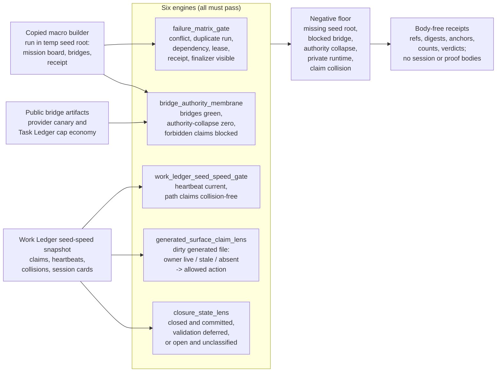

# Concurrency Mission Control

`concurrency_mission_control` imports the real
`self-indexing-cognitive-substrate/src/idea_microcosm/concurrency_mission_control_specimen.py`
macro builder plus its public provider-canary and Task Ledger bridge artifacts
as exact public-safe source copies. The organ runs the copied builder in a
temporary public seed root, then checks the transaction failure matrix,
authority membrane, and a public Work Ledger seed-speed topology fixture. The
Work Ledger code body itself is consumed through the existing
`mission_transaction_work_spine` source-body import surfaces rather than
duplicated here.

The organ is deliberately narrow: it demonstrates fail-closed transaction
gating for synthetic multi-agent lanes, not private mission-control runtime,
provider dispatch, live scheduling, production concurrency safety, hosted
orchestration, or release approval.

## Purpose

When several agents work the same repository at once, the dangerous moment is
not a crash. It is a quiet one: two lanes edit the same generated file, or one
lane commits work whose owner has not finished, and nobody notices until the
state is already wrong. This organ exists to make that moment a checkable
verdict rather than a judgement call.

The single question it answers is: given a dirty path and the live claim
topology around it, is acting on that path safe, and if not, what must happen
first? The answer is never "probably fine". Each case resolves to a named
classification and one allowed action, so a lane can decide whether to proceed,
hand off, or wait.

What is unusual is where the evidence comes from. Rather than re-implementing a
scheduler, the organ runs the real macro mission-control builder over public
synthetic lanes and reads a public snapshot of the Work Ledger's seed-speed
topology: who holds which claim, whether their heartbeat is current, and where
path claims collide. The most pointed part is the pair of classifier lenses.
The generated-surface lens looks at a dirty generated file (`ORGANS.md`,
`ARCHITECTURE.md`, `AGENT_ROUTES.md`, `agent_task_routes.json`) and decides
whether its owner is live, stale, or absent, because that decides whether you
may regenerate it from a sibling lane. The closure-state lens then folds in
validation, commitability, and residual evidence to say whether a piece of work
is genuinely closed or only looks closed. Both lenses default to the cautious
verdict when the evidence is thin, which is the behaviour the page is really
about.

## Prior Art Grounding

This organ borrows from workflow DAGs, lease-based coordination, atomic commit
protocols, and CI concurrency controls. Useful anchors include:

- Apache Airflow
  [DAGs](https://airflow.apache.org/docs/apache-airflow/stable/core-concepts/dags.html),
  for representing tasks, dependencies, retries, and scheduling separately
  from task internals.
- Kubernetes
  [Lease-based leader election](https://kubernetes.io/docs/concepts/cluster-administration/coordinated-leader-election/),
  as a prior pattern for lease holders, renewals, and failover-sensitive
  control-plane coordination.
- IBM Research on
  [two-phase commit](https://research.ibm.com/publications/two-phase-commit-optimizations-and-tradeoffs-in-the-commercial-environment),
  as a transaction-consistency pattern for distributed participants under
  failure.
- GitHub Actions
  [workflow syntax](https://docs.github.com/en/actions/reference/workflows-and-actions/workflow-syntax),
  for declared workflow concurrency and job orchestration controls.

Microcosm borrows the DAG, lease, commit-gate, and workflow-concurrency shapes,
but keeps the organ to fail-closed synthetic multi-agent transaction gating. It
does not claim private mission-control runtime, provider dispatch, live
scheduling, production concurrency safety, hosted orchestration, or release.

## Shape



## Engines

- `mission_transaction_original_builder` dynamically loads the copied macro
  builder and emits the mission board, provider repair bridge, work-metabolism
  bridge, residual replay bridge, and receipt.
- `failure_matrix_gate` checks that owner-path conflicts, duplicate command
  runs, dependency gaps, stale leases, missing receipts, supervised-scope gaps,
  missing parent finalizers, and misanchored claims all remain visible.
- `bridge_authority_membrane` checks that bridge statuses are green while
  authority-collapse counters remain zero and forbidden claims stay blocked.
- `work_ledger_seed_speed_gate` checks that public session heartbeat,
  seed-speed status, mutation-check commands, multi-session/claim counts, and
  collision-free path-claim rows are present without exporting private Work
  Ledger session bodies.
- `generated_surface_claim_lens` takes a dirty generated entry surface and the
  claim rows around it and returns one of a fixed set of classifications:
  `owned_live` (an owner holds a live claim, so do not patch from a sibling
  lane), `owned_stale` (release or supersede the stale claim before
  regenerating), `unowned_generated_drift` (claim the builder lane, regenerate,
  and revalidate), `unrelated_dirty_state`, or `clean`. Each classification
  carries the single allowed action, so the verdict is what a lane should do,
  not just what it observed.
- `closure_state_lens` decides whether a unit of work is genuinely closed. It
  folds the generated-surface classification together with validation state,
  commitability, and any open residual, separating `closed_and_committed` from
  the cases that only look done: `closed_validation_deferred` (validation
  parked under host pressure), `closed_uncommitted_authority` (event authority
  exists but shared append logs are unsafe to stage), `false_residual_stale`
  (a residual left open against a passing generator check), or
  `open_unclassified` when the closure evidence is simply insufficient. The
  default is the last of these, so absent evidence never reads as success.

## Structured Lattice Bindings

The structured capsule row is
`core/paper_module_capsules.json::paper_modules[47:paper_module.concurrency_mission_control]`. It
binds this Markdown projection to the organ, the resolved mechanism row
`mechanism.concurrency_mission_control.validates_public_concurrency_mission_control`,
the runtime source locus `src/microcosm_core/organs/concurrency_mission_control.py`,
concept `concept.work_landing_and_continuity_control_bundle`, principles
`P-10`, `P-16`, `P-2`, `P-6`, and `P-8`, axioms `AX-5`, `AX-7`, `AX-8`,
and `AX-9`, and dependency modules `paper_module.mission_transaction_work_spine`,
`paper_module.bridge_phase_continuity_runtime`, and
`paper_module.work_landing_control_spine`.

Those bindings are source rows for discoverability and coverage. They do not
make this Markdown file source authority, authorize live mission control, or
upgrade synthetic coordination receipts into hosted orchestration or production
concurrency-safety evidence.

## Governing Lattice Relation

The governing lattice claim is that this module turns concurrency coordination
from a status narrative into a transaction-scoped evidence check. The capsule
sidecar reports sixteen resolved edges and zero unresolved selective relations:
the page explains the accepted organ and mechanism, cites the runtime source
locus, depends on the mission-transaction, bridge-continuity, and work-landing
modules, and is governed by `concept.work_landing_and_continuity_control_bundle`.
That concept binds this organ to the same family shape as work landing and
continuity controls: public fixture or exported bundle input becomes a
coordination validator, and the result is a scoped transaction or continuity
receipt rather than chat status or generated projection authority.

The mechanism row
`mechanism.concurrency_mission_control.validates_public_concurrency_mission_control`
is the source-backed explanation edge. In source, `run`,
`run_concurrency_mission_control_bundle`, `classify_generated_surface_claim_lens`,
and `classify_concurrency_closure_state_lens` require copied-source digest
equality, required anchors, failure-class coverage, Work Ledger seed-speed
topology checks, body-free receipts, and explicit authority ceilings. The
focused proof consumer is `tests/test_concurrency_mission_control.py`: it checks
the happy-path fixture, exported-bundle validation, digest-mismatch rejection,
exact macro-body imports, semantic negative cases, owner-state classification,
and closure-state classification. The standard
`std_microcosm_concurrency_mission_control.json` supplies the same ceiling in
schema form, including seven copied public source modules, five negative cases,
no private body export, and no live scheduler/provider/release authority.

The principle and axiom edges keep the proof boundary from drifting upward.
`P-10`, `P-16`, and `AX-9` make coordination effects transaction-scoped and
compensable; `P-2`, `P-6`, `P-8`, `AX-5`, `AX-7`, and `AX-8` force the validator
to lower claim strength when evidence, preconditions, provenance, or refusal
reasons are missing. A passing run therefore proves only the public concurrency
mission-control fixture contract over declared copied bodies and synthetic
fixtures. It does not prove private mission-control runtime truth, live
scheduling, provider dispatch, hosted orchestration, production concurrency
safety, source mutation authority, release readiness, or whole-system
correctness.

## Public Command

```bash
PYTHONPATH=src python3 -m microcosm_core.organs.concurrency_mission_control run \
  --input fixtures/first_wave/concurrency_mission_control/input \
  --out receipts/first_wave/concurrency_mission_control \
  --acceptance-out receipts/acceptance/first_wave/concurrency_mission_control_fixture_acceptance.json \
  --card
```

## Validation Receipt Path

From `microcosm-substrate`, validate with throwaway receipt outputs first:

```bash
PYTHONPATH=src ../repo-python -m microcosm_core.organs.concurrency_mission_control run --input fixtures/first_wave/concurrency_mission_control/input --out /tmp/microcosm-concurrency-mission-control/fixture --acceptance-out /tmp/microcosm-concurrency-mission-control/acceptance.json --card
PYTHONPATH=src ../repo-python -m microcosm_core.organs.concurrency_mission_control run-concurrency-mission-control-bundle --input examples/concurrency_mission_control/exported_concurrency_mission_control_bundle --out /tmp/microcosm-concurrency-mission-control/bundle --card
PYTHONPATH=src ../repo-python -m pytest -p no:cacheprovider tests/test_concurrency_mission_control.py -q
PYTHONPATH=src ../repo-python scripts/build_doctrine_projection.py --check-paper-module-corpus
PYTHONPATH=src ../repo-python scripts/build_doctrine_projection.py --check
```

A diagram view and navigation card are generated for this module from its
declared organ, mechanism, concept, principle, axiom, dependency, and
code-locus relationships. Fixture and bundle passes prove only public
fail-closed coordination evidence over the declared copied bodies and synthetic
fixtures. Source-copy digest drift belongs to `microcosm_exact_copy_refresh`;
shared lattice projection drift belongs to the live projection owner lane.

## JSON Capsule Binding

- Source row: `core/paper_module_capsules.json::paper_modules[47:paper_module.concurrency_mission_control]`
- `source_authority: json_capsule`
- This Markdown is a reader projection. The generated Mermaid projection is
  `available_from_capsule_edges`, and the generated Atlas projection is
  `linked_from_capsule_edges`; both are navigation projections derived from the
  capsule's subject, principle, axiom, dependency, and code-locus edges.
- The proof boundary is the exact public macro builder copy, provider-canary
  and Task Ledger bridge artifacts, failure-matrix fixture, bridge authority
  membrane, seed-speed topology fixture, and validation receipts.
- The authority ceiling excludes private mission-control runtime, provider
  dispatch, live scheduling, production concurrency safety, hosted
  orchestration, source mutation, release, and whole-system correctness.

## Claim Ceiling

This module may claim public fixture evidence that the exact public macro
builder copy, provider-canary and Task Ledger bridge artifacts,
failure-matrix fixture, bridge authority membrane, Work Ledger seed-speed
topology fixture, source manifests, body-free receipts, negative cases, and
generated navigation projections support the declared concurrency
mission-control fixture contract. It may also claim that the structured
binding row resolves the accepted organ subject, resolved mechanism subject,
runtime source locus, governed concept, five principles, four axioms, and
three dependency modules.

This module may not claim private mission-control runtime truth, provider
dispatch, live scheduling, production concurrency safety, hosted orchestration,
source mutation authority, hosted-public readiness, release approval,
publication approval, implementation correctness beyond the listed witnesses,
or whole-system correctness.

## Reader Evidence Routing

Read this module as a coordination-evidence membrane, not as a live scheduler.
Start with `paper_modules/concurrency_mission_control.json` for the full
structured binding, then open `standards/std_microcosm_concurrency_mission_control.json`
for required copied-body counts, negative cases, receipt fields, and the
public/private boundary.

Open
`core/fixture_manifests/concurrency_mission_control.fixture_manifest.json` and
`examples/concurrency_mission_control/exported_concurrency_mission_control_bundle/source_module_manifest.json`
before inspecting copied source modules. The manifest floor names one macro
builder body and six public bridge artifacts; receipt payloads should carry
source refs, hashes, anchors, counts, verdicts, and omission receipts, not body
text.

Read the Work Ledger seed-speed topology as a public coordination fixture. It
can show heartbeat participation, mutation-check commands, session and claim
counts, and collision-free selected rows, but it cannot export private Work
Ledger session bodies or authorize live scheduling.

## Reader Proof Boundary

The reader-verifiable proof is limited to the copied public macro builder,
provider-canary and Task Ledger bridge artifacts, fixture and bundle validators,
failure-matrix cases, bridge authority-membrane checks, Work Ledger seed-speed
topology fixture, source manifests, and body-free receipts. The JSON capsule is
the authority for the organ, mechanism, concept, principle, axiom, dependency,
and code-locus edges; this Markdown only explains how to inspect those edges.

The generated Mermaid and Atlas projections show capsule-derived navigation.
They do not prove live mission-control runtime, provider dispatch, live
scheduling, production concurrency safety, hosted orchestration, release
approval, source mutation, or whole-system correctness.

## Public Site Availability Boundary

Public site or Atlas availability may expose this module as a coordination
evidence card, a source-open route, and a generated diagram view. That
availability is a navigation claim only: it means a reader can find the public
fixtures, source manifests, validation routes, and navigation projections.

It must not be presented as a hosted scheduler, production concurrency system,
agent runtime, provider-control surface, or release gate. Any public copy should
keep the same anti-claims as the capsule and receipts.

## Public-Safe Body Handling

Receipts should carry source refs, digests, anchors, counts, verdicts, omission
receipts, and negative-case names. They should not carry private Work Ledger
session bodies, provider payloads, account/session state, private mission
control material, copied macro body text, or secret-bearing paths. If a digest
or copied source body drifts, route the repair through the exact-copy lane before
raising this Markdown projection's claim ceiling.

## Receipt Expectations

The fixture run should write `concurrency_mission_control_result.json`,
`concurrency_mission_control_board.json`, and
`concurrency_mission_control_validation_receipt.json` under
`receipts/first_wave/concurrency_mission_control/`, plus
`receipts/acceptance/first_wave/concurrency_mission_control_fixture_acceptance.json`.

The exported bundle validator should write runtime-shell or temporary receipts
that prove bundle shape, source-module digest equality, required anchors,
secret exclusion, body-free receipt payloads, generated-surface classifications,
closure-state classifications, and the five negative cases. Passing receipts
do not authorize provider dispatch, model dispatch, live scheduling, hosted
orchestration, publication, release, source mutation, private-root equivalence,
production concurrency safety, or whole-system correctness.

## Negative Cases

The fixture carries stable cases for missing seed roots, blocked provider
bridges, authority-collapse claims, private runtime overclaims, and unresolved
Work Ledger seed-speed claim collisions.
If focused validation reports an exact-copy source-module body mismatch, route
that repair through `microcosm_exact_copy_refresh`; do not treat this Markdown
projection as source authority for copied macro bodies.
