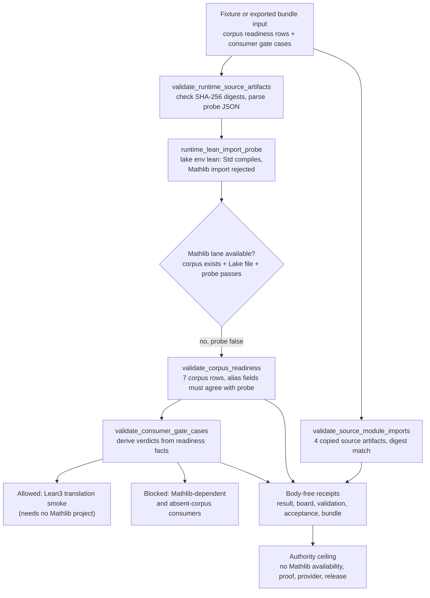

# Corpus Readiness Mathlib Absence Gate

## Abstract

`corpus_readiness_mathlib_absence_gate` is the public formal-math corpus
readiness boundary for Microcosm. It carries copied non-secret corpus/toolchain
rows from the 2026-05-11 proof-state curriculum smoke run and forces Mathlib
absence, absent-corpus blocking, consumer gate decisions, and source-module
digest coupling to be visible before any downstream retrieval, tactic-routing,
or proof-witness language is allowed.

## Purpose

Formal-math agents fail in a specific way: they treat "there is a corpus" as
if it meant "this corpus is usable for the proof route I am about to take".
A roster lists miniF2F, PutnamBench, ProofNet, LeanDojo and Mathlib, the agent
assumes the libraries are present, and the failure only surfaces later as a
broken import or a tactic that needs a premise the host cannot resolve. This
organ answers one question before that happens: for each corpus, is it actually
present on this host, and is the Mathlib import lane actually available, or not?

The unusual part is that the gate does not take the answer on trust. It runs a
bounded Lean/Lake import probe in a temporary directory: one small file that
imports `Std` and is expected to compile, and one that imports `Mathlib` and is
expected to be rejected with the toolchain's own `unknown module prefix
'Mathlib'` error. A corpus is only marked usable for Mathlib-dependent work when
the runtime evidence agrees the corpus exists, carries a Lake file, and the
Mathlib lane probe passes. In the current substrate the Mathlib probe stays
false, so every Mathlib-dependent consumer is blocked, and the one consumer that
passes is the Lean3 translation smoke, which needs no Mathlib project at all.

This closes the most common way a readiness claim drifts. Stale alias fields
such as `mathlib_available`, or a `PASS` lean status, cannot turn the gate green
on their own; they must agree with the live probe or the row is flagged. The
probe is deliberately narrow. It checks that imports resolve and that Mathlib is
genuinely absent. It does not run a `lake build`, prove any theorem, or claim
Mathlib is installed. The output is a readiness board and a set of blocked
consumer verdicts, not proof.

## JSON Capsule Binding

Source authority for this reader page is `core/paper_module_capsules.json::paper_modules[8:paper_module.corpus_readiness_mathlib_absence_gate]`; the generated instance is `paper_modules/corpus_readiness_mathlib_absence_gate.json` with `source_authority: json_capsule`.

This Markdown is a reader projection over the capsule, not the authority plane. The generated Mermaid projection is `available_from_capsule_edges`, while the generated Atlas projection is `blocked_until_organ_atlas_owner_lane_binds_edges`; both statuses are builder-owned projections and do not expand the authority ceiling.

The proof boundary is public algorithmic projection over copied non-secret corpus/toolchain substrate, first-wave fixture receipts, and exported bundle receipts only. A cold reader should not treat this page, Mermaid availability, Atlas status, or validation receipts as a Lean/Lake rerun, Mathlib availability claim, theorem correctness, proof-body export, provider call authority, benchmark/corpus completeness, publication approval, or release approval.

## Shape



This reader diagram is intentionally smaller than the generated doctrine-lattice
graph. The generated Mermaid projection proves only that the capsule supplies
resolving organ, mechanism, law, concept, and code-locus edges; the flow above
shows the evidence path a cold reader should inspect before any formal-math
consumer treats a corpus, Mathlib-dependent route, tactic route, or proof
witness as usable.

## Mechanism

The mechanism is a readiness reducer, not a theorem-proving backend. The
runtime entrypoints `run` and `run_projection_bundle` both call `_build_result`,
which loads public fixture or exported-bundle inputs, scans those inputs against
the private-state exclusion policy, verifies copied source artifacts, and then
combines corpus readiness, consumer gate, source-module import, negative-case,
and authority-ceiling fields into one body-free result.

`validate_runtime_source_artifacts` anchors the reducer to four public-safe
source refs: the corpus readiness rows, tactic-affordance probe, Mathlib import
probe Lean file, and tactic portfolio availability JSON. It checks expected
SHA-256 digests, parses the JSON source artifacts, and runs a bounded Lean/Lake
import probe that can show Std imports and Mathlib remains absent without
running a Lake build or exporting Lean bodies.

`validate_corpus_readiness` normalizes seven corpus rows against those runtime
source artifacts. A corpus is usable for Mathlib-dependent work only when the
runtime evidence says the corpus exists, has a Lake file, and
`mathlib_lake_project_import_available` is true. In the current fixture and
bundle evidence that field remains false, so Mathlib-dependent capabilities are
blocked, absent corpora are recorded, and stale alias fields such as
`mathlib_available` cannot turn the gate green.

`validate_consumer_gate_cases` then derives consumer verdicts from the normalized
readiness facts instead of trusting expected-decision labels. The translation
smoke consumer can pass because it does not require a Mathlib Lake project and
names an available Lean3 annex corpus; Mathlib-dependent or absent-corpus
consumers stay blocked. `validate_source_module_imports` adds the exported
bundle floor by requiring the manifest class `copied_non_secret_macro_body`,
public-safe material classes, target/source digest agreement, and no body
material in receipts.

The proof consumers are the two organ commands, the focused regression test
`tests/test_corpus_readiness_mathlib_absence_gate.py`, the paper-module corpus
check, and the command-card surfaces emitted by `result_card`. Together they
exercise the success path, contradictory Mathlib claims, consumer-gate skips,
source digest tampering, private-path rewrites, runtime-probe blocks, and
receipt body exclusion. The resulting evidence relates the capsule's two
mechanisms to `concept.formal_math_and_proof_witness_bundle`, `P-8`, and
`AX-7` by making readiness visibility a precondition for downstream
formal-math claims while keeping the claim ceiling below theorem, provider,
benchmark, or release authority.

## JSON Capsule Boundary

The JSON capsule is the source authority for this module. This Markdown page is
a legacy reader projection kept aligned with that capsule by inspection and
tests until a round-trip Markdown builder exists.

The capsule row resolves only the relation classes it names:

- accepted organ subject: `corpus_readiness_mathlib_absence_gate`;
- mechanism subject:
  `mechanism.corpus_readiness_mathlib_absence_gate.validates_public_corpus_readiness_boundary`;
- Mathlib-absence mechanism subject:
  `mechanism.corpus_readiness_mathlib_absence_gate.validates_public_mathlib_absence_boundary`;
- governing concept ref: `concept.formal_math_and_proof_witness_bundle`;
- governing law refs: `P-8` and `AX-7`;
- sibling paper-module dependency:
  `paper_module.tactic_portfolio_availability`;
- runtime source locus:
  `src/microcosm_core/organs/corpus_readiness_mathlib_absence_gate.py`.

The dependency is narrow and source-backed: the runtime source names
`tactic_portfolio_availability.json` as a copied source artifact and cites the
tactic-portfolio receipt triplet as receipt anchors. It does not add downstream
retrieval, tactic-routing, proof-witness, Mathlib-availability, or release
authority.

The generated instance file is
`paper_modules/corpus_readiness_mathlib_absence_gate.json`. The legacy Markdown
projection intentionally keeps the shorter public slug
`paper_modules/corpus_readiness_mathlib_absence.md`; readers should follow the
capsule row's `legacy_markdown_projection` field instead of deriving paths from
filenames.

## Public Surfaces

- Organ runner: `python -m microcosm_core.organs.corpus_readiness_mathlib_absence_gate run --input fixtures/first_wave/corpus_readiness_mathlib_absence_gate/input --out receipts/first_wave/corpus_readiness_mathlib_absence_gate`
- Exported bundle runner: `python -m microcosm_core.organs.corpus_readiness_mathlib_absence_gate run-projection-bundle --input examples/corpus_readiness_mathlib_absence_gate/exported_corpus_readiness_bundle --out receipts/runtime_shell/demo_project/organs/corpus_readiness_mathlib_absence_gate`
- Standard: `standards/std_microcosm_corpus_readiness_mathlib_absence_gate.json`
- Source-module manifest: `examples/corpus_readiness_mathlib_absence_gate/exported_corpus_readiness_bundle/source_module_manifest.json`
- Runtime receipt: `receipts/runtime_shell/demo_project/organs/corpus_readiness_mathlib_absence_gate/exported_corpus_readiness_bundle_validation_result.json`

## Structured Lattice Bindings

| Binding | Source |
|---|---|
| Capsule authority | `core/paper_module_capsules.json::paper_modules[8:paper_module.corpus_readiness_mathlib_absence_gate]` |
| Generated instance | `paper_modules/corpus_readiness_mathlib_absence_gate.json` |
| Reader projection | `paper_modules/corpus_readiness_mathlib_absence.md` |
| Organ subject | `corpus_readiness_mathlib_absence_gate` |
| Mechanism subject | `mechanism.corpus_readiness_mathlib_absence_gate.validates_public_corpus_readiness_boundary` |
| Mathlib-absence mechanism | `mechanism.corpus_readiness_mathlib_absence_gate.validates_public_mathlib_absence_boundary` |
| Governing concept | `concept.formal_math_and_proof_witness_bundle` |
| Runtime locus | `src/microcosm_core/organs/corpus_readiness_mathlib_absence_gate.py` |
| Dependency | `paper_module.tactic_portfolio_availability` |
| Governing principle | `P-8` |
| Governing axiom | `AX-7` |
| Generated Mermaid | `paper_module.corpus_readiness_mathlib_absence_gate.mermaid` is `available_from_capsule_edges` |
| Generated Atlas card | `organ_atlas.corpus_readiness_mathlib_absence_gate` is `blocked_until_organ_atlas_owner_lane_binds_edges` |
| Residual relations | No paper-module selective dependency residual remains for the source-backed tactic-portfolio edge. |

The generated instance currently carries eight relationship edges: three
explained subjects, one governing concept, one governing principle, one
governing axiom, one dependency edge, and one resolved code locus. That is the
full proof boundary for this paper module; the Atlas residual is a separate
organ-atlas owner-lane re-entry, not a Markdown defect.

## Reader Evidence Routing

Read this module in five passes:

1. Start with the capsule row at
   `core/paper_module_capsules.json::paper_modules[8:paper_module.corpus_readiness_mathlib_absence_gate]`.
   It is the source authority that names `source_authority: json_capsule`, the
   organ subject, two mechanism subjects, the resolved runtime code locus, the
   concept `concept.formal_math_and_proof_witness_bundle`, the dependency
   `paper_module.tactic_portfolio_availability`, `P-8`, and `AX-7`.
2. Open the generated JSON sidecar
   `paper_modules/corpus_readiness_mathlib_absence_gate.json` as a
   builder-owned parity projection. The reader proof is the current row shape:
   eight generated relationship edges, Mermaid
   `available_from_capsule_edges`, Atlas
   `blocked_until_organ_atlas_owner_lane_binds_edges`, and no unpopulated
   paper-module selective dependency residual for the tactic-portfolio edge.
   The sidecar is wiring evidence, not theorem-correctness,
   runtime-correctness, release, provider, or production authority.
3. Inspect the runtime locus
   `src/microcosm_core/organs/corpus_readiness_mathlib_absence_gate.py`. The
   load-bearing symbols are `run`, `run_projection_bundle`,
   `validate_corpus_readiness`, `validate_consumer_gate_cases`,
   `validate_source_module_imports`, `_build_result`, `write_receipts`,
   `result_card`, `EXPECTED_NEGATIVE_CASES`, `AUTHORITY_CEILING`,
   `SOURCE_MODULE_MANIFEST_NAME`, `BUNDLE_RESULT_NAME`, and
   `CARD_SCHEMA_VERSION`.
4. For fixture evidence, use
   `fixtures/first_wave/corpus_readiness_mathlib_absence_gate/input` and the
   receipts under `receipts/first_wave/corpus_readiness_mathlib_absence_gate/`
   plus
   `receipts/acceptance/first_wave/corpus_readiness_mathlib_absence_gate_fixture_acceptance.json`.
   The first-wave result receipt records seven corpus rows, seven consumer
   cases, one allowed Lean3 translation-smoke case, six blocked absent or
   Mathlib-dependent cases, `mathlib_lake_project_import_available: false`,
   `body_in_receipt: false`, and the five negative cases
   `mathlib_available_without_probe`, `consumer_skips_readiness_gate`,
   `private_corpus_source_ref`, `proof_body_leakage`, and
   `release_overclaim`.
5. For exported-bundle evidence, use
   `examples/corpus_readiness_mathlib_absence_gate/exported_corpus_readiness_bundle/source_module_manifest.json`
   and
   `receipts/runtime_shell/demo_project/organs/corpus_readiness_mathlib_absence_gate/exported_corpus_readiness_bundle_validation_result.json`.
   The manifest verifies four copied source artifacts: corpus readiness JSON,
   tactic-affordance probe JSON, the Mathlib import probe Lean file, and tactic
   portfolio availability JSON. The exported receipt records
   `source_module_import_count: 4`, `copied_source_artifact_count: 4`,
   `source_modules_pass: true`, `body_in_receipt: false`, and three blocked
   absent or Mathlib-dependent bundle consumer cases.

If a reader needs validation receipts rather than prose, run the commands in
`## Validation Receipt Path`, including the focused regression test and
paper-module corpus check. Treat every receipt as corpus-readiness boundary
evidence only; it does not create Lean/Lake execution authority, Mathlib
availability, theorem-proof authority, provider authority, private-root
equivalence, or release readiness.

## Receipt Expectations

A usable receipt for this module should include:

- both organ commands;
- the focused organ regression test;
- the shared paper-module coverage contract;
- the doctrine projection checks.

The expected evidence is not that Mathlib exists or that theorem work ran. The
evidence floor is narrower: the public fixture and exported bundle must keep
corpus readiness, Mathlib absence, consumer blocking, source-module digests,
body-free receipts, and negative leakage cases inside the declared authority
ceiling.

## Validation Receipt Path

Reader-verifiable commands, run from the `microcosm-substrate/` public root:

```bash
PYTHONPATH=src python3 -m microcosm_core.organs.corpus_readiness_mathlib_absence_gate run \
  --input fixtures/first_wave/corpus_readiness_mathlib_absence_gate/input \
  --out /tmp/microcosm-corpus-readiness-mathlib-absence-vrp
PYTHONPATH=src python3 -m microcosm_core.organs.corpus_readiness_mathlib_absence_gate run-projection-bundle \
  --input examples/corpus_readiness_mathlib_absence_gate/exported_corpus_readiness_bundle \
  --out /tmp/microcosm-corpus-readiness-mathlib-absence-bundle-vrp
PYTHONPATH=src python3 scripts/build_doctrine_projection.py --check-paper-module-corpus
PYTHONPATH=src .venv/bin/python -m pytest -p no:cacheprovider --basetemp=/tmp/microcosm-corpus-readiness-mathlib-absence-tests -q tests/test_corpus_readiness_mathlib_absence_gate.py
jq '{edge_count:(.relationships.edges|length), mermaid_status:.paper_module_payload.generated_projections.mermaid.status, atlas_status:.paper_module_payload.generated_projections.atlas_card.status, source_authority:.paper_module_payload.source_authority, unresolved_selective_relation_count:(.relationships.unpopulated_selective_relations|length)}' paper_modules/corpus_readiness_mathlib_absence_gate.json
```

The fixture command writes the public corpus-readiness board, result receipt,
and validation receipt. The bundle command validates the exported source-module
manifest and body-free runtime receipt. The corpus check and `jq` sidecar query
prove the capsule-derived projection currentness without hand-editing generated
JSON. The focused test keeps the Mathlib absence boundary, consumer gate cases,
source-module digest checks, private path rewrite policy, and anti-claim
behavior from regressing.

Passing these commands does not prove Mathlib is installed, rerun Lean/Lake,
validate downstream theorem correctness, benchmark a corpus, authorize provider
dispatch, or approve release; it only proves the bounded fixture and exported
bundle receipts preserve the declared readiness boundary.

## Authority Ceiling

This organ is algorithmic projection over copied non-secret macro substrate,
not a Lean/Lake rerun and not Mathlib proof authority. Its strongest public
claim is that a fixture and exported bundle agree about corpus readiness,
Mathlib absence, blocked consumers, copied source-module digests, body-free
receipts, and negative leakage guards. It does not prove theorem correctness,
claim Mathlib is available, benchmark a corpus, expose proof/provider/private
bodies, call a provider, mutate source, or authorize release.

## Claim Ceiling

The JSON capsule proves a public corpus-readiness boundary only: copied
non-secret corpus/toolchain rows, absent-Mathlib blocking, consumer gate
decisions, source-module digest coupling, body-free receipts, and negative
leakage guards. Mermaid availability reflects capsule edges, while the Atlas row
still waits on the organ-atlas owner lane. This module does not prove Mathlib is
installed, rerun Lean or Lake, validate theorem correctness, benchmark corpus
quality, authorize retrieval or tactic routing, call providers, expose private
proof bodies, mutate source authority, or approve release.

## Prior Art Grounding

This organ is grounded in Lean corpus and neural theorem-proving work where
library availability, premise access, and benchmark splits are part of the
claim. The [Lean mathematical library](https://arxiv.org/abs/1910.09336)
establishes Mathlib as a large community-maintained formal mathematics corpus,
[miniF2F](https://arxiv.org/abs/2109.00110) gives a cross-system benchmark for
formal Olympiad statements, and [LeanDojo](https://arxiv.org/abs/2306.15626)
shows why reproducible corpus extraction and accessible-premise metadata matter
for theorem-proving agents.

Microcosm borrows the readiness gate: corpus rows, Mathlib availability probes,
blocked consumer cases, source-module digests, and negative leakage guards must
be visible before retrieval, tactic-routing, or proof-witness language is
allowed. It does not claim Mathlib is present or that any theorem was proved.

## Research Bet

Formal-math agents fail when they treat "there is a corpus" as equivalent to
"this corpus is usable for this proof route." This organ makes that boundary
runnable. It records seven corpus rows, blocks six absent or Mathlib-dependent
consumer cases, allows only the Lean3 translation-smoke case, and keeps the
Mathlib probe false until an actual passing probe is present.

The exported bundle carries four copied body artifacts: corpus readiness JSON,
tactic-affordance probe JSON, the Mathlib import probe Lean file, and tactic
portfolio availability JSON. Two rows are exact copies and two use a verified
public-safe private-path rewrite. The receipt records the manifest status,
counts, material classes, digests, and body-free policy; the copied bodies stay
under `source_artifacts/`, not inside receipts.

## Receipt Shape

The first-wave result receipt records `corpus_count: 7`,
`consumer_case_count: 7`, `allowed_case_ids`, `blocked_case_ids`,
`absent_corpus_ids`, `mathlib_lake_project_import_available: false`,
`body_in_receipt: false`, the authority ceiling, and five observed negative
cases:

- `mathlib_available_without_probe`
- `consumer_skips_readiness_gate`
- `private_corpus_source_ref`
- `proof_body_leakage`
- `release_overclaim`

The exported runtime receipt records `source_module_import_count: 4`,
`copied_source_artifact_count: 4`, `source_modules_pass: true`, and the same
body-free receipt boundary.

## Source-Backed Doctrine Binding

- Organ: `src/microcosm_core/organs/corpus_readiness_mathlib_absence_gate.py`
- Capsule: `core/paper_module_capsules.json#paper_module.corpus_readiness_mathlib_absence_gate`
- Mechanism: `core/mechanism_sources.json#mechanism.corpus_readiness_mathlib_absence_gate.validates_public_corpus_readiness_boundary`
- Standard: `standards/std_microcosm_corpus_readiness_mathlib_absence_gate.json`
- Evidence class: `core/organ_evidence_classes.json::corpus_readiness_mathlib_absence_gate` records `algorithmic_projection` at rank 3.
- Source-module manifest: `examples/corpus_readiness_mathlib_absence_gate/exported_corpus_readiness_bundle/source_module_manifest.json`
- Acceptance receipts: `receipts/first_wave/corpus_readiness_mathlib_absence_gate/*` and `receipts/acceptance/first_wave/corpus_readiness_mathlib_absence_gate_fixture_acceptance.json`

## Cold-Agent Use

Open the source-module manifest first, then the runtime bundle receipt, then
the first-wave result receipt. The useful claim is not that Microcosm has
Mathlib or can prove downstream theorems. The useful claim is that Microcosm
can force a formal-math route to expose corpus availability, Mathlib absence,
consumer gating, source-module digest evidence, copied-body boundaries,
negative-case receipts, and an explicit anti-claim before any proof route is
treated as usable.

Re-entry condition: the current atlas row already points at this paper module.
After the sibling `organ_atlas.json` lane releases, bind this capsule's
mechanism ref and code locus into the atlas row and rerun
`python -m microcosm_core.doctrine_lattice --check`.

## Anti-Claim

This is a source-backed corpus readiness boundary with copied non-secret
macro corpus/toolchain material, not Lean/Lake execution, Mathlib availability,
theorem-proof authority, corpus benchmark authority, provider authority, or
release authority.
