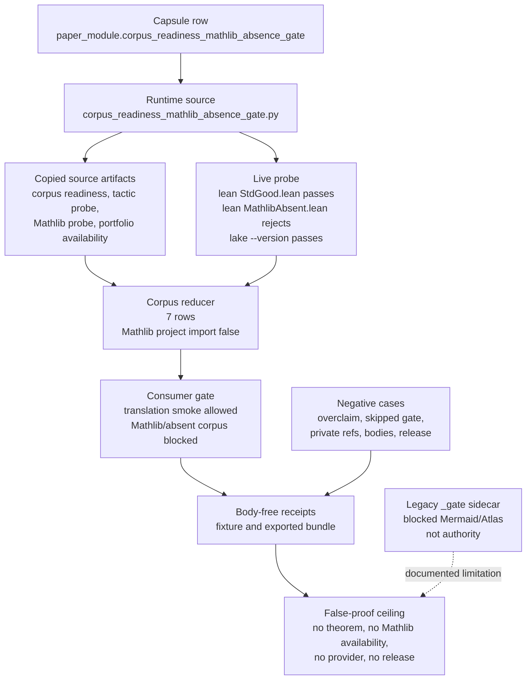

# Corpus Readiness Mathlib Absence Gate

## Abstract

`corpus_readiness_mathlib_absence_gate` is a public Microcosm organ for a
narrow formal-math readiness question: can a copied corpus/toolchain substrate
permit Lean/Std translation-smoke consumers while still blocking Mathlib-
dependent proof or retrieval consumers?

The answer is a gate, not a theorem. The landed source now contains a bounded
Lean CLI witness: if `lean` and `lake` are available, the runtime writes a
temporary `StdGood.lean`, verifies `import Std` succeeds, writes a temporary
`MathlibAbsent.lean`, verifies `import Mathlib` is rejected as absent, checks
`lake --version`, and records that no Lake build ran. The checked-in tests and
recent commits prove that contract at source/test level. The older checked-in
corpus-readiness receipts still prove the fixture and exported-bundle boundary,
but they do not yet carry the new `runtime_lean_import_probe` payload.

This file is a legacy companion paper for the gate. The populated capsule row
`paper_module.corpus_readiness_mathlib_absence_gate` declares
`paper_modules/corpus_readiness_mathlib_absence.md` as the capsule-backed reader
projection. The generated `_gate.json` sidecar for this filename currently
remains `legacy_markdown_projection` with blocked Mermaid/Atlas status, so this
page treats generated currentness as a limitation rather than authority.

## JSON Capsule Binding

- Source authority: `core/paper_module_capsules.json::paper_modules[8:paper_module.corpus_readiness_mathlib_absence_gate]` with `source_authority: json_capsule`; the generated instance is `paper_modules/corpus_readiness_mathlib_absence_gate.json`.
- This Markdown is a reader projection of that JSON capsule row, not the source authority. The generated Mermaid projection is `available_from_capsule_edges`, and the generated Atlas projection is blocked until the organ-atlas owner lane binds its edges.
- The proof boundary is the capsule-bound organ, mechanism row, runtime locus, and the doctrine edges the capsule resolves. The authority ceiling is narrow: public algorithmic projection over copied non-secret corpus/toolchain readiness substrate, first-wave fixture receipts, and exported bundle receipts only. Reproduce it with the validation receipts named in the Validation Receipt Path section.

## Authority Map

| Surface | Role | Safe use |
|---|---|---|
| `core/paper_module_capsules.json::paper_module.corpus_readiness_mathlib_absence_gate` | Capsule authority | Names the organ, mechanisms, code locus, doctrine refs, dependency, and claim ceiling. |
| `paper_modules/corpus_readiness_mathlib_absence.md` | Capsule-declared reader projection | Primary human reader page for the populated capsule row. |
| `paper_modules/corpus_readiness_mathlib_absence_gate.md` | This legacy companion paper | Technical explanation of the Lean CLI absence gate and evidence classes. |
| `paper_modules/corpus_readiness_mathlib_absence_gate.json` | Generated legacy sidecar for this filename | Current residual: `legacy_markdown_projection`, zero edges, blocked Mermaid/Atlas, six unresolved selective relations. |
| `src/microcosm_core/organs/corpus_readiness_mathlib_absence_gate.py` | Runtime source | Implements fixture validation, exported-bundle validation, live Lean CLI probe, and body-free receipts. |
| `tests/test_corpus_readiness_mathlib_absence_gate.py` | Regression evidence | Pins good, bad, and perturbation cases for the gate. |

Do not infer capsule authority from the `_gate.md` filename. Follow the capsule
row's `legacy_markdown_projection` field for the source-backed reader page.

## JSON Capsule Boundary

This file is a legacy Markdown projection indexed by
`paper_modules/corpus_readiness_mathlib_absence_gate.json`; it is not the
JSON-capsule-backed reader projection declared by the populated capsule row.
The current machine boundary for this filename is:
`paper_module_payload.source_authority: legacy_markdown_projection`,
`legacy_markdown_projection: paper_modules/corpus_readiness_mathlib_absence_gate.md`,
Mermaid `blocked_required_subject_gap`, and Atlas `blocked_required_subject_gap`.

That sidecar state means this page must explain the proof boundary and cold
reader route without claiming JSON capsule authority. It must not invent a
subject row yet, must not hand-edit generated JSON, and must not treat the
legacy filename as stronger than the capsule row in
`core/paper_module_capsules.json`.

The JSON-capsule-backed route is separate: the existing capsule registry already
contains `paper_module.corpus_readiness_mathlib_absence_gate`, and that row's
declared reader projection is `paper_modules/corpus_readiness_mathlib_absence.md`.
A generated-projection owner pass must reconcile this filename split through
`scripts/build_doctrine_projection.py`, not through hand edits to
`paper_modules/*.json`.

## Reader Proof Boundary

The reader proof boundary for this legacy projection is source/test evidence
plus `/tmp` validation receipts from the commands below. It is not theorem
truth, not Mathlib availability, not provider authority, not private-root
equivalence, not publication approval, and not release readiness.

## Capsule Re-entry Packet

If the generated sidecar remains a legacy row, re-entry belongs to the
paper-module corpus owner lane:

- resolved source locus: `src/microcosm_core/organs/corpus_readiness_mathlib_absence_gate.py`;
- generated residual source: `paper_modules/corpus_readiness_mathlib_absence_gate.json`;
- exact re-entry condition: the owner reconciles the existing populated capsule
  row with this legacy `_gate` sidecar, or explicitly retires the duplicate
  legacy filename;
- if a true new capsule splice is required, append
  `paper_module.corpus_readiness_mathlib_absence_gate` to
  `core/paper_module_capsules.json` only through the owner lane, and do not
  duplicate the already-populated row;
- run `PYTHONPATH=src python3 scripts/build_doctrine_projection.py --write-paper-module-corpus`
  only after the owner lane is claimed;
- verify `PYTHONPATH=src python3 scripts/build_doctrine_projection.py --check-paper-module-corpus`
  and inspect Mermaid and Atlas statuses plus aggregate doctrine-lattice
  coverage before treating the residual as closed.

## Mechanism

The runtime reduces four evidence streams into one readiness decision:

1. `validate_runtime_source_artifacts()` verifies copied public-safe source
   artifacts and SHA-256 digests for corpus readiness, tactic-affordance probe,
   Mathlib probe source, and tactic portfolio availability.
2. `runtime_lean_import_probe()` performs the bounded host witness over Lean
   CLI and Lake version availability.
3. `validate_corpus_readiness()` normalizes seven corpus rows, requires Mathlib
   claims to agree with anchored runtime evidence, records absent corpora, and
   keeps `mathlib_lake_project_import_available` false unless the real probe
   supports it.
4. `validate_consumer_gate_cases()` derives consumer decisions instead of
   trusting expected labels: one Lean3 translation-smoke consumer is allowed,
   while Mathlib-dependent or absent-corpus consumers are blocked.
5. `validate_source_module_imports()` validates the exported bundle manifest:
   copied source modules must be public-safe, digest-coupled, and absent from
   receipts as bodies.

`_build_result()`, `write_receipts()`, `run()`, `run_projection_bundle()`, and
`result_card()` assemble those facts into fixture receipts, bundle receipts,
and compact command-card output. Their ceiling is readiness visibility only.

## Exact Probe Contract

| Probe element | Contract |
|---|---|
| Preconditions | `shutil.which("lean")` and `shutil.which("lake")` must both resolve; otherwise the probe returns `blocked_by: lean_unavailable` or `blocked_by: lake_unavailable`. |
| Temporary files | A `/tmp/microcosm_corpus_readiness_probe_*` directory receives `StdGood.lean` and `MathlibAbsent.lean`; the receipt states that the temp root is cleaned before receipt write. |
| Std command | `lean StdGood.lean` over a tiny `import Std` Nat example must return `0`. |
| Mathlib command | `lean MathlibAbsent.lean` over a tiny `import Mathlib` example must return nonzero and expose unknown `Mathlib` in stdout or stderr. |
| Lake command | `lake --version` must return `0`. |
| Pass shape | `status: pass`, `std_import_passed: true`, `mathlib_import_rejected: true`, `mathlib_lake_project_import_available: false`, `lake_build_ran: false`. |
| Receipt policy | `body_in_receipt: false`, `body_redacted: true`; command cards can show argv, return code, booleans, and redaction status, not Lean/proof/provider bodies. |
| Prohibited inference | A passing probe is not a Lake build, not theorem proof, not Mathlib availability, and not benchmark or release authority. |

The source constants name the rung explicitly:
`TOOLCHAIN_BOUNDARY_STATUS = real_lean_cli_std_mathlib_absence_probe_with_lake_available`,
`RUNTIME_PROBE_STATUS = real_runtime_lean_cli_std_good_mathlib_absent_lake_available_probe`,
and `AUTHORITY_CEILING["lean_lake_execution_scope"] =
temporary_lean_cli_import_probe_plus_lake_version_check_no_lake_build`.

## Evidence Classes

### Real-good evidence

- Source: `runtime_lean_import_probe()` writes and executes the Std-good,
  Mathlib-absent, and Lake-version probes with a 20-second timeout and no Lake
  build.
- Tests: `_passing_runtime_probe()` pins the expected pass payload; the live
  host test `test_corpus_readiness_runtime_lean_import_probe_is_live_when_available`
  runs only when `lean` and `lake` are present and then checks Std success,
  Mathlib rejection, `lake --version`, redaction, and no Lake build.
- Commits: `ea77d7f099` added the runtime probe and blocking test,
  `2209de9698` tightened the bounded authority names, and `b1d7b50091` switched
  the witness to direct Lean CLI probes plus `lake --version`.
- Fixture receipt: the checked-in first-wave result is `status: pass` with
  `corpus_count: 7`, `consumer_case_count: 7`,
  `mathlib_lake_project_import_available: false`, `body_in_receipt: false`,
  and authority fields denying proof, provider, benchmark, release, and Mathlib
  project-import authority.
- Exported-bundle receipt: the runtime-shell receipt records four source-module
  imports, four copied source artifacts, `source_modules_pass: true`,
  `body_in_receipt: false`, and
  `mathlib_lake_project_import_available: false`.

### Real-bad evidence

- `test_corpus_readiness_runtime_probe_blocks_when_lean_unavailable` and
  `test_corpus_readiness_runtime_probe_blocks_when_lake_unavailable` prove the
  host witness blocks instead of fabricating readiness.
- `test_corpus_readiness_runtime_probe_failure_blocks_projection` mutates the
  probe so Mathlib rejection no longer holds and verifies projection failure.
- Negative fixture cases cover Mathlib availability overclaim, a consumer that
  skips the readiness gate, private corpus source refs, proof-body leakage, and
  release overclaim.
- Alias fields such as `mathlib_available` and `direct_mathlib_lane_available`
  cannot substitute for `mathlib_lake_project_import_available`.

### Perturbation evidence

- `test_corpus_readiness_real_good_ignores_expected_decision_labels` proves the
  verdict is derived from readiness facts, not fixture labels.
- `test_corpus_readiness_real_fixture_fields_move_consumer_verdict` and
  `test_corpus_readiness_source_row_perturbation_moves_absence_verdict` show
  that changing source readiness fields changes decisions.
- `test_corpus_readiness_rejects_source_module_source_digest_mismatch` and
  `test_corpus_readiness_rejects_source_module_target_digest_mismatch` enforce
  digest coupling.
- `test_corpus_readiness_bundle_embedded_runtime_artifact_moves_probe_verdict`,
  `test_corpus_readiness_bundle_rejects_stale_mathlib_probe_status_label`, and
  `test_corpus_readiness_bundle_rejects_manifest_consistent_runtime_forgery`
  block forged or stale runtime evidence inside exported bundles.

## Pipeline



## Reader Evidence Route

Run from `microcosm-substrate/` when validating this paper's claims:

```bash
PYTHONPATH=src python3 -m microcosm_core.organs.corpus_readiness_mathlib_absence_gate run \
  --input fixtures/first_wave/corpus_readiness_mathlib_absence_gate/input \
  --out /tmp/microcosm-corpus-readiness-mathlib-absence-vrp

PYTHONPATH=src python3 -m microcosm_core.organs.corpus_readiness_mathlib_absence_gate run-projection-bundle \
  --input examples/corpus_readiness_mathlib_absence_gate/exported_corpus_readiness_bundle \
  --out /tmp/microcosm-corpus-readiness-mathlib-absence-bundle-vrp

PYTHONPATH=src PYTHONPYCACHEPREFIX=/tmp/mc_corpus_gate_pycache \
  .venv/bin/python -m pytest -p no:cacheprovider \
  --basetemp=/tmp/mc_corpus_gate_bt -q \
  tests/test_corpus_readiness_mathlib_absence_gate.py

PYTHONPATH=src python3 scripts/build_doctrine_projection.py --check-paper-module-corpus
```

For the filename/capsule boundary, inspect both rows:

```bash
jq '.paper_modules[] | select(.id=="paper_module.corpus_readiness_mathlib_absence_gate")' \
  core/paper_module_capsules.json

jq '{source_authority:.paper_module_payload.source_authority,
     mermaid:.paper_module_payload.generated_projections.mermaid.status,
     atlas:.paper_module_payload.generated_projections.atlas_card.status,
     edge_count:(.relationships.edges|length),
     unresolved_selective_relation_count:((.relationships.unpopulated_selective_relations // [])|length)}' \
  paper_modules/corpus_readiness_mathlib_absence_gate.json
```

The first command is capsule evidence. The second command is current generated
residual evidence for this legacy companion filename.

## Doctrine And Source Links

| Link | Source-backed role |
|---|---|
| `corpus_readiness_mathlib_absence_gate` | Organ subject. |
| `mechanism.corpus_readiness_mathlib_absence_gate.validates_public_corpus_readiness_boundary` | Mechanism for copied corpus/toolchain readiness gating. |
| `mechanism.corpus_readiness_mathlib_absence_gate.validates_public_mathlib_absence_boundary` | Mechanism for explicit Mathlib-absence blocking. |
| `concept.formal_math_and_proof_witness_bundle` | Governing concept: proof-witness language must be backed by public readiness evidence. |
| `P-8` and `AX-7` | Governing Microcosm principle and axiom refs from the populated capsule row. |
| `paper_module.tactic_portfolio_availability` | Dependency because the exported source artifacts include tactic portfolio availability metadata. |
| `standards/std_microcosm_corpus_readiness_mathlib_absence_gate.json` | Local standard for this organ's validation and claim boundaries. |
| `src/microcosm_core/organs/corpus_readiness_mathlib_absence_gate.py` | Runtime source and receipt writer. |
| `tests/test_corpus_readiness_mathlib_absence_gate.py` | Source-level regression evidence for good/bad/perturbation cases. |
| `fixtures/first_wave/corpus_readiness_mathlib_absence_gate/input` | Fixture input corpus and consumer cases. |
| `examples/corpus_readiness_mathlib_absence_gate/exported_corpus_readiness_bundle` | Exported bundle and source-module manifest. |

## False-Proof Authority Ceiling

This gate can reject false proof authority; it cannot create proof authority.
The strongest valid claim is that the public fixture, exported bundle, source
digests, and bounded Lean CLI witness make a Mathlib-absence readiness boundary
inspectable.

It must not claim:

- theorem correctness;
- Mathlib availability;
- a Lake build or Mathlib project import;
- downstream proof search correctness;
- benchmark or corpus completeness;
- provider-call authority;
- proof, provider, or private bodies in receipts;
- private-root equivalence;
- source mutation authority;
- publication, release, hosted-product, or production-readiness approval.

If `import Mathlib` begins to pass, this module does not become a theorem
prover. It becomes a different readiness state that needs new receipts and a
separate Mathlib-availability claim ceiling.

## Limitations

- The live Lean CLI witness is host-dependent. If `lean` or `lake` is missing,
  the runtime blocks rather than manufacturing a pass.
- The checked-in first-wave corpus-readiness receipts predate the runtime probe
  lift and do not contain `runtime_lean_import_probe`; cite source/tests/commits
  for the live-probe proof until receipts are refreshed by an owning lane.
- The `_gate.json` generated sidecar currently remains a legacy residual even
  though the capsule registry has a populated row. This paper documents the
  mismatch but does not edit generated projections.
- A passing fixture and exported bundle do not certify library completeness,
  premise quality, tactic quality, retrieval quality, or theorem truth.
- Public-source and body-floor claims exclude browser/HUD/cockpit state,
  account/session control, cookies, credentials, raw operator voice, provider
  payload bodies, recipient-send state, and private macro-root material.

## Claim Ceiling

`corpus_readiness_mathlib_absence_gate` is a receipt-backed readiness boundary
over copied non-secret corpus/toolchain substrate plus a bounded live Lean CLI
absence witness. It may say: Std imports in the current host probe, Mathlib
import is rejected in that probe, Lake version is visible, no Lake build ran,
Mathlib-dependent consumers remain blocked, and receipts stay body-free.

It may not say: Mathlib is usable, a theorem was proved, a proof consumer is
correct, a corpus is complete, a provider may be called, private bodies may be
exported, or Microcosm is release-ready.

## Prior Art Grounding

The gate checks whether a proof corpus has the toolchain and library dependencies it needs before work proceeds, and reports honestly when Mathlib is absent rather than failing opaquely. It draws on hermetic-build practice and on the Lean [Mathlib](https://leanprover-community.github.io/) community's treatment of a pinned dependency set as a precondition for reproducible proof. Microcosm borrows the readiness-precondition shape; the result is fixture-bound readiness evidence, not a proof of corpus correctness or a hosted build service.

## Validation Receipt Path

Reader-verifiable commands, run from the `microcosm-substrate/` public root:

```bash
PYTHONPATH=src python3 -m pytest tests/test_corpus_readiness_mathlib_absence_gate.py -q
PYTHONPATH=src python3 scripts/build_doctrine_projection.py --check-paper-module-corpus
```

The focused test exercises this organ's fixture and bundle expectations; the corpus check confirms the capsule, generated Mermaid projection, Atlas card, and this Markdown projection stay mutually consistent. These are reader-verifiable evidence only and do not authorize release, provider dispatch, source mutation, or whole-system correctness.
