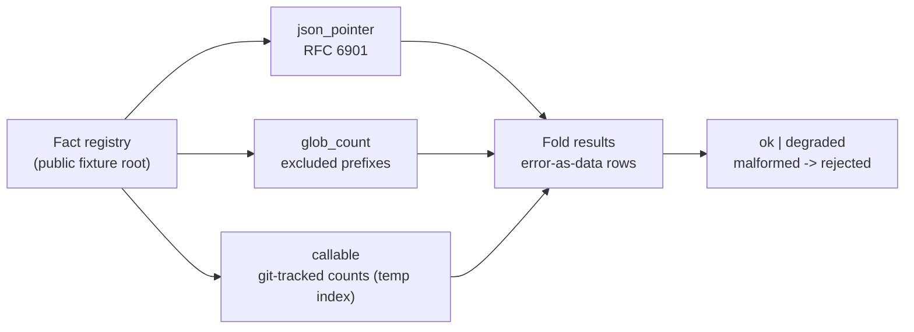

# Derived Fact Provider Runtime

`derived_fact_provider_runtime` resolves a registry of derived facts over a public
fixture root — pulling values out of JSON by pointer, counting files by glob, and
running a few named callables — and turns any provider failure into an
error-as-data row instead of crashing.

## Purpose

A fact registry is only useful if its failures are legible. When a recipe points
at something that is not there, the registry should record that as a typed error
with a repair hint, not fall over or quietly drop the row.

It surfaces the public `derived_fact_provider_engine` capsule. Each fact resolves
through one of three providers: a JSON pointer (RFC 6901, including list-index
traversal), a glob count (with excluded prefixes), or a named callable (git-tracked
file and Python counts, run against a throwaway git index in a temp directory).
A provider failure degrades the receipt to `degraded` and records an error row;
a malformed registry is rejected by recomputation.

## Shape



## JSON Capsule Binding

- source_ref:
  `core/paper_module_capsules.json::paper_modules[97:paper_module.derived_fact_provider_runtime]`
- source_authority: json_capsule
- Projection role: This Markdown is a reader projection of the JSON capsule row,
  not the source authority. The generated Mermaid projection is
  `paper_module.derived_fact_provider_runtime.mermaid` with status
  `available_from_capsule_edges`, and the generated Atlas projection is
  `organ_atlas.derived_fact_provider_runtime` with status
  `linked_from_capsule_edges`.
- proof boundary: the capsule binds the accepted organ, the resolved mechanism
  row, the runtime locus, the surfaced engine-room capsule, and the governing
  concept, principle, and axiom edges; the generated JSON projection carries the
  exact resolved relationship edges.
- authority ceiling: this page can explain the fact-resolution fixtures and the
  validation receipts, but it cannot become a doctrine truth auditor, a full macro
  fact-registry export, semantic claim validation, or release authority.

## Structured Lattice Bindings

The structured capsule row is
`core/paper_module_capsules.json#paper_module.derived_fact_provider_runtime`. It
binds this Markdown projection to the organ, the resolved mechanism row
`mechanism.derived_fact_provider_runtime.verifies_derived_fact_provider_engine`,
the runtime locus
`src/microcosm_core/organs/derived_fact_provider_runtime.py`, and the surfaced
capsule `src/microcosm_core/engine_room/derived_fact_provider_engine.py`. It
abides by axiom `AX-2` (a small checker decides claims over certificates) and
principle `P-3` (prefer a small, rerunnable verifier over narrative confidence).

Generated atlas docs remain builder-owned projections: refresh them with
`PYTHONPATH=src python3 scripts/build_organ_atlas.py --write` instead of editing
`ORGANS.md`, `ARCHITECTURE.md`, `AGENT_ROUTES.md`, or
`atlas/agent_task_routes.json` by hand.

## Reader Evidence Routing

The honest unit is the error-as-data row, not "facts resolved." Read how failure
is represented before trusting the registry:

- A safety/evals engineer should confirm a missing source or unknown provider
  becomes a typed error row that degrades the receipt, rather than crashing or
  being dropped. The useful question is whether failure is legible.
- A hiring reviewer should read the two negatives. The useful question is whether
  a clean receipt means the registered facts actually resolved against the
  supplied root — not that any downstream claim is true.
- A peer developer should run the fixtures (git must be on the path for the
  callable case). The useful question is whether the providers recompute over the
  fixture root rather than reading baked answers.

## Validation

```bash
PYTHONPATH=src python3 -m microcosm_core.organs.derived_fact_provider_runtime run --input fixtures/first_wave/derived_fact_provider_runtime/input --out receipts/first_wave/derived_fact_provider_runtime --acceptance-out receipts/acceptance/first_wave/derived_fact_provider_runtime_fixture_acceptance.json
```

The positive cases (`json_pointer_glob_clean`,
`git_callable_and_pointer_index_clean`) resolve a pointer, a glob count, the
git-backed callables, and a list-index pointer to an `ok` receipt. The negative
cases are rejected by recomputation: `missing_source_path_rejected` records a
`FileNotFoundError` row and `unknown_provider_type_rejected` records a
`ValueError` row, each degrading the receipt. The registry, ledger, and runtime
spine checks in `make test` exercise the organ's acceptance receipt.

## Authority Ceiling

A green run shows that the registered facts resolved against the supplied fixture
root and that malformed registries were rejected by recomputation. It does not
audit whether any prose claim is true, does not export the full macro fact
registry, does not perform semantic claim validation, and does not authorize
release, publication, provider calls, or source mutation.
