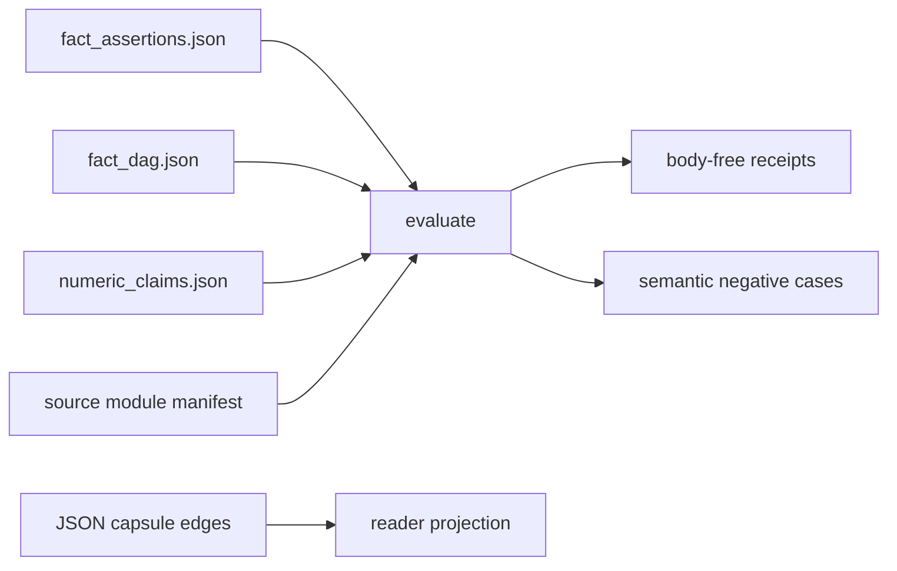

# Doctrine fact claim audit

`doctrine_fact_claim_audit` is a Crown Jewel import organ with real runnable substrate and a strict public authority ceiling. It consumes synthetic public fixtures, copied non-secret macro source bodies, and source manifests that verify sha256 digests, line counts, required anchors, secret-exclusion status, and receipt body omission.

What it proves: fact assertion, code-loci, DAG, and numeric claim binding fixture truth gate only.

## Prior Art Grounding

This organ borrows from provenance modeling, structured fact-check metadata,
schema validation, and supply-chain attestation. Useful anchors include:

- W3C [PROV](https://www.w3.org/TR/prov-overview/), which models entities,
  activities, and agents so readers can assess the quality, reliability, and
  trustworthiness of derived information.
- Schema.org
  [ClaimReview](https://schema.org/ClaimReview), as a web metadata pattern for
  recording a reviewed claim and its fact-checking context.
- [JSON Schema](https://json-schema.org/), for declaring expected structure and
  rejecting malformed or incomplete claim records.
- [SLSA provenance](https://slsa.dev/spec/v1.2/), for the software-supply-chain
  pattern of tracing artifacts back to source and build metadata.

Microcosm borrows the provenance, claim-review, schema, and attestation shapes,
but keeps this organ to public fixture fact counts, code-loci existence, anchor
presence, DAG references, and synthetic volatile numeric binding cases. It is
not a comprehension engine, private-doctrine export, release authority, or a
minimum-read-graph proof.

## Technical Mechanism

The runtime mechanism is a public fixture evaluator in
`src/microcosm_core/organs/doctrine_fact_claim_audit.py`. The organ declares a
`CrownJewelSpec` with four required inputs: `fact_assertions.json`,
`fact_dag.json`, `numeric_claims.json`, and `projection_protocol.json`. The
shared crown-jewel runner handles source-manifest validation, receipt writing,
negative-case execution, and authority-ceiling attachment; this module supplies
the domain evaluator and the semantic negative-case mutator.

`evaluate` first loads the fact assertion table and compares
`expected_fact_count` to the number of fact rows. Each fact must carry at least
one code locus. The evaluator resolves every relative code-locus path against
the copied source-module bundle, then checks that the declared anchor text is
present in the copied body. The DAG pass builds the set of audited fact ids and
rejects any edge whose `from` or `to` endpoint is not in that set. These checks
convert plausible documentation references into receipt-backed paths, anchors,
and graph edges.

Numeric claims are checked by importing the copied
`source_modules/system/lib/derived_fact_hologram.py` body from the exported
bundle and calling its `find_unbound_numeric_claims` function. For each row in
`numeric_claims.json`, the evaluator synthesizes `FactAssertion` instances for
the declared sections, records unbound numeric detections, and blocks a case
when a non-detector row leaves current-state numeric prose without a matching
fact assertion. Detector rows are positive evidence only because they must
surface the expected section and number.

The negative floor is semantic rather than label-trusting. `evaluate_negative_case`
mutates the positive fixture in memory for `wrong_fact_count`,
`missing_code_locus`, `dead_code_locus`, `dead_dag_ref`, and
`unbound_numeric_claim`, then reruns the same evaluator in a temporary input
directory. The tests deliberately overwrite the declared negative-case files
with bogus pass rows and confirm that the organ still derives the expected
stable error codes from the evaluator itself. That keeps the proof tied to the
mechanism, not to fixture labels.

The source-open body floor is separate from the receipt floor. The exported
bundle manifest names two copied non-secret bodies,
`derived_fact_hologram.py` and `paper_modules.py`, with digests and line
counts. Runtime receipts carry refs, counts, verdicts, anti-claims, and
`body_in_receipt: false`; they do not embed copied macro bodies or private
operator material.

How to run it:

```bash
PYTHONPATH=src python3 -m microcosm_core.organs.doctrine_fact_claim_audit run --input fixtures/first_wave/doctrine_fact_claim_audit/input --out receipts/first_wave/doctrine_fact_claim_audit --acceptance-out receipts/acceptance/first_wave/doctrine_fact_claim_audit_fixture_acceptance.json
```

Runtime bundle route:

```bash
PYTHONPATH=src python3 -m microcosm_core.organs.doctrine_fact_claim_audit run-doctrine-fact-bundle --input examples/doctrine_fact_claim_audit/exported_doctrine_fact_claim_audit_bundle --out receipts/runtime_shell/demo_project/organs/doctrine_fact_claim_audit
```

## Validation Receipt Path

From `microcosm-substrate`, validate with external receipt outputs so the
reader check does not churn tracked receipts:

```bash
PYTHONPATH=src ../repo-python -m microcosm_core.organs.doctrine_fact_claim_audit run --input fixtures/first_wave/doctrine_fact_claim_audit/input --out /tmp/microcosm-doctrine-fact-claim-audit/fixture --acceptance-out /tmp/microcosm-doctrine-fact-claim-audit/acceptance.json --card
PYTHONPATH=src ../repo-python -m microcosm_core.organs.doctrine_fact_claim_audit run-doctrine-fact-bundle --input examples/doctrine_fact_claim_audit/exported_doctrine_fact_claim_audit_bundle --out /tmp/microcosm-doctrine-fact-claim-audit/bundle --card
PYTHONPATH=src ../repo-python -m pytest -p no:cacheprovider tests/test_doctrine_fact_claim_audit.py -q
PYTHONPATH=src ../repo-python scripts/build_doctrine_projection.py --check-paper-module-corpus
PYTHONPATH=src ../repo-python scripts/build_doctrine_projection.py --check
```

A diagram view is generated for this module, and an atlas card links to it.
Passing receipts validate fact-count, code-locus, DAG-ref, numeric-claim,
digest, and negative-case boundaries only. If copied macro bodies drift, refresh
the exact copy bundle through the owning lane before treating bundle red as a
reader-page defect.

Negative cases covered by the fixture manifest: dead_code_locus, dead_dag_ref, missing_code_locus, unbound_numeric_claim, wrong_fact_count.

Source provenance is anchored by `examples/doctrine_fact_claim_audit/exported_doctrine_fact_claim_audit_bundle/source_module_manifest.json` and receipts carry refs, digests, counts, verdicts, and anti-claims only.

## Claim Ceiling

This module may claim public fixture evidence that doctrine fact assertions,
code-locus refs, DAG refs, numeric claim bindings, copied non-secret source
manifests, digest checks, anchor checks, secret-exclusion scans, body-free
receipts, and negative stale-claim cases are checked by the listed runtime
witnesses.

This module may not claim doctrine comprehension, private doctrine export,
minimum-read-graph proof, live release approval, hosted-public readiness,
source mutation authority, candidate-axiom promotion, projection correctness
beyond the listed witnesses, or whole-system correctness.

## Governing Lattice Relation

This module is the architecture-and-navigation contract specimen for turning
current-state doctrine claims into auditable fact rows. The admitted mechanism,
`mechanism.doctrine_fact_claim_audit.validates_public_doctrine_fact_claim_audit`,
does not ask a model whether prose is true. It recomputes a bounded relation:
declared fact count, code-locus anchors, route-DAG endpoints, volatile numeric
claim bindings, source-module manifest anchors, and semantic negative cases
must all agree with the copied public fixture basis before a receipt can pass.

That relation is why the capsule binds the module to
`concept.architecture_and_navigation_route_contract_bundle`. Architecture and
navigation claims are only readable as doctrine when they can be traced through
source rows, code loci, validator commands, and body-free receipts. The capsule
therefore treats the generated Mermaid and Atlas card as route projections of
15 resolved edges, not as independent proof that doctrine coverage is complete.

The principle edges are source-backed claim discipline, not decorative tags.
`P-1` is exercised when the evaluator recomputes fixture truth rather than
echoing declared labels. `P-2` is exercised by lowering the positive claim to
the checker's strength: fact assertion, code-locus, DAG, numeric-claim, and
manifest truth only. `P-7` is exercised by recording known unknowns without
claiming the unmapped doctrine space is exhausted. `P-15` is exercised by
keeping this Markdown, the generated JSON sidecar, Mermaid, and Atlas below the
capsule, source module, and validator receipts.

The axiom bindings are likewise operational. `AX-1` requires a derivation before
the page repeats a fact count or source claim. `AX-6` keeps the declared fixture
domain open-world outside its explicit rows. `AX-7` makes failed preconditions
typed blocking findings instead of meaningless green output. `AX-8` keeps
public source refs, manifest digests, secret-exclusion status, and
`body_in_receipt: false` attached as data moves from copied source bodies into
receipts and reader copy.

The proof consumer for this lattice relation is
`tests/test_doctrine_fact_claim_audit.py`: its positive case, four direct
mutation cases, semantic-negative-label override, and exported-bundle test
prove that the mechanism is an executable claim-audit boundary. The fixture and
bundle CLIs give the same boundary to a reader outside pytest; the corpus check
proves only that the Markdown and generated sidecar still agree with the
capsule, not that any new doctrine truth has been discovered.

## Shape

- Subject: `doctrine_fact_claim_audit`, with mechanism
  `mechanism.doctrine_fact_claim_audit.validates_public_doctrine_fact_claim_audit`.
- Runtime locus:
  `src/microcosm_core/organs/doctrine_fact_claim_audit.py`, especially `run`,
  `run_doctrine_fact_bundle`, `evaluate`, `_evaluate_numeric_claims`,
  `_load_derived_fact_module`, `EXPECTED_NEGATIVE_CASES`, and
  `AUTHORITY_CEILING`.
- The fixture checks an expected fact count, resolves declared code-locus
  paths, verifies required source anchors, rejects dead DAG references, and
  requires volatile numeric claim cases to be bound to fact assertions.
- The accepted positive receipt reports three facts, three verified code loci,
  two DAG edges, two numeric claim cases, and one detected unbound numeric
  detector case, while preserving `body_in_receipt: false`.
- The negative floor is stable: `dead_code_locus`, `dead_dag_ref`,
  `missing_code_locus`, `unbound_numeric_claim`, and `wrong_fact_count`.
- The public standard is
  `standards/std_microcosm_doctrine_fact_claim_audit.json`; the fixture
  manifest is
  `core/fixture_manifests/doctrine_fact_claim_audit.fixture_manifest.json`.



## JSON Capsule Binding

- Source row: `core/paper_module_capsules.json::paper_modules[48:paper_module.doctrine_fact_claim_audit]`
- `source_authority: json_capsule`
- Generated instance:
  `paper_modules/doctrine_fact_claim_audit.json::paper_module_payload`.
- Capsule subjects: organ `doctrine_fact_claim_audit` and mechanism
  `mechanism.doctrine_fact_claim_audit.validates_public_doctrine_fact_claim_audit`.
- Capsule concept: `concept.architecture_and_navigation_route_contract_bundle`.
- Capsule governance names principles `P-1`, `P-2`, `P-7`, and `P-15`, plus
  axioms `AX-1`, `AX-6`, `AX-7`, and `AX-8`.
- Capsule dependencies are `paper_module.cold_reader_route_map`,
  `paper_module.navigation_hologram_route_plane`, and
  `paper_module.executable_doctrine_grammar`.
- This Markdown is a reader projection. The generated Mermaid projection is
  `available_from_capsule_edges`, and the generated Atlas projection is
  `linked_from_capsule_edges`; both are navigation projections derived from the
  capsule row rather than source authority.
- The proof boundary is the synthetic public claim-audit fixtures, copied
  non-secret macro bodies, source manifests, digest and anchor checks,
  secret-exclusion scans, body-free receipts, negative stale-claim cases, and
  validation receipts.
- All selective relations named by the capsule row are currently populated in
  the generated projection; do not invent additional doctrine ids to improve
  counts.
- The authority ceiling excludes doctrine comprehension claims, private
  doctrine export, release authority, hosted-public readiness, and any claim
  that claim-audit counts prove whole-system correctness.

## Structured Lattice Bindings

| Binding | Reader route |
|---|---|
| Paper module id | `paper_module.doctrine_fact_claim_audit` |
| Capsule authority | `core/paper_module_capsules.json::paper_modules[48:paper_module.doctrine_fact_claim_audit]` |
| Markdown projection | `paper_modules/doctrine_fact_claim_audit.md` |
| Generated instance | `paper_modules/doctrine_fact_claim_audit.json::paper_module_payload` |
| Organ runtime | `src/microcosm_core/organs/doctrine_fact_claim_audit.py` |
| Mechanism source | `core/mechanism_sources.json::mechanism.doctrine_fact_claim_audit.validates_public_doctrine_fact_claim_audit` |
| Standard | `standards/std_microcosm_doctrine_fact_claim_audit.json` |
| Fixture input | `fixtures/first_wave/doctrine_fact_claim_audit/input` |
| Exported bundle | `examples/doctrine_fact_claim_audit/exported_doctrine_fact_claim_audit_bundle` |
| Source manifest | `examples/doctrine_fact_claim_audit/exported_doctrine_fact_claim_audit_bundle/source_module_manifest.json` |
| Fixture manifest | `core/fixture_manifests/doctrine_fact_claim_audit.fixture_manifest.json` |
| First-wave result receipt | `receipts/first_wave/doctrine_fact_claim_audit/doctrine_fact_claim_audit_result.json` |
| First-wave board receipt | `receipts/first_wave/doctrine_fact_claim_audit/doctrine_fact_claim_audit_board.json` |
| First-wave validation receipt | `receipts/first_wave/doctrine_fact_claim_audit/doctrine_fact_claim_audit_validation_receipt.json` |
| Acceptance receipt | `receipts/acceptance/first_wave/doctrine_fact_claim_audit_fixture_acceptance.json` |
| Runtime-shell receipt | `receipts/runtime_shell/demo_project/organs/doctrine_fact_claim_audit/exported_doctrine_fact_claim_audit_bundle_validation_result.json` |

## Named Proof Consumers

- Fixture CLI consumer:
  `PYTHONPATH=src ../repo-python -m microcosm_core.organs.doctrine_fact_claim_audit run --input fixtures/first_wave/doctrine_fact_claim_audit/input --out /tmp/microcosm-doctrine-fact-claim-audit/fixture --acceptance-out /tmp/microcosm-doctrine-fact-claim-audit/acceptance.json --card`.
  Expected proof shape: `status: pass`, three fact rows, three verified code
  loci, two DAG edges, two numeric-claim cases, one detector case, zero blocking
  unbound numerics, five semantic negative cases, and `body_in_receipt: false`.
- Exported bundle consumer:
  `PYTHONPATH=src ../repo-python -m microcosm_core.organs.doctrine_fact_claim_audit run-doctrine-fact-bundle --input examples/doctrine_fact_claim_audit/exported_doctrine_fact_claim_audit_bundle --out /tmp/microcosm-doctrine-fact-claim-audit/bundle --card`.
  Expected proof shape: the same evaluator runs through the exported bundle
  input mode, validates the source-module manifest, and writes body-free bundle
  receipts.
- Focused regression consumer:
  `PYTHONPATH=src ../repo-python -m pytest -p no:cacheprovider --basetemp=/tmp/microcosm_doctrine_fact_claim_audit_pytest tests/test_doctrine_fact_claim_audit.py -q`.
  Expected proof shape: the seven tests cover the positive fixture, dead code
  locus, missing code locus, dead DAG ref, unbound numeric claim, semantic
  negative-case derivation, and exported-bundle route.
- Corpus parity consumer:
  `PYTHONPATH=src ../repo-python scripts/build_doctrine_projection.py --check-paper-module-corpus`.
  Expected proof shape: the generated JSON sidecar remains reproducible from
  the capsule and Markdown projection without hand-editing generated state.
- Sidecar readback consumer:
  `jq '{source_authority:.paper_module_payload.source_authority, mermaid:.paper_module_payload.generated_projections.mermaid.status, atlas:.paper_module_payload.generated_projections.atlas_card.status, edge_count:(.relationships.edges|length), unresolved:(.relationships.unpopulated_selective_relations|length)}' paper_modules/doctrine_fact_claim_audit.json`.
  Expected proof shape: `json_capsule`, `available_from_capsule_edges`,
  `linked_from_capsule_edges`, resolved capsule edges, and zero unpopulated
  selective relations.

## Reader Evidence Routing

- Start with `paper_modules/doctrine_fact_claim_audit.json` as the primary
  reference, then open this Markdown page as a reader guide to that record.
- Open `standards/std_microcosm_doctrine_fact_claim_audit.json` for the
  standard, required witnesses, negative floor, denied authority, and receipt
  contract.
- Open
  `core/fixture_manifests/doctrine_fact_claim_audit.fixture_manifest.json` for
  fixture inputs, copied-body counts, durable receipt refs, and source-open body
  omission rules.
- Open
  `examples/doctrine_fact_claim_audit/exported_doctrine_fact_claim_audit_bundle/source_module_manifest.json`
  before inspecting copied source modules; receipts carry refs and digests, not
  copied macro body text.
- Run the fixture or bundle route from the `microcosm-substrate` directory and
  inspect the written JSON files. The organ CLI exposes `--card`, but it does
  not expose a `--json` stdout mode.
- Use `scripts/build_doctrine_projection.py --check-paper-module-corpus` to
  verify this paper-module projection stays inside the shared corpus contract.

## Reader Proof Boundary

The reader-verifiable proof is limited to public fixture fact counts, code-locus
existence, required source-anchor checks, DAG-reference checks, numeric claim
binding cases, copied non-secret source-body manifests, digest and line-count
checks, secret-exclusion scans, body-free receipts, and the named negative
cases. The JSON capsule is the authority for the organ, mechanism, concept,
principle, axiom, dependency, and code-locus edges; this Markdown explains those
edges for a cold reader.

Passing receipts do not prove doctrine comprehension, a minimum-read graph,
private doctrine export, candidate-axiom promotion, publication readiness,
release authority, or whole-system correctness.

## Public Site Availability Boundary

Public site or Atlas availability may expose this module as a claim-audit
evidence card, a route to the fixture and source manifests, and a generated
capsule diagram. That availability is a navigation and inspection claim, not a
claim that the public site understands doctrine or certifies current release
truth.

Any public copy should keep this module's denied authorities visible: no private
doctrine export, no live source mutation, no candidate-axiom promotion, and no
minimum-read-graph proof.

## Public-Safe Body Handling

Receipts should carry source refs, hashes, anchors, counts, verdicts,
secret-exclusion status, and omission receipts. They should not carry copied
macro body text, private doctrine bodies, raw private paths, provider/account
state, or unpublished Work/Task Ledger bodies. If a source-module digest drifts,
refresh through the exact-copy/import lane before raising the Markdown claim
ceiling.

## Receipt Expectations

- Fixture run writes `doctrine_fact_claim_audit_result.json`,
  `doctrine_fact_claim_audit_board.json`, and
  `doctrine_fact_claim_audit_validation_receipt.json` under
  `receipts/first_wave/doctrine_fact_claim_audit/`.
- Acceptance output writes
  `receipts/acceptance/first_wave/doctrine_fact_claim_audit_fixture_acceptance.json`.
- Bundle run writes the exported bundle result under
  `receipts/runtime_shell/demo_project/organs/doctrine_fact_claim_audit/`.
- Passing receipts must preserve real runtime execution, source manifest refs,
  digest and anchor verification, required negative cases, secret-exclusion
  status, and `body_in_receipt: false`.
- Receipt success does not authorize source mutation, private doctrine export,
  release, publication, doctrine saturation, a minimum-read-graph proof, or
  whole-system correctness.

## Claim-Rot Detection

This organ treats documentation claims like cached values that need an
invalidation strategy. The failure mode is not only a wrong number; it is a
volatile number embedded in current-state prose with no attached route for
re-deriving it.

The detector flags volatile numerics: a number near a countable noun inside a
current-state section. Such a claim is admissible only when it is bound to a
fact assertion that records how to recompute or revalidate the value. The same
audit resolves every cited code locus on disk and checks that the quoted anchor
is actually present, so stale file references and plausible-but-dead anchors are
negative evidence rather than inert prose.

The public fixture does not claim natural-language comprehension. It proves the
more useful contract: current-state numerics, fact assertions, DAG refs, code
loci, and anchor text can be audited as receipt-backed claims instead of
untracked documentation drift.

Authority ceiling: Doctrine fact claim audit checks only public fixture fact counts, code-loci existence, anchor presence, DAG references, and synthetic volatile numeric claim binding cases. It is not a comprehension engine, does not prove a minimum read graph, does not export private doctrine, and does not authorize release.
